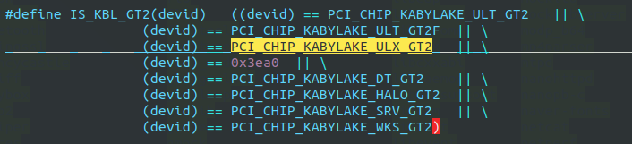

# err: create buffer manager

df -h 看u盘挂载在那？

env:

4.19.15 -android7 我们自己的代码。 


## 1. 位置

**1. **

```shell
hp-4.19/external/drm_gralloc$  grep -inR "create buffer manager"
gralloc_drm_intel.c:699:		ALOGE("failed to create buffer manager");
```


```shell
hp-4.19/external/drm_gralloc$ vim gralloc_drm_intel.c +699
```

```c
struct gralloc_drm_drv_t *gralloc_drm_drv_create_for_intel(int fd)
{
    info->bufmgr = drm_intel_bufmgr_gem_init(info->fd, 16 * 1024);
    if (!info->bufmgr) {               
        ALOGE("failed to create buffer manager");
        free(info);
        return NULL;
    }
    
    
}
```

**2. **找到 drm_intel_bufmgr_gem_init 函数

```shell
hp-4.19/external/libdrm$ vim intel/intel_bufmgr_gem.c +3603
```

由于是新的代码，这里需要添加 3ea0

这里参照 591e进行添加：




```c
drm_intel_bufmgr *
drm_intel_bufmgr_gem_init(int fd, int batch_size){

	drm_intel_bufmgr_gem *bufmgr_gem;
	bufmgr_gem = calloc(1, sizeof(*bufmgr_gem)); // 分配
	
	bufmgr_gem->pci_device = get_pci_device_id(bufmgr_gem);// 返回0x3ea0
	
	else if (IS_GEN9(bufmgr_gem->pci_device))// 现在这里应该是走的这个
        bufmgr_gem->gen = 9;
        
                                      
exit:
    pthread_mutex_unlock(&bufmgr_list_mutex);

	// 这里应该找 bufmgr_gem == NULL 的情况， 
    return bufmgr_gem != NULL ? &bufmgr_gem->bufmgr : NULL;
}
```

重新编译  make libdrm_intel

adb push out/target/product/x86_64/system/lib64/libdrm_intel.so /system/lib64/libdrm_intel.so

该问题消失。

## 2. 查 pci id for fd 10: 8086:3ea0, driver (null)

EGL-DRI2: pci id for fd 10: 8086:3ea0, driver (null)

**1. 源码定位**

```shell
haier/external$ vim mesa/src/loader/loader.c +400
```

```c
char *
loader_get_driver_for_fd(int fd) 
{
    
    // driver_map 中没有 和 3ea0相关的 东西 ，当然是空
    for (i = 0; driver_map[i].driver; i++) {                                                                           
      if (vendor_id != driver_map[i].vendor_id)
         continue;

      if (driver_map[i].predicate && !driver_map[i].predicate(fd))
         continue;

      if (driver_map[i].num_chips_ids == -1) {
         driver = strdup(driver_map[i].driver);
         goto out;
      }

      for (j = 0; j < driver_map[i].num_chips_ids; j++)
         if (driver_map[i].chip_ids[j] == chip_id) {
            driver = strdup(driver_map[i].driver);
            goto out;
         }
   }
    
    
    out:
   log_(driver ? _LOADER_DEBUG : _LOADER_WARNING,
         "pci id for fd %d: %04x:%04x, driver %s\n",                                                                  
         fd, vendor_id, chip_id, driver);
   return driver;
}
```

**2. driver_map 在那里被赋值了**

```shell
external/mesa$ vim src/loader/pci_id_driver_map.h +76
```

```c
static const struct {
   int vendor_id;
   const char *driver;
   const int *chip_ids;
   int num_chips_ids;
   int (*predicate)(int fd);
} driver_map[] = {                                                                                                    
   { 0x8086, "i915", i915_chip_ids, ARRAY_SIZE(i915_chip_ids) },
   { 0x8086, "i965", i965_chip_ids, ARRAY_SIZE(i965_chip_ids) },
   { 0x1002, "radeon", r100_chip_ids, ARRAY_SIZE(r100_chip_ids) },
   { 0x1002, "r200", r200_chip_ids, ARRAY_SIZE(r200_chip_ids) },
   { 0x1002, "r300", r300_chip_ids, ARRAY_SIZE(r300_chip_ids) },
   { 0x1002, "r600", r600_chip_ids, ARRAY_SIZE(r600_chip_ids) },
   { 0x1002, "radeonsi", radeonsi_chip_ids, ARRAY_SIZE(radeonsi_chip_ids) },
   { 0x10de, "nouveau_vieux", NULL, -1, is_nouveau_vieux },
   { 0x10de, "nouveau", NULL, -1, },
   { 0x1af4, "virtio_gpu", virtio_gpu_chip_ids, ARRAY_SIZE(virtio_gpu_chip_ids) },
   { 0x15ad, "vmwgfx", vmwgfx_chip_ids, ARRAY_SIZE(vmwgfx_chip_ids) },
   { 0x0000, NULL, NULL, 0 },
};
```

**3. **i915_chip_ids 中的内容是什么？

```c
static const int i915_chip_ids[] = {
#define CHIPSET(chip, desc, name) chip,
#include "pci_ids/i915_pci_ids.h"                                                                                     
#undef CHIPSET
};
```

```shell
external/mesa$ vim ./include/pci_ids/i915_pci_ids.h
```

```c
CHIPSET(0x3577, I830_M,   "Intel(R) 830M")                                                                          
CHIPSET(0x2562, 845_G,    "Intel(R) 845G")
CHIPSET(0x3582, I855_GM,  "Intel(R) 852GM/855GM")
CHIPSET(0x2572, I865_G,   "Intel(R) 865G")
CHIPSET(0x2582, I915_G,   "Intel(R) 915G")
CHIPSET(0x258A, E7221_G,  "Intel(R) E7221G (i915)")
CHIPSET(0x2592, I915_GM,  "Intel(R) 915GM")
CHIPSET(0x2772, I945_G,   "Intel(R) 945G")
CHIPSET(0x27A2, I945_GM,  "Intel(R) 945GM")
CHIPSET(0x27AE, I945_GME, "Intel(R) 945GME")
CHIPSET(0x29B2, Q35_G,    "Intel(R) Q35")
CHIPSET(0x29C2, G33_G,    "Intel(R) G33")
CHIPSET(0x29D2, Q33_G,    "Intel(R) Q33")
CHIPSET(0xA011, PNV_GM,   "Intel(R) Pineview M")
CHIPSET(0xA001, PNV_G,    "Intel(R) Pineview")
```

这里没有我们的 591e, 因为我们此时是参照  591e走的

发现  

```shell
include/pci_ids/i965_pci_ids.h:160:CHIPSET(0x591E,
```

591e 在 i965_pci_ids.h 中。

那就在 这个  i965_pci_ids.h 文件中 添加 3ea0 

```c
CHIPSET(0x591D, kbl_gt2, "Intel(R) HD Graphics P630 (Kaby Lake GT2)")
CHIPSET(0x591E, kbl_gt2, "Intel(R) HD Graphics 615 (Kaby Lake GT2)")
CHIPSET(0x3ea0, kbl_gt2, "Intel(R) HD Graphics 615 (Kaby Lake GT2)")
```

此时在编译：

编译运行 飞了，， 醉了。。。

**重新修改：**


等android9 的代码来了之后，首先比较这几个目录：

```
libdrm drm_hwcomposer drm_gralloc, drm_framebuffer, Mesa
```


