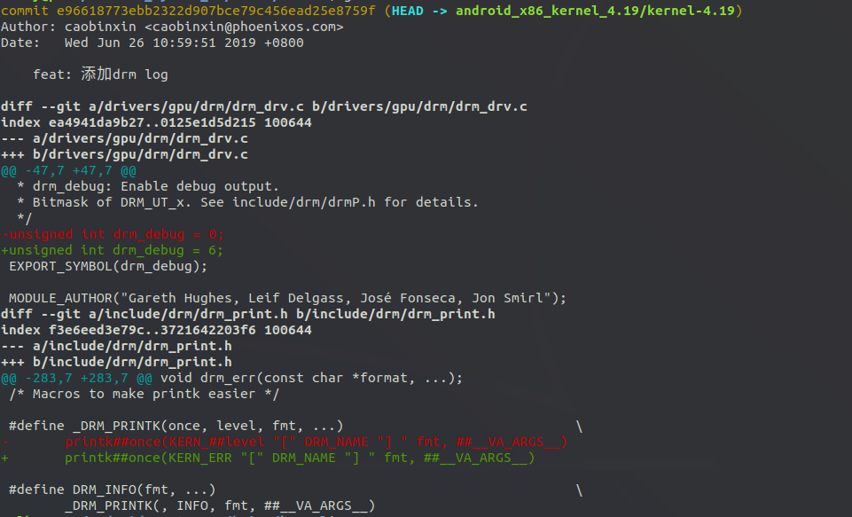

临时记录

backlight

haier/kernel/drivers$ grep -inR "intel_backlight"

android_x86/kernel/drivers$ vim input/touchscreen/elants_i2c.c


触摸屏的驱动：

hp 触摸屏驱动移植

kernel/drivers/mfd$ vim intel-lpss-pci.c


```c++
#define INTEL_WHL_U_GT2_IDS(info) \   
    INTEL_VGA_DEVICE(0x3EA0, info)
        
        
        
        
#define INTEL_CFL_IDS(info)    \
    INTEL_CFL_S_GT1_IDS(info), \
    INTEL_CFL_S_GT2_IDS(info), \
    INTEL_CFL_H_GT2_IDS(info), \
    INTEL_CFL_U_GT2_IDS(info), \
    INTEL_CFL_U_GT3_IDS(info), \
    INTEL_WHL_U_GT1_IDS(info), \
    INTEL_WHL_U_GT2_IDS(info), \
    INTEL_WHL_U_GT3_IDS(info)

```


在那使用的

```shell
/android_x86/kernel$ grep -inR "INTEL_WHL_U_GT2_IDS"
drivers/gpu/drm/i915/i915_pci.c:666:	INTEL_WHL_U_GT2_IDS(&intel_coffeelake_gt2_info),
include/drm/i915_pciids.h:412:#define INTEL_WHL_U_GT2_IDS(info) \
include/drm/i915_pciids.h:428:	INTEL_WHL_U_GT2_IDS(info), \
```


步骤如下：

1. 先放置

4.19.15 中的内容

include/drm/i915_pciids.h 

```c
// 暂时没有放置这个
#define INTEL_CFL_IDS(info)    \
	INTEL_WHL_U_GT2_IDS(info), \
	
#define INTEL_WHL_U_GT2_IDS(info) \                                               INTEL_VGA_DEVICE(0x3EA0, info)
```

drivers/gpu/drm/i915/i915_pci.c:66传6

```c
static const struct pci_device_id pciidlist[] = {
INTEL_WHL_U_GT2_IDS(&intel_coffeelake_gt2_info),
}；
```

找到：intel_coffeelake_gt2_info

drivers/gpu/drm/i915/i915_pci.c:568

```c
static const struct intel_device_info intel_coffeelake_gt2_info = {    
    CFL_PLATFORM,
    .gt = 2,
};
```

vim arch/x86/kernel/early-quirks.c +546

```c
static const struct pci_device_id intel_early_ids[] __initconst = {
    INTEL_CFL_IDS(&gen9_early_ops),
}
```


添加drm log

第一处：

drivers/gpu/drm/drm_drv.c

void drm_printk(

printk(KERN_ERR "%s" "[" DRM_NAME ":%ps]%s %pV",

第二处：

drivers/gpu/drm/drm_drv.c

unsigned int drm_debug = 6;



intel_chipset.h