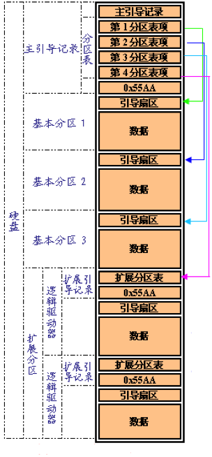
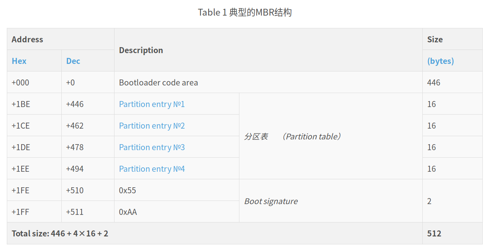
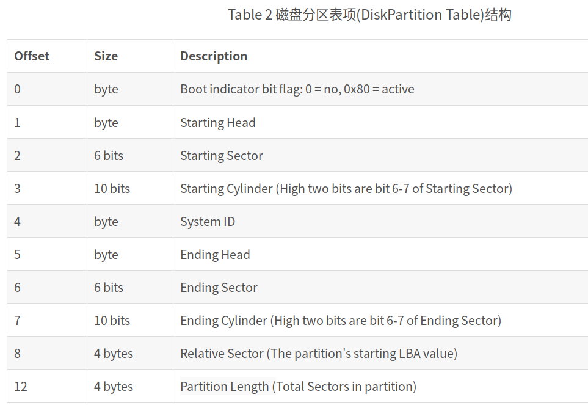
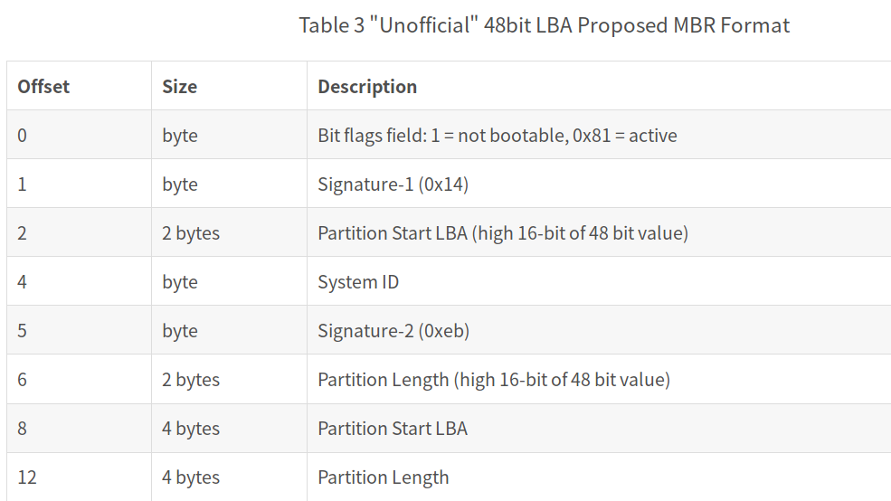
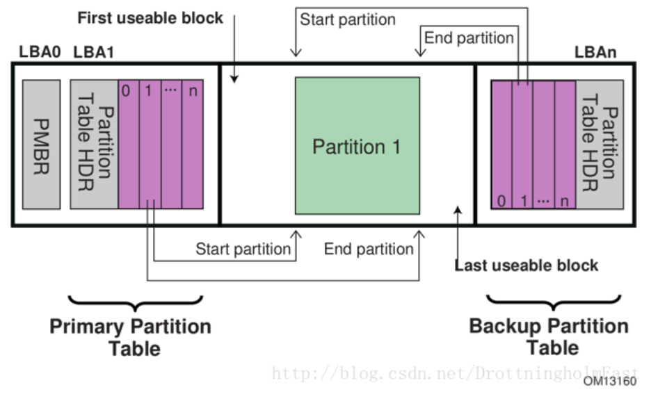
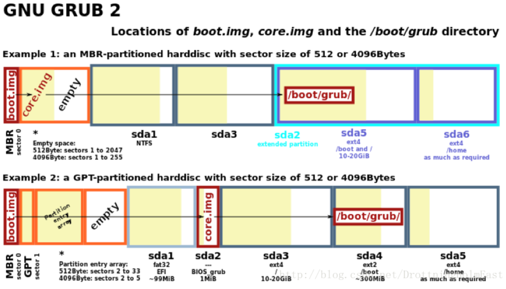

# grub2.0-源码分析

## 1. 参考资料：

翻译的官方文档：

https://www.cnblogs.com/f-ck-need-u/archive/2017/06/29/7094693.html

基于grub2.0 的x86内核引导流程：

https://blog.csdn.net/DrottningholmEast/article/details/76651729

https://blog.csdn.net/drottningholmeast/article/details/76651845


grub源码分析：

https://blog.csdn.net/conansonic/article/details/78482766

grub 源码调试：可以跑在虚拟机中

https://blog.csdn.net/snailstart/article/details/50868157

http://www.doc88.com/p-9394965782093.html

intel给的资料：

目的是实现，每次加载凤凰系统的时候，做一次冷启动。

```shell
 
Code Definition:
file: grub2/include/grub/efi/api.h
 
enum grub_efi_reset_type
  {
    GRUB_EFI_RESET_COLD,
    GRUB_EFI_RESET_WARM,
    GRUB_EFI_RESET_SHUTDOWN
  };
typedef enum grub_efi_reset_type grub_efi_reset_type_t;
 
 
Call Reference:
file: grub2/grub-core/lib/efi/halt.c
 
  efi_call_4 (grub_efi_system_table->runtime_services->reset_system,
              GRUB_EFI_RESET_SHUTDOWN, GRUB_EFI_SUCCESS, 0, NULL);
 
#源码下载：
Please check Grub bootloader source code for details:
https://github.com/rhboot/grub2
```


### 1.2基础知识的储备：

```shell
colby@pc:~/android_system_os$ git clone https://github.com/rhboot/grub2.git
```

目前Linux中使用最广泛的的bootloader是Grub(GRand Unified Bootloader)。如今Grub 2已经替换了早期的0.9x系列版本的Grub Legacy， 而且Grub Legacy已经不再开发维护。虽然Grub 2从名字上看像是Grub的升级版，但其源代码实际被完全重构了。现从源代码角度分析基于Grub 2.00的x86内核引导流程。

#### 1.2.1 磁盘：

由于在Grub进行内核引导的过程中涉及到磁盘操作，先简介一下磁盘为后续引导流程分析作铺垫。磁盘三要素：由所有盘面上相同半径的同心圆形磁道(Track)组成的柱面(Cylinder), 磁头(Head), 扇区(Sector)之间的关系如下图所示：


对于磁盘，其最小存储单位为扇区（Sector），在相当长的一段时间里，扇区的大小固定在512 bytes[[1\]](https://blog.csdn.net/DrottningholmEast/article/details/76651729#_ftn1). 但是从2009年开始出现扇区大小为4096 bytes的磁盘，即[Advanced  Format](https://en.wikipedia.org/wiki/Advanced_Format) disks。

对于扇区的编址，早期的方案是CHS编址(Cylinder-Head-Sector)，即用数据元组CHS tuples (c,h,s)的形式表示一个扇区的位置，但是在CHS编址时，扇区号是从1开始的，没有扇区0，但磁头和柱面编号都是从0开始的，即CHS编址起始于地址(0,0,1)。另外一种编址方案是LBA编址(Logical Block Addressing)，把整个磁盘的所有扇区资源统一分配序号。在2003年发布的ATA-6标准中，LBA采用48-bit地址。

CHS数据元组(c, h, s)根据如下公式转换成相应的LBA逻辑地址： 

*LBA*  = (*c*×*N*heads + *h*)×*N*sectors +  (*s* − 1)

其中：Nheads是硬盘中的磁头数目，Nsectors是每条磁道上可以划分的最大的扇区数目。上面的公式意味着LBA对扇区的编址是从0开始的，所以在Grub的boot.S源代码中，当磁盘不支持LBA模式，代码执行流回退至CHS模式继续进行处理时，会将编址的起始地址调整成从1开始。

```c
==================grub-2.00/grub-core/boot/i386/pc/boot.S=================
 288           /* normalize sector start (1-based)*/
 289           incb  %cl
```

磁盘在使用过程中总是会涉及到分区方案，其中一个典型的四分区MBR磁盘结构如下所示：



其中：磁盘的0柱面、0磁头、1扇区即为主引导记录MBR(MasterBoot Record)扇区。它由三个部分组成：主引导程序bootloader、磁盘分区表和有效标志（0x55AA）。在总共512字节的主引导扇区里主引导程序（boot loader）占446个字节，第二部分是Partition table区（分区表），占64个字节，磁盘中分区有多少以及每一分区的大小都记在其中。第三部分是磁盘有效标志签名，占2个字节，固定为0x55AA。 另外对于MBR磁盘，由于扇区空间限制分区表最多占用64字节，每个分区表项占用16字节，所以其最多有4个分区。



<table border="0" cellspacing="0" cellpadding="0" class="ta1"><colgroup><col width="130"/><col width="119"/><col width="108"/><col width="133"/><col width="134"/></colgroup><tr class="ro1"><td colspan="2" style="text-align:left;width:29.67mm; " class="ce1"><p>Address</p></td><td colspan="2" rowspan="2" style="text-align:left;width:24.77mm; " class="ce1"><p>Description</p></td><td style="text-align:left;width:30.76mm; " class="ce1"><p>size</p></td></tr><tr class="ro2"><td style="text-align:left;width:29.67mm; " class="ce1"><p>hex（十六进制）</p></td><td style="text-align:left;width:27.22mm; " class="ce3"><p>dec(十进制)</p></td><td style="text-align:left;width:30.76mm; " class="ce1"><p>bytes（单位）</p></td></tr><tr class="ro1"><td style="text-align:left;width:29.67mm; " class="ce1"><p>0x00</p></td><td style="text-align:right; width:27.22mm; " class="ce3"><p>0</p></td><td colspan="2" style="text-align:left;width:24.77mm; " class="ce1"><p>bootloader code area</p></td><td style="text-align:right; width:30.76mm; " class="ce1"><p>446</p></td></tr><tr class="ro2"><td style="text-align:left;width:29.67mm; " class="ce1"><p>0x1be</p></td><td style="text-align:right; width:27.22mm; " class="ce3"><p>446</p></td><td style="text-align:left;width:24.77mm; " class="ce1"><p>第1分区表项</p></td><td rowspan="4" style="text-align:left;width:30.5mm; " class="ce1"><p>分区表</p></td><td style="text-align:right; width:30.76mm; " class="ce1"><p>16</p></td></tr><tr class="ro2"><td style="text-align:left;width:29.67mm; " class="ce1"><p>0x1ce</p></td><td style="text-align:right; width:27.22mm; " class="ce3"><p>462</p></td><td style="text-align:left;width:24.77mm; " class="ce1"><p>第2分区表项</p></td><td style="text-align:right; width:30.76mm; " class="ce1"><p>16</p></td></tr><tr class="ro2"><td style="text-align:left;width:29.67mm; " class="ce1"><p>0x1de</p></td><td style="text-align:right; width:27.22mm; " class="ce3"><p>478</p></td><td style="text-align:left;width:24.77mm; " class="ce1"><p>第3分区表项</p></td><td style="text-align:right; width:30.76mm; " class="ce1"><p>16</p></td></tr><tr class="ro2"><td style="text-align:left;width:29.67mm; " class="ce1"><p>0x1ee</p></td><td style="text-align:right; width:27.22mm; " class="ce3"><p>494</p></td><td style="text-align:left;width:24.77mm; " class="ce1"><p>第4分区表项</p></td><td style="text-align:right; width:30.76mm; " class="ce1"><p>16</p></td></tr><tr class="ro1"><td style="text-align:left;width:29.67mm; " class="ce1"><p>0x1fe</p></td><td style="text-align:right; width:27.22mm; " class="ce3"><p>510</p></td><td style="text-align:left;width:24.77mm; " class="ce1"><p>0x55</p></td><td rowspan="2" style="text-align:left;width:30.5mm; " class="ce1"><p>boot signature</p></td><td rowspan="2" style="text-align:right; width:30.76mm; " class="ce1"><p>2</p></td></tr><tr class="ro1"><td style="text-align:left;width:29.67mm; " class="ce1"><p>0x1ff</p></td><td style="text-align:right; width:27.22mm; " class="ce3"><p>511</p></td><td style="text-align:left;width:24.77mm; " class="ce1"><p>0xaa</p></td></tr><tr class="ro3"><td colspan="5" style="text-align:left;width:29.67mm; " class="ce1"><p>总共是一个扇区： 446 + 4 x 16 + 2 = 512</p></td></tr><tr class="ro1"><td style="text-align:left;width:29.67mm; " class="ce2"> </td><td style="text-align:left;width:27.22mm; " class="Default"> </td><td style="text-align:left;width:24.77mm; " class="Default"> </td><td style="text-align:left;width:30.5mm; " class="Default"> </td><td style="text-align:left;width:30.76mm; " class="ce2"> </td></tr><tr class="ro1"><td style="text-align:left;width:29.67mm; " class="ce2"> </td><td style="text-align:left;width:27.22mm; " class="Default"> </td><td style="text-align:left;width:24.77mm; " class="Default"> </td><td style="text-align:left;width:30.5mm; " class="Default"> </td><td style="text-align:left;width:30.76mm; " class="ce2"> </td></tr></table>
后续对bootloader部分会有详细分析。先来分析磁盘分区表，其定义如下：

每个磁盘分区表占据16个字节，每个字节中的含义如下：



磁盘分区表项结构定义对柱面、磁头和扇区的大小分别限定在10 bits、8 bits和6 bits，

该种定义隐含着限制了磁盘的大小。分区表可描述磁盘容量的大小根据如下公式计算：

*MaxCapacity*  =
*N*heads×*N*sectors×*N*cylinders×*SectorSize*

取(c,h,s)的上限便可得到最大磁盘容量：

*MaxCapacity*  = *256*×*64*×*1024*×*512 bytes = 8GB* 

解释如下： 256 个磁头、每个磁道有 64个扇区 、总共 1024个柱面、 每个扇区512字节

即：现有的分区表项结构定义只能描述8GB容量以下的硬盘。

随着磁盘的容量越来越大，8GB的容量限制显然亟待扩容，最好的方式应该是重新定义分区表项结构，但不幸的是：对于容量大于8GB的磁盘，磁盘分区表项结构定义并没有更新，只是将其中CHS相关的结构体变量设置成一个不合理配置(Cylinder = 1023, Head = 255, Sector = 63)，然后用32位LBA扇区地址(Relative Sector)和32位分区长度(PartitionLength)去描述某个磁盘分区，但是该用法依然会限制磁盘容量：

*MaxCapacity*  =
*2^32* ⋅ *512 bytes = 2TB*

让人感觉更不合理的是：在2003年发布的ATA-6标准中，LBA采用48-bit地址，在此分区表项定义中却只能使用其低32bit，这是一种自废武功的做法。为何不将结构体中空闲的CHS相关字段组合起来保存LBA-48的高16位呢？下面就是一种非官方的定义，悲哀的是：这种合理的定义并没有被实现。



追根溯源，对于MBR磁盘，由于扇区空间大小的限制，留给磁盘分区表项的空间只有64 bytes，仅有的这点空间还要平均分配给若干个分区。清晰描述一个分区所需的最小空间需求摆在那里，无论怎么设计磁盘分区表项，用一个受限的分区表空间去描述的磁盘空间也同样是受限的。于是为了解决MBR磁盘分区表可描述磁盘容量受限的问题，在2004年，Wintel在共同推出的一种可扩展固件接口(EFI: Extensible Firmware Interface)的主板升级换代方案中提出了GPT分区模式。

GPT（Globally Unique Identifier Partition Table Format）磁盘分区模式虽然是EFI方案的一部分，但并不依赖于EFI主板，在BIOS主板的PC中也可使用GPT分区。与MBR分区方案的最大4个分区表项的限制相比，GPT对分区数量没有限制。GPT还允许将主磁盘分区表和备份磁盘分区表用于冗余，支持唯一的磁盘和分区GUID。GPT分区方案目前在Windows操作系统上应用比较广泛。GPT分区方案示意图如下：



为了前向兼容性，在GPT分区方案中传统的MBR空间被保留下来，但是其用途是防止基于MBR分区的磁盘工具误判以及可能误写GPT磁盘。这也是第一个逻辑扇区LBA0称为保护分区PMBR(Protective MBR)的缘由。

Linux支持通过BIOS从基于GPT的磁盘中进行引导，即所谓的Hybrid MBR模式。该模式下保护分区PMBR与传统的MBR作用相同：该扇区被用来存放引导程序bootloader第一阶段(Stage 1)的代码，但是磁盘分区表项中仅包含一种类型为0xEE的主分区表项(Primary Partition Entry)。

Note: 后续内核引导流程分析时，以当下主流的MBR分区磁盘为主，GPT磁盘仅作提及，不作详述。 

#### 1.2.2 编译系统分析

有了磁盘简介的铺垫，现切入主题Grub 2.00内核引导源代码分析。整个分析过程基本都是一个逆向分析的过程，先介绍其用法及相关描述[[1\]](https://blog.csdn.net/DrottningholmEast/article/details/76651845#_ftn1)，然后分析Makefile以确定生成某个可执行文件的依赖链，从而得出其对应的源文件，最后分析源文件解析其动作。

[[1\]](https://blog.csdn.net/DrottningholmEast/article/details/76651845#_ftnref1)对描述中涉及到英文的部分，为保留原意不致扭曲而不做翻译。毕竟在GNU Grub和Linux内核源代码中，所有文档注释都是英文描述。所以，英语，x86汇编语言，Makefile是内核开发过程中绕不过去的坎。



Grub的x86源代码主要分为四个部分，分别为位于目录grub-core/boot/i386/pc下的boot.S， diskboot.S， startup_raw.S，以及grub-core/kern目录下的Grub main.c主模块相关代码 。

**Stage 1:** boot.img is stored in the master bootrecord (MBR) or optionally in any of the volume boot records (VBRs), because a PC bootsector is 512 bytes, the size of boot.img is exactly 512 bytes. And it addressesthe next stage by an LBA48 address (For LBA 48bit addressing, the1024-cylinder limitation of GRUB legacy is avoided); the sole function of`boot.img' is to load the first sector of core.img from a local disk andjump to it.

**Stage 1.5:** core.img is by default written to thesectors between the MBR and the first partition, when these sectors are freeand available. For legacy reasons, the first partition of a hard drive does notbegin at sector 1 (counting begins with 0) but at sector 63, leaving a gap of62 sectors of empty space. That space is not part of any partition or filesystem, and therefore not prone to any problems related with it. Onceexecuted, core.img will load its configuration file and any othermodules needed, particularly file system drivers; at installation time, it is generatedfrom diskboot.img and configured to load the stage 2 byits file path.

**Stage 2: **files belonging to the stage 2 areall being held in the /boot/grub directory, which is a subdirectory ofthe /boot directory specified by the Filesystem Hierarchy Standard (FHS).


##### 1.2.2.1 Stage1：boot.img分析

GNU的软件工程基本都依赖于Makefile去描述一个可执行文件的来龙去脉，由其编译过程可以整理出某个可执行文件的诞生过程：由哪些源文件编译，然后链接哪些库，以及还可能额外存在的二进制文件操作，比如objcopy，strip等等。为了弄清楚boot.img的来龙去脉，需要理顺boot.img在Makefile中的依赖链：


## 1. 目录结构分析

```shell
grub/grub-core/kern$ vim main.c
```

目录下的  main.c 源文件，实现了 grub 引导菜单主界面的用户交互功能；其中的 grub_main()，它是 main.c 的主函数，当我们看到 grub 的引导菜单主界面时，CPU 执行的正是这个函数中的代码逻辑；main.c 也就是编译后生成的 kernel.img 的核心部分；

```shell
grub/include/grub # 头文件
```

grub 源码目录的组织结构，采用下述规则来分离函数的声明，定义，以及调用：

grub/grub-core/kern/main.c  调用其它外部函数（没有在 main.c 中定义的）；

grub/grub-core/kern/  目录下的其它源文件，分别提供这些外部函数的定义（实现了这些函数的具体功能）；

另外， grub/grub-core/ 目录下的其它子目录，除了 kern 子目录外，有一些是 grub 2.00 的“模块”目录，例如 normal 子目录，loader 子目录等等，后面在代码中涉及具体源文件所在子目录时，再作介绍。

## 1. 编译

编译报错：

```shell
If this token and others are legitimate, please use m4_pattern_allow.
      See the Autoconf documentation.
```

```shell
sudo apt-get install libtool 
sudo apt-get install libsysfs-dev
```


## 2. 分析

### 2.1 main.c文件分析：

当我们看到　grub的引导界面，其实就是执行到这里了。

```c
/* The main routine.  */
void __attribute__ ((noreturn))
grub_main (void)
{
  /* First of all, initialize the machine.  */
  grub_machine_init (); 

  grub_boot_time ("After machine init.");

  /* Hello.  */
  /***
  	设置字体颜色
  */
  grub_setcolorstate (GRUB_TERM_COLOR_HIGHLIGHT);
  grub_printf ("Welcome to GRUB!\n\n");
  grub_setcolorstate (GRUB_TERM_COLOR_STANDARD);

  grub_load_config (); /*加载配置文件*/

  grub_boot_time ("Before loading embedded modules.");

  /* Load pre-loaded modules and free the space.  */
  grub_register_exported_symbols (); 
#ifdef GRUB_LINKER_HAVE_INIT
  grub_arch_dl_init_linker (); 
#endif  
  grub_load_modules (); 

  grub_boot_time ("After loading embedded modules.");

  /* It is better to set the root device as soon as possible,
     for convenience.  */
  grub_set_prefix_and_root (); 
  grub_env_export ("root");
  grub_env_export ("prefix");

  /* Reclaim space used for modules.  */
  reclaim_module_space (); 

  grub_boot_time ("After reclaiming module space.");

  grub_register_core_commands (); 

  grub_boot_time ("Before execution of embedded config.");

  if (load_config)
    grub_parser_execute (load_config);

  grub_boot_time ("After execution of embedded config. Attempt to go to normal mode");

  grub_load_normal_mode (); 
  grub_rescue_run (); 
}
```

# GRUB环境区块

https://blog.csdn.net/listener_ri/article/details/45621947

这个功能用来在一次引导时记录下一些信息，下一次启动 GRUB 可以读取这些信息。假设你希望默认菜  
 单项为最后一次使用的那个。你就需要使用这个。由于空间限制，为了节省代码量同时也是为了防止文  
 件系统崩溃，GRUB 不能写入文件。因此 GRUB 不能创建或者修改自己的配置文件。因此 GRUB 提供  
 了环境区块的功能，它用来记录 GRUB 当前的状态，便于日后加载。 

环境区块是一个 1024byte 的文件，它通常命名为 /boot/grub2/grubenv 。在 GRUB 中可以使用 load_  
 env 命令加载它，使用 save_env 写入当前 GRUB 环境变量到区块中。在 OS 中，可以使用 grub2-  
 editenv 程序编辑区块文件。 

由于安全问题，这个功能只能应用在普通磁盘（非 LVM 和 RAID ），不使用文件系统校检 （非 ZFS  
 ） ，使用 BIOS 或者 EFI( 非 ATA， USB 或者  IEEE1275 ) 的平台    。 

GRUB_SAVEDEFAULT  变量就是使用环境区块完成自己的功能。 