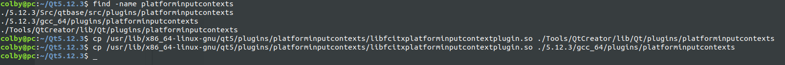

# QT-IDE中文输入

## 1. 安装：

```shell
sudo apt-get install fcitx-frontend-qt5
```

找到：

```shell
colby@pc:/usr/lib/x86_64-linux-gnu$ find -name libfcitxplatforminputcontextplugin.so

./qt5/plugins/platforminputcontexts/libfcitxplatforminputcontextplugin.so
```


将libfcitxplatforminputcontextplugin.so 复制到以下两个路径下（Qt的安装路径下查找）

路径1

~/Qt5.12.3/Tools/QtCreator/lib/Qt/plugins/platforminputcontexts
路径2

~/Qt5.12.3/5.12.3/gcc_64/plugins/platforminputcontexts



重启qtIDE

这样确实，可以在IDE中正常的输入中文了!!!

