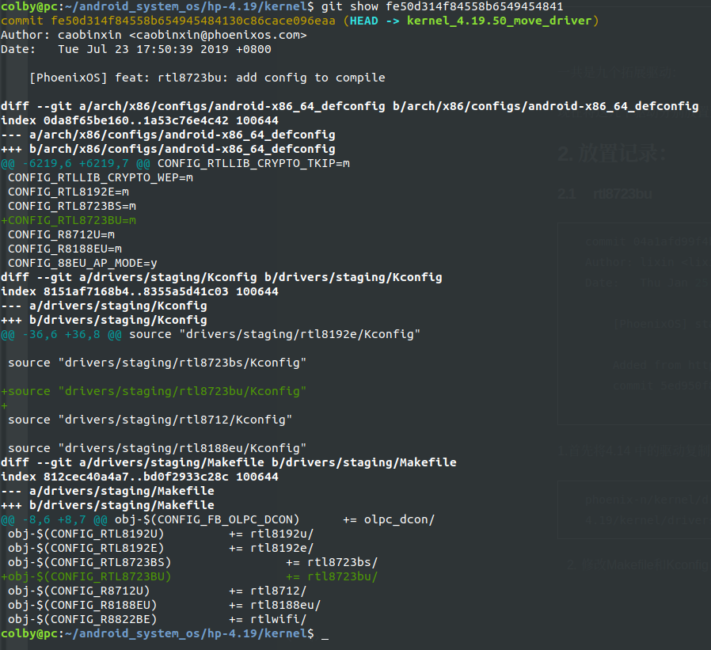

# kernel4.14.15中的第三方驱动汇总：

## 1. 驱动list

1. 　完成

```shell
[PhoenixOS] staging: rtl8723bu: update driver
    
    Added from https://github.com/lwfinger/rtl8723bu
    commit 5ed950f8dacb62586def35f18e2b8d0861d13c70
```


3.　完成

```shell
author	lixin <lixin@phoenixos.com>	
	Mon, 11 Dec 2017 11:43:32 +0800 (11:43 +0800)
committer	lixin <lixin@phoenixos.com>	
	Fri, 5 Jan 2018 11:21:50 +0800 (11:21 +0800)
commit	2c2ea56f81145634b809b27676e6d586a3f4687b
tree	74f91ef279178468d42bbd77003512a513f1464f	tree | snapshot
parent	7e01070779d7bf9b8ecbad515f7163d0f94f3751	commit | diff
[PhoenixOS] staging: add thinkpad tp_smapi to staging
```


4. 完成

```shell
author	lixin <lixin@phoenixos.com>	
	Mon, 11 Dec 2017 11:11:08 +0800 (11:11 +0800)
committer	lixin <lixin@phoenixos.com>	
	Fri, 5 Jan 2018 11:21:49 +0800 (11:21 +0800)
commit	93b94dd26fa5be6fe8e03831416eaa2f84940284
tree	3615be5aeb5d709b00cd5079f334d100d0176366	tree | snapshot
parent	72e8b541d9b98226a557c3875662ab33dc756646	commit | diff
[PhoenixOS] staging: input: add macbook (pro) SPI input driver

```


5. 　这个暂时，不放入进来

```shell
author	lixin <lixin@phoenixos.com>	
	Tue, 28 Jun 2016 02:08:47 +0800 (14:08 -0400)
committer	lixin <lixin@phoenixos.com>	
	Fri, 5 Jan 2018 11:21:48 +0800 (11:21 +0800)
commit	726c67b75af6489ada91bdba24e56c79e9d1fea2
tree	bcf80ea63fda7627dea36940714067ed741c48c6	tree | snapshot
parent	a8bc021a431227e25e5eb750c9508a6db13c1d31	commit | diff
[PhoenixOS] net: wireless: add rtl8188eu wifi driver to rtl8xxxu
```


6. 完成

```shell
author	lixin <lixin@phoenixos.com>	
	Thu, 23 Jun 2016 10:32:30 +0800 (10:32 +0800)
committer	lixin <lixin@phoenixos.com>	
	Fri, 5 Jan 2018 11:21:47 +0800 (11:21 +0800)
commit	a8bc021a431227e25e5eb750c9508a6db13c1d31
tree	8f535174232fe1d426d50766c62d36b1accb5ec0	tree | snapshot
parent	f9acb06c863ec975897452e7955b8695ed58289b	commit | diff
[PhoenixOS] staging: add r92su wext wifi driver to staging
```


7. 　完成

```shell
author	lixin <lixin@phoenixos.com>	
	Sun, 2 Oct 2016 02:03:24 +0800 (20:03 +0200)
committer	lixin <lixin@phoenixos.com>	
	Fri, 5 Jan 2018 11:21:47 +0800 (11:21 +0800)
commit	f9acb06c863ec975897452e7955b8695ed58289b
tree	9cdd89158a85b66d8a76bd466059d5065884f01f	tree | snapshot
parent	57f0f36838a4dcfeae4b47fab6b7a257e142d8b2	commit | diff
[PhoenixOS] staging: rtl8812au: add updated driver

Copied from https://github.com/diederikdehaas/rtl8812AU
branch driver-4.3.22-beta commit f8b11a1
```


8. 完成

```shell
author	lixin <lixin@phoenixos.com>	
	Mon, 11 Dec 2017 15:45:49 +0800 (15:45 +0800)
committer	lixin <lixin@phoenixos.com>	
	Fri, 5 Jan 2018 11:21:46 +0800 (11:21 +0800)
commit	57f0f36838a4dcfeae4b47fab6b7a257e142d8b2
tree	184e25b424511fbbf5ee7c341d89904a0de32d02	tree | snapshot
parent	322854637e570ab46a0195d416c4efbef2a851b5	commit | diff
[PhoenixOS] staging: rtl8723bu: add updated driver

Added from https://github.com/lwfinger/rtl8723bu
commit 167505727c9b87e5b548142639080ba2a5f082f2
```


9.

```shell
author	lixin <lixin@phoenixos.com>	
	Mon, 11 Dec 2017 15:42:30 +0800 (15:42 +0800)
committer	lixin <lixin@phoenixos.com>	
	Fri, 5 Jan 2018 11:21:46 +0800 (11:21 +0800)
commit	322854637e570ab46a0195d416c4efbef2a851b5
tree	cc74328f490baddc9ee2e22104a3e53ed7fec0bf	tree | snapshot
parent	c6a2ecc2fb552153bf940185d99f2ab5f76614ba	commit | diff
[PhoenixOS] net: add broadcom wl sta driver

add util linux-4.12 patch
allow wifi scan when max_scan_ie_len is zero
```


一共是九个拓展驱动：

现在将这九个驱动分别放置到新版本的内核中去：

## 2. 放置记录：

### 2.1 　rtl8723bu

```shell
commit 04a1afd99f4bb7b4dbbd5478b80e67dfb056a340
Author: lixin <lixin@phoenixos.com>
Date:   Thu Jan 25 11:16:17 2018 +0800

    [PhoenixOS] staging: rtl8723bu: update driver
    
    Added from https://github.com/lwfinger/rtl8723bu
    commit 5ed950f8dacb62586def35f18e2b8d0861d13c70

```

1.首先将4.14 中的驱动复制到4.19中

```shell
phoenix-n/kernel/drivers/staging$ cp rtl8723bu /home/colby/android_system_os/hp-4.19/kernel/drivers/staging -rf
```

2. 修改Makefile和Kconfig以及android_defconfig中



**当我把这个驱动加上之后，发现编译速度由原来的3分钟，直接上涨的10分钟，**所以，暂时可以不将他放置到内核中，参与编译。节省点后面的时间。

3. 这里做了一次版本reverts，　这样就取消了　编译进内核，当我们把所有第三方驱动都拿到　内核中，在开启这次编译。

### 2.2 这里记录一个个patch

#### 2.2.1 如何用git出patch和打patch

参考url: https://www.cnblogs.com/ArsenalfanInECNU/p/8931377.html

Linux命令里有diff和patch两个命令可以生成patch和打patch。但是有两个缺点值得注意：

1. 对单个文件或者多个文件，diff和patch这两个文件比较方便。对于git这种以project为单位的修改，尤其是涉及到多个文件夹下的多个文件的改动时，就很不方便。
2. 无法保存commit的信息。

**推荐大家使用git的format-patch和am命令进行生成patch和打patch，用此方法获得的patch其实就是commit里提交的code修改以及commit信息。有如下好处**：

1. 对于git这种以project为单位的修改，尤其是涉及到多个文件夹下的多个文件的改动时，非常方便，能够记录所有的改动（添加，修改，删除文件等）
2. 可以保存commit信息。
3. 能够灵活的获取patch。可以获取任意两个commit之间的patch集。


**使用方法：**

1. ## 生成patch

```shell
$ git format-patch HEAD^ 　　　　#生成最近的1次commit的patch

$ git format-patch HEAD^^　　　　#生成最近的2次commit的patch

$ git format-patch HEAD^^^ 　　 #生成最近的3次commit的patch

$ git format-patch HEAD^^^^ 　　#生成最近的4次commit的patch

$ git format-patch <r1>..<r2>  #生成两个commit间的修改的patch（包含两个commit. <r1>和<r2>都是具体的commit号)

$ git format-patch -1 <r1>     #生成单个commit的patch

$ git format-patch <r1>        #生成某commit以来的修改patch（不包含该commit）

$ git format-patch --root <r1>　#生成从根到r1提交的所有patch
```

这里会经常用到：

```shell
git format-patch -1 <r1>  

git format-patch <r1>..<r2>
```


2. ## 打patch

```shell
$ git apply --stat 0001-limit-log-function.patch   　　　　  # 查看patch的情况

$ git apply --check 0001-limit-log-function.patch   　　　  # 检查patch是否能够打上，如果没有任何输出，则说明无冲突，可以打上

(注：git apply是另外一种打patch的命令，其与git am的区别是，git apply并不会将commit message等打上去，打完patch后需要重新git add和git commit，而git am会直接将patch的所有信息打上去，而且不用重新git add和git commit,author也是patch的author而不是打patch的人)


$ git am 0001-limit-log-function.patch     # 将名字为0001-limit-log-function.patch的patch打上

$ git am --signoff 0001-limit-log-function.patch       # 添加-s或者--signoff，还可以把自己的名字添加为signed off by信息，作用是注明打patch的人是谁，因为有时打patch的人并不是patch的作者

$ git am ~/patch-set/*.patch　　　　　　　　　　　　　# 将路径~/patch-set/*.patch 按照先后顺序打上

$ git am --abort     # 当git am失败时，用以将已经在am过程中打上的patch废弃掉(比如有三个patch，打到第三个patch时有冲突，那么这条命令会把打上的前两个patch丢弃掉，返回没有打patch的状态)

$ git am --resolved  # 当git am失败，解决完冲突后，这条命令会接着打patch
```

这里会经常用到：

```shell
git apply --check 0001-limit-log-function.patch 

git am --signoff 0001-limit-log-function.patch

git am ~/patch-set/*.patch
```


##### 2.2.1.1 解决打patch的冲突问题：

**如果打Patch的过程中发生了冲突（conflicts），怎么办？**

解决patch冲突的过程是：

**如果不想打这一系列patch了，直接：git am --abort。**

如果还想打, 有两种解决方案：

**方案一（个人推荐）：**

(1) 根据git am失败的信息，找到发生冲突的具体patch文件，然后用命令git apply --reject  <patch_name>，强行打这个patch，发生冲突的部分会保存为.rej文件（例如发生冲突的文件是a.txt，那么运行完这个命令后，发生conflict的部分会保存为a.txt.rej），未发生冲突的部分会成功打上patch

(2) 根据.rej文件，通过编辑该patch文件的方式解决冲突。

(3) 废弃上一条am命令已经打了的patch：git am --abort

(4) 重新打patch：git am ~/patch-set/*.patchpatch

**方案二：**

(1) 根据git am失败的信息，找到发生冲突的具体patch文件，然后用命令git apply --reject  <patch_name>，强行打这个patch，发生冲突的部分会保存为.rej文件（例如发生冲突的文件是a.txt，那么运行完这个命令后，发生conflict的部分会保存为a.txt.rej），未发生冲突的部分会成功打上patch

(2) 根据.rej文件，通过编辑发生冲突的code文件的方式解决冲突。

(3) 将该patch涉及到的所有文件（不仅仅是发生冲突的文件）通过命令git add <file_name>添加到工作区中

(4) 告诉git冲突已经解决，继续打patch: git am --resolved (git am --resolved 和 git am --continue是一样的)

 

**分析**：方案一和方案二主要区别是解决冲突的方法不一样。方案一是通过编辑patch文件的方式解决冲突，方案二是通过编辑冲突code文件的方式解决冲突。这两种方案区别比较大：经过实验，核心区别在于，方案二无法验证冲突有没有切实的解决。即使你在方案二的第二步乱改一通，也能“打完”发生冲突的patch（并没有检测修改后的code文件跟patch期望的是否相同）。因此，如果采用方案二，那么再解决code文件冲突后，需要人工去确认修改的正确性。

#### 2.2.2 4.14-4.19API修改记录：

这里把patch的内容记录下来，　并且对应的patch文件，就在该md对应的文件夹下面：

##### 2.2.2.1 timer_setup

```shell
commit e6eaab00d1753370b8ce105cfa71c984510852e1
Author: caobinxin <caobinxin@phoenixos.com>
Date:   Tue Jul 23 19:09:27 2019 +0800

    [PhoenixOS] api: frome timer_init update to timer_setup at tp_smapi dri
    
    Signed-off-by: caobinxin <caobinxin@phoenixos.com>

#　只生成这次提交的patch
git format-patch -1 e6eaab00d1753370b8ce105cfa71c984510852e1
```

```diff
From e6eaab00d1753370b8ce105cfa71c984510852e1 Mon Sep 17 00:00:00 2001
From: caobinxin <caobinxin@phoenixos.com>
Date: Tue, 23 Jul 2019 19:09:27 +0800
Subject: [PATCH] [PhoenixOS] api: frome timer_init update to timer_setup at
 tp_smapi dri

Signed-off-by: caobinxin <caobinxin@phoenixos.com>
---
 drivers/staging/tp_smapi/hdaps.c | 5 ++---
 1 file changed, 2 insertions(+), 3 deletions(-)

diff --git a/drivers/staging/tp_smapi/hdaps.c b/drivers/staging/tp_smapi/hdaps.c
index f54099a3994f..453ecb9cd94d 100644
--- a/drivers/staging/tp_smapi/hdaps.c
+++ b/drivers/staging/tp_smapi/hdaps.c
@@ -469,7 +469,7 @@ static void hdaps_calibrate(void)
 /* Timer handler for updating the input device. Runs in softirq context,
  * so avoid lenghty or blocking operations.
  */
-static void hdaps_mousedev_poll(unsigned long unused)
+static void hdaps_mousedev_poll(struct timer_list *unused)
 {
 	int ret;
 
@@ -779,8 +779,7 @@ static int __init hdaps_init(void)
 			hdaps_invert = 0; /* default */
 
 	/* Init timer before platform_driver_register, in case of suspend */
-	init_timer(&hdaps_timer);
-	hdaps_timer.function = hdaps_mousedev_poll;
+	timer_setup(&hdaps_timer, hdaps_mousedev_poll, 0);
 	ret = platform_driver_register(&hdaps_driver);
 	if (ret)
 		goto out;
-- 
2.17.1

```


##### 2.2.2.2 READ_ONCE

```shell
commit 03462591a74a2bda270b9050929cf9872c1bbd03
Author: caobinxin <caobinxin@phoenixos.com>
Date:   Wed Jul 24 18:38:05 2019 +0800

    [PhoenixOS] api: frome ACCESS_ONCE update to READ_ONCE at r92su dri
    
    Signed-off-by: caobinxin <caobinxin@phoenixos.com>
    
#　只生成这次提交的patch
git format-patch -1 03462591a74a2bda270b9050929cf9872c1bbd03
```

```diff
From 03462591a74a2bda270b9050929cf9872c1bbd03 Mon Sep 17 00:00:00 2001
From: caobinxin <caobinxin@phoenixos.com>
Date: Wed, 24 Jul 2019 18:38:05 +0800
Subject: [PATCH] [PhoenixOS] api: frome ACCESS_ONCE update to READ_ONCE at
 r92su dri

Signed-off-by: caobinxin <caobinxin@phoenixos.com>
---
 drivers/staging/r92su/main.c | 4 ++--
 1 file changed, 2 insertions(+), 2 deletions(-)

diff --git a/drivers/staging/r92su/main.c b/drivers/staging/r92su/main.c
index 620c52f29498..cdc221e61653 100644
--- a/drivers/staging/r92su/main.c
+++ b/drivers/staging/r92su/main.c
@@ -714,7 +714,7 @@ static void r92su_bss_add_work(struct work_struct *work)
 			cfg80211_put_bss(r92su->wdev.wiphy, bss);
 		}
 next:
-		node = ACCESS_ONCE(node->next);
+		node = READ_ONCE(node->next);
 
 		/* these bss_priv have been generated by "c2h_survey_event"
 		 * they are not part of the cfg80211 framework and this is
@@ -1564,7 +1564,7 @@ static int r92su_stop(struct net_device *ndev)
 	while (node) {
 		struct r92su_add_bss *bss_priv =
 			llist_entry(node, struct r92su_add_bss, head);
-		node = ACCESS_ONCE(node->next);
+		node = READ_ONCE(node->next);
 		kfree(bss_priv);
 	}
 
-- 
2.17.1

```


##### 2.2.2.3 timer_setup

```shell
commit 58d01ae48eb07e3dc31e0b111c518e3f7ceac8be
Author: caobinxin <caobinxin@phoenixos.com>
Date:   Thu Jul 25 16:13:29 2019 +0800

    [PhoenixOS] api: frome setup_timer update to timer_setup at r92su dri
    
    Signed-off-by: caobinxin <caobinxin@phoenixos.com>
    
#　只生成这次提交的patch
git format-patch -1 58d01ae48eb07e3dc31e0b111c518e3f7ceac8be
```

```diff
From 58d01ae48eb07e3dc31e0b111c518e3f7ceac8be Mon Sep 17 00:00:00 2001
From: caobinxin <caobinxin@phoenixos.com>
Date: Thu, 25 Jul 2019 16:13:29 +0800
Subject: [PATCH] [PhoenixOS] api: frome setup_timer update to timer_setup at
 r92su dri

Signed-off-by: caobinxin <caobinxin@phoenixos.com>
---
 drivers/staging/r92su/rx.c  | 4 ++--
 drivers/staging/r92su/rx.h  | 4 ++--
 drivers/staging/r92su/sta.c | 9 ++++++---
 3 files changed, 10 insertions(+), 7 deletions(-)

diff --git a/drivers/staging/r92su/rx.c b/drivers/staging/r92su/rx.c
index 7ccd0393d770..fb17b05d95a6 100644
--- a/drivers/staging/r92su/rx.c
+++ b/drivers/staging/r92su/rx.c
@@ -1084,7 +1084,7 @@ static void r92su_rx_data(struct r92su *r92su,
 #undef RX_HANDLER
 }
 
-void r92su_reorder_tid_timer(unsigned long arg)
+void r92su_reorder_tid_timer(struct timer_list *unused)
 {
 	struct sk_buff_head frames;
 	struct r92su_rx_tid *tid;
@@ -1096,7 +1096,7 @@ void r92su_reorder_tid_timer(unsigned long arg)
 	__skb_queue_head_init(&frames);
 
 	rcu_read_lock();
-	tid = (struct r92su_rx_tid *) arg;
+	tid = (struct r92su_rx_tid *) gloable_tid;
 	r92su = tid->r92su;
 	sta = tid->sta;
 
diff --git a/drivers/staging/r92su/rx.h b/drivers/staging/r92su/rx.h
index 115c8a06c5cd..6ab8e888ea97 100644
--- a/drivers/staging/r92su/rx.h
+++ b/drivers/staging/r92su/rx.h
@@ -41,8 +41,8 @@ void r92su_rx_deinit(struct r92su *r92su);
 
 u8 *r92su_find_ie(u8 *ies, const u32 len, const u8 ie);
 
-
-void r92su_reorder_tid_timer(unsigned long arg);
+extern struct r92su_rx_tid *gloable_tid;
+void r92su_reorder_tid_timer(struct timer_list *unused);
 void r92su_rx(struct r92su *r92su, void *skb, const unsigned int len);
 
 #endif /* __R92SU_RX_H__ */
diff --git a/drivers/staging/r92su/sta.c b/drivers/staging/r92su/sta.c
index b17540fbfb97..bc9698c2c174 100644
--- a/drivers/staging/r92su/sta.c
+++ b/drivers/staging/r92su/sta.c
@@ -90,6 +90,8 @@ static void r92su_free_sta_rcu(struct rcu_head *rch)
 	kfree(sta);
 }
 
+struct r92su_rx_tid *gloable_tid;
+
 void r92su_sta_alloc_tid(struct r92su *r92su,
 			 struct r92su_sta *sta,
 			 const u8 tid, u16 ssn)
@@ -98,6 +100,7 @@ void r92su_sta_alloc_tid(struct r92su *r92su,
 	struct r92su_rx_tid *old_tid;
 
 	new_tid = kzalloc(sizeof(*new_tid), GFP_ATOMIC);
+	gloable_tid = new_tid;
 
 	rcu_read_lock();
 	old_tid = rcu_dereference(sta->rx_tid[tid]);
@@ -105,9 +108,9 @@ void r92su_sta_alloc_tid(struct r92su *r92su,
 		spin_lock_init(&new_tid->lock);
 		new_tid->tid = tid;
 
-		setup_timer(&new_tid->reorder_timer,
-			    r92su_reorder_tid_timer,
-		    (unsigned long) new_tid);
+		timer_setup(&new_tid->reorder_timer,
+			    r92su_reorder_tid_timer, 0);
+
 		new_tid->r92su = r92su;
 		new_tid->sta = sta;
 		new_tid->head_seq = new_tid->ssn = ssn >> 4;
-- 
2.17.1

```


##### 2.2.2.4 ieee80211_data_*

```shell
commit 5a1f4a43004dc7983782094e506cdbbae939a402
Author: caobinxin <caobinxin@phoenixos.com>
Date:   Thu Jul 25 16:39:15 2019 +0800

    [PhoenixOS] api:
    1. add ieee80211_data_from_8023()
    2. add ieee80211_data_to_8023_exthdr(..., 0)
    
    Signed-off-by: caobinxin <caobinxin@phoenixos.com>
    
#　只生成这次提交的patch
git format-patch -1 5a1f4a43004dc7983782094e506cdbbae939a402
```

```diff
From 5a1f4a43004dc7983782094e506cdbbae939a402 Mon Sep 17 00:00:00 2001
From: caobinxin <caobinxin@phoenixos.com>
Date: Thu, 25 Jul 2019 16:39:15 +0800
Subject: [PATCH] [PhoenixOS] api: 1. add ieee80211_data_from_8023() 2. add
 ieee80211_data_to_8023_exthdr(..., 0)

Signed-off-by: caobinxin <caobinxin@phoenixos.com>
---
 drivers/staging/r92su/rx.c |   2 +-
 include/net/cfg80211.h     |  13 +++++
 net/wireless/util.c        | 117 +++++++++++++++++++++++++++++++++++++
 3 files changed, 131 insertions(+), 1 deletion(-)

diff --git a/drivers/staging/r92su/rx.c b/drivers/staging/r92su/rx.c
index fb17b05d95a6..5c6f8f439985 100644
--- a/drivers/staging/r92su/rx.c
+++ b/drivers/staging/r92su/rx.c
@@ -576,7 +576,7 @@ r92su_rx_data_to_8023(struct r92su *r92su, struct sk_buff *skb,
 		struct ethhdr ethhdr;
 
 		if (ieee80211_data_to_8023_exthdr(skb, &ethhdr,
-		    wdev_address(&r92su->wdev), r92su->wdev.iftype))
+		    wdev_address(&r92su->wdev), r92su->wdev.iftype, 0))
 			return RX_DROP;
 
 		ieee80211_amsdu_to_8023s(skb, queue,
diff --git a/include/net/cfg80211.h b/include/net/cfg80211.h
index 4de121e24ce5..2bfe38e34e7c 100644
--- a/include/net/cfg80211.h
+++ b/include/net/cfg80211.h
@@ -4614,6 +4614,19 @@ static inline int ieee80211_data_to_8023(struct sk_buff *skb, const u8 *addr,
 	return ieee80211_data_to_8023_exthdr(skb, NULL, addr, iftype, 0);
 }
 
+/**
+ * ieee80211_data_from_8023 - convert an 802.3 frame to 802.11                                                                                                                                                     
+ * @skb: the 802.3 frame
+ * @addr: the device MAC address
+ * @iftype: the virtual interface type
+ * @bssid: the network bssid (used only for iftype STATION and ADHOC)
+ * @qos: build 802.11 QoS data frame
+ * Return: 0 on success, or a negative error code.
+ */
+int ieee80211_data_from_8023(struct sk_buff *skb, const u8 *addr,
+                 enum nl80211_iftype iftype, const u8 *bssid,
+                 bool qos);
+
 /**
  * ieee80211_amsdu_to_8023s - decode an IEEE 802.11n A-MSDU frame
  *
diff --git a/net/wireless/util.c b/net/wireless/util.c
index aad1c8e858e5..a7f6305a23e7 100644
--- a/net/wireless/util.c
+++ b/net/wireless/util.c
@@ -530,6 +530,123 @@ int ieee80211_data_to_8023_exthdr(struct sk_buff *skb, struct ethhdr *ehdr,
 }
 EXPORT_SYMBOL(ieee80211_data_to_8023_exthdr);
 
+
+
+int ieee80211_data_from_8023(struct sk_buff *skb, const u8 *addr,
+			     enum nl80211_iftype iftype,
+			     const u8 *bssid, bool qos)
+{
+	struct ieee80211_hdr hdr;
+	u16 hdrlen, ethertype;
+	__le16 fc;
+	const u8 *encaps_data;
+	int encaps_len, skip_header_bytes;
+	int nh_pos, h_pos;
+	int head_need;
+
+	if (unlikely(skb->len < ETH_HLEN))
+		return -EINVAL;
+
+	nh_pos = skb_network_header(skb) - skb->data;
+	h_pos = skb_transport_header(skb) - skb->data;
+
+	/* convert Ethernet header to proper 802.11 header (based on
+	 * operation mode) */
+	ethertype = (skb->data[12] << 8) | skb->data[13];
+	fc = cpu_to_le16(IEEE80211_FTYPE_DATA | IEEE80211_STYPE_DATA);
+
+	switch (iftype) {
+	case NL80211_IFTYPE_AP:
+	case NL80211_IFTYPE_AP_VLAN:
+	case NL80211_IFTYPE_P2P_GO:
+		fc |= cpu_to_le16(IEEE80211_FCTL_FROMDS);
+		/* DA BSSID SA */
+		memcpy(hdr.addr1, skb->data, ETH_ALEN);
+		memcpy(hdr.addr2, addr, ETH_ALEN);
+		memcpy(hdr.addr3, skb->data + ETH_ALEN, ETH_ALEN);
+		hdrlen = 24;
+		break;
+	case NL80211_IFTYPE_STATION:
+	case NL80211_IFTYPE_P2P_CLIENT:
+		fc |= cpu_to_le16(IEEE80211_FCTL_TODS);
+		/* BSSID SA DA */
+		memcpy(hdr.addr1, bssid, ETH_ALEN);
+		memcpy(hdr.addr2, skb->data + ETH_ALEN, ETH_ALEN);
+		memcpy(hdr.addr3, skb->data, ETH_ALEN);
+		hdrlen = 24;
+		break;
+	case NL80211_IFTYPE_OCB:
+	case NL80211_IFTYPE_ADHOC:
+		/* DA SA BSSID */
+		memcpy(hdr.addr1, skb->data, ETH_ALEN);
+		memcpy(hdr.addr2, skb->data + ETH_ALEN, ETH_ALEN);
+		memcpy(hdr.addr3, bssid, ETH_ALEN);
+		hdrlen = 24;
+		break;
+	default:
+		return -EOPNOTSUPP;
+	}
+
+	if (qos) {
+		fc |= cpu_to_le16(IEEE80211_STYPE_QOS_DATA);
+		hdrlen += 2;
+	}
+
+	hdr.frame_control = fc;
+	hdr.duration_id = 0;
+	hdr.seq_ctrl = 0;
+
+	skip_header_bytes = ETH_HLEN;
+	if (ethertype == ETH_P_AARP || ethertype == ETH_P_IPX) {
+		encaps_data = bridge_tunnel_header;
+		encaps_len = sizeof(bridge_tunnel_header);
+		skip_header_bytes -= 2;
+	} else if (ethertype >= ETH_P_802_3_MIN) {
+		encaps_data = rfc1042_header;
+		encaps_len = sizeof(rfc1042_header);
+		skip_header_bytes -= 2;
+	} else {
+		encaps_data = NULL;
+		encaps_len = 0;
+	}
+
+	skb_pull(skb, skip_header_bytes);
+	nh_pos -= skip_header_bytes;
+	h_pos -= skip_header_bytes;
+
+	head_need = hdrlen + encaps_len - skb_headroom(skb);
+
+	if (head_need > 0 || skb_cloned(skb)) {
+		head_need = max(head_need, 0);
+		if (head_need)
+			skb_orphan(skb);
+
+		if (pskb_expand_head(skb, head_need, 0, GFP_ATOMIC))
+			return -ENOMEM;
+	}
+
+	if (encaps_data) {
+		memcpy(skb_push(skb, encaps_len), encaps_data, encaps_len);
+		nh_pos += encaps_len;
+		h_pos += encaps_len;
+	}
+
+	memcpy(skb_push(skb, hdrlen), &hdr, hdrlen);
+
+	nh_pos += hdrlen;
+	h_pos += hdrlen;
+
+	/* Update skb pointers to various headers since this modified frame
+	 * is going to go through Linux networking code that may potentially
+	 * need things like pointer to IP header. */
+	skb_reset_mac_header(skb);
+	skb_set_network_header(skb, nh_pos);
+	skb_set_transport_header(skb, h_pos);
+
+	return 0;
+}
+EXPORT_SYMBOL(ieee80211_data_from_8023);
+
 static void
 __frame_add_frag(struct sk_buff *skb, struct page *page,
 		 void *ptr, int len, int size)
-- 
2.17.1

```


##### 2.2.2.5 timer_setup

```shell
commit a21b4d235943085a39db49f4cc37a2ce679ff56b
Author: caobinxin <caobinxin@phoenixos.com>
Date:   Thu Jul 25 17:51:28 2019 +0800

    [PhoenixOS] api: frome setup_timer update to timer_setup at rtl8812au
    
    Signed-off-by: caobinxin <caobinxin@phoenixos.com>
    
#　只生成这次提交的patch
git format-patch -1 a21b4d235943085a39db49f4cc37a2ce679ff56b
```

```diff
From a21b4d235943085a39db49f4cc37a2ce679ff56b Mon Sep 17 00:00:00 2001
From: caobinxin <caobinxin@phoenixos.com>
Date: Thu, 25 Jul 2019 17:51:28 +0800
Subject: [PATCH] [PhoenixOS] api: frome setup_timer update to timer_setup at
 rtl8812au

Signed-off-by: caobinxin <caobinxin@phoenixos.com>
---
 drivers/staging/rtl8812au/include/osdep_service_linux.h | 5 +----
 1 file changed, 1 insertion(+), 4 deletions(-)

diff --git a/drivers/staging/rtl8812au/include/osdep_service_linux.h b/drivers/staging/rtl8812au/include/osdep_service_linux.h
index 8f1bf535d3b0..3ef0fbf5c6b8 100644
--- a/drivers/staging/rtl8812au/include/osdep_service_linux.h
+++ b/drivers/staging/rtl8812au/include/osdep_service_linux.h
@@ -272,10 +272,7 @@ __inline static void rtw_list_delete(_list *plist)
 
 __inline static void _init_timer(_timer *ptimer,_nic_hdl nic_hdl,void *pfunc,void* cntx)
 {
-	//setup_timer(ptimer, pfunc,(u32)cntx);
-	ptimer->function = pfunc;
-	ptimer->data = (unsigned long)cntx;
-	init_timer(ptimer);
+	timer_setup(ptimer, pfunc, 0);
 }
 
 __inline static void _set_timer(_timer *ptimer,u32 delay_time)
-- 
2.17.1

```


##### 2.2.2.6 timer_setup

```shell
commit f7366a18ff5ea0feb7f3e30f61a78113f1438bfc
Author: caobinxin <caobinxin@phoenixos.com>
Date:   Fri Jul 26 17:55:43 2019 +0800

    [PhoenixOS] api: frome timer_init update to timer_setup at broadcom wl dri
    
    Signed-off-by: caobinxin <caobinxin@phoenixos.com>
    
#　只生成这次提交的patch
git format-patch -1 f7366a18ff5ea0feb7f3e30f61a78113f1438bfc
```

```diff
From f7366a18ff5ea0feb7f3e30f61a78113f1438bfc Mon Sep 17 00:00:00 2001
From: caobinxin <caobinxin@phoenixos.com>
Date: Fri, 26 Jul 2019 17:55:43 +0800
Subject: [PATCH] [PhoenixOS] api: frome timer_init update to timer_setup at
 broadcom wl dri

Signed-off-by: caobinxin <caobinxin@phoenixos.com>
---
 .../net/wireless/broadcom/wl/src/wl/sys/wl_linux.c  | 13 ++++++-------
 1 file changed, 6 insertions(+), 7 deletions(-)

diff --git a/drivers/net/wireless/broadcom/wl/src/wl/sys/wl_linux.c b/drivers/net/wireless/broadcom/wl/src/wl/sys/wl_linux.c
index 1270d6da22ba..2e1701b2e83e 100644
--- a/drivers/net/wireless/broadcom/wl/src/wl/sys/wl_linux.c
+++ b/drivers/net/wireless/broadcom/wl/src/wl/sys/wl_linux.c
@@ -93,7 +93,8 @@ struct iw_statistics *wl_get_wireless_stats(struct net_device *dev);
 
 #include <wlc_wowl.h>
 
-static void wl_timer(ulong data);
+static wl_timer_t *gloable_t;
+static void wl_timer(struct timer_list *unused);
 static void _wl_timer(wl_timer_t *t);
 static struct net_device *wl_alloc_linux_if(wl_if_t *wlif);
 
@@ -2301,9 +2302,9 @@ wl_timer_task(wl_task_t *task)
 }
 
 static void
-wl_timer(ulong data)
+wl_timer(struct timer_list *unused)
 {
-	wl_timer_t *t = (wl_timer_t *)data;
+	wl_timer_t *t = (wl_timer_t *)gloable_t;
 
 	if (!WL_ALL_PASSIVE_ENAB(t->wl))
 		_wl_timer(t);
@@ -2346,7 +2347,7 @@ wl_init_timer(wl_info_t *wl, void (*fn)(void *arg), void *arg, const char *tname
 	wl_timer_t *t;
 
 	t = (wl_timer_t*)MALLOC(wl->osh, sizeof(wl_timer_t));
-
+	gloable_t = t;
 	if (t == NULL) {
 		WL_ERROR(("wl%d: wl_init_timer: out of memory, malloced %d bytes\n",
 			wl->unit, MALLOCED(wl->osh)));
@@ -2355,9 +2356,7 @@ wl_init_timer(wl_info_t *wl, void (*fn)(void *arg), void *arg, const char *tname
 
 	bzero(t, sizeof(wl_timer_t));
 
-	init_timer(&t->timer);
-	t->timer.data = (ulong) t;
-	t->timer.function = wl_timer;
+	timer_setup(&t->timer, wl_timer, 0);
 	t->wl = wl;
 	t->fn = fn;
 	t->arg = arg;
-- 
2.17.1

```

## 3. 总结

从这次 4.14.15 向 4.19.50挪动第三方驱动的过程中，发现　对于驱动而言，只有少数api发生了变化：

list:

1. timer_setup	
2. READ_ONCE

其他API变动都很少