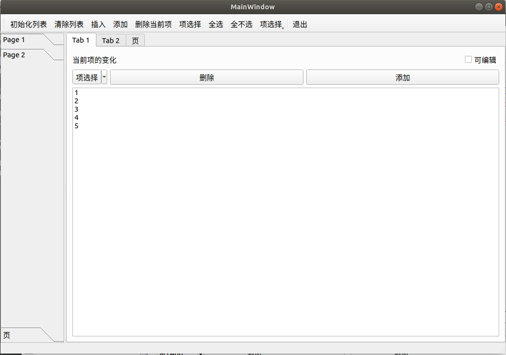
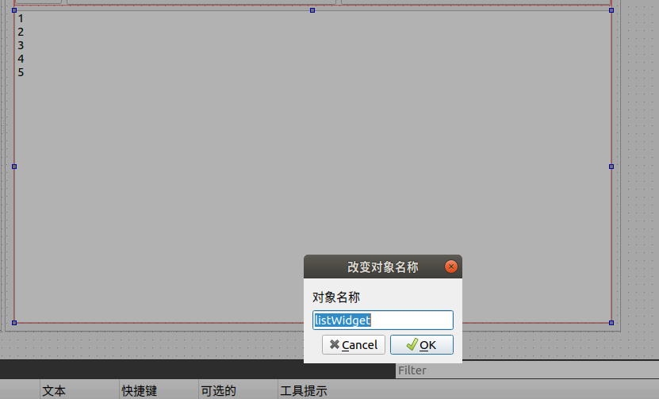

# Qt Widget 鼠标右键

## 1. 问题描述



当我们右键单击　1 2 3 4 5 所在的区域的时候，并没有弹出菜单项，根本原因是：没有发出customContextMenuRequested信号

## 2. 资料查询：

https://blog.csdn.net/weiaipan1314/article/details/81676739


customContextMenuRequested(QPoint)信号是QWidget中唯一右键菜单点击的信号，该信号发出的条件是：widget的ContextMenuPolicy必须是Qt::CustomContextMenu，此时右键点击就会发出此信号。

## 3. 修改办法：



这个控件的名字是 listWidget.

在构造函数中添加：

```c++
MainWindow::MainWindow(QWidget *parent) :
    QMainWindow(parent),
    ui(new Ui::MainWindow)
{
    ui->setupUi(this);
    setCentralWidget(ui->splitter_2);//可以使splitter填充整个工作区

    setActionsForButton();
    createSelectionPopMenu();

    ui->listWidget->setContextMenuPolicy(Qt::CustomContextMenu);  // 主要就是加这个　

}
```

修改之后，就可以在　对应的区域右键点击，发现是可以弹出菜单的　

## 4. **额外：**

1. 槽函数也展示出来：

```c++
void MainWindow::on_listWidget_customContextMenuRequested(const QPoint &pos)
{
    qDebug()<< "触发了右键菜单";
    Q_UNUSED(pos);
    QMenu *menuList = new QMenu(this); //创建菜单
    // 添加 actions 创建菜单项
    menuList->addAction(ui->actInsert);
    menuList->addAction(ui->actInSeclet);
    menuList->addAction(ui->actAllSelect);
    menuList->addAction(ui->actNoAllSelect);
    menuList->addAction(ui->actAdd);
    menuList->addAction(ui->actItemSeclect);

    menuList->addSeparator();
    menuList->addAction(ui->actExit);

    menuList->exec(QCursor::pos()); // 在鼠标光标位置显示右键快捷菜单
    delete menuList;
    qDebug()<< "触发了右键菜单";
}
```

2. 记录　一个debug的方法：

```c++
#include <QtDebug>
qDebug()<< "触发了右键菜单";
```

3. **每个从QWidgt 继承的类都有信号　customContextMenuRequested()**,这个信号在鼠标右键单击时发出

