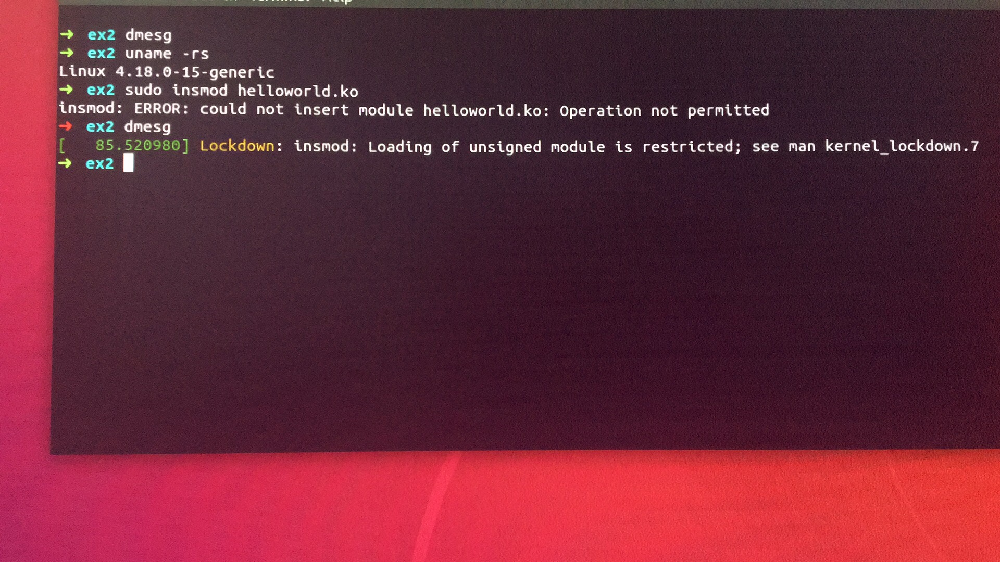
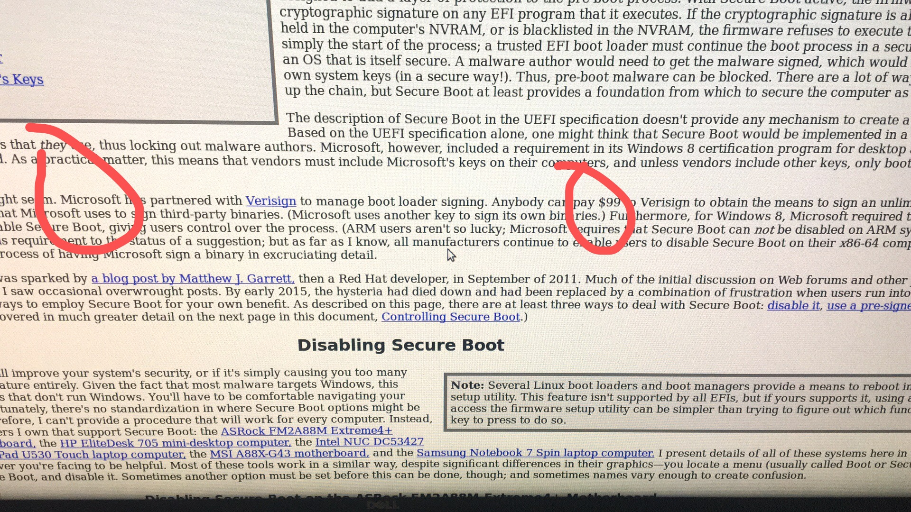
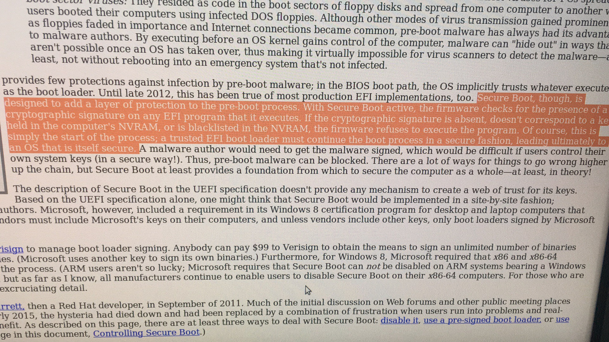
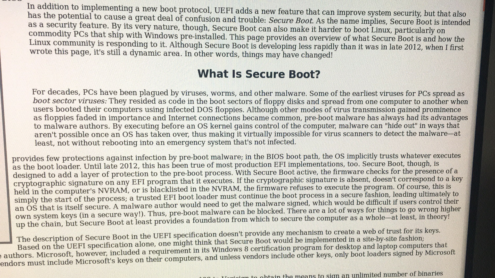
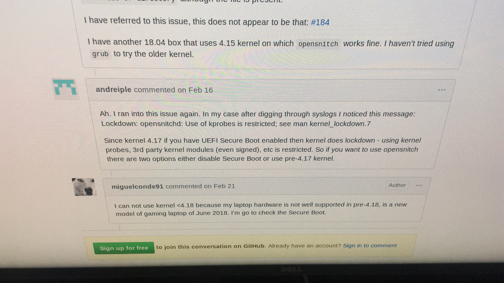
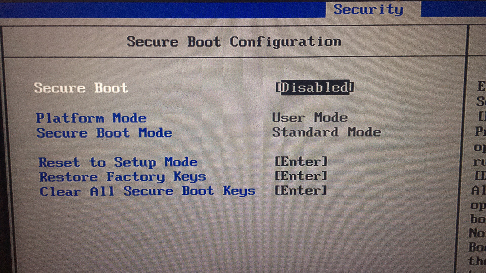
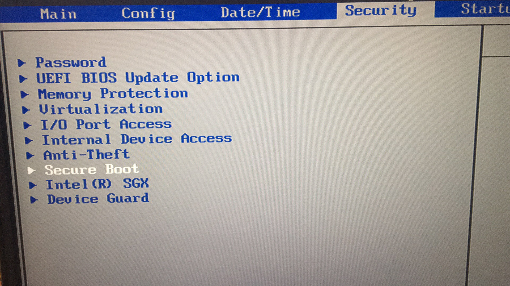

# kernel4.17之后insmod报错解决

## 1. 问题描述

当我们编写基本的内核模块时，插入时，报错：

```c
#include <linux/init.h>
#include <linux/module.h>

MODULE_LICENSE("Dual BSD/GPL") ;

static char *my_name = "colby";
static int num = 5000 ;

static __init int person_init(void)
{
    printk(KERN_INFO"persion name: %s\n", my_name) ;
    printk(KERN_INFO"persion num: %d\n", num) ;

    return 0;
}

static __exit void persion_exit(void)
{
    printk(KERN_ALERT"persion module exit\n") ;
}

module_init(person_init) ;
module_exit(persion_exit) ;
module_param(num, int, S_IRUGO) ;
module_param(my_name, charp, S_IRUGO) ;

MODULE_AUTHOR("colby") ;
MODULE_DESCRIPTION("带参数的模块测试") ;
MODULE_VERSION("V1.0") ;
```

```makefile
obj-m := helloworld.o

all :
	$(MAKE) -C /lib/modules/$(shell uname -r)/build M=$(PWD) modules  
clean:
	$(MAKE) -C /lib/modules/$(shell uname -r)/build M=$(PWD) clean 
```

报错信息如下：



## 2. 资料查询：









从这个我们知道　是kernel从 4.17开始　加的，检测 UEFI 的 Secure Boot

## 3.解决措施

关闭 uefi 的 secure boot



