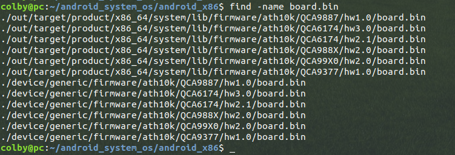
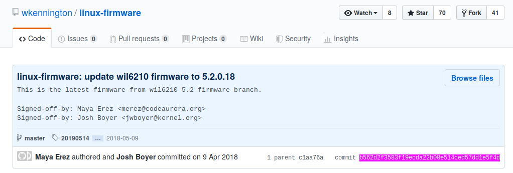

# 02.更新wifi-board.bin

# 1. 资料

http://bbs.phoenixstudio.org/cn/index.php?m=3g&c=read&tid=24714

首先根据上述资料去找，发现该url中的board.bin的下载链接是失败的

然后，我有在android_x86中搜索board.bin文件：



查看git提交：

```shell
commit 8b0fe89ed700a5a2914a57fe2f30263607f82ac1 (HEAD, x86/nougat-x86, m/nougat-x86)
Author: Chih-Wei Huang <cwhuang@linux.org.tw>
Date:   Wed May 2 00:06:46 2018 +0800

    Update firmwares from linux-firmware.git
    
    The reference commit is b562d2f3583f19ecda22b08e514ced57dd1e5f4d.
    
    Excluded commits:
    * 2a91ed954213eabc90154ccd682cbfed7195c4b0
    * 60ba4da28422dbb5e36f2f4cbca56f9b3b141874
```

从android_x86中我们可以看出来，这儿的固件是从如下的git仓库linux-firmware中去merge的固件：

https://github.com/wkennington/linux-firmware



而且我也确实从中找到了 对应参考的commit的提交记录

# 2. merge新的固件

以后，我们更新固件就可以从 linux-firmware 仓库中去拿：

这里我们就从这个仓库中去更新固件：

https://github.com/wkennington/linux-firmware

