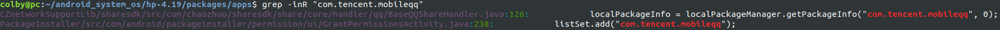

06.修改安装包的应用白名单



```shell
hp-4.19/packages/apps$ grep -inR "com.tencent.mobileqq"

CZnetworkSupportLib/sharesdk/src/com/chaozhuo/sharesdk/share/core/handler/qq/BaseQQShareHandler.java:126:            localPackageInfo = localPackageManager.getPackageInfo("com.tencent.mobileqq", 0);


PackageInstaller/src/com/android/packageinstaller/permission/ui/GrantPermissionsActivity.java:238:            listSet.add("com.tencent.mobileqq");
```

最后在 GrantPermissionsActivity.java +238 中找到修改白名单的地方了

```java
private static HashSet listSet = null;
    private boolean isPermissionWhiteList(PackageInfo callingPackageInfo) {
        if (listSet == null) {
            listSet = new HashSet();                                                                                                                                                                           
            listSet.add("com.google.android.inputmethod.pinyin");
            listSet.add("com.baidu.input");
            listSet.add("com.chaozhuo.browser");
            listSet.add("com.chaozhuo.browser.x86");
            listSet.add("com.chaozhuo.filemanager");
            listSet.add("com.chaozhuo.texteditor");
            listSet.add("cn.wps.moffice_eng");
            listSet.add("com.kingsoft.mail");
            listSet.add("com.android.settings");
            listSet.add("com.chaozhuo.browser");
                
            listSet.add("com.chaozho.recommendedapp");
            listSet.add("com.chaozhuo.feedback");
            listSet.add("com.android.gallery3d");
            listSet.add("com.android.camera2");
            listSet.add("com.chaozhuo.voicerecorder");
            listSet.add("com.chaozhuo.permission.controller");
            listSet.add("com.android.email");
                
            listSet.add("com.microsoft.office.word");
            listSet.add("com.microsoft.office.excel");
            
            // 将如下注释掉
            listSet.add("com.tencent.mm");// 这个是微信的包名
            listSet.add("com.tencent.mobileqq");// 这个是qq的包名
            listSet.add("com.qiyi.video");//  这个是 爱奇艺的包名
    
            listSet.add("com.wandoujia.phoenix2");
            listSet.add("com.happyelements.AndroidAnimal");
            listSet.add("com.baidu.BaiduMap");
            listSet.add("com.ss.android.article.news");
        }
        boolean ret = false;
        if (callingPackageInfo != null) {
            String packageName = callingPackageInfo.packageName;
            if (packageName != null && listSet.contains(packageName)) {
                return true;
            }
        }
        return false;
    }   

```


补充：

```shell
pm list packages # 看系统中的包

pm path com.qiyi.video.pad # 看包的文件路径
```

 com.qiyi.video.pad