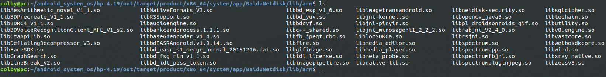

11.安装第三方的apk

# 1. apk

将百度云盘.apk和 全能播放器.apk放入系统后，发现运行的时候，显示报错，少库：

```shell
libsqlcipher.so # 百度云盘

libkv.so # 完美播放器
```


预制app可参照如下提交： phoenix_config 这个仓库中的提交， 从repo中去找对应目录：hp-4.19/phoenix

```shell

```

```shell
commit 16c94cd8ca32b69ea1e5fd23958577c14af9a91c
Author: zhoujianfeng <zhoujianfeng@phoenixos.com>
Date:   Tue Oct 16 16:25:56 2018 +0800

    预置教育app
    
    
commit e9cfeed531abf23b963ac12f348d2583004697b4
Author: zhoujianfeng <zhoujianfeng@phoenixos.com>
Date:   Tue Nov 27 16:05:53 2018 +0800

    咪咕灵犀预置签名被修改安装失败

commit fe072d1035d5801e0cb0e518a60b86c38c86efd7
Author: zhoujianfeng <zhoujianfeng@phoenixos.com>
Date:   Fri Nov 23 16:41:29 2018 +0800

    add app 咪咕灵犀
    
```


修改Android.mk : hp-4.19/phoenix/x86/prebuild-app/system$ vim Android.mk

```makefile
#### config forBaiduNetdisk ####
include $(CLEAR_VARS)
LOCAL_MODULE := BaiduNetdisk
LOCAL_MODULE_TAGS := optional
LOCAL_MODULE_SUFFIX := .apk
LOCAL_SRC_FILES := BaiduNetdisk.apk
LOCAL_MODULE_CLASS := APPS
LOCAL_DEX_PREOPT := false
LOCAL_CERTIFICATE := PRESIGNED
include $(BUILD_PREBUILT)

LOCAL_LIBS := $(shell zipinfo -1 $(LOCAL_PATH)/BaiduNetdisk.apk | grep ^lib/ | grep -v /$$$$)
LOCAL_X86_LIBS := $(filter lib/armeabi-v7a/%,$(LOCAL_LIBS))


ifneq ($(LOCAL_X86_LIBS),)
INSTALLED_LIBS := $(addprefix $(TARGET_OUT_SHARED_LIBRARIES)/../app/$(LOCAL_MODULE)/lib/arm/,$(notdir $(firstword $(LOCAL_LIBS))))
$(INSTALLED_LIBS): PRIVATE_LIBS := $(LOCAL_LIBS)
$(INSTALLED_LIBS): $(LOCAL_PATH)/BaiduNetdisk.apk
    @mkdir -p $(@D) && unzip -joDDd $(@D) $< $(PRIVATE_LIBS)
$(LOCAL_BUILT_MODULE): $(INSTALLED_LIBS)
endif
ALL_DEFAULT_INSTALLED_MODULES += $(LOCAL_INSTALLED_MODULE)
```


这个是参考：

```makefile
#CHAOZHUO
ifeq ($(CZ_BUILD_MAIN_SWITCH_ON),true)
ifneq ($(TARGET_PRODUCT),$(filter $(TARGET_PRODUCT),android_x86 android_x86_64))

LOCAL_PATH := $(call my-dir)
LOCAL_APPS := $(subst $(LOCAL_PATH)/,,$(wildcard $(LOCAL_PATH)/*$(COMMON_ANDROID_PACKAGE_SUFFIX)))

define include-app
include $$(CLEAR_VARS)                                                                                                                                                                                             

LOCAL_MODULE := $$(basename $(1))
LOCAL_MODULE_TAGS := optional
LOCAL_MODULE_SUFFIX := $$(suffix $(1))
LOCAL_SRC_FILES := $(1)
LOCAL_MODULE_CLASS := APPS
LOCAL_CERTIFICATE := PRESIGNED
include $$(BUILD_PREBUILT)

LOCAL_LIBS := $$(shell zipinfo -1 $$(LOCAL_PATH)/$(1) | grep ^lib/ | grep -v /$$$$)
LOCAL_X86_LIBS := $$(filter lib/x86/%,$$(LOCAL_LIBS))
LOCAL_ARM_LIBS := $$(filter lib/armeabi/%,$$(LOCAL_LIBS))
LOCAL_ARMV7_LIBS := $$(filter lib/armeabi-v7a/%,$$(LOCAL_LIBS))
LOCAL_LIBS := $$(if $$(LOCAL_ARMV7_LIBS),$$(LOCAL_ARMV7_LIBS),$$(LOCAL_ARM_LIBS))
$(info OutPath: $(LOCAL_MODULE))
$(info Local libs: $(LOCAL_LIBS))
ifneq ($$(LOCAL_LIBS),)
INSTALLED_LIBS := $$(addprefix $$(TARGET_OUT_SHARED_LIBRARIES)/../app/$$(LOCAL_MODULE)/lib/arm/,$$(notdir $$(firstword $$(LOCAL_LIBS))))
$(info INSTALLED_LIBS: $(INSTALLED_LIBS))
$$(INSTALLED_LIBS): PRIVATE_LIBS := $$(LOCAL_LIBS)
$$(INSTALLED_LIBS): $$(LOCAL_PATH)/$(1)
    @mkdir -p $$(@D) && unzip -joDDd $$(@D) $$< $$(PRIVATE_LIBS)
$$(LOCAL_BUILT_MODULE): $$(INSTALLED_LIBS)
endif
$(info $(LOCAL_BUILT_MODULE))
ALL_DEFAULT_INSTALLED_MODULES += $$(LOCAL_INSTALLED_MODULE)
endef

$(foreach a,$(LOCAL_APPS),$(eval $(call include-app,$(a))))

endif
endif
#CHAOZHUO
```

## 1.1 步骤：

1. 将第三方的apk放在：hp-4.19/phoenix/x86/prebuild-app/system 该目录下
2. 修改该目录中的Android.mk

```makefile
#### config for baidu WangMeiBoFangQi ####
include $(CLEAR_VARS)
LOCAL_MODULE := WangMeiBoFangQi
LOCAL_MODULE_TAGS := optional
LOCAL_MODULE_SUFFIX := .apk
LOCAL_SRC_FILES := WangMeiBoFangQi.apk
LOCAL_MODULE_CLASS := APPS
LOCAL_DEX_PREOPT := false
LOCAL_CERTIFICATE := PRESIGNED
include $(BUILD_PREBUILT)

LOCAL_LIBS := $(shell zipinfo -1 $(LOCAL_PATH)/WangMeiBoFangQi.apk | grep ^lib/ | grep -v /$$$$)
LOCAL_X86_LIBS := $(filter lib/armeabi-v7a/%,$(LOCAL_LIBS))


ifneq ($(LOCAL_X86_LIBS),)
INSTALLED_LIBS := $(addprefix $(TARGET_OUT_SHARED_LIBRARIES)/../app/$(LOCAL_MODULE)/lib/arm/,$(notdir $(firstword $(LOCAL_LIBS))))
$(INSTALLED_LIBS): PRIVATE_LIBS := $(LOCAL_LIBS)
$(INSTALLED_LIBS): $(LOCAL_PATH)/WangMeiBoFangQi.apk
	@mkdir -p $(@D) && unzip -joDDd $(@D) $< $(PRIVATE_LIBS)
$(LOCAL_BUILT_MODULE): $(INSTALLED_LIBS)
endif
ALL_DEFAULT_INSTALLED_MODULES += $(LOCAL_INSTALLED_MODULE)

#### config forBaiduNetdisk ####
include $(CLEAR_VARS)
LOCAL_MODULE := BaiduNetdisk
LOCAL_MODULE_TAGS := optional
LOCAL_MODULE_SUFFIX := .apk
LOCAL_SRC_FILES := BaiduNetdisk.apk
LOCAL_MODULE_CLASS := APPS
LOCAL_DEX_PREOPT := false
LOCAL_CERTIFICATE := PRESIGNED
include $(BUILD_PREBUILT)

LOCAL_LIBS := $(shell zipinfo -1 $(LOCAL_PATH)/BaiduNetdisk.apk | grep ^lib/ | grep -v /$$$$)

LOCAL_X86_LIBS := $(filter lib/x86/%,$(LOCAL_LIBS))
LOCAL_ARM_LIBS := $(filter lib/armeabi/%,$$(LOCAL_LIBS))
LOCAL_ARMV7_LIBS := $(filter lib/armeabi-v7a/%,$$(LOCAL_LIBS))

LOCAL_LIBS := $(if $(LOCAL_X86_LIBS),$(LOCAL_ARMV7_LIBS),$(LOCAL_ARM_LIBS))
$(info OutPath: $(LOCAL_MODULE))
$(info Local libs: $(LOCAL_LIBS))
ifneq ($(LOCAL_LIBS),)
INSTALLED_LIBS := $(addprefix $(TARGET_OUT_SHARED_LIBRARIES)/../app/$(LOCAL_MODULE)/lib/arm/,$(notdir $(firstword $(LOCAL_LIBS))))
$(INSTALLED_LIBS): PRIVATE_LIBS := $(LOCAL_LIBS)
$(INSTALLED_LIBS): $(LOCAL_PATH)/BaiduNetdisk.apk
	@mkdir -p $(@D) && unzip -joDDd $(@D) $< $(PRIVATE_LIBS)
$(LOCAL_BUILT_MODULE): $(INSTALLED_LIBS)
endif
ALL_DEFAULT_INSTALLED_MODULES += $(LOCAL_INSTALLED_MODULE)
```

这里说明一点， 只所以这样干的目的是： 提取出 第三方中的 *.so库， 放在对应目录下面。

由于我们是在x86 平台中 跑arm的 *.so库， 

我们只需要将arm的*so库提取出来即可， 当平台调用arm .so 时，会自动转成intel x86指令集

这个技术叫： houdini-5.1  houdini-6.0  houdini-7.0


我们在用命令行提取百度网盘的库时，没有提取成功，是unzip -jo BaiDUnetdisk.apk 手动提取的*.so, 将*.so 赋值到了对应out 目录下面：hp-4.19/out/target/product/x86_64/system/app/BaiduNetdisk/lib/arm



完美播放器是提取成功的。直接用即可。


编译出来的Img 安装出错， 必须在windows上在跑一遍压缩：

压缩的命令如下：

phoenix-n/bootable$ grep -inR "7za"

newinstaller/Android.mk:99

```shell
7za a -t7z $(TARGET_PRODUCT).7z initrd.img install.img kernel ramdisk.img system.$(if $(MKSQUASHFS),sfs,img)
```

