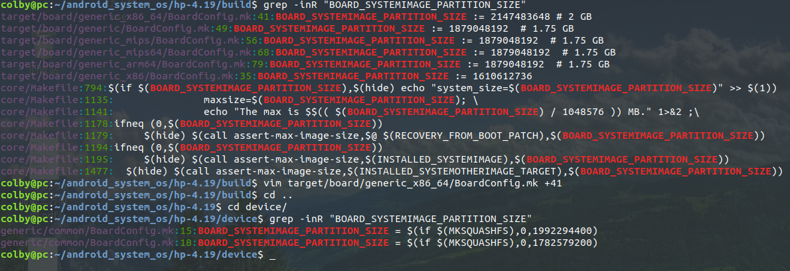

12 android systemimage默认大小以及如何修改

使用ext4格式生成system.img有时候会报错，原因可能是因为文件分配的大小不够，默认情况下系统使用128M大小，对于4.0以上系统不做裁剪其实是不够用的。


build/core/Makefile:

     823 $(INSTALLED_SYSTEMIMAGE): $(BUILT_SYSTEMIMAGE) $(RECOVERY_FROM_BOOT_PATCH)      | $(ACP)
     824     @echo "Install system fs image: $@"
     825     $(copy-file-to-target)
     826     $(hide) $(call assert-max-image-size,$@ $(RECOVERY_FROM_BOOT_PATCH),$(B     OARD_SYSTEMIMAGE_PARTITION_SIZE),yaffs)
     827 
     828 systemimage: $(INSTALLED_SYSTEMIMAGE)
    
     799 $(BUILT_SYSTEMIMAGE): $(FULL_SYSTEMIMAGE_DEPS) $(INSTALLED_FILES_FILE)
     800     $(call build-systemimage-target,$@)

build-systemimage-target定义：

     790 define build-systemimage-target
     791   @echo "Target system fs image: $(1)"
     792   @mkdir -p $(dir $(1)) $(systemimage_intermediates) && rm -rf $(systemimag     e_intermediates)/system_image_info.txt
     793   $(call generate-userimage-prop-dictionary, $(systemimage_intermediates)/s     ystem_image_info.txt, skip_fsck=true)
     794   $(hide) PATH=$(foreach p,$(INTERNAL_USERIMAGES_BINARY_PATHS),$(p):)$$PATH      \
     795       ./build/tools/releasetools/build_image.py \
     796       $(TARGET_OUT) $(systemimage_intermediates)/system_image_info.txt $(1)
     797 endef

核心是调用了build_image.py脚本文件，但system_image_info.txt文件很重要，该文件中描述了生成image的一些属性，不如类型、分区大小、标记等等，python脚本会根据该文件生成相应的Image。


info.txt文件生成过程：

     590 define generate-userimage-prop-dictionary
     591 $(if $(INTERNAL_USERIMAGES_EXT_VARIANT),$(hide) echo "fs_type=$(INTERNAL_US     ERIMAGES_EXT_VARIANT)" >> $(1))
     592 $(if $(BOARD_SYSTEMIMAGE_PARTITION_SIZE),$(hide) echo "system_size=$(BOARD_     SYSTEMIMAGE_PARTITION_SIZE)" >> $(1))
     593 $(if $(BOARD_USERDATAIMAGE_PARTITION_SIZE),$(hide) echo "userdata_size=$(BO     ARD_USERDATAIMAGE_PARTITION_SIZE)" >> $(1))
     594 $(if $(BOARD_CACHEIMAGE_FILE_SYSTEM_TYPE),$(hide) echo "cache_fs_type=$(BOA     RD_CACHEIMAGE_FILE_SYSTEM_TYPE)" >> $(1))
     595 $(if $(BOARD_CACHEIMAGE_PARTITION_SIZE),$(hide) echo "cache_size=$(BOARD_CA     CHEIMAGE_PARTITION_SIZE)" >> $(1))
     596 $(if $(BOARD_VENDORIMAGE_FILE_SYSTEM_TYPE),$(hide) echo "vendor_fs_type=$(B     OARD_VENDORIMAGE_FILE_SYSTEM_TYPE)" >> $(1))
     597 $(if $(BOARD_VENDORIMAGE_PARTITION_SIZE),$(hide) echo "vendor_size=$(BOARD_     VENDORIMAGE_PARTITION_SIZE)" >> $(1))
     598 $(if $(INTERNAL_USERIMAGES_SPARSE_EXT_FLAG),$(hide) echo "extfs_sparse_flag     =$(INTERNAL_USERIMAGES_SPARSE_EXT_FLAG)" >> $(1))
     599 $(if $(mkyaffs2_extra_flags),$(hide) echo "mkyaffs2_extra_flags=$(mkyaffs2_     extra_flags)" >> $(1))
     600 $(hide) echo "selinux_fc=$(SELINUX_FC)" >> $(1)
     601 $(if $(2),$(hide) $(foreach kv,$(2),echo "$(kv)" >> $(1);))
     602 endef

这里可以得到几个有用的变量来控制几个镜像文件的大小等信息。

BOARD_SYSTEMIMAGE_PARTITION_SIZE ，可以修改system.img的文件大小。


看看如果不定义文件大小会是多少

system/extras/ext4_utils/mkuserimg.sh:

     47 if [ -z $SIZE ]; then
     48   echo "Need size of filesystem"
     49   exit 2
     50 fi

这是最新版的处理办法，没有定义会提示。

老版是这样的：

    0046 if [ -z $SIZE ]; then
    0047     SIZE=128M
    0048 fi

默认为128M。 


原文链接：https://blog.csdn.net/remme123/article/details/16967523


# 1.1 根据上述对凤凰系统进行修改

编译时报错信息：

```shell
error: ext4_allocate_best_fit_partial: failed to allocate 131 blocks, out of space?
Creating filesystem with parameters:
    Size: 1992294400 # 这个数字
    Block size: 4096
    Blocks per group: 32768
    Inodes per group: 8112
    Inode size: 256
    Journal blocks: 7600
    Label: system
    Blocks: 486400
    Block groups: 15
    Reserved block group size: 119
Out of space? the tree size of out/target/product/x86_64/system is (MB): 
1879	out/target/product/x86_64/system
The max is 1900 MB.
ninja: build stopped: subcommand failed.
build/core/ninja.mk:148: recipe for target 'ninja_wrapper' failed
make: *** [ninja_wrapper] Error 1

#### make failed to build some targets (06:30 (mm:ss)) ####

```

在根目录的 build 和  device 搜  BOARD_SYSTEMIMAGE_PARTITION_SIZE 关键字：



其中：hp-4.19/device 下的 generic/common/BoardConfig.mk:15:BOARD_SYSTEMIMAGE_PARTITION_SIZE = $(if $(MKSQUASHFS),0,1992294400) 和上述报错的地方大小是相等的。**所以只需要调整这里的大小即可**

# 1.2 修改方案：

hp-4.19/device$ vim generic/common/BoardConfig.mk +15

```makefile
#hp-4.19/device$ vim generic/common/BoardConfig.mk +15

ifeq ($(TARGET_PRODUCT),android_x86_64)
# 64bit 1900M
BOARD_SYSTEMIMAGE_PARTITION_SIZE = $(if $(MKSQUASHFS),0,1992294400)                                                                                                                                                
else
# def=1536Mb  now=1700Mb
BOARD_SYSTEMIMAGE_PARTITION_SIZE = $(if $(MKSQUASHFS),0,1782579200)
endif

```

修改为：

```makefile
#hp-4.19/device$ vim generic/common/BoardConfig.mk +15
ifeq ($(TARGET_PRODUCT),android_x86_64)
# 64bit 2000M                                                                                                                                                                                                      
BOARD_SYSTEMIMAGE_PARTITION_SIZE = $(if $(MKSQUASHFS),0,2097152000)
else
# def=1536Mb  now=1700Mb
BOARD_SYSTEMIMAGE_PARTITION_SIZE = $(if $(MKSQUASHFS),0,1782579200)
endif
```

