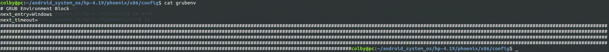

13.从Android 切换到 windows中：

```shell
colby@pc:~/android_system_os/hp-4.19/phoenix/x86/config$ ls
Android.mk  arm.txt  grubenv  parted  reboot_to_window.sh
```


```shell
#!/bin/sh

DEVICES=`ls /sys/block | grep -v -E "loop|ram|sr|boot|rpmb"`
PREFFIX=/dev/block/

for device in $DEVICES; do
    if [ -e $PREFFIX$device ]; then
        parted $PREFFIX$device print |grep gpt > /dev/null 2>&1
	if [ $? -eq 0 ]; then
	    NO=`parted $PREFFIX$device print |grep boot |awk '{print $1}'`
            TY=`parted $PREFFIX$device print |grep boot |awk '{print $5}'`
	    if [ 0$NO -gt 0 ]; then
                PATH=$PREFFIX$device$NO
                TYPE=$TY
                break;
            fi
	fi
    fi
done

if [ $PATH ] && [ $TYPE ]; then
    if [ "$TYPE" == "fat32" ] ; then
        REAL_TYPE=vfat
    fi
    echo $PATH
    echo $TYPE
    MOUNT_PATH=/storage/tmp/
    system/bin/mkdir $MOUNT_PATH
    system/bin/mount -t $REAL_TYPE $PATH $MOUNT_PATH

    EFI_PATH=/storage/tmp/EFI/Boot/
    if [ -e $EFI_PATH ]; then
        system/bin/cp -r /system/etc/grubenv $EFI_PATH/
        system/bin/setprop persist.sys.phoenix.towindow 0
    fi
fi

exit 0
```

```makefile
ifeq ($(TARGET_PRODUCT),$(filter $(TARGET_PRODUCT),android_x86 android_x86_64))
LOCAL_PATH := $(call my-dir)

include $(CLEAR_VARS)
LOCAL_MODULE := arm
LOCAL_MODULE_TAGS := optional
LOCAL_SRC_FILES := $(LOCAL_MODULE).txt
LOCAL_MODULE_CLASS :=ETC
LOCAL_MODULE_SUFFIX :=.txt
LOCAL_MODULE_PATH := $(TARGET_OUT)/etc/
include $(BUILD_PREBUILT)
ALL_DEFAULT_INSTALLED_MODULES += $(LOCAL_MODULE)

include $(CLEAR_VARS)
LOCAL_MODULE := grubenv
LOCAL_MODULE_TAGS := optional
LOCAL_SRC_FILES := $(LOCAL_MODULE)
LOCAL_MODULE_CLASS := ETC
LOCAL_MODULE_PATH := $(TARGET_OUT)/etc
include $(BUILD_PREBUILT)
ALL_DEFAULT_INSTALLED_MODULES += $(LOCAL_MODULE)

include $(CLEAR_VARS)
LOCAL_MODULE := parted
LOCAL_MODULE_TAGS := optional
LOCAL_SRC_FILES := $(LOCAL_MODULE)
LOCAL_MODULE_CLASS :=EXECUTABLES
LOCAL_MODULE_PATH := $(TARGET_OUT)/bin
include $(BUILD_PREBUILT)
ALL_DEFAULT_INSTALLED_MODULES += $(LOCAL_MODULE)

include $(CLEAR_VARS)
LOCAL_MODULE := reboot_to_window
LOCAL_MODULE_TAGS := optional
LOCAL_SRC_FILES := $(LOCAL_MODULE).sh
LOCAL_MODULE_SUFFIX :=.sh
LOCAL_MODULE_CLASS :=EXECUTABLES
LOCAL_MODULE_PATH := $(TARGET_OUT)/bin
include $(BUILD_PREBUILT)
ALL_DEFAULT_INSTALLED_MODULES += $(LOCAL_MODULE)

endif
```



```shell
cat grubenv 
# GRUB Environment Block
next_entry=Windows
next_timeout=
```

