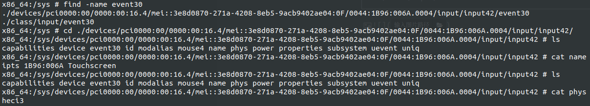

03.没有触屏

背景：

在kernel4.14版本中，是支持触摸屏的。但是新版本的内核4.19.50中是没有对应的驱动的，所以要去拿，4.14中的驱动，或者是从github中去找当前4.19 的触摸板的驱动，重新放置进来即可。

# 1. 4.14 中有用的信息

当我们点击屏幕的时候，　getevent　中　event30 是上报触摸屏事件的

```shell
x86_64:/sys # find -name event30

./devices/pci0000:00/0000:00:16.4/mei::3e8d0870-271a-4208-8eb5-9acb9402ae04:0F/0044:1B96:006A.0004/input/input42/event30


./class/input/event30
```



这里得到一个信息：

name:  ipts 1B96:006A Touchscreen

phys :  heci3

bustype: 0044

product: 006a

version: 0000


cat uevent

```shell
PRODUCT=44/1b96/6a/0
NAME="ipts 1B96:006A Touchscreen"
PHYS="heci3"
UNIQ=""
PROP=2
EV=b
KEY=400 0 0 0 0 0
ABS=3273800000000003
MODALIAS=input:b0044v1B96p006Ae0000-e0,1,3,k14A,ra0,1,2F,30,31,34,35,36,39,3C,3D,mlsfw
```

通过　　ipts　信息，我们找到了　**0005-ipts.patch**　https://github.com/caobinxin/linux-surface/blob/4.19.56-1/patches/4.19/0005-ipts.patch

将这个patch打入我们的kernel中，并开启下面的配置，编译后，触屏可以使用。

CONFIG_INTEL_IPTS


