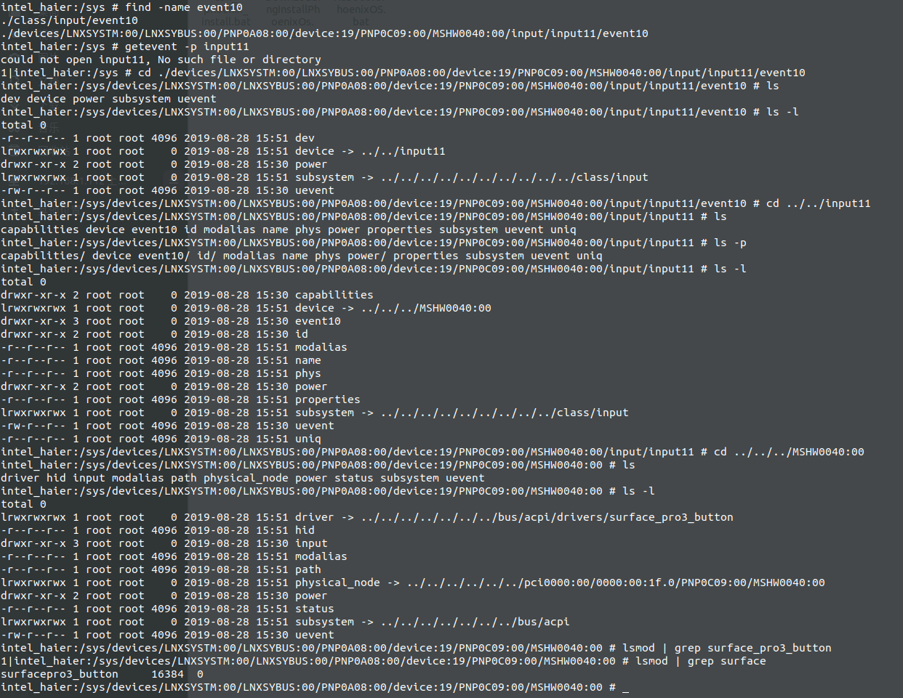

04.无法唤醒

# 1. 问题描述

当休眠后，点击电源键无法唤醒

猜测情况为：休眠后，powerbtn和音量键　都处于休眠状态，电源键应该不要处于休眠，不然没法上报唤醒事件。

# 2. 问题检查:


```shell
intel_haier:/ # getevent -p 

add device 33: /dev/input/event10
  name:     "Surface Pro 3/4 Buttons"
  events:
    KEY (0001): 0072  0073  0074  007d 
  input props:
    <none>

```

## 2.1 查找设备驱动

现在记录一个查找设备对应驱动的方法：



1. 这里已知 powerbtn和音量按键　是 event10 事件
2. 先找到　device
3. 然后在找到　driver目录的链接目录

**关键是：看sys目录下面的　软链接的情况去决定**

找到这个驱动　

```shell
intel_haier:/system # find -name surfacepro3_button.ko

./lib/modules/4.19.50-PhoenixOS-x86_64-g8b1fe08554f0/kernel/drivers/platform/x86/surfacepro3_button.ko
```


找到源代码：

```shell
colby@pc:~/ssd_480/phoenix-n/kernel$ find -name surfacepro3_button.c
./drivers/platform/x86/surfacepro3_button.c
```

注意看：目录关系

## 2.2 打patch

通过搜索　"Surface Pro 3/4 Buttons"　

我们发现在　https://github.com/caobinxin/linux-surface/blob/master/patches/4.19/0003-buttons.patch 中有相关的字段，然后，我就把这个patch给打上了

检验发现，休眠后，还是没法唤醒


打第二个patch 0002-suspend.patch


打第三个patch  0001-surface-acpi.patch

出现patch打不上的操作：

报错如下：

```diff
diff a/drivers/acpi/acpica/exfield.c b/drivers/acpi/acpica/exfield.c	(rejected hunks)
@@ -102,6 +102,7 @@ acpi_ex_read_data_from_field(struct acpi_walk_state *walk_state,
 	void *buffer;
 	u32 function;
 	u16 accessor_type;
+	u8 field_flags;
 
 	ACPI_FUNCTION_TRACE_PTR(ex_read_data_from_field, obj_desc);
 
@@ -199,11 +200,16 @@ acpi_ex_read_data_from_field(struct acpi_walk_state *walk_state,
 	 * Note: Field.length is in bits.
 	 */
 	length =
-	    (acpi_size)ACPI_ROUND_BITS_UP_TO_BYTES(obj_desc->field.bit_length);
+	    (acpi_size)ACPI_ROUND_BITS_UP_TO_BYTES(obj_desc->common_field.bit_length);
+	field_flags = obj_desc->common_field.field_flags;
 
-	if (length > acpi_gbl_integer_byte_width) {
+	if (length > acpi_gbl_integer_byte_width ||
+	    (field_flags & AML_FIELD_ACCESS_TYPE_MASK) == AML_FIELD_ACCESS_BUFFER) {
 
-		/* Field is too large for an Integer, create a Buffer instead */
+		/*
+		 * Field is either too large for an Integer, or a actually of type
+		 * buffer, so create a Buffer.
+		 */
 
 		buffer_desc = acpi_ut_create_buffer_object(length);
 		if (!buffer_desc) {
@@ -366,19 +372,7 @@ acpi_ex_write_data_to_field(union acpi_operand_object *source_desc,
 		} else if (obj_desc->field.region_obj->region.space_id ==
 			   ACPI_ADR_SPACE_GSBUS) {
 			accessor_type = obj_desc->field.attribute;
-			length =
-			    acpi_ex_get_serial_access_length(accessor_type,
-							     obj_desc->field.
-							     access_length);
-
-			/*
-			 * Add additional 2 bytes for the generic_serial_bus data buffer:
-			 *
-			 *     Status;    (Byte 0 of the data buffer)
-			 *     Length;    (Byte 1 of the data buffer)
-			 *     Data[x-1]: (Bytes 2-x of the arbitrary length data buffer)
-			 */
-			length += 2;
+			length = source_desc->buffer.length;
 			function = ACPI_WRITE | (accessor_type << 16);
 		} else {	/* IPMI */
 
```

通过手动修改后，还用如下的patch没有打，和代码严重不对应，所以就没有打：在这里记录一下

```diff
diff a/drivers/acpi/acpica/exfield.c b/drivers/acpi/acpica/exfield.c	(rejected hunks)
@@ -366,19 +372,7 @@ acpi_ex_write_data_to_field(union acpi_operand_object *source_desc,
 		} else if (obj_desc->field.region_obj->region.space_id ==
 			   ACPI_ADR_SPACE_GSBUS) {
 			accessor_type = obj_desc->field.attribute;
-			length =
-			    acpi_ex_get_serial_access_length(accessor_type,
-							     obj_desc->field.
-							     access_length);
-
-			/*
-			 * Add additional 2 bytes for the generic_serial_bus data buffer:
-			 *
-			 *     Status;    (Byte 0 of the data buffer)
-			 *     Length;    (Byte 1 of the data buffer)
-			 *     Data[x-1]: (Bytes 2-x of the arbitrary length data buffer)
-			 */
-			length += 2;
+			length = source_desc->buffer.length;
 			function = ACPI_WRITE | (accessor_type << 16);
 		} else {	/* IPMI */
```


## 2.3 surfacepro3_button.c分析

### 2.3.2 是否和　pm有关

```diff
------------------ drivers/platform/x86/surfacepro3_button.c ------------------
index eaec30380b11..c20b5642e546 100644
@@ -257,7 +257,7 @@ static struct acpi_driver surface_button_driver = {
 		.remove = surface_button_remove,
 		.notify = surface_button_notify,
 	},
-	.drv.pm = &surface_button_pm,
+//	.drv.pm = &surface_button_pm,
 };
 
 module_acpi_driver(surface_button_driver);

```

将pm先关的关了，验证发现，和pm无关，并不是我们一开始猜想的这样

# 3.问题解决方案：

env: 发现一旦进入mem（深度休眠后）系统是无法唤醒的，只能强制按电源键，关闭重启。

这里解决方案是，让android系统不要进入mem(深度休眠)

 **只要linux保持有一个唤醒锁，系统就不会进入深度休眠。那么解决问题的思路是在linux启动的时候添加一个唤醒锁就行了。在init.rc文件里面添加一个初始化项：**

```shell
# 向　
echo "surfacepro4" > /sys/power/wake_lock
```


