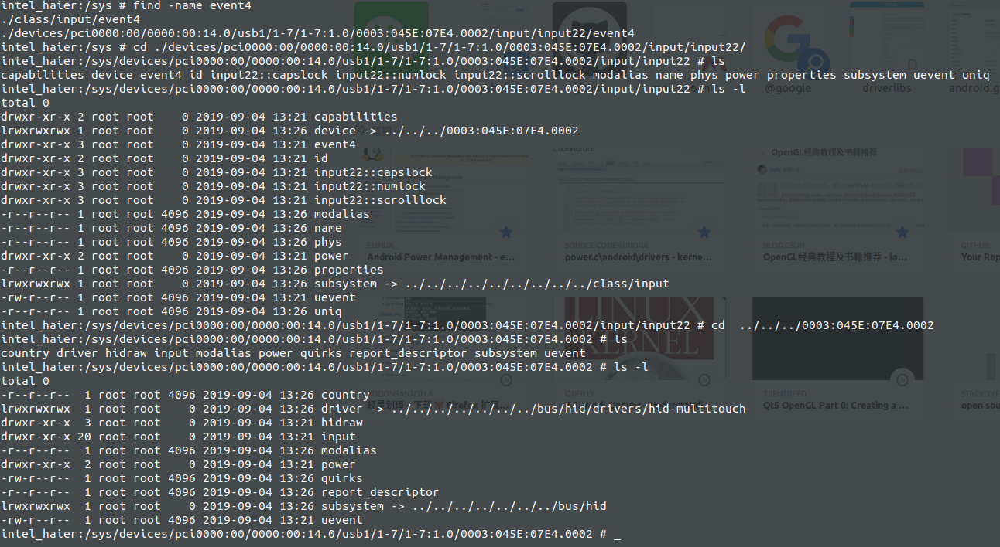
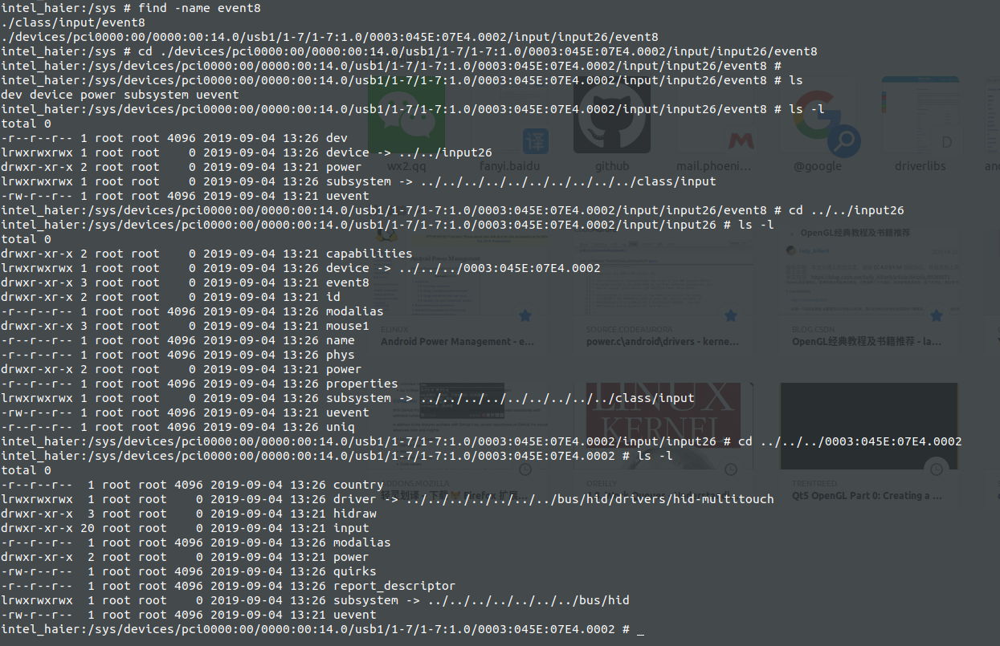
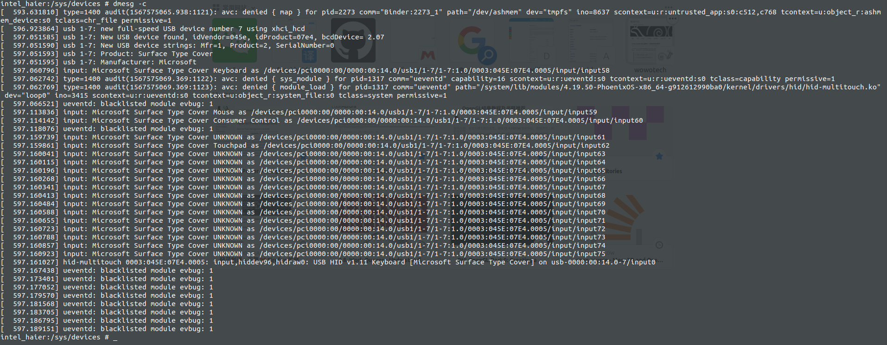

## env:

1. 当键盘拔掉后，再次插入键盘不能使用：


```shell
add device 32: /dev/input/event4
  name:     "Microsoft Surface Type Cover Keyboard"
  
  
add device 28: /dev/input/event8
  name:     "Microsoft Surface Type Cover Touchpad"
 
```


## 正确的log

dmesg: 这个是正确的

```shell
usb 1-7: New USB device found, idVendor=045e, idProduct=07e4, bcdDevice= 2.07

input: Microsoft Surface Type Cover Keyboard as /devices/pci0000:00/0000:00:14.0/usb1/1-7/1-7:1.0/0003:045E:07E4.0002/input/input4

hid-generic 0003:045E:07E4.0002: input,hiddev96,hidraw0: USB HID v1.11 Keyboard [Microsoft Surface Type Cover] on usb-0000:00:14.0-7/input0
```





从软连接中看，驱动已经匹配成功了。


## 错误的log

操作：　此时在正常状态下，将键盘拔掉重新插上。打印的dmesg



