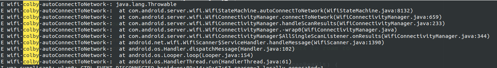

问题场景描述：

## 问题必显的步骤：

- 一个热点a先开启，在启动phoenix 然后在开启一个热点b.此时我们去连接b，死活连接不是。连接上之后，就切换到a热点

  

  

## 最终解决的方案：

问题原因：　我们在检测信号强度的时候，检测到当前网络并不是一个高质量的网络。被触发自动切换了

```java
// frameworks/.../WifiQualifiedNetworkSelector.java

private boolean isNetworkQualified(WifiConfiguration currentNetwork) {
    ...
/*        
    int currentRssi = mWifiInfo.getRssi();
    if ((mWifiInfo.is24GHz()
                        && currentRssi < mWifiConfigManager.mThresholdQualifiedRssi24.get())
                || (mWifiInfo.is5GHz()
                        && currentRssi < mWifiConfigManager.mThresholdQualifiedRssi5.get())) {
        
            localLog("Current band = " + (mWifiInfo.is24GHz() ? "2.4GHz band" : "5GHz band")
                    + "current RSSI is: " + currentRssi);
            return false;
        
        }
  */  
    ...
}
```

我们这里的修改方案是，直接屏蔽这个信号强度检测代码。


## 代码分析：

1. 打开代码调试　WifiStateMachine.java  ; boolean DBG = true;
2. 通过必显的步骤，发现　打印中有　CMD_AUTO_CONNECT will save config ->
3. 根据这个打印信息，找到代码的调用处，对代码的调用栈进行追溯

首先,我们找到了 CMD_AUTO_CONNECT 这个命令是在那发送的,全局只有一个地方发送了，然后对其进行回溯，看为啥会触发这次，wifi切换。

```java
public void autoConnectToNetwork(int networkId, String bssid) {
        synchronized (mWifiReqCountLock) {
            if (hasConnectionRequests()) {
                // 这里将调用结果进行了回溯
                Log.e("wifi-colby-autoConnectToNetwork-",Log.getStackTraceString(new Throwable()));
                sendMessage(CMD_AUTO_CONNECT, networkId, 0, bssid);
            }
        }
    }
```



```c
private void connectToNetwork(WifiConfiguration candidate) {
    ...
    if (currentConnectedNetwork != null
                && (currentConnectedNetwork.networkId == candidate.networkId
                || currentConnectedNetwork.isLinked(candidate))) {
        
            mStateMachine.autoRoamToNetwork(candidate.networkId, scanResultCandidate);
        
    } else {
            
            mStateMachine.autoConnectToNetwork(candidate.networkId, scanResultCandidate.BSSID); // 这个被调用了　
        }
    ...
}

// 通过调试，会发现　一下两个条件都为　false
// 1. currentConnectedNetwork.networkId == candidate.networkId　； candidate:候选者
// 2. currentConnectedNetwork.isLinked(candidate) // 这个是判断当前的网络是否可以连接外网
```

网络是否能上网,我觉得这个我们不用关心。只需要去关心这个　candidate

我们可以通过如下命令关闭　这个网络连接是否检测

```shell
# 当wifi 图标上有小感叹号　使用如下命令可以　关闭　能否上网的检测
adb shell settings put global captive_portal_detection_enabled 0
```


```java
private boolean handleScanResults(List<ScanDetail> scanDetails, String listenerName) {
        localLog(listenerName + " onResults: start QNS");
        WifiConfiguration candidate =
                mQualifiedNetworkSelector.selectQualifiedNetwork(false,
                mUntrustedConnectionAllowed, scanDetails,
                mStateMachine.isLinkDebouncing(), mStateMachine.isConnected(),
                mStateMachine.isDisconnected(),
                mStateMachine.isSupplicantTransientState());
        mWifiLastResortWatchdog.updateAvailableNetworks(
                mQualifiedNetworkSelector.getFilteredScanDetails());
        mWifiMetrics.countScanResults(scanDetails);
        if (candidate != null) {
            localLog(listenerName + ": QNS candidate-" + candidate.SSID);
            connectToNetwork(candidate); // 这个调用了，
            return true;
        } else {
            return false;
        }
    }

// 只要　connectToNetwork(candidate); 不要被调用，问题就能解　
// 只要　candidate == null, 这个问题就能解
```

```java
public WifiConfiguration selectQualifiedNetwork(boolean forceSelectNetwork ,
            boolean isUntrustedConnectionsAllowed, List<ScanDetail>  scanDetails,
            boolean isLinkDebouncing, boolean isConnected, boolean isDisconnected,
            boolean isSupplicantTransient) {
        localLog("==========start qualified Network Selection==========");
        mScanDetails = scanDetails;
        List<Pair<ScanDetail, WifiConfiguration>>  filteredScanDetails = new ArrayList<>();
        if (mCurrentConnectedNetwork == null) {
            mCurrentConnectedNetwork =
                    mWifiConfigManager.getWifiConfiguration(mWifiInfo.getNetworkId());
        }

        // Always get the current BSSID from WifiInfo in case that firmware initiated roaming
        // happened.
        mCurrentBssid = mWifiInfo.getBSSID();

    	// forceSelectNetwork == false 
        if (!forceSelectNetwork && !needQualifiedNetworkSelection(isLinkDebouncing, isConnected,
                isDisconnected, isSupplicantTransient)) {
            localLog("Quit qualified Network Selection since it is not forced and current network"
                    + " is qualified already");
            mFilteredScanDetails = filteredScanDetails;
            return null; // 只要从这个口子出，问题就能解
        }
    
    ...
        
}

// 这里只需要　needQualifiedNetworkSelection() 函数调用返回　false　就能解
```


```java
private boolean needQualifiedNetworkSelection() {
    
    ...
       
    if (!isNetworkQualified(mCurrentConnectedNetwork)) {
       //need not trigger Qualified Network Selection if current network is qualified
       
       return true; // 不能走这个分支
    } else {
       return false;
    }
        
    ...
}

// isNetworkQualified() 需要返回　true
```


```java
boolean isNetworkQualified(WifiConfiguration currentNetwork) {
    
    // 发现下最后一个检查中，没有检测通过，返回了　false,　只需要段代码注销掉：
    
    /*
    
    int currentRssi = mWifiInfo.getRssi();
        if ((mWifiInfo.is24GHz()
                        && currentRssi < mWifiConfigManager.mThresholdQualifiedRssi24.get())
                || (mWifiInfo.is5GHz()
                        && currentRssi < mWifiConfigManager.mThresholdQualifiedRssi5.get())) {
            localLog("Current band = " + (mWifiInfo.is24GHz() ? "2.4GHz band" : "5GHz band")
                    + "current RSSI is: " + currentRssi);
            return false;
        }
    
    */
    
    return true;
}
```

