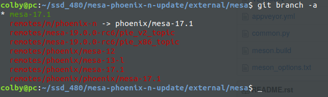
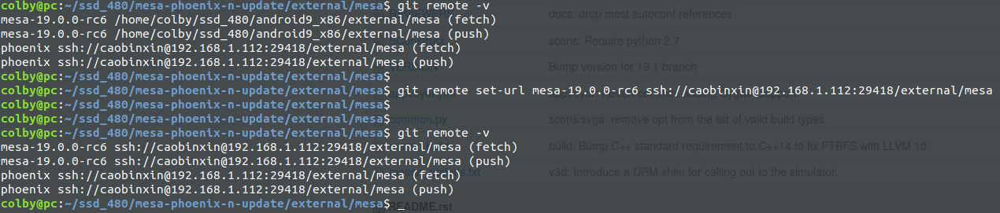
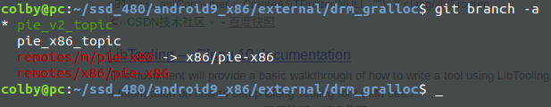
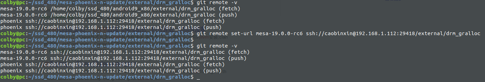
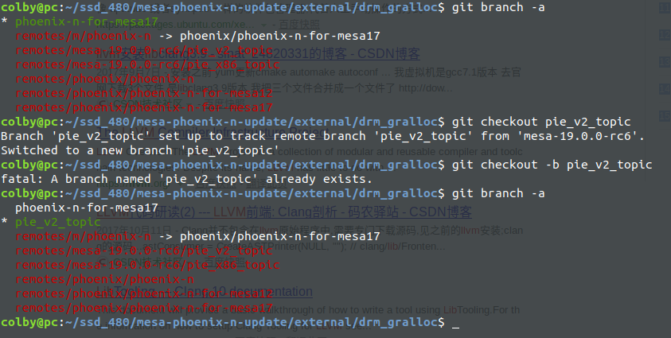
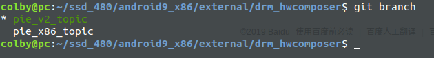
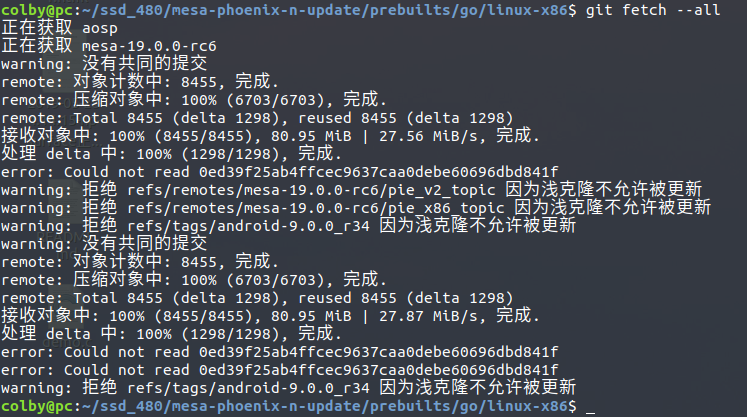

## 1.开项目

选择phoenix-n 分支(公版) 为此次mesa升级的工程

```shell
repo init --repo-url git://aosp.chaozhuo.org/git-repo -u ssh://caobinxin@192.168.1.112:29418/x86manifest -b phoenix-n

repo sync -c -j8 #最好 加一个 -c 这样就不会拉取所有， 
```


## 2.引入新版本mesa代码

### 引入code

将android_x86_9 中的mesa 直接拿过来使用：

```shell
colby@pc:~/ssd_480/mesa-phoenix-n-update/external/mesa$
git remote add mesa-19.0.0-rc6 /home/colby/ssd_480/android9_x86/external/mesa
# 首先添加一个远端xxx 为 mesa-19.0.0-rc6

# 拉代码
git fetch --all
```

拉完之后的分支情况



### 同步到公司的服务器中：



### 切换分支

android9 中mesa所在的分支为 pie_v2_topic

```shell
# 我们也使用同样的分支
git checkout mesa-19.0.0-rc6/pie_v2_topic
git checkout -b pie_v2_topic

# 这样就和android9中的保持一致了
```

## 3.引入对应版本的drm_gralloc代码

external/drm_gralloc

先来记录Android9 下的分支情况：



和mesa同样的引入方案：

```shell
colby@pc:~/ssd_480/mesa-phoenix-n-update/external/drm_gralloc$

git remote add mesa-19.0.0-rc6 ~/ssd_480/android9_x86/external/drm_gralloc
git fetch --all
```



切换到  pie_v2_topic



## 4. 升级对应 libdrm

```shell
git remote add mesa-19.0.0-rc6 /home/colby/ssd_480/android9_x86/external/libdrm/
git fetch --all

git remote set-url mesa-19.0.0-rc6 ssh://caobinxin@192.168.1.112:29418/external/libdrm

git checkout pie_v2_topic
```

## 5. 升级对应 drm_hwcomposer

先看android9 中的记录



```shell
git remote add mesa-19.0.0-rc6 /home/colby/ssd_480/android9_x86/external/drm_hwcomposer/
git fetch --all

git remote set-url mesa-19.0.0-rc6  ssh://caobinxin@192.168.1.112:29418/external/drm_hwcomposer

git checkout pie_v2_topic
```

## 6. 升级 build/soong

```shell
# mesa-phoenix-n-update/build/soong$

git remote add mesa-19.0.0-rc6 /home/colby/ssd_480/android9_x86/build/soong/
git fetch --all

git remote set-url  mesa-19.0.0-rc6 git://aosp.chaozhuo.org/platform/build/soong

 git checkout pie_v2_topic
```

这样升级后，发现，整个phoenixos 报各种错误，直接编译不起来。这个升级废除了，换做，该文件夹下，对应模块的升级了

## 7. 升级go 

```shell
# mesa-phoenix-n-update/prebuilts/go/linux-x86$

git remote add mesa-19.0.0-rc6 /home/colby/ssd_480/android9_x86/prebuilts/go/linux-x86/
git fetch --all
```



这里临时决定，直接将目录拷贝过去：

```shell
 # colby@pc:~/ssd_480/mesa-phoenix-n-update/prebuilts/go$
 
 mv linux-x86 linux-x86-old
 cp /home/colby/ssd_480/android9_x86/prebuilts/go/linux-x86 ./ -r
```

