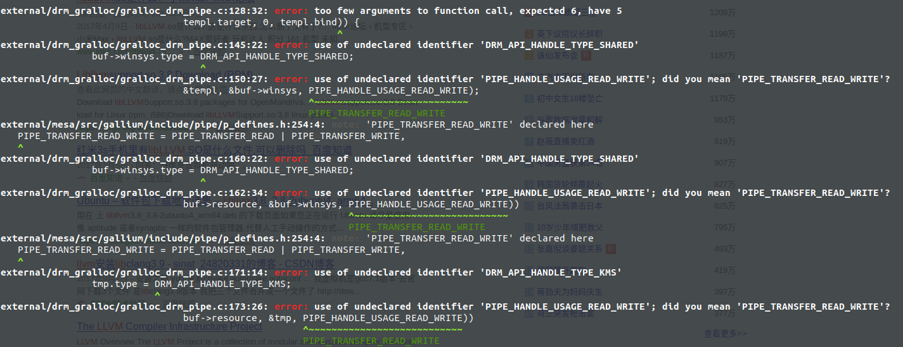
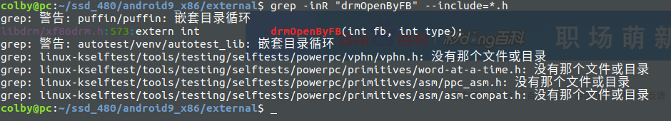
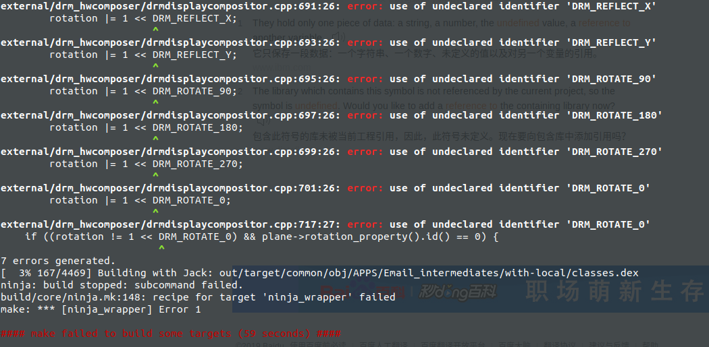
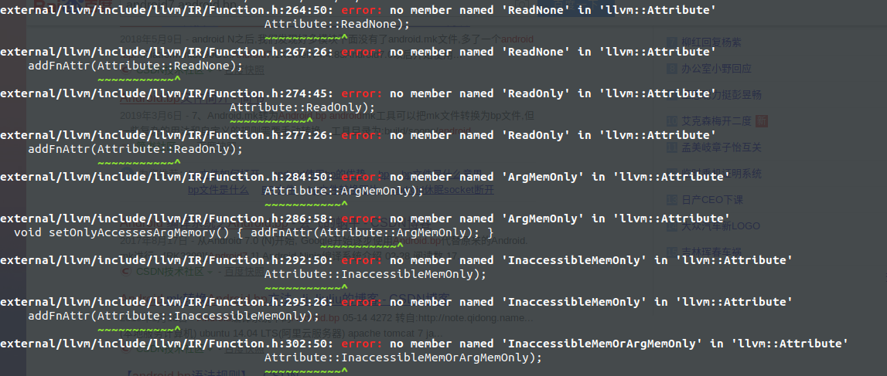
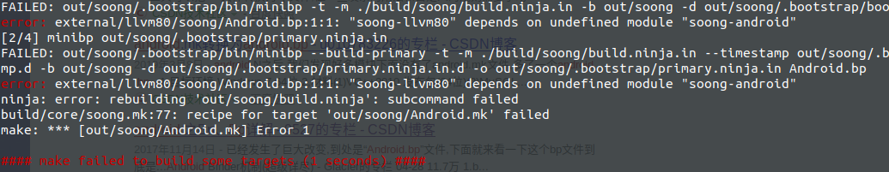
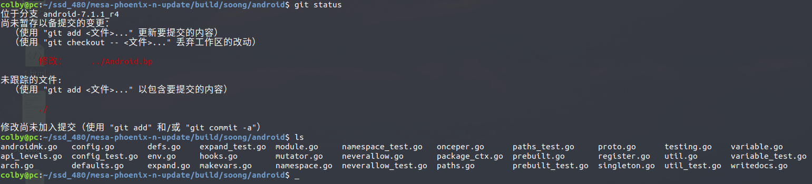

# 用llvm 去编译

## 1. libLLVM80_intermediates/export_includes

log:

```shell
ninja: error: 'out/target/product/x86_64/obj_x86/SHARED_LIBRARIES/libLLVM80_intermediates/export_includes', needed by 'out/target/product/x86_64/obj_x86/SHARED_LIBRARIES/gallium_dri_intermediates/import_includes', missing and no known rule to make it
```


```shell
 grep -inR "LLVM80" --include=*.mk --include=Makefile
 
 external/mesa/Android.mk:102:  $(eval LOCAL_SHARED_LIBRARIES += libLLVM80)
```

解决办法是：

将Android.mk 中的 $(eval LOCAL_SHARED_LIBRARIES += libLLVM80)改为如下：

```shell
$(eval LOCAL_SHARED_LIBRARIES += libLLVM)
```

## 2. external/drm_gralloc 函数接口错误

报错信息：



错误的原因是  external/drm_gralloc/ 下的内容也要和 mesa中的对应起来

解决方案：将android9中的drm_gralloc也同样的merge过来：

这里的merge过程我记录在 00.升级环境.md 中了

## 3. drmOpenByFB

```shell
external/drm_gralloc/gralloc_drm.c:130: error: undefined reference to 'drmOpenByFB'
```

在android9中搜索发现，



此时发现，可能需要升级 libdrm

方案，具体升级libdrm的工作 记录在 00.升级环境.md

## 4.  drm_hwcomposer

报错如下：



从问题中看，需要升级 drm_hwcomposer 

方案： 具体升级过程记录在  00.升级环境.md

## 5. 头文件找不到

```c
external/mesa/src/amd/common/ac_llvm_util.h:30:10: fatal error: 'llvm-c/TargetMachine.h' file not found
```

添加如下头文件 external/mesa/src/amd/Android.common.mk

```makefile
LOCAL_C_INCLUDES := \
    $(MESA_TOP)/include \
    $(MESA_TOP)/src \
    $(MESA_TOP)/src/amd/common \
    $(MESA_TOP)/src/compiler \
    $(call generated-sources-dir-for,STATIC_LIBRARIES,libmesa_nir,,)/nir \
    $(MESA_TOP)/src/gallium/include \
    $(MESA_TOP)/src/gallium/auxiliary \
    $(intermediates)/common \
    external/llvm/include \ # 添加它
    external/llvm/device/include # 添加它
```

## 6. .inc文件找不到

```c
external/llvm/include/llvm/IR/Attributes.h:68:14: fatal error: 'llvm/IR/Attributes.inc' file not found
    #include "llvm/IR/Attributes.inc"
```

解决方案： 注销

```c
 enum AttrKind {
    //#include "llvm/IR/Attributes.inc"
  };
```

## 7. 函数接口不对



按照这种思路解下去，问题会原来越多，最后，所以不能使用 llvm 而只能使用 llvm80

# 用llvm80去编译

恢复到 用llvm 编译之前，将知之前的代码进行恢复：

```shell
external/llvm$ git checkout .
external/mesa$ git checkout .
```


```shell
# android7默认使用 Android.mk 进行编译， 而我们如果使用llvm80，只能使用 Android.bp去编译
# 下面就是 编译指令
make iso_img -j8 'USE_SOONG=true'
```


## 1. soong-android



解决方案是升级  build/soong ，

升级方案记录在  00.升级环境.md 中  这个尝试后发现，不能这样办。

新的方案：

参照 android9 将相关 song-android 那过来， 并将对应的目录也拿过来，直接放里面

mesa-phoenix-n-update/build/soong$ vim Android.bp ,放入里面

```c
bootstrap_go_package {
    name: "soong-android",
    pkgPath: "android/soong/android",
    deps: [
        "blueprint",                                                                
        "blueprint-bootstrap",
        "soong",
        "soong-env",
    ],  
    srcs: [
        "android/androidmk.go",
        "android/api_levels.go",
        "android/arch.go",
        "android/config.go",
        "android/defaults.go",
        "android/defs.go",
        "android/expand.go",
        "android/hooks.go",
        "android/makevars.go",
        "android/module.go",
        "android/mutator.go",
        "android/namespace.go",
        "android/neverallow.go",
        "android/onceper.go",
        "android/package_ctx.go",
        "android/paths.go",
        "android/prebuilt.go",
        "android/proto.go",
        "android/register.go",
        "android/singleton.go",
        "android/testing.go",
        "android/util.go",
        "android/variable.go",
        "android/writedocs.go",

        // Lock down environment access last
        "android/env.go",
    ],  
    testSrcs: [
        "android/config_test.go",
        "android/expand_test.go",
        "android/namespace_test.go",
        "android/neverallow_test.go",
        "android/paths_test.go",
        "android/prebuilt_test.go",
        "android/util_test.go",
        "android/variable_test.go",                                                                                                                                                                    
    ],  
}
```

对应的加入的文件如下



## 2. go 版本过低

```shell
FAILED: GOROOT='./prebuilts/go/linux-x86/'

build/soong/android/onceper.go:23: undefined: sync.Map
ninja: error: rebuilding 'out/soong/build.ninja': subcommand failed
build/core/soong.mk:77: recipe for target 'out/soong/Android.mk' failed
make: *** [out/soong/Android.mk] Error 1

#### make failed to build some targets (1 seconds) ####
```

android9 go:  go1.10

phoenix go: go1.5.1

所以这里需要升级：

升级的过程记录在  00.升级环境.md中

