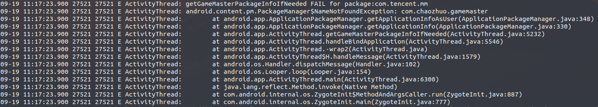

在系统中经常打游戏助手相关的Log:

这里将这个log去掉



修改记录:

```shell
# hp-4.19/frameworks/base$ git show

commit 3fdd8c51ed64f56ea7126a90c7399781e77e4b97 (HEAD -> haier, phoenix/haier, m/intel_edu_lenovo_aio520c, m/intel_edu_hp, m/intel_edu_haier_4.19, m/edu_tec_x4)
Author: caobinxin <caobinxin@phoenixos.com>
Date:   Thu Sep 19 14:08:55 2019 +0800

    [phoenix] fix: disable about GameMaster at edu proj.
    
    Signed-off-by: caobinxin <caobinxin@phoenixos.com>

diff --git a/core/java/android/app/ActivityThread.java b/core/java/android/app/ActivityThread.java
index 4a957654fe3..bf44b409e25 100644
--- a/core/java/android/app/ActivityThread.java
+++ b/core/java/android/app/ActivityThread.java
@@ -3573,7 +3573,7 @@ public final class ActivityThread {
                 }
                 if (a.mVisibleFromClient && !a.mWindowAdded) {
                     // CHAOZHUO START
-                    setGameMasterClassLoadedIfNeeded(a);
+                    //setGameMasterClassLoadedIfNeeded(a);
                     // CHAOZHUO END
                     a.mWindowAdded = true;
                     wm.addView(decor, l);
@@ -5543,7 +5543,7 @@ public final class ActivityThread {
             dalvik.system.VMRuntime.getRuntime().clampGrowthLimit();
         }
         // CHAOZHUO START
-        getGameMasterPackageInfoIfNeeded(appContext);
+        //getGameMasterPackageInfoIfNeeded(appContext);
         // CHAOZHUO END
         // Allow disk access during application and provider setup. This could
         // block processing ordered broadcasts, but later processing would
```

这里直接将 函数调用直接注销

```shell
# 这里直接提交到了 该项目公共的分支中了
```

