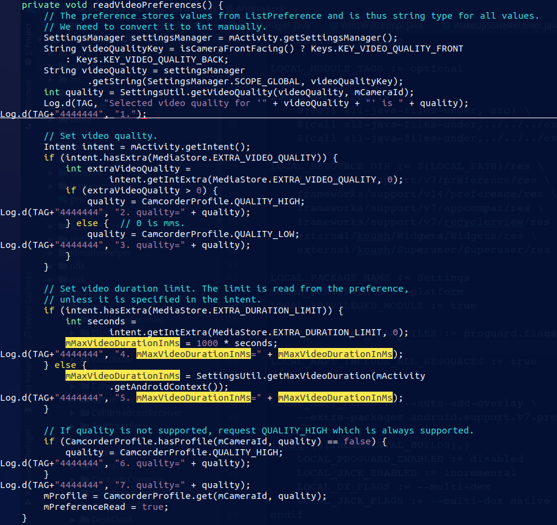
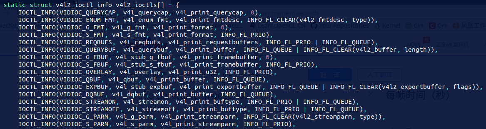

# 1. 问题列表

1. 录像时，相机会断开连接
2. 后置相机，会连接到前置相机
3. 帧率慢，拍照慢

# 2. 问题解决

## 2.1 录像时相机断开：

### 2.1.1 问题定位

堆栈打印方法：

```cpp
// 把这个函数放在 文件的顶部，#include 的下面， 不然会报， namespace的问题 
    
#include <utils/Log.h>
#include <utils/CallStack.h>

void dumping_callstack(){
    android::CallStack stack;                                                  
    stack.update();
    stack.dump(1);
    stack.log("Dumping Stack", ANDROID_LOG_ERROR, "111111");
}

// E Dumping Stack: 111111111111111111111111111111111111111111111#00 pc 000c5999  /system/lib/libstagefright.so 
```

报错：

```shell
D CameraHardware: CameraHardware::getParameters
D CameraHardware: CameraHardware::putParameters
E CameraSource: Video dimension (1280x720) is unsupported
```

错误的原因：

```shell
1. 框架层中，将相机支持的所有分辨率都设置了，但是底层相机不一定支持这么多
2. 所以这里需要厂商去 适配 底层和上层要保持一致
```

台电x4 设备所支持的相机的分辨率为：

```shell
# 这些值是从底层上传上来的
CameraSource: configureCamera
CameraSource: colby........................................
CameraSource: isVideoSizeSupported # 在这个函数中打印出底层信息的
CameraSource:  colby supportedSizes[0] width=176 height=144 
CameraSource:  colby supportedSizes[1] width=240 height=160 
CameraSource:  colby supportedSizes[2] width=320 height=200 
CameraSource:  colby supportedSizes[3] width=320 height=240 
CameraSource:  colby supportedSizes[4] width=352 height=288 
CameraSource:  colby supportedSizes[5] width=432 height=320 
CameraSource:  colby supportedSizes[6] width=480 height=320 
CameraSource:  colby supportedSizes[7] width=1600 height=1200
```

上层相关配置的文件在 CamcorderProfile.java 中

```java
// CamcorderProfile.java
// 上层就是被设置为 1280*720 的了， 而底层相机不支持该分辨率的

	/** 
     * Quality level corresponding to the 720p (1280 x 720) resolution.
     */
    public static final int QUALITY_720P = 5
```


这里先将   Video dimension (1280x720) is unsupported 对应的调用栈打印出来在说：

```c++
// av/media/libstagefright/CameraSource.cpp:374

00 pc 000c5999  /system/lib/libstagefright.so -> CameraSource.cpp:52
01 pc 000c6245  /system/lib/libstagefright.so -> CameraSource.cpp:683
02 pc 000c4b81  /system/lib/libstagefright.so -> CameraSource.cpp:567
03 pc 000c4c5e  /system/lib/libstagefright.so -> CameraSource.cpp:205 -> CameraSource::CreateFromCamera 


04 pc 0015788f  /system/lib/libstagefright.so -> AVFactory.cpp:72 -> AVFactory::CreateCameraSourceFromCamera

05 pc 000574b2  /system/lib/libmediaplayerservice.so -> StagefrightRecorder.cpp:1500 -> 
    StagefrightRecorder::setupCameraSource // 在这个地方填充了 w h
    
06 pc 00055db6  /system/lib/libmediaplayerservice.so -> StagefrightRecorder.cpp:1465
07 pc 00053fad  /system/lib/libmediaplayerservice.so -> StagefrightRecorder.cpp:1742
08 pc 00053d9a  /system/lib/libmediaplayerservice.so -> StagefrightRecorder.cpp:812
09 pc 00054f38  /system/lib/libmediaplayerservice.so -> StagefrightRecorder.cpp:868
10 pc 0004dc24  /system/lib/libmediaplayerservice.so -> MediaRecorderClient.cpp:240
11 pc 000d6d83  /system/lib/libmedia.so -> IMediaRecorder.cpp:361
12 pc 000d73b1  /system/lib/libmedia.so 
13 pc 000390c6  /system/lib/libbinder.so
14 pc 000480c0  /system/lib/libbinder.so
15 pc 00047acb  /system/lib/libbinder.so
16 pc 0004831f  /system/lib/libbinder.so
17 pc 0006ef3e  /system/lib/libbinder.so
18 pc 00012095  /system/lib/libutils.so 
19 pc 00011883  /system/lib/libutils.so 
20 pc 00086e5f  /system/lib/libc.so 
21 pc 00022f40  /system/lib/libc.so 
22 pc 000207a6  /system/lib/libc.so
```

```c++
// frameworks$ vim av/media/libmediaplayerservice/StagefrightRecorder.cpp +1500

status_t StagefrightRecorder::setupCameraSource(
        sp<CameraSource> *cameraSource) {
       
    Size videoSize;
    videoSize.width = mVideoWidth; // 谁给他赋值为 7200了
    videoSize.height = mVideoHeight;
    if (mCaptureFpsEnable) {
    } else {
        *cameraSource = AVFactory::get()->CreateCameraSourceFromCamera(
                mCamera, mCameraProxy, mCameraId, mClientName, mClientUid, mClientPid,
                videoSize, mFrameRate,
                mPreviewSurface);
    }
........
}

status_t StagefrightRecorder::setVideoSize(int width, int height) {
    ALOGV("setVideoSize: %dx%d", width, height);
    if (width <= 0 || height <= 0) { 
        ALOGE("Invalid video size: %dx%d", width, height);
        return BAD_VALUE;
    }                      
    // Additional check on the dimension will be performed later
    mVideoWidth = width;
    mVideoHeight = height;
    
    // 在这个地方进行回溯

    return OK;
}

//make libmediaplayerservice
```

```shell
V StagefrightRecorder: setVideoSize: 1280x720
00 pc 000525b5  /system/lib/libmediaplayerservice.so -> StagefrightRecorder.cpp:71
01 pc 0004db82  /system/lib/libmediaplayerservice.so -> MediaRecorderClient.cpp:185
02 pc 000d6ff8  /system/lib/libmedia.so -> IMediaRecorder.cpp:442
03 pc 000d73b1  /system/lib/libmedia.so -> IMediaRecorder.cpp:323 -> BnMediaRecorder::onTransact # 到这里就需要跨进程通信了 

04 pc 000390c6  /system/lib/libbinder.so 
05 pc 000480c0  /system/lib/libbinder.so                     
06 pc 00047acb  /system/lib/libbinder.so 
07 pc 0004831f  /system/lib/libbinder.so 
08 pc 0006ef3e  /system/lib/libbinder.so 
09 pc 00012095  /system/lib/libutils.so 
10 pc 00011883  /system/lib/libutils.so 
11 pc 00086e5f  /system/lib/libc.so 
12 pc 00022f40  /system/lib/libc.so
13 pc 000207a6  /system/lib/libc.so
```

```cpp
// IMediaRecorder.cpp

status_t BnMediaRecorder::onTransact(
                                     uint32_t code, const Parcel& data, Parcel* reply,
                                     uint32_t flags)
{
    switch (code) {
            case SET_VIDEO_SIZE: {
            ALOGV("SET_VIDEO_SIZE");
            CHECK_INTERFACE(IMediaRecorder, data, reply);
            int width = data.readInt32();
            int height = data.readInt32();
            reply->writeInt32(setVideoSize(width, height));
            return NO_ERROR;
        } break;
    }
    ...
}

// 这个地方的 onTransact 是在这个地方被调用的：
status_t setVideoSize(int width, int height)
    {
        ALOGV("setVideoSize(%dx%d)", width, height);
        Parcel data, reply;
        data.writeInterfaceToken(IMediaRecorder::getInterfaceDescriptor());
        data.writeInt32(width);
        data.writeInt32(height);
        remote()->transact(SET_VIDEO_SIZE, data, &reply); // 这里被调用                             // 在这里进行 栈回溯                
        return reply.readInt32();
    }
```

回溯结果：

```c
V IMediaRecorder: setVideoSize(1280x720)
E Dumping Stack: 222222222222#00 pc 000000000012e47b  /system/lib64/libmedia.so -> IMediaRecorder.cpp:39

E Dumping Stack: 222222222222#01 pc 000000000013b5cd  /system/lib64/libmedia.so -> mediarecorder.cpp:322 -> MediaRecorder::setVideoSize
    
E Dumping Stack: 222222222222#02 pc 000000000004d4b9  /system/lib64/libmedia_jni.so -> android_media_MediaRecorder.cpp:288 // 看jni 的调用
    
    
E Dumping Stack: 222222222222#03 pc 0000000000ea254d  /data/dalvik-cache/x86_64/system@framework@boot.oat


```

```c++
// android_media_MediaRecorder.cpp

static void
android_media_MediaRecorder_setVideoSize(JNIEnv *env, jobject thiz, jint width, jint height)                                                                                                                       
{
    // 将这里的强制赋值去掉也没事： 所以这里也不是最关键的
    width = 1600;               
    height = 1200;
    ALOGV("setVideoSize(%d, %d)", width, height);
    sp<MediaRecorder> mr = getMediaRecorder(env, thiz);

    if (width <= 0 || height <= 0) {
        jniThrowException(env, "java/lang/IllegalArgumentException", "invalid video size");
        return;
    }   
    process_media_recorder_call(env, mr->setVideoSize(width, height), "java/lang/RuntimeException", "setVideoSize failed."); // 在这里调用了
}

// 从这里我们可以看出， 这个函数是被java层调用了， java 层对应的函数为 setVideoSize(int, int)
static const JNINativeMethod gMethods[] = {
		{"setVideoSize",         "(II)V",                           (void 									*)android_media_MediaRecorder_setVideoSize},
}

int register_android_media_MediaRecorder(JNIEnv *env)
{
    return AndroidRuntime::registerNativeMethods(env,  
                "android/media/MediaRecorder", gMethods, NELEM(gMethods));
} // 这里是和 MediaRecorder.java 所对应的

// make libmedia_jni
// ./out/target/product/x86_64/symbols/system/lib64/libmedia_jni.so
```

```java
// MediaRecorder.java

public native void setVideoSize(int width, int height) throws IllegalStateException;

public void setProfile(CamcorderProfile profile) {
        setOutputFormat(profile.fileFormat);
        setVideoFrameRate(profile.videoFrameRate);
    
    	Log.e(“dump_test”,Log.getStackTraceString(new Throwable()));
    	// 在这个地方打印函数调用栈 // 在这里强制 赋值为了 1600*1200 
    	// 通过测试， 可以不在这里直接改为 1600*1200 保持原样就好。
        setVideoSize(profile.videoFrameWidth, profile.videoFrameHeight);// 从这里就要看， profile 文件是被谁设置的？？？                                                                                                                                     
        setVideoEncodingBitRate(profile.videoBitRate);
        setVideoEncoder(profile.videoCodec);
        if (profile.quality >= CamcorderProfile.QUALITY_TIME_LAPSE_LOW &&
             profile.quality <= CamcorderProfile.QUALITY_TIME_LAPSE_QVGA) {
            // Nothing needs to be done. Call to setCaptureRate() enables
            // time lapse video recording.
        } else {
            setAudioEncodingBitRate(profile.audioBitRate);
            setAudioChannels(profile.audioChannels);
            setAudioSamplingRate(profile.audioSampleRate);
            setAudioEncoder(profile.audioCodec);
        }
    }

// 这里我们发现 由原来的设置 w,h 变为设置 profile ，问题已经转变了
```

```shell
 make framework
```

```java
StagefrightRecorder: setVideoSource: 1
 java.lang.Throwable 
    at android.media.MediaRecorder.setProfile(MediaRecorder.java:484)
    at com.android.camera.VideoModule.initializeRecorder(VideoModule.java:1147)
    at com.android.camera.VideoModule.-wrap2(VideoModule.java)
    at com.android.camera.VideoModule$11.onStorageUpdateDone(VideoModule.java:1377)
    at com.android.camera.CameraActivity$20.onPostExecute(CameraActivity.java:2351)
    at com.android.camera.CameraActivity$20.onPostExecute(CameraActivity.java:2346)
    at android.os.AsyncTask.finish(AsyncTask.java:667)
    at android.os.AsyncTask.-wrap1(AsyncTask.java)
    at android.os.AsyncTask$InternalHandler.handleMessage(AsyncTask.java:684)
    at android.os.Handler.dispatchMessage(Handler.java:102)
    at android.os.Looper.loop(Looper.java:154)
    at android.app.ActivityThread.main(ActivityThread.java:6300)
    at java.lang.reflect.Method.invoke(Native Method)
    at com.android.internal.os.ZygoteInit$MethodAndArgsCaller.run(ZygoteInit.java:887)
    at com.android.internal.os.ZygoteInit.main(ZygoteInit.java:777)
```

```java
// 这儿的1147 在 packages/apps/Camera2/src/com/android/camera/VideoModule.java:1147 中

 private void initializeRecorder() {
     ...
     mMediaRecorder.setCamera(camera);
        // CHAOZHUO BEGIN
        mMediaRecorder.setAudioSource(MediaRecorder.AudioSource.MIC);
        // CHOAZHUO END
        mMediaRecorder.setVideoSource(MediaRecorder.VideoSource.CAMERA);
        mMediaRecorder.setProfile(mProfile); // 这里就要着重分析这个是从那来的                                                                                                                                                                      
        mMediaRecorder.setVideoSize(mProfile.videoFrameWidth, mProfile.videoFrameHeight);
        mMediaRecorder.setMaxDuration(mMaxVideoDurationInMs);
     ...
 }

// 唯一一个被赋值的位置：
private void readVideoPreferences() {
    ...
    mProfile = CamcorderProfile.get(mCameraId, quality);
    ...
}
```



```shell
D CAM_VideoModule: Selected video quality for 'large' is 5                       
D CAM_VideoModule: 1.
D CAM_VideoModule: 5. mMaxVideoDurationInMs=0
D CAM_VideoModule: 7. quality=5
```

```shell
# int quality = SettingsUtil.getVideoQuality(videoQuality, mCameraId); 
# mProfile = CamcorderProfile.get(mCameraId, quality);

# 这里需要搞清楚 quality = 5 是怎么来的，以及 mProfile 的赋值
```

```java
// 先搞清楚 quality 如何来的
// hp-4.19/packages$ vim apps/Camera2/src/com/android/camera/settings/SettingsUtil.java

/** 
     * Determines the video quality for large/medium/small for the given camera.
     * Returns the one matching the given setting. Defaults to 'large' of the
     * qualitySetting does not match either large. medium or small.
     *
     * @param qualitySetting One of 'large', 'medium', 'small'.
     * @param cameraId The ID of the camera for which to get the quality
     *            setting.
     * @return The CamcorderProfile quality setting.
     */
/*
	给定相机确定 大 中 小 视频的质量。返回一个匹配的设置。默认设置large(高)质量是不匹配每一个 large medium small 的。
	@param qualitySetting 下面的其中之一 'large', 'medium', 'small'.
	@param cameraId 要设置的相机的ID
	@return 相机的质量
*/
public static int getVideoQuality(String qualitySetting, int cameraId) {     
        return getSelectedVideoQualities(cameraId).getFromSetting(qualitySetting);
}


static SelectedVideoQualities getSelectedVideoQualities(int cameraId) {
        if (sCachedSelectedVideoQualities.get(cameraId) != null) {
            return sCachedSelectedVideoQualities.get(cameraId);
        }

        // 按降序查看大小，看它们是否受支持，并相应地设置大/中/小。如果根本不支持任何质量，则对getNextSupportedQuality的第一次调用将引发异常。如果只支持一个质量，则所选的三个质量都将相同。
    
        int largeIndex = getNextSupportedVideoQualityIndex(cameraId, -1); // 2
        int mediumIndex = getNextSupportedVideoQualityIndex(cameraId, largeIndex);
        int smallIndex = getNextSupportedVideoQualityIndex(cameraId, mediumIndex);

        SelectedVideoQualities selectedQualities = new SelectedVideoQualities();
        selectedQualities.large = sVideoQualities[largeIndex]; // 5
        selectedQualities.medium = sVideoQualities[mediumIndex];
        selectedQualities.small = sVideoQualities[smallIndex];
        sCachedSelectedVideoQualities.put(cameraId, selectedQualities);
        return selectedQualities;
    }
public static int[] sVideoQualities = new int[] {
            CamcorderProfile.QUALITY_2160P,
            CamcorderProfile.QUALITY_1080P,
            CamcorderProfile.QUALITY_720P, // 5
            CamcorderProfile.QUALITY_480P,
            CamcorderProfile.QUALITY_CIF,
            CamcorderProfile.QUALITY_QVGA,
            CamcorderProfile.QUALITY_QCIF
    };
```

```shell
 largeIndex=2              
 mediumIndex=3
 smallIndex=4
 selectedQualities.larger=5
 selectedQualities.medium=4
 selectedQualities.small=3
 largeIndex=2
 mediumIndex=3
 smallIndex=4
 selectedQualities.larger=5
 selectedQualities.medium=4
 selectedQualities.small=3
```

这里要弄明白 int largeIndex = getNextSupportedVideoQualityIndex(cameraId, -1); // 2 

```java
private static int getNextSupportedVideoQualityIndex(int cameraId, int start) {
        for (int i = start + 1; i < sVideoQualities.length; ++i) {
            if (isVideoQualitySupported(sVideoQualities[i])
                    && CamcorderProfile.hasProfile(cameraId, sVideoQualities[i])) {
                return i; // 这个地方返回了2
            }
        }
        if (start < 0 || start >= sVideoQualities.length) {
            // 这意味这我们没有找到任何一个支持的质量
            throw new IllegalArgumentException("Could not find supported video qualities.");
        }

        // 返回相同的 质量
        return start;
    }
```


```java
// hp-4.19$ vim ./frameworks/base/media/java/android/media/CamcorderProfile.java

public static boolean hasProfile(int cameraId, int quality) {
        return native_has_camcorder_profile(cameraId, quality);
    }
```


```c++
// android_media_MediaProfiles.cpp

{"native_has_camcorder_profile",           "(II)Z",(void *)android_media_MediaProfiles_native_has_camcorder_profile},


static jboolean
android_media_MediaProfiles_native_has_camcorder_profile(JNIEnv* /* env */, jobject /* thiz */,jint id, jint quality)
{
    ALOGV("native_has_camcorder_profile: %d %d", id, quality);
    if (!isCamcorderQualityKnown(quality)) {
        return JNI_FALSE;
    }   

    camcorder_quality q = static_cast<camcorder_quality>(quality); // 这是个强制类型转换
    
    return sProfiles->hasCamcorderProfile(id, q) ? JNI_TRUE : JNI_FALSE; // 看这里为啥是true
}


```

```cpp
// MediaProfiles.cpp
bool MediaProfiles::hasCamcorderProfile(int cameraId, camcorder_quality quality) const     
{
    return (getCamcorderProfileIndex(cameraId, quality) != -1);
}

int MediaProfiles::getCamcorderProfileIndex(int cameraId, camcorder_quality quality) const 
{
    int index = -1;
    for (size_t i = 0, n = mCamcorderProfiles.size(); i < n; ++i) {
        if (mCamcorderProfiles[i]->mCameraId == cameraId &&
            mCamcorderProfiles[i]->mQuality == quality) {
            index = i; // 从这里返回了
            break;
        }
    }
    return index;
}

// make libmedia
```

### 2.1.2 解决

有了2.1.1 的分析和调试，在如下位置修改即可：

```cpp
// frameworks$ vim av/media/libstagefright/CameraSource.cpp

status_t CameraSource::configureCamera(
        CameraParameters* params,
        int32_t width, int32_t height,
        int32_t frameRate) {
    ALOGV("configureCamera");
    Vector<Size> sizes;
    bool isSetVideoSizeSupportedByCamera = true;
    getSupportedVideoSizes(*params, &isSetVideoSizeSupportedByCamera, sizes);
    bool isCameraParamChanged = false;
    if (width != -1 && height != -1) {
        //if (!isVideoSizeSupported(width, height, sizes)) {
        if (!isVideoSizeSupported(1600, 1200, sizes)) {   // 只需要在这个位置改为 和我们硬件匹配的 就可以了   ， 由于上层配置的 为1280 * 720 ,所以录完像之后，属性值就是 1280*720的                              
            dumping_callstack();
            ALOGE("colby Video dimension (%dx%d) is unsupported", width, height);
            return BAD_VALUE; // 这里直接将这个 注释掉，也是可以的，让这个判断 通过
        }
        if (isSetVideoSizeSupportedByCamera) {
            params->setVideoSize(width, height);
        } else {
            params->setPreviewSize(width, height);
        }
        isCameraParamChanged = true;
    }
    ...

}

//make  libstagefright
```

总结：

**修改方案一**

这里优先使用这个， 录像和preview 都固定死

直接 在这里写死  if (!isVideoSizeSupported(1600, 1200, sizes)) 

**修改方案二**

让这个if判断不要返回，错误

```c
if (!isVideoSizeSupported(width, height, sizes)) {                             
            dumping_callstack();
            ALOGE("colby Video dimension (%dx%d) is unsupported", width, height);
           // return BAD_VALUE; // 这里直接将这个 注释掉，也是可以的，让这个判断 通过
        }
```


```c
// android_media_MediaRecorder.cpp

static void
android_media_MediaRecorder_setVideoSize(JNIEnv *env, jobject thiz, jint width, jint height)                                                                                                                       
{
    // 将这里的强制赋值去掉也没事： 所以这里也不是最关键的
    width = 1600;               
    height = 1200;
    ALOGV("setVideoSize(%d, %d)", width, height);
    sp<MediaRecorder> mr = getMediaRecorder(env, thiz);
	...
}
```


这里采用方案二， 直接不让他放回错误即可。

## 2.2 录像前后置摄像头切换问题：

问题描述：

不管切换的是那个摄像头，默认都使用的是前置摄像头

原因：

由于有的设备没有后置摄像头，所以，就将后置相机，也设置为前置相机了。 本来是没有问题的。这里还原回去即可

```shell
1. packages/apps/chaozhuo/CZApplyPatches/x86/hardware_libcamera.patch
```

```cpp
// hardware/libcamera$ vim CameraFactory.cpp
#define DEFAULT_DEVICE_FRONT "/dev/video0" // 前置默认是 0
#define DEFAULT_DEVICE_BACK  "/dev/video1" // 后置默认是 1

// 如果这两个对调后，就会出现 相机 画面镜像的问题。


// make camera.x86 
```

## 2.3 preview 格式不对

问题描述

当我们使用前置摄像头录像的时候， 预览的分辨率是 432x320，正式录像时为1280*720 

### 2.3.1 问题定位

```shell
D CameraHardware: CameraHardware::startPreviewLocked: Init
D V4L2Camera: V4L2Camera::Init
D V4L2Camera: Trying format: (1600 x 1200), Fps: 5 [difArea:1781760, difFps:25, cDifArea:-1, cDifFps:-1]                                                                                                           
D V4L2Camera: Trying format: (1600 x 1200), Fps: 25 [difArea:1781760, difFps:5, cDifArea:1781760, cDifFps:25]
D V4L2Camera: Trying format: (1600 x 1200), Fps: 30 [difArea:1781760, difFps:0, cDifArea:1781760, cDifFps:5]
D V4L2Camera: Selected format: (1600 x 1200), Fps: 30
I V4L2Camera: Cropping from origin: 584x440 - size: 432x320  (offset:1409168)
I V4L2Camera: Actual format: (1600 x 1200), Fps: 5, pixfmt: 'YUYV', bytesperline: 3200
D CameraHardware: CameraHardware::startPreviewLocked: effective size: 432x320
D CameraHardware: CameraHardware::initHeapLocked
D CameraHardware: CameraHardware::initHeapLocked: preview size=432x320
D CameraHardware: CameraHardware::initHeapLocked: picture size=432x320
D CameraHardware: CameraHardware::initHeapLocked: video size=1280x720
D CameraHardware: CameraHardware::initHeapLocked: OK
D CameraHardware: CameraHardware::startPreviewLocked: StartStreaming
```

先从 grep -inR "Actual format:"

```c
// hp-4.19/hardware/libcamera$ vim V4L2Camera.cpp
int V4L2Camera::Init(int width, int height, int fps)
{
    // 1. V4L2Camera::Init width=432 height=320 fps=30
    // 正确的情况下应该传入 1280*720 从这可以有一个切入点
    ALOGD("V4L2Camera::Init width=%d height=%d fps=%d", width, height, fps);
    /* Initialize the capture to the specified width and height */
    static const struct {
        int fmt;            /* PixelFormat */
        int bpp;            /* bytes per pixel */
        int isplanar;       /* If format is planar or not */
        int allowscrop;     /* If we support cropping with this pixel format */
    } pixFmtsOrder[] = {
        {V4L2_PIX_FMT_YUYV,     2,0,1},
        {V4L2_PIX_FMT_YVYU,     2,0,1},
        {V4L2_PIX_FMT_UYVY,     2,0,1},
        {V4L2_PIX_FMT_YYUV,     2,0,1},
        {V4L2_PIX_FMT_SPCA501,  2,0,0},
        {V4L2_PIX_FMT_SPCA505,  2,0,0},
        {V4L2_PIX_FMT_SPCA508,  2,0,0},
        {V4L2_PIX_FMT_YUV420,   0,1,0},
        {V4L2_PIX_FMT_YVU420,   0,1,0},
        {V4L2_PIX_FMT_NV12,     0,1,0},
        {V4L2_PIX_FMT_NV21,     0,1,0},
        {V4L2_PIX_FMT_NV16,     0,1,0},
        {V4L2_PIX_FMT_NV61,     0,1,0},
        {V4L2_PIX_FMT_Y41P,     0,0,0},
        {V4L2_PIX_FMT_SGBRG8,   0,0,0},
        {V4L2_PIX_FMT_SGRBG8,   0,0,0},
        {V4L2_PIX_FMT_SBGGR8,   0,0,0},
        {V4L2_PIX_FMT_SRGGB8,   0,0,0},
        {V4L2_PIX_FMT_BGR24,    3,0,1},
        {V4L2_PIX_FMT_RGB24,    3,0,1},
        {V4L2_PIX_FMT_MJPEG,    0,1,0},
        {V4L2_PIX_FMT_JPEG,     0,1,0},
        {V4L2_PIX_FMT_GREY,     1,0,1},
        {V4L2_PIX_FMT_Y16,      2,0,1},
    };

    int ret;

    // If no formats, break here
    if (m_AllFmts.isEmpty()) {
        ALOGE("No video formats available");
        return -1;
    }

    // Try to get the closest match ...
    SurfaceDesc closest;
    int closestDArea = -1;
    int closestDFps = -1;
    unsigned int i;
    int area = width * height;
    for (i = 0; i < m_AllFmts.size(); i++) {
        SurfaceDesc sd = m_AllFmts[i];

        // Always choose a bigger or equal surface
        if (sd.getWidth() >= width &&
            sd.getHeight() >= height) {

            int difArea = sd.getArea() - area;
            int difFps = my_abs(sd.getFps() - fps);

            ALOGD("Trying format: (%d x %d), Fps: %d [difArea:%d, difFps:%d, cDifArea:%d, cDifFps:%d]",sd.getWidth(),sd.getHeight(),sd.getFps(), difArea, difFps, closestDArea, closestDFps);
            if (closestDArea < 0 ||
                difArea < closestDArea ||
                (difArea == closestDArea && difFps < closestDFps)) {

                // Store approximation
                closestDArea = difArea;
                closestDFps = difFps;

                // And the new surface descriptor
                closest = sd;
            }
        }
    }

    if (closestDArea == -1) {
        ALOGE("Size not available: (%d x %d)",width,height);
        return -1;
    }

    // Selected format: (1600 x 1200), Fps: 30
    ALOGD("Selected format: (%d x %d), Fps: %d",closest.getWidth(),closest.getHeight(),closest.getFps());

    // Check if we will have to crop the captured image
    bool crop = width != closest.getWidth() || height != closest.getHeight();

    // Iterate through pixel formats from best to worst
    ret = -1;
    for (i=0; i < (sizeof(pixFmtsOrder) / sizeof(pixFmtsOrder[0])); i++) {

        // If we will need to crop, make sure to only select formats we can crop...
        if (!crop || pixFmtsOrder[i].allowscrop) {

            memset(&videoIn->format,0,sizeof(videoIn->format));
            videoIn->format.type = V4L2_BUF_TYPE_VIDEO_CAPTURE;
            videoIn->format.fmt.pix.width = closest.getWidth();
            videoIn->format.fmt.pix.height = closest.getHeight();
            videoIn->format.fmt.pix.pixelformat = pixFmtsOrder[i].fmt;

            ret = ioctl(fd, VIDIOC_TRY_FMT, &videoIn->format);
            if (ret >= 0 &&
                videoIn->format.fmt.pix.width ==  (uint)closest.getWidth() &&
                videoIn->format.fmt.pix.height == (uint)closest.getHeight()) {
                break;
            }
        }
    }
    if (ret < 0) {
        ALOGE("Open: VIDIOC_TRY_FMT Failed: %s", strerror(errno));
        return ret;
    }


    /* Set the format */
    memset(&videoIn->format,0,sizeof(videoIn->format));
    videoIn->format.type = V4L2_BUF_TYPE_VIDEO_CAPTURE;
    videoIn->format.fmt.pix.width = closest.getWidth();
    videoIn->format.fmt.pix.height = closest.getHeight();
    videoIn->format.fmt.pix.pixelformat = pixFmtsOrder[i].fmt;
    
    // lineNum:226 width=1600 height=1200
ALOGD("lineNum:%d width=%d height=%d ", __LINE__, videoIn->format.fmt.pix.width, videoIn->format.fmt.pix.height);
    ret = ioctl(fd, VIDIOC_S_FMT, &videoIn->format);
    if (ret < 0) {
        ALOGE("Open: VIDIOC_S_FMT Failed: %s", strerror(errno));
        return ret;
    }


    /* Query for the effective video format used */
    memset(&videoIn->format,0,sizeof(videoIn->format));
    videoIn->format.type = V4L2_BUF_TYPE_VIDEO_CAPTURE;
    ret = ioctl(fd, VIDIOC_G_FMT, &videoIn->format);
    if (ret < 0) {
        ALOGE("Open: VIDIOC_G_FMT Failed: %s", strerror(errno));
        return ret;
    }

    /* Note VIDIOC_S_FMT may change width and height. */
    // lineNum:244 width=1600 height=1200 这里传入的和设置的是一致的
ALOGD("lineNum:%d width=%d height=%d ", __LINE__, videoIn->format.fmt.pix.width, videoIn->format.fmt.pix.height);

    /* Buggy driver paranoia. */
    unsigned int min = videoIn->format.fmt.pix.width * 2;
// lineNum:249 bytesperline=3200
ALOGD("lineNum:%d bytesperline=%d", __LINE__, videoIn->format.fmt.pix.bytesperline);
    if (videoIn->format.fmt.pix.bytesperline < min)
        videoIn->format.fmt.pix.bytesperline = min;
    min = videoIn->format.fmt.pix.bytesperline * videoIn->format.fmt.pix.height;
    
// lineNum:253 sizeimage=3840000
ALOGD("lineNum:%d sizeimage=%d", __LINE__, videoIn->format.fmt.pix.sizeimage);
    if (videoIn->format.fmt.pix.sizeimage < min)
        videoIn->format.fmt.pix.sizeimage = min;

    /* Store the pixel formats we will use */
    videoIn->outWidth           = width;
    videoIn->outHeight          = height;
    videoIn->outFrameSize       = width * height << 1; // Calculate the expected output framesize in YUYV
    videoIn->capBytesPerPixel   = pixFmtsOrder[i].bpp;
// lineNum:263 closest.getWidth=1600 width=432
ALOGD("lineNum:%d closest.getWidth=%d width=%d", __LINE__, closest.getWidth(), width);
    
// lineNum:264 closest.getHeight=1200 height=320    
ALOGD("lineNum:%d closest.getHeight=%d height=%d", __LINE__, closest.getHeight(), height);
    /* Now calculate cropping margins, if needed, rounding to even */
    int startX = ((closest.getWidth() - width) >> 1) & (-2);
    int startY = ((closest.getHeight() - height) >> 1) & (-2);

    /* Avoid crashing if the mode found is smaller than the requested */
    if (startX < 0) {
        videoIn->outWidth += startX;
        startX = 0;
    }
    if (startY < 0) {
        videoIn->outHeight += startY;
        startY = 0;
    }

    /* Calculate the starting offset into each captured frame */
    videoIn->capCropOffset = (startX * videoIn->capBytesPerPixel) +
            (videoIn->format.fmt.pix.bytesperline * startY);
    
	// Cropping from origin: 584x440 - size: 432x320  (offset:1409168)
    ALOGI("Cropping from origin: %dx%d - size: %dx%d  (offset:%d)",
        startX,startY,
        videoIn->outWidth,videoIn->outHeight,
        videoIn->capCropOffset);

    /* sets video device frame rate */
    memset(&videoIn->params,0,sizeof(videoIn->params));
    videoIn->params.type = V4L2_BUF_TYPE_VIDEO_CAPTURE;
    videoIn->params.parm.capture.timeperframe.numerator = 1;
    videoIn->params.parm.capture.timeperframe.denominator = closest.getFps();
    
    // lineNum:293 timeperframe.denominator=30 // 这里设置的是30
ALOGD("lineNum:%d timeperframe.denominator=%d", __LINE__, videoIn->params.parm.capture.timeperframe.denominator);
    /* Set the framerate. If it fails, it wont be fatal */
    if (ioctl(fd,VIDIOC_S_PARM,&videoIn->params) < 0) {
        ALOGE("VIDIOC_S_PARM error: Unable to set %d fps", closest.getFps());
    }

    /* Gets video device defined frame rate (not real - consider it a maximum value) */
    if (ioctl(fd,VIDIOC_G_PARM,&videoIn->params) < 0) {
        ALOGE("VIDIOC_G_PARM - Unable to get timeperframe");
    }

    // 2. 这里就有一个疑问了，我们设置的 fps 是30, 而再次去读的话， fps 为5, 说明就没有设置成功
    // Actual format: (1600 x 1200), Fps: 5, pixfmt: 'YUYV', bytesperline: 3200
    ALOGI("Actual format: (%d x %d), Fps: %d, pixfmt: '%c%c%c%c', bytesperline: %d",
        videoIn->format.fmt.pix.width,
        videoIn->format.fmt.pix.height,
        videoIn->params.parm.capture.timeperframe.denominator,
        videoIn->format.fmt.pix.pixelformat & 0xFF, (videoIn->format.fmt.pix.pixelformat >> 8) & 0xFF,
        (videoIn->format.fmt.pix.pixelformat >> 16) & 0xFF, (videoIn->format.fmt.pix.pixelformat >> 24) & 0xFF,
        videoIn->format.fmt.pix.bytesperline);

    ...

    return 0;
}

// make camera.x86
```

```shell
D CameraHardware: CameraHardware::startPreviewLocked: Init                         
D V4L2Camera: V4L2Camera::Init width=432 height=320 fps=30
D V4L2Camera: Trying format: (1600 x 1200), Fps: 5 [difArea:1781760, difFps:25, cDifArea:-1, cDifFps:-1]
D V4L2Camera: Trying format: (1600 x 1200), Fps: 25 [difArea:1781760, difFps:5, cDifArea:1781760, cDifFps:25]
D V4L2Camera: Trying format: (1600 x 1200), Fps: 30 [difArea:1781760, difFps:0, cDifArea:1781760, cDifFps:5]
D V4L2Camera: Selected format: (1600 x 1200), Fps: 30
D V4L2Camera: lineNum:226 width=1600 height=1200 
D V4L2Camera: lineNum:244 width=1600 height=1200 
D V4L2Camera: lineNum:249 bytesperline=3200
D V4L2Camera: lineNum:253 sizeimage=3840000
D V4L2Camera: lineNum:263 closest.getWidth=1600 width=432
D V4L2Camera: lineNum:264 closest.getHeight=1200 height=320
I V4L2Camera: Cropping from origin: 584x440 - size: 432x320  (offset:1409168)
D V4L2Camera: lineNum:293 timeperframe.denominator=30
I V4L2Camera: Actual format: (1600 x 1200), Fps: 5, pixfmt: 'YUYV', bytesperline: 3200
D CameraHardware: CameraHardware::startPreviewLocked: effective size: 432x320
D CameraHardware: CameraHardware::initHeapLocked
D CameraHardware: CameraHardware::initHeapLocked: preview size=432x320
D CameraHardware: CameraHardware::initHeapLocked: picture size=432x320
D CameraHardware: CameraHardware::initHeapLocked: video size=1600x1200
D CameraHardware: CameraHardware::initHeapLocked: OK
D CameraHardware: CameraHardware::startPreviewLocked: StartStreaming
D CameraHardware: CameraHardware::setPreviewWindow - Negotiating preview format
D CameraHardware: CameraHardware::NegotiatePreviewFormat
D CameraHardware: Trying to set preview window geometry to 432x320
D CameraHardware: CameraHardware::startPreviewLocked: starting PreviewThread
D CameraHardware: CameraHardware::startPreviewLocked: O - this:0x0xea34f180
V CAM_CameraAppUI: onPreviewStarted
```

从上述打印出来的信息来看，暴露出两个问题：

1. 为何传入进来的是 432x320

2. 设置的fps = 30, 在次读的时候为 5

   

这里采用栈回溯， 追明白在那被赋值为 432x320

```shell
#00 pc 00013b9b  /system/lib/hw/camera.x86.so -> Init()
#01 pc 0000a3b2  /system/lib/hw/camera.x86.so -> CameraHardware.cpp:490
#02 pc 0000c384  /system/lib/hw/camera.x86.so -> CameraHardware.cpp:541
#03 pc 0007a01f  /system/lib/libcameraservice.so 
#04 pc 00079de3  /system/lib/libcameraservice.so 
#05 pc 00079d10  /system/lib/libcameraservice.so 
#06 pc 000341a2  /system/lib/libcamera_client.so 
#07 pc 000346a1  /system/lib/libcamera_client.so 
#08 pc 000390c6  /system/lib/libbinder.so 
#09 pc 000480c0  /system/lib/libbinder.so 
#10 pc 00047acb  /system/lib/libbinder.so 
#11 pc 0004831f  /system/lib/libbinder.so 
#12 pc 0006ef3e  /system/lib/libbinder.so 
#13 pc 00012095  /system/lib/libutils.so 
#14 pc 00011883  /system/lib/libutils.so 
#15 pc 00086e5f  /system/lib/libc.so 
#16 pc 00022f40  /system/lib/libc.so 
#17 pc 000207a6  /system/lib/libc.so
```

```shell
CameraHardware::startPreview() ->
CameraHardware::startPreviewLocked() ->
V4L2Camera::Init(int width, int height, int fps) 
```

从上述调用栈中可以看出， width height 是在 startPreviewLocked 赋值的

```c
// CameraHardware.cpp

status_t CameraHardware::startPreviewLocked()
{
    int width, height;

    // If we are recording, use the recording video size instead of the preview size
    // 如果是录像， 用录像 时的视屏大小去替代预览的视屏大小
    if (mRecordingEnabled && mMsgEnabled & CAMERA_MSG_VIDEO_FRAME) {
        mParameters.getVideoSize(&width, &height);
    } else {
        mParameters.getPreviewSize(&width, &height);// 这里走的是这个分支 取的是 预览的 大小
    }    

    int fps = mParameters.getPreviewFrameRate();

    ALOGD("CameraHardware::startPreviewLocked: Open, %dx%d", width, height);

    status_t ret = camera.Open(mVideoDevice);
    if (ret != NO_ERROR) {
        ALOGE("Failed to initialize Camera");
        return ret; 
    }

    ALOGD("CameraHardware::startPreviewLocked: Init");
    ret = camera.Init(width, height, fps);
    if (ret != NO_ERROR) {
        ALOGE("Failed to setup streaming");                 
        return ret; 
    }    

    /* Retrieve the real size being used */
    camera.getSize(width, height);

    ALOGD("CameraHardware::startPreviewLocked: effective size: %dx%d",width, height);

    // If we are recording, use the recording video size instead of the preview size
    if (mRecordingEnabled && mMsgEnabled & CAMERA_MSG_VIDEO_FRAME) {
        /* Store it as the video size to use */
ALOGD("%s %d %dx%d", __func__, __LINE__, width, height);
        mParameters.setVideoSize(width, height);
    } else {
        /* Store it as the preview size to use */
        // 这里会再次加载这个分支
ALOGD("%s %d %dx%d", __func__, __LINE__, width, height);
        mParameters.setPreviewSize(width, height);
    }
    ...
}
```

这里具体分析一下，getPreviewSize

```c
// hp-4.19/frameworks$ vim av/camera/CameraParameters.cpp
void CameraParameters::getPreviewSize(int *width, int *height) const
{
    *width = *height = -1; 
    // Get the current string, if it doesn't exist, leave the -1x-1 
    const char *p = get(KEY_PREVIEW_SIZE); // "preview-size"
    if (p == 0)  return;
    parse_pair(p, width, height, 'x');
}

const char *CameraParameters::get(const char *key) const
{
    String8 v = mMap.valueFor(String8(key));
    if (v.length() == 0)
        return 0;
    return v.string();
}


void CameraParameters::setPreviewSize(int width, int height)
{             
    char str[32];
    // 这里应该打一个调用栈 出来
    sprintf(str, "%dx%d", width, height);
    set(KEY_PREVIEW_SIZE, str);
}
// 这里重点追一下，在哪里调用的 setPreviewSize
```


// 480P

```shell
preferred-preview-size-for-video=640x480;preview-format=yuv422sp;preview-format-values=yuv422i-yuyv,yuv422sp,yuv420sp,yuv420p;preview-fps-range=30,30;preview-fps-range-values=(5,5),(25,25),(30,30);preview-frame-rate=30;preview-frame-rate-values=5,25,30;preview-size=432x320;preview-size-values=176x144,240x160,320x200,320x240,352x288,432x320,480x320,1600x1200;recording-hint=true;rotation=0;rotation-values=0;scene-mode=auto;scene-mode-values=auto;smooth-zoom-supported=false;vertical-view-angle=90;video-frame-format=yuv420p;video-size=1600x1200;video-size-values=176x144,240x160,320x200,320x240,352x288,432x320,480x320,1600x1200;whitebalance=auto;whitebalance-values=auto;zoom=0;zoom-ratios=100;zoom-supported=false
```


// 720P

```shell
preferred-preview-size-for-video=640x480;
preview-format=yuv422sp;
preview-format-values=yuv422i-yuyv,yuv422sp,yuv420sp,yuv420p;
preview-fps-range=30,30;
preview-fps-range-values=(5,5),(25,25),(30,30);
preview-frame-rate=30;
preview-frame-rate-values=5,25,30;
preview-size=432x320;
preview-size-values=176x144,240x160,320x200,320x240,352x288,432x320,480x320,1600x1200;
recording-hint=true;
rotation=0;
rotation-values=0;
scene-mode=auto;
scene-mode-values=auto;
smooth-zoom-supported=false;
vertical-view-angle=90;
video-frame-format=yuv420p;
video-size=1600x1200;
video-size-values=176x144,240x160,320x200,320x240,352x288,432x320,480x320,1600x1200;
whitebalance=auto;
whitebalance-values=auto;
zoom=0;
zoom-ratios=100;
zoom-supported=false
```

### 2.3.2 问题解决：

问题初步定位到了， 是因为我们在拿 preview 的w h 的时候，拿的是  getPreviewSize ，应该拿这个 getVideoSize 

```c
status_t CameraHardware::startPreviewLocked()
{
    int width, height;

    // If we are recording, use the recording video size instead of the preview size
    // 如果是录像， 用录像 时的视屏大小去替代预览的视屏大小
    if (mRecordingEnabled && mMsgEnabled & CAMERA_MSG_VIDEO_FRAME) {
        mParameters.getVideoSize(&width, &height);
    } else {
        // 把这个注销掉
        // mParameters.getPreviewSize(&width, &height);// 这里走的是这个分支 取的是 预览的 大小
		width = 1600;
        height = 1200;
        //mParameters.getVideoSize(&width, &height); // 使用这个， 后面会再次设置这个值，不用担心
    }    
...
}
```

这里直接将， w, h 都直接写死， 不去设置为动态可配置的

## 2.4 preview fps 低

问题 在前置，录像预览中，当我们向底层设置 fps=30, 没有成功，底层设置的是 fps = 5; 这个还需要进一步的去查；

### 2.4.1 问题定位

开启 kernel 中 uvc 相关的 dri log

```shell
echo 0xffff > /sys/module/uvcvideo/parameters/trace //打开
echo 0 > /sys/module/uvcvideo/parameters/trace //关闭
```


```shell
uvcvideo: uvc_v4l2_open                                                                                                                                                                                            
type=1400 audit(1569409239.668:5641): avc: denied { map } for pid=12984 comm="Binder:12984_1" path="/dev/ashmem" dev="tmpfs" ino=10501 scontext=u:r:cameraserver:s0 tcontext=u:object_r:ashmem_device:s0 tclass=chr

uvcvideo: Resuming interface 0
uvcvideo: Resuming interface 1
uvcvideo: Trying format 0x56595559 (YUYV): 1600x1200.
uvcvideo: Using default frame interval 200000.0 us (5.0 fps).
uvcvideo: Trying format 0x56595559 (YUYV): 1600x1200.
uvcvideo: Using default frame interval 200000.0 us (5.0 fps).
uvcvideo: Setting frame interval to 1/30 (333333).
uvcvideo: uvc_v4l2_mmap
uvcvideo: uvc_v4l2_mmap
uvcvideo: uvc_v4l2_mmap
uvcvideo: uvc_v4l2_mmap
uvcvideo: Device requested 3072 B/frame bandwidth.
uvcvideo: Selecting alternate setting 7 (3072 B/frame bandwidth).
uvcvideo: Allocated 5 URB buffers of 32x3072 bytes each.
uvcvideo: frame 1 stats: 0/0/1605 packets, 0/0/1605 pts (early !initial), 1604/1605 scr, last pts/stc/sof 0/8386954/1841
uvcvideo: Frame complete (EOF found).
uvcvideo: Dropping payload (out of sync).
```


这里的log 有点多，这里选择性的进行打开：

```c
/* ------------------------------------------------------------------------
 * Debugging, printing and logging
 */

#define UVC_TRACE_PROBE     (1 << 0) // probe 相关
#define UVC_TRACE_DESCR     (1 << 1) // 描述相关
#define UVC_TRACE_CONTROL   (1 << 2) // 控制相关的
#define UVC_TRACE_FORMAT    (1 << 3) // 格式相关

#define UVC_TRACE_CAPTURE   (1 << 4) // 拍照相关
#define UVC_TRACE_CALLS     (1 << 5) // 调用相关
#define UVC_TRACE_FRAME     (1 << 7) // frame 
#define UVC_TRACE_SUSPEND   (1 << 8) // 休眠相关
#define UVC_TRACE_STATUS    (1 << 9) // status
#define UVC_TRACE_VIDEO     (1 << 10) // 视频相关
#define UVC_TRACE_STATS     (1 << 11) // 状态相关
#define UVC_TRACE_CLOCK     (1 << 12) // 时钟相关
```

我们的fps 是和 control 和 format 相关的， 这里只开启这两个层级的log

```shell
echo 12 > /sys/module/uvcvideo/parameters/trace
```

```shell
[14618.323742] uvcvideo: Trying format 0x56595559 (YUYV): 1600x1200.
[14618.323746] uvcvideo: Using default frame interval 200000.0 us (5.0 fps).
[14618.330846] uvcvideo: Trying format 0x56595559 (YUYV): 1600x1200.
[14618.330847] uvcvideo: Using default frame interval 200000.0 us (5.0 fps).
[14618.338048] uvcvideo: Setting frame interval to 1/30 (333333).
```

```c
// drivers/media/usb/uvc/uvc_v4l2.c:222

static int uvc_v4l2_try_format(struct uvc_streaming *stream,
    struct v4l2_format *fmt, struct uvc_streaming_control *probe,
    struct uvc_format **uvc_format, struct uvc_frame **uvc_frame)
{
    
    ...
    uvc_trace(UVC_TRACE_FORMAT, "Using default frame interval %u.%u us "
        "(%u.%u fps).\n", interval/10, interval%10, 10000000/interval,
        (100000000/interval)%10);    
    ...
}
```


代码追踪：

#### hal层:

```c
// hp-4.19/hardware/libcamera$ vim V4L2Camera.cpp
int V4L2Camera::Init(int width, int height, int fps)
{
    ...

    /* sets video device frame rate */
    memset(&videoIn->params,0,sizeof(videoIn->params));
    videoIn->params.type = V4L2_BUF_TYPE_VIDEO_CAPTURE;
    videoIn->params.parm.capture.timeperframe.numerator = 1;
    videoIn->params.parm.capture.timeperframe.denominator = closest.getFps();
    
    // lineNum:293 timeperframe.denominator=30 // 这里设置的是30
ALOGD("lineNum:%d timeperframe.denominator=%d", __LINE__, videoIn->params.parm.capture.timeperframe.denominator);
    /* Set the framerate. If it fails, it wont be fatal */
    if (ioctl(fd,VIDIOC_S_PARM,&videoIn->params) < 0) {
        ALOGE("VIDIOC_S_PARM error: Unable to set %d fps", closest.getFps());
    }

    /* Gets video device defined frame rate (not real - consider it a maximum value) */
    if (ioctl(fd,VIDIOC_G_PARM,&videoIn->params) < 0) {
        ALOGE("VIDIOC_G_PARM - Unable to get timeperframe");
    }

    // 2. 这里就有一个疑问了，我们设置的 fps 是30, 而再次去读的话， fps 为5, 说明就没有设置成功
    // Actual format: (1600 x 1200), Fps: 5, pixfmt: 'YUYV', bytesperline: 3200
    ALOGI("Actual format: (%d x %d), Fps: %d, pixfmt: '%c%c%c%c', bytesperline: %d",
        videoIn->format.fmt.pix.width,
        videoIn->format.fmt.pix.height,
        videoIn->params.parm.capture.timeperframe.denominator,
        videoIn->format.fmt.pix.pixelformat & 0xFF, (videoIn->format.fmt.pix.pixelformat >> 8) & 0xFF,
        (videoIn->format.fmt.pix.pixelformat >> 16) & 0xFF, (videoIn->format.fmt.pix.pixelformat >> 24) & 0xFF,
        videoIn->format.fmt.pix.bytesperline);

    ...

    return 0;
}

// make camera.x86
```

这里使用的ioctl 参数是  VIDIOC_S_PARM ，去设置的 fps

#### kernel 层：

```c
// kernel$ vim include/uapi/linux/videodev2.h +2345
#define VIDIOC_S_PARM       _IOWR('V', 22, struct v4l2_streamparm)
```


```c
struct v4l2_ioctl_info {                        
    unsigned int ioctl;
    u32 flags;
    const char * const name;
    int (*func)(const struct v4l2_ioctl_ops *ops, struct file *file,
            void *fh, void *p);
    void (*debug)(const void *arg, bool write_only);
};


#define IOCTL_INFO(_ioctl, _func, _debug, _flags)       \
    [_IOC_NR(_ioctl)] = {                   \
        .ioctl = _ioctl,                \
        .flags = _flags,                \
        .name = #_ioctl,                \
        .func = _func,                  \
        .debug = _debug,                \
    }

static struct v4l2_ioctl_info v4l2_ioctls[] = {
    ...
	IOCTL_INFO(VIDIOC_S_PARM, v4l_s_parm, v4l_print_streamparm, INFO_FL_PRIO),
    ...
};
```

```c
// v4l2-ioctl.c

long video_ioctl2(struct file *file,unsigned int cmd, unsigned long arg) 
{
    return video_usercopy(file, cmd, arg, __video_do_ioctl);
}
EXPORT_SYMBOL(video_ioctl2);


long
video_usercopy(struct file *file, unsigned int cmd, unsigned long arg,
           v4l2_kioctl func)
{
    // 拷贝用户空间的数据
	err = func(file, cmd, parg); // func = __video_do_ioctl;
    ...
}

static long __video_do_ioctl(struct file *file,
        unsigned int cmd, void *arg)                                        
{
    ...
    const struct v4l2_ioctl_ops *ops = vfd->ioctl_ops; // 注意这里的 ioctl_ops = uvc_ioctl_ops
    ...
    
    
    if (v4l2_is_known_ioctl(cmd)) {                           
        info = &v4l2_ioctls[_IOC_NR(cmd)]; // 从数组中取出对应命令的 info
        if (!test_bit(_IOC_NR(cmd), vfd->valid_ioctls) &&
            !((info->flags & INFO_FL_CTRL) && vfh && vfh->ctrl_handler))
            goto done;

        if (vfh && (info->flags & INFO_FL_PRIO)) {
            ret = v4l2_prio_check(vfd->prio, vfh->prio);
            if (ret)
                goto done;
        }
    }
    
    ...
        
    if (info != &default_info) {
        ret = info->func(ops, file, fh, arg); 
        // 这里的 func = v4l_s_parm
        // ops = uvc_ioctl_ops
    }
    ...
}


static int v4l_s_parm(const struct v4l2_ioctl_ops *ops,
                struct file *file, void *fh, void *arg)
{
    struct v4l2_streamparm *p = arg; 
    int ret = check_fmt(file, p->type);                                         
    if (ret)
        return ret; 

    /* Note: extendedmode is never used in drivers */
    if (V4L2_TYPE_IS_OUTPUT(p->type)) {
        memset(p->parm.output.reserved, 0,
               sizeof(p->parm.output.reserved));
        p->parm.output.extendedmode = 0; 
        p->parm.output.outputmode &= V4L2_MODE_HIGHQUALITY;
    } else {
        memset(p->parm.capture.reserved, 0,
               sizeof(p->parm.capture.reserved));
        p->parm.capture.extendedmode = 0; 
        p->parm.capture.capturemode &= V4L2_MODE_HIGHQUALITY;
    }    
    return ops->vidioc_s_parm(file, fh, p);// ops = uvc_ioctl_ops
}
```

##### 重点分析

```c
// uvc_v4l2.c
const struct v4l2_ioctl_ops uvc_ioctl_ops = {
    ...
    .vidioc_s_parm = uvc_ioctl_s_parm,
    ...
}

static int uvc_ioctl_s_parm(struct file *file, void *fh,                      
                struct v4l2_streamparm *parm)
{
    struct uvc_fh *handle = fh;
    struct uvc_streaming *stream = handle->stream;
    int ret; 

    ret = uvc_acquire_privileges(handle);
    if (ret < 0) 
        return ret; 

    return uvc_v4l2_set_streamparm(stream, parm); // 最终会调用到这里
}


static int uvc_v4l2_set_streamparm(struct uvc_streaming *stream,
        struct v4l2_streamparm *parm)
{
    ...
    // Setting frame interval to 1/30 (333333).
    uvc_trace(UVC_TRACE_FORMAT, "Setting frame interval to %u/%u (%u).\n",  
        timeperframe.numerator, timeperframe.denominator, interval);
    ...
    这个函数成为了重点分析的对象了
}
```

这里临时来记录几个结构体

```c
// videodev2.h

struct v4l2_streamparm {
    __u32    type;          /* enum v4l2_buf_type */
    union {
        struct v4l2_captureparm capture;
        struct v4l2_outputparm  output; 
        __u8    raw_data[200];  /* user-defined */
    } parm;
};

struct v4l2_captureparm {                                     
    __u32          capability;    /*  Supported modes */
    __u32          capturemode;   /*  Current mode */
    struct v4l2_fract  timeperframe;  /*  Time per frame in seconds 每帧时间（秒） */
    __u32          extendedmode;  /*  Driver-specific extensions */
    __u32              readbuffers;   /*  # of buffers for read */
    __u32          reserved[4];
};

struct v4l2_fract {                                      
    __u32   numerator; // 分子
    __u32   denominator; // 分母
};
```


```c
// uvc_v4l2.c

const struct v4l2_file_operations uvc_fops = {                             
    .owner      = THIS_MODULE,
    .open       = uvc_v4l2_open,
    .release    = uvc_v4l2_release,
    .unlocked_ioctl = video_ioctl2, // 看这个 ioctl
#ifdef CONFIG_COMPAT
    .compat_ioctl32 = uvc_v4l2_compat_ioctl32,
#endif
    .read       = uvc_v4l2_read,
    .mmap       = uvc_v4l2_mmap,
    .poll       = uvc_v4l2_poll,
#ifndef CONFIG_MMU
    .get_unmapped_area = uvc_v4l2_get_unmapped_area,
#endif
};
```


```c
// uvc_driver.c

static int uvc_register_video(struct uvc_device *dev,
        struct uvc_streaming *stream)
{
    int ret; 

    /* Initialize the streaming interface with default parameters. */
    ret = uvc_video_init(stream);
    if (ret < 0) { 
        uvc_printk(KERN_ERR, "Failed to initialize the device (%d).\n",
               ret);
        return ret; 
    }    

    if (stream->type == V4L2_BUF_TYPE_VIDEO_CAPTURE)
        stream->chain->caps |= V4L2_CAP_VIDEO_CAPTURE
            | V4L2_CAP_META_CAPTURE;
    else 
        stream->chain->caps |= V4L2_CAP_VIDEO_OUTPUT;

    uvc_debugfs_init_stream(stream);

    /* Register the device with V4L. */
    return uvc_register_video_device(dev, stream, &stream->vdev,
                     &stream->queue, stream->type,
                     &uvc_fops, &uvc_ioctl_ops);    // 在这用到了                                                                                                                                                               
}


int uvc_register_video_device(struct uvc_device *dev,
                  struct uvc_streaming *stream,
                  struct video_device *vdev,
                  struct uvc_video_queue *queue,
                  enum v4l2_buf_type type,
                  const struct v4l2_file_operations *fops,
                  const struct v4l2_ioctl_ops *ioctl_ops)
{
    vdev->v4l2_dev = &dev->vdev;
    vdev->fops = fops;
    vdev->ioctl_ops = ioctl_ops;
    
    ret = video_register_device(vdev, VFL_TYPE_GRABBER, -1);
}

static inline int __must_check video_register_device(struct video_device *vdev, enum vfl_devnode_type type,int nr)
{
    return __video_register_device(vdev, type, nr, 1, vdev->fops->owner);
}
```


```c
// v4l2-dev.c

int __video_register_device(struct video_device *vdev,
                enum vfl_devnode_type type,
                int nr, int warn_if_nr_in_use,
                struct module *owner)
{
    
    /* Part 1: check device type */
    switch (type) {
    case VFL_TYPE_GRABBER:                                                                                                                                                                                         
        name_base = "video";
        break;
    case VFL_TYPE_VBI:
        name_base = "vbi";
        break;
    case VFL_TYPE_RADIO:
        name_base = "radio";
        break;
    case VFL_TYPE_SUBDEV:
        name_base = "v4l-subdev";
        break;
    case VFL_TYPE_SDR:
        /* Use device name 'swradio' because 'sdr' was already taken. */
        name_base = "swradio";
        break;
    case VFL_TYPE_TOUCH:
        name_base = "v4l-touch";
        break;
    default:
        pr_err("%s called with unknown type: %d\n",
               __func__, type);
        return -EINVAL;
    }
    
    vdev->cdev = NULL;
    
    /* Part 3: Initialize the character device */
    vdev->cdev = cdev_alloc(); // 这里分配了 字符设备
    if (vdev->cdev == NULL) {
        ret = -ENOMEM;
        goto cleanup;
    }
    vdev->cdev->ops = &v4l2_fops; // 这里使用了  v4l2_fops 这个
    vdev->cdev->owner = owner;
    ret = cdev_add(vdev->cdev, MKDEV(VIDEO_MAJOR, vdev->minor), 1); // 注册了这个字符设备
    
    ... 
}

// 这个ops 就是 最终暴露出来给应用层使用的ops
static const struct file_operations v4l2_fops = {
    .owner = THIS_MODULE,
    .read = v4l2_read,
    .write = v4l2_write,
    .open = v4l2_open,
    .get_unmapped_area = v4l2_get_unmapped_area,
    .mmap = v4l2_mmap,
    .unlocked_ioctl = v4l2_ioctl,
#ifdef CONFIG_COMPAT
    .compat_ioctl = v4l2_compat_ioctl32,
#endif
    .release = v4l2_release,
    .poll = v4l2_poll,
    .llseek = no_llseek,
};


static long v4l2_ioctl(struct file *filp, unsigned int cmd, unsigned long arg) 
{
    struct video_device *vdev = video_devdata(filp);
    int ret = -ENODEV;

    if (vdev->fops->unlocked_ioctl) {
        if (video_is_registered(vdev))
            ret = vdev->fops->unlocked_ioctl(filp, cmd, arg);// 看到这里了没有啊 vdev->fops = uvc_fops
    } else
        ret = -ENOTTY;

    return ret;
}
```

##### 分析总结：

1. 场景： hal 层中 ioctl(fd,VIDIOC_S_PARM,&videoIn->params)

2. 在kernel 中 这个ioctl 的调用顺序为：

   ```shell
   [v4l2-dev.c] v4l2_fops.unlocked_ioctl=v4l2_ioctl # 上层暴露的 用户接口
   1.  v4l2_ioctl -> uvc_fops-> unlocked_ioctl # 这里实际调用的是 video_ioctl2
   
   [uvc_v4l2.c] uvc_fops.unlocked_ioctl = video_ioctl2
   2. video_ioctl2 -> video_usercopy ->__video_do_ioctl
   
   [uvc_v4l2.c] __video_do_ioctl：
           ops = vfd->ioctl_ops;
   		info = &v4l2_ioctls[_IOC_NR(cmd)]; #cmd对应的 struct v4l2_ioctl_info
           ret = info->func(ops, file, fh, arg); 
           # 这里的 func = v4l_s_parm
           # ops = uvc_ioctl_ops
   3.__video_do_ioctl->v4l_s_parm
   
   [v4l2-ioctl.c] vidioc_s_parm:
           ops->vidioc_s_parm(file, fh, p);// ops = uvc_ioctl_ops
           
   [uvc_v4l2.c] uvc_ioctl_ops
   		.vidioc_s_parm = uvc_ioctl_s_parm,
   4. v4l_s_parm -> uvc_ioctl_s_parm -> uvc_v4l2_set_streamparm
   
   #########[再次总结]
   [user: ioctl]
   ---------------------------
   [kernel:]
   
   v4l2_ioctl ->
   video_ioctl2 ->
   __video_do_ioctl ->
v4l_s_parm ->
   uvc_ioctl_s_parm -> 
   uvc_v4l2_set_streamparm
   ```
   
   


为确保上述分析是正确的，将在 uvc_v4l2_set_streamparm 中进行函数调用回溯：

```shell
[   43.934645] Call Trace:
[   43.934657]  dump_stack+0x63/0x85
[   43.934665]  uvc_ioctl_s_parm+0x5a/0x400 [uvcvideo]
[   43.934670]  v4l_s_parm+0x55/0x60
[   43.934672]  __video_do_ioctl+0x167/0x380
[   43.934675]  video_usercopy+0x2be/0x620
[   43.934677]  ? v4l_querycap+0xa0/0xa0
[   43.934679]  video_ioctl2+0x15/0x20
[   43.934681]  v4l2_ioctl+0x46/0x50
[   43.934684]  v4l2_compat_ioctl32+0x14d7/0x1a90
[   43.934687]  ? selinux_file_ioctl+0x116/0x1e0
[   43.934692]  __se_compat_sys_ioctl+0x370/0x1160
[   43.934696]  ? do_compat_writev+0x88/0xc0
[   43.934698]  __ia32_compat_sys_ioctl+0x17/0x20
[   43.934701]  do_fast_syscall_32+0x95/0x237
[   43.934703]  entry_SYSENTER_compat+0x6b/0x7a
[   43.934706] RIP: 0023:0xe8cc5ec9
```

和我们分析的完全一致


### 2.4.2 uvc_v4l2_set_streamparm

通过上述的分析，我们最终定位在 kernel 中的 uvc_v4l2_set_streamparm 函数中。本节就通过调试的手段，进一步的进行分析：

```shell
[   43.934637] uvc_v4l2_set_streamparm 382

[   43.934724] uvc_v4l2_set_streamparm 389
[   43.934726] probe.dwFrameInterval=2000000 maxd=1666667
[   43.934727] uvc_v4l2_set_streamparm 420
[   43.934728] for-end: wWidth=5 wHeight=6784 probe.dwFrameInterval=1 maxd=2000000
[   43.942005] Return the actual frame period: timeperframe.numerator=2000000 timeperframe.denominator=10000000
[   43.942008] Return the actual frame period: timeperframe.numerator=1 timeperframe.denominator=5
[   43.942010] uvc_v4l2_set_streamparm 480

```

根据log 还原出调用路径：

```c
static int uvc_v4l2_set_streamparm(struct uvc_streaming *stream,
		struct v4l2_streamparm *parm)
{
	struct uvc_streaming_control probe;
	struct v4l2_fract timeperframe;
	struct uvc_format *format;
	struct uvc_frame *frame;
	u32 interval, maxd;
	unsigned int i;
	int ret;

printk(KERN_ERR"%s %d\n", __func__, __LINE__);
dump_stack();

	if (parm->type != stream->type)
		return -EINVAL;

	if (parm->type == V4L2_BUF_TYPE_VIDEO_CAPTURE){
        // 这里被调用了
printk(KERN_ERR"%s %d\n", __func__, __LINE__);
		timeperframe = parm->parm.capture.timeperframe;
	}else{
printk(KERN_ERR"%s %d\n", __func__, __LINE__);
		timeperframe = parm->parm.output.timeperframe;
	}

	interval = uvc_fraction_to_interval(timeperframe.numerator,
		timeperframe.denominator);
    // Setting frame interval to 1/30 (333333).
	uvc_trace(UVC_TRACE_FORMAT, "Setting frame interval to %u/%u (%u).\n",
		timeperframe.numerator, timeperframe.denominator, interval);

	mutex_lock(&stream->mutex);

	if (uvc_queue_streaming(&stream->queue)) {// 没有调用
printk(KERN_ERR"%s %d\n", __func__, __LINE__);
		mutex_unlock(&stream->mutex);
		return -EBUSY;
	}

	format = stream->cur_format;
	frame = stream->cur_frame;
	probe = stream->ctrl;
	probe.dwFrameInterval = uvc_try_frame_interval(frame, interval);// 这个函数是有问题的， interval=333333 此时是对的， 返回之后，就成为了 2000000； 传入的是 1/30, 为何出来的时候，成了 1/5 ,这个函数要重点分析 
	maxd = abs((s32)probe.dwFrameInterval - interval);
    
    // probe.dwFrameInterval=2000000 maxd=1666667
printk(KERN_ERR"probe.dwFrameInterval=%u maxd=%u\n",probe.dwFrameInterval, maxd);
	/* Try frames with matching size to find the best frame interval. */
	for (i = 0; i < format->nframes && maxd != 0; i++) {
		u32 d, ival;

		if (&format->frame[i] == stream->cur_frame){
            // 这里被调用了一次
printk(KERN_ERR"%s %d\n", __func__, __LINE__);
			continue;
		}

		if (format->frame[i].wWidth != stream->cur_frame->wWidth ||
		    format->frame[i].wHeight != stream->cur_frame->wHeight){
printk(KERN_ERR"%s %d\n", __func__, __LINE__);
			continue;
		}

		ival = uvc_try_frame_interval(&format->frame[i], interval);
		d = abs((s32)ival - interval);
printk(KERN_ERR"i=%d ival=%d d=%d\n",i, ival, d);
		if (d >= maxd){
printk(KERN_ERR"%s %d\n", __func__, __LINE__);
			continue;
		}

		frame = &format->frame[i];
		probe.bFrameIndex = frame->bFrameIndex;
		probe.dwFrameInterval = ival;
		maxd = d;


printk(KERN_ERR"for: wWidth=%d wHeight=%d probe.dwFrameInterval=%d maxd=%d\n",                                                                                                                                     
        format->frame[i].wWidth,
        format->frame[i].wHeight,
        probe.bFrameIndex,
        probe.dwFrameInterval,
        maxd);
	}
// 可以近似的认为， 上面的for 循环就没有被执行
// for-end: wWidth=5 wHeight=6784 probe.dwFrameInterval=1 maxd=2000000
printk(KERN_ERR"for-end: wWidth=%d wHeight=%d probe.dwFrameInterval=%d maxd=%d\n", 
        format->frame[i].wWidth,
        format->frame[i].wHeight,
        probe.bFrameIndex,
        probe.dwFrameInterval,
        maxd);

	/* Probe the device with the new settings. */
	ret = uvc_probe_video(stream, &probe);
	if (ret < 0) {
printk(KERN_ERR"%s %d\n", __func__, __LINE__);
		mutex_unlock(&stream->mutex);
		return ret;
	}

	stream->ctrl = probe;
	stream->cur_frame = frame;
	mutex_unlock(&stream->mutex);

	/* Return the actual frame period. */
	timeperframe.numerator = probe.dwFrameInterval;
	timeperframe.denominator = 10000000;
    
// Return the actual frame period: timeperframe.numerator=2000000 timeperframe.denominator=10000000
printk(KERN_ERR"Return the actual frame period: timeperframe.numerator=%d timeperframe.denominator=%d\n", timeperframe.numerator, timeperframe.denominator);
    
	uvc_simplify_fraction(&timeperframe.numerator,
		&timeperframe.denominator, 8, 333);
    
// Return the actual frame period: timeperframe.numerator=1 timeperframe.denominator=5
printk(KERN_ERR"Return the actual frame period: timeperframe.numerator=%d timeperframe.denominator=%d\n", timeperframe.numerator, timeperframe.denominator);	

	if (parm->type == V4L2_BUF_TYPE_VIDEO_CAPTURE){
        // 这个被执行了
printk(KERN_ERR"%s %d\n", __func__, __LINE__);
		parm->parm.capture.timeperframe = timeperframe;
	}else{
printk(KERN_ERR"%s %d\n", __func__, __LINE__);
		parm->parm.output.timeperframe = timeperframe;
	}

	return 0;
}
```

从上面的分析看， uvc_try_frame_interval该函数要重点分析： 

传入的是 1/30, 为何出来的时候，成了 1/5 ,这个函数要重点分析 

```c
static u32 uvc_try_frame_interval(struct uvc_frame *frame, u32 interval)
{
    unsigned int i;
printk(KERN_ERR"%s %d\n", __func__, __LINE__);
    if (frame->bFrameIntervalType) { // 走这个分支
        u32 best = -1, dist;

printk(KERN_ERR"%s %d\n", __func__, __LINE__);
        for (i = 0; i < frame->bFrameIntervalType; ++i) {
            dist = interval > frame->dwFrameInterval[i]
                 ? interval - frame->dwFrameInterval[i]
                 : frame->dwFrameInterval[i] - interval;
// i=0 dist=1666667 interval=333333 frame->dwFrameInterval[0]=2000000 best=-1
printk(KERN_ERR"i=%d dist=%d interval=%d frame->dwFrameInterval[%d]=%d best=%d\n", i, dist, interval, i,frame->dwFrameInterval[i], best);
            if (dist > best){
printk(KERN_ERR"%s %d\n", __func__, __LINE__);
                break;
            }    

            best = dist;
        }    

printk(KERN_ERR"interval = %d\n",interval);
        interval = frame->dwFrameInterval[i-1];
printk(KERN_ERR"interval = %d\n",interval);
printk(KERN_ERR"%s %d\n", __func__, __LINE__);
    
    } else { // 不走这个分支
printk(KERN_ERR"%s %d\n", __func__, __LINE__);
        const u32 min = frame->dwFrameInterval[0];
        const u32 max = frame->dwFrameInterval[1];
        const u32 step = frame->dwFrameInterval[2];

printk(KERN_ERR"min=%d max=%d step=%d\n", min, max, step);

printk(KERN_ERR"interval = %d\n",interval);
        interval = min + (interval - min + step/2) / step * step;
printk(KERN_ERR"interval = %d\n",interval);
        if (interval > max){
printk(KERN_ERR"%s %d\n", __func__, __LINE__);
            interval = max; 
        }    
    }  

printk(KERN_ERR"interval = %d\n",interval);
    return interval;
}
```

```shell
[   50.847267] uvc_try_frame_interval 111
[   50.847267] uvc_try_frame_interval 115
[   50.847269] i=0 dist=1666667 interval=333333 frame->dwFrameInterval[0]=2000000 best=-1
[   50.847269] interval = 333333
[   50.847270] interval = 2000000
[   50.847271] uvc_try_frame_interval 132
[   50.847271] interval = 2000000
```

这里临时将 probe.dwFrameInterval = 333333;  启动后的效果，还是 和 2000000 保持一样， 这样改都是无效的：

```c
static int uvc_v4l2_set_streamparm(struct uvc_streaming *stream,struct v4l2_streamparm *parm){
    ...
    probe.dwFrameInterval = 333333; // 这样改动是无效的
    /* Probe the device with the new settings. */
    ret = uvc_probe_video(stream, &probe);
    ...
}
```


还有两个线索需要去查：

```c
// 第一个线索 // 看 uvc_parse_format
static u32 uvc_try_frame_interval(struct uvc_frame *frame, u32 interval)
{
    for (i = 0; i < frame->bFrameIntervalType; ++i) {
        // 这里 frame->bFrameIntervalType; 为啥=1 ,导致这个循环只执行了一次
    }
}

// 第二个线索
static int uvc_v4l2_set_streamparm(struct uvc_streaming *stream,struct v4l2_streamparm *parm){
    ...
        
    for (i = 0; i < format->nframes && maxd != 0; i++) {
    	// format->nframes = 1 这里的循环也只走了一次  
    }
    ...
}
```

这两个线索 都来自于 struct uvc_streaming *stream

```c
static int uvc_ioctl_s_parm(struct file *file, void *fh,struct v4l2_streamparm *parm)
{
    struct uvc_fh *handle = fh;
    struct uvc_streaming *stream = handle->stream;
    int ret; 

    ret = uvc_acquire_privileges(handle);
    if (ret < 0) 
        return ret; 

    return uvc_v4l2_set_streamparm(stream, parm);
}

// 通过源码跟踪，发现最终的 fh 来源于：
static long __video_do_ioctl(struct file *file,
        unsigned int cmd, void *arg)                                        
{
    void *fh = file->private_data; // 这个一般在 open 函数中 对file->private_data赋值 ，根据这个思路，在进一步的去找
    
    ret = info->func(ops, file, fh, arg);
	...
}

// uvc_v4l2.c
// 确实找到了：不过它是嵌套调用的，细节不做记录了
static int uvc_v4l2_open(struct file *file)
{
    struct uvc_streaming *stream;
    struct uvc_fh *handle;
    int ret = 0;
	
    stream = video_drvdata(file); // 最后是从 dev->driver_data; 从这拿到的数据 //
    // 他的放置点在 uvc_register_video_device-> video_set_drvdata(vdev, stream); 这个时候放置的
    
    
    handle = kzalloc(sizeof(*handle), GFP_KERNEL);
    
    stream->dev->users++; 
    
    v4l2_fh_init(&handle->vfh, &stream->vdev);                                                                                                                                                                     
    v4l2_fh_add(&handle->vfh);
    handle->chain = stream->chain;
    handle->stream = stream;
    handle->state = UVC_HANDLE_PASSIVE;
    file->private_data = handle; // 最后将这个 handle 放入了 private_data 中

    return 0;
}


// 和 stream 相关的记录：
// uvc_parse_streaming 解析流 并加入 list_add_tail(&streaming->list, &dev->streams);
// 获取流 uvc_register_terms ： stream = uvc_stream_by_id(dev, term->id);                                                  ret = uvc_register_video(dev, stream); 

// uvc_driver.c 这个就是 通用 uvc 驱动
uvc_probe -> uvc_parse_control -> uvc_parse_standard_control ->uvc_parse_streaming -> uvc_parse_format
```


#### format:

通过追代码：

```c
static int uvc_v4l2_set_streamparm(struct uvc_streaming *stream,
        struct v4l2_streamparm *parm)                         
{
    struct uvc_streaming_control probe;
    struct v4l2_fract timeperframe;
    struct uvc_format *format;
    struct uvc_frame *frame;
    u32 interval, maxd;
    unsigned int i;
    int ret;
    
	format = stream->cur_format; // 这的format 是在这里选择的 uvc_v4l2_set_format
    // format->nframes = 1
    for (i = 0; i < format->nframes && maxd != 0; i++) {
        u32 d, ival;

        if (&format->frame[i] == stream->cur_frame){
            continue;
        }
    }
}


static int uvc_v4l2_set_format(struct uvc_streaming *stream,
    struct v4l2_format *fmt)
{                         
    struct uvc_streaming_control probe;
    struct uvc_format *format;
    struct uvc_frame *frame;
    int ret; 

    if (fmt->type != stream->type)
        return -EINVAL;

    ret = uvc_v4l2_try_format(stream, fmt, &probe, &format, &frame);// 在这里去设置最接近的格式
    if (ret < 0) 
        return ret; 

    mutex_lock(&stream->mutex);

    if (uvc_queue_allocated(&stream->queue)) {
        ret = -EBUSY;
        goto done;
    }    

    stream->ctrl = probe;
    stream->cur_format = format; // 这里被赋值了
    stream->cur_frame = frame; // 这里被赋值了， 这才是最关键的地方

done:
    mutex_unlock(&stream->mutex);
    return ret; 
}
```

#### frame:

```c
static int uvc_v4l2_set_streamparm(struct uvc_streaming *stream,
        struct v4l2_streamparm *parm)                                                     {
    struct uvc_streaming_control probe;
    struct v4l2_fract timeperframe;
    struct uvc_format *format;
    struct uvc_frame *frame;
    u32 interval, maxd;
    unsigned int i;
    int ret;
    
	frame = stream->cur_frame;
    probe.dwFrameInterval = uvc_try_frame_interval(frame, interval);
}
```

#### uvc_parse_streaming:

先分析前置摄像头：

```shell
uvc_parse_streaming
	streaming->type = V4L2_BUF_TYPE_VIDEO_CAPTURE;
	size = 13;
	    bmInfo                              0 
        bTerminalLink                       3   
        bStillCaptureMethod                 2   
        bTriggerSupport                     1   
        bTriggerUsage                       0 
```

### 2.4.2 临时收尾

在内核中，将打印信息临时，保存在 edu_tec_x4_uvc-debug 分支中， 等忙完在来查。同时将log 文件生成了一个 patch, 保存在 当前目录下面的 diff.log 中

初步的结论：

1. kernel 中在 uvc_v4l2_set_format -> uvc_v4l2_try_format 这个时候，给换掉了
2. hardware 中可以过滤 V4L2Camera.cpp 中 EnumFrameIntervals() 有lixin 加的一段过滤， 帧率的方法。

### 2.4.3 hardware层去查

```shell
make camera.x86
./out/target/product/x86_64/system/lib64/hw/camera.x86.so
```


在 hardware 层去查，理由，编译调试见效果快


#### 2.4.3.1 yuv mjpeg 设置

hal 层中， 设置preview 和 拍照 以及 video 的地方是在 CameraHardware::setParameters： 这个地方就可以解释清楚 为啥 kernel 中preview 和 video 时始终使用的是yuyv 格式的，而不是MJPEG； MJPEG 用于拍照。

```c++
// CameraHardware.cpp 
status_t CameraHardware::setParameters(const char* parms)
{
    ALOGD("CameraHardware::setParameters parms=%s", parms);

    CameraParameters params;                                                                                                                                                                                       
    String8 str8_param(parms);
    params.unflatten(str8_param);

    Mutex::Autolock lock(mLock);

    // If no changes, trivially accept it!
    if (params.flatten() == mParameters.flatten()) {
        ALOGD("Trivially accept it. No changes detected");
        return NO_ERROR;
    }    

    if (strcmp(params.getPreviewFormat(),"yuv422i-yuyv") &&
            strcmp(params.getPreviewFormat(),"yuv422sp") &&
            strcmp(params.getPreviewFormat(),"yuv420sp") &&
            strcmp(params.getPreviewFormat(),"yuv420p")) {
        ALOGE("CameraHardware::setParameters: Unsupported format '%s' for preview",params.getPreviewFormat());
        return BAD_VALUE;
    }    

    if (strcmp(params.getPictureFormat(), CameraParameters::PIXEL_FORMAT_JPEG)) {
        ALOGE("CameraHardware::setParameters: Only jpeg still pictures are supported");
        return BAD_VALUE;
    }    

    if (strcmp(params.get(CameraParameters::KEY_VIDEO_FRAME_FORMAT),"yuv422i-yuyv") &&
            strcmp(params.get(CameraParameters::KEY_VIDEO_FRAME_FORMAT),"yuv422sp") &&
            strcmp(params.get(CameraParameters::KEY_VIDEO_FRAME_FORMAT),"yuv420sp") &&
            strcmp(params.get(CameraParameters::KEY_VIDEO_FRAME_FORMAT),"yuv420p")) {
        ALOGE("CameraHardware::setParameters: Unsupported format '%s' for recording",params.get(CameraParameters::KEY_VIDEO_FRAME_FORMAT));
        return BAD_VALUE;
    }
...
}
```

#### 2.4.3.2 效果比较好的修改

后置摄像头使用 640 x 480 fps 为30的修改如下：

```c++
// hal: V4L2Camera.cpp
bool V4L2Camera::EnumFrameIntervals(int pixfmt, int width, int height)
{
    ...
    if (strstr((const char *)videoIn->cap.card, "Back")) {
                ALOGD("Special mode %s", videoIn->cap.card);
                if (width != 640 || fival.discrete.denominator != 30) {
                    
                    ALOGD("Skip %dx%d@%d", width, height, fival.discrete.denominator);
                    continue;
                }
        		// 选择 w=640 fps = 30 格式的, 其他格式不要
                ALOGD("Special mode found %dx%d@%d", width, height, fival.discrete.denominator);
            }
    ...
}
```

```diff
status_t CameraHardware::startPreviewLocked()
     if (mRecordingEnabled && mMsgEnabled & CAMERA_MSG_VIDEO_FRAME) {
         mParameters.getVideoSize(&width, &height);
     } else {
-        mParameters.getPreviewSize(&width, &height);
+
+               // CHAOZHUO start
+#define FIXED_BEFORE 1
+#if FIXED_BEFORE
+        //mParameters.getPreviewSize(&width, &height);
+        mParameters.getVideoSize(&width, &height); // 这里使用 videoSize 而不是使用 previewSize
+#else
+               width = 640;
+               height = 480;
+#endif
+               // CHAOZHUO end
     }
```

#### 2.4.3.2 前置摄像头

```shell
 D V4L2Camera: V4L2Camera::EnumFrameFormats
 D V4L2Camera: { pixelformat = 'MJPG', description = 'Motion-JPEG' }
 D V4L2Camera: V4L2Camera::EnumFrameSizes: pixfmt: 0x47504a4d
 D V4L2Camera: { discrete: width = 1600, height = 1200 }
 D V4L2Camera: V4L2Camera::EnumFrameIntervals: pixfmt: 0x47504a4d, w:1600, h:1200
 D V4L2Camera:  Time interval between frame: 
 D V4L2Camera: 1/30 videoIn->cap.card=Front Camera: Front Camera
 D V4L2Camera: 1/25 videoIn->cap.card=Front Camera: Front Camera
 D V4L2Camera: { pixelformat = 'YUYV', description = 'YUYV 4:2:2' }
 D V4L2Camera: V4L2Camera::EnumFrameSizes: pixfmt: 0x56595559
 D V4L2Camera: { discrete: width = 1600, height = 1200 }
 D V4L2Camera: V4L2Camera::EnumFrameIntervals: pixfmt: 0x56595559, w:1600, h:1200
 D V4L2Camera:  Time interval between frame: 
 D V4L2Camera: 1/5 videoIn->cap.card=Front Camera: Front Camera
 D CameraHardware: CameraHardware::startPreviewLocked: Init
 D V4L2Camera: V4L2Camera::Init
 D V4L2Camera: Trying format: (1600 x 1200), Fps: 5 [difArea:192000, difFps:25, cDifArea:-1, cDifFps:-1]
 D V4L2Camera: Trying format: (1600 x 1200), Fps: 25 [difArea:192000, difFps:5, cDifArea:192000, cDifFps:25]
 D V4L2Camera: Trying format: (1600 x 1200), Fps: 30 [difArea:192000, difFps:0, cDifArea:192000, cDifFps:5]
 D V4L2Camera: Selected format: (1600 x 1200), Fps: 30
 I V4L2Camera: Cropping from origin: 0x60 - size: 1600x1080  (offset:192000)
 I V4L2Camera: Actual format: (1600 x 1200), Fps: 30, pixfmt: 'YUYV', bytesperline: 3200
 I cameraserver: type=1400 audit(0.0:5771): avc: denied { map } for path="/dev/video0" dev="tmpfs" 
                    ino=9860 scontext=u:r:cameraserver:s0 tcontext=u:object_r:video_device:s0 tclass=chr_file permissive=1                                                                                         
 D CameraHardware: CameraHardware::startPreviewLocked: effective size: 1600x1080
 D CameraHardware: CameraHardware::initHeapLocked
 D CameraHardware: CameraHardware::initHeapLocked: preview size=1600x1080
 D CameraHardware: CameraHardware::initHeapLocked: picture size=1600x1200
 D CameraHardware: CameraHardware::initHeapLocked: video size=1600x1080
 D CameraHardware: CameraHardware::initHeapLocked: Raw preview heap allocated
 D CameraHardware: CameraHardware::initHeapLocked: preview heap allocated
 D CameraHardware: CameraHardware::initHeapLocked: OK
 D CameraHardware: CameraHardware::startPreviewLocked: StartStreaming
 D CameraHardware: CameraHardware::setPreviewWindow - Negotiating preview format
 D CameraHardware: CameraHardware::NegotiatePreviewFormat
 D CameraHardware: Trying to set preview window geometry to 1600x1080
 D CameraHardware: CameraHardware::startPreviewLocked: starting PreviewThread
 D CameraHardware: CameraHardware::startPreviewLocked: O - this:0x0xef4cf180
 D CameraHardware: CameraHardware::cancelAutoFocus
 D CameraHardware: CameraHardware::getParameters

```

**前后置摄像头 的fps ,根据不同的格式(mjepg,yuyv)是有不同的fps的。 具体的对应关系，可以通过 在ubuntu 下 lsusb -d 18ec:3399 –v 获得**

```shell
lsusb -d 18ec:3399 –v # 18ec:3399 为 厂商ID:产品ID
```


问题描述: 

前置摄像头

FORMAT_MJPEG: 

​            1600 x 1200 (1/30) (1/25)

   FORMAT_UNCOMPRESSED: yuyv

​            1600 x 1200 (1/5)

既然 yuyv 格式的不支持 30fps,  那就使用 支持 30fps 的 MJPEG:

修改方案如下：

```c++
// V4L2Camera.cpp
int V4L2Camera::Init(int width, int height, int fps)
{
    ...
    /* Set the format */
    memset(&videoIn->format,0,sizeof(videoIn->format));
    videoIn->format.type = V4L2_BUF_TYPE_VIDEO_CAPTURE;
    videoIn->format.fmt.pix.width = closest.getWidth();
    videoIn->format.fmt.pix.height = closest.getHeight();
    //videoIn->format.fmt.pix.pixelformat = pixFmtsOrder[i].fmt;
    ALOGD("colby set V4L2_PIX_FMT_MJPEG ");
    videoIn->format.fmt.pix.pixelformat = V4L2_PIX_FMT_MJPEG; // 这里强制 将格式设置为 V4L2_PIX_FMT_MJPEG
    ret = ioctl(fd, VIDIOC_S_FMT, &videoIn->format);
    if (ret < 0) {
        ALOGE("Open: VIDIOC_S_FMT Failed: %s", strerror(errno));
        return ret;
    }


    /* Query for the effective video format used */
    memset(&videoIn->format,0,sizeof(videoIn->format));
    videoIn->format.type = V4L2_BUF_TYPE_VIDEO_CAPTURE;
    ret = ioctl(fd, VIDIOC_G_FMT, &videoIn->format);
    if (ret < 0) {
        ALOGE("Open: VIDIOC_G_FMT Failed: %s", strerror(errno));
        return ret;
    }
    
    // colby read format: (1600 x 1200), Fps: , pixfmt: 'MJPG', bytesperline: 0
    ALOGI("colby read format: (%d x %d), Fps: , pixfmt: '%c%c%c%c', bytesperline: %d",
        videoIn->format.fmt.pix.width,
        videoIn->format.fmt.pix.height,
        videoIn->format.fmt.pix.pixelformat & 0xFF, (videoIn->format.fmt.pix.pixelformat >> 8) & 0xFF,
        (videoIn->format.fmt.pix.pixelformat >> 16) & 0xFF, (videoIn->format.fmt.pix.pixelformat >> 24) & 0xFF,
        videoIn->format.fmt.pix.bytesperline);    
    ...
}
```

colby read format: (1600 x 1200), Fps: , pixfmt: 'MJPG', bytesperline: 0

从这个打印来看，设置 V4L2_PIX_FMT_MJPEG 是可以在 kernel 层设置成功的. 从实际的表现来看，preview 是变快了， 但是， video 出来的 是 绿色。也就是说，不能直接这样去修改。

仔细，看如下

```shell
	# videoIn->format.fmt.pix.pixelformat = pixFmtsOrder[i].fmt; 为啥这个格式是 yuyv的，这个地方对应的不对，导致的
    ALOGD("colby set V4L2_PIX_FMT_MJPEG ");
    videoIn->format.fmt.pix.pixelformat = V4L2_PIX_FMT_MJPEG; # 这个是我强制赋值的
```

#### 2.4.3.3 前置录像变为 绿色

**抓log:**

log 的条件： 前置摄像头preview 此时(logcat start)开启录像，录像后结束(logcat end)

具体看 logcat.recording.txt

```shell
I/CAM_VideoModule( 3920): startVideoRecording: Thread[main,5,main]

I/CAM_VideoModule( 3920): initializeRecorder: Thread[main,5,main]

 D/CameraHardware( 2740): CameraHardware::isRecordingEnabled: 0
 
 W/StagefrightRecorder( 2742): Max file duration is not positive: 0 us. Disabling duration limit.
 
 W/StagefrightRecorder( 2742): Target duration (0 us) too short to be respected
 
 V/CAM_VideoModule( 3920): New video filename: /storage/emulated/0/DCIM/Camera/VID_20191014_105020.mp4.tmp
 
 W/StagefrightRecorder( 2742): Intended video encoding frame height (1200) is too large and will be set to (1080) # 这个地方将 1600x1200 改为 1600x1080
 
 D/CameraHardware( 2740): CameraHardware::getParameters
 
 D/CameraHardware( 2740): CameraHardware::putParameters
 
 E/CameraSource( 2742): Video dimension (1600x1080) is unsupported # 这个信息很重要
```


抓log:

条件： preview 开始 之前抓， 开始后，结束  logcat.previewing.txt

抓log:

条件：变为绿色后，关闭相机，(logcat 开始)再次preview 此时的log为  logcat.previewing.green.txt

**log 结论：**

从这三个log中，看出。 正常的preview 的  CameraHardware::startPreviewLocked: Open, 1600x1200，变为绿色的CameraHardware::startPreviewLocked: Open, 1600x1080, 这里很有可能和这个 1080 有很大的关系。


这里着重看， recording 的时候如下的log 打印：

```shell
W/StagefrightRecorder( 2742): Intended video encoding frame height (1200) is too large and will be set to (1080) # 这个地方将 1600x1200 改为 1600x1080  

# frameworks/av/media/libmediaplayerservice/StagefrightRecorder.cpp:1453
```

```c++
// StagefrightRecorder.cpp
void StagefrightRecorder::clipVideoFrameHeight() {
    ALOGV("clipVideoFrameHeight: encoder %d", mVideoEncoder);
    int minFrameHeight = mEncoderProfiles->getVideoEncoderParamByName(
                        "enc.vid.height.min", mVideoEncoder);
    int maxFrameHeight = mEncoderProfiles->getVideoEncoderParamByName(
                        "enc.vid.height.max", mVideoEncoder);
    if (minFrameHeight != -1 && mVideoHeight < minFrameHeight) {
        ALOGW("Intended video encoding frame height (%d) is too small"
             " and will be set to (%d)", mVideoHeight, minFrameHeight);
        mVideoHeight = minFrameHeight;
    } else if (maxFrameHeight != -1 && mVideoHeight > maxFrameHeight) {
        ALOGW("Intended video encoding frame height (%d) is too large"
             " and will be set to (%d)", mVideoHeight, maxFrameHeight);
        //mVideoHeight = maxFrameHeight;
        mVideoHeight = 1200;   // 暂时将这里前置设置为 1200                                                                                
    }    
}

// make libmediaplayerservice
// ./out/target/product/x86_64/symbols/system/lib64/libmediaplayerservice.so
```

验证的结果是， 成功(此时用前置摄像头录像时: 可以正常录像 ) 但这里的改法是有问题的， 后置摄像头，录像时，依然是绿色。

这里临时的记录一下：修改方式：

```c++
void StagefrightRecorder::clipVideoFrameHeight() {
    ALOGV("clipVideoFrameHeight: encoder %d", mVideoEncoder);
    int minFrameHeight = mEncoderProfiles->getVideoEncoderParamByName(
                        "enc.vid.height.min", mVideoEncoder);
    int maxFrameHeight = mEncoderProfiles->getVideoEncoderParamByName(
                        "enc.vid.height.max", mVideoEncoder);
    if (minFrameHeight != -1 && mVideoHeight < minFrameHeight) {
        ALOGW("Intended video encoding frame height (%d) is too small"
             " and will be set to (%d)", mVideoHeight, minFrameHeight);
        mVideoHeight = minFrameHeight;
    } else if (maxFrameHeight != -1 && mVideoHeight > maxFrameHeight) {
        ALOGW("Intended video encoding frame height (%d) is too large"
             " ,but not will be set to (%d)", mVideoHeight, maxFrameHeight);
        //mVideoHeight = maxFrameHeight; // 直接将这里的注销掉  
        // 添加这个
        ALOGW("Final chaozhuo reset frame height (%d) is keep itself", mVideoHeight);
    }    
}
```


#### 2.4.3.4 后置录像变为 绿色

同样通过抓log,我们发现后置摄像头：

正常preview 时：

```shell
 CameraHardware::setParameters: PREVIEW: Size 1280x720, 30 fps, format: yuv422sp
 
 CameraHardware::setParameters: PICTURE: Size 1280x720, format: jpeg
 
 CameraHardware::setParameters: VIDEO: Size 640x480, format: yuv420p # 之前过滤过后置摄像头 只能有 640*480 格式的，  所以这里的Log是正常的，我们应该将 相关的过滤去掉，在试试
```

录像时 变为绿色：

```shell
setVideoSize(1600, 1200) # 这个地方，前置设置为了 1600 x 1200 了

Intended video encoding frame height (1200) is too large and will be set to (1080)

Final chaozhuo reset frame height (1200) is keep itself

CameraHardware::setParameters: PREVIEW: Size 640x480, 30 fps, format: yuv422sp

CameraHardware::setParameters: PICTURE: Size 1280x720, format: jpeg

CameraHardware::setParameters: VIDEO: Size 1600x1200, format: yuv420p # 这里从那多出来了一个 1600 * 1200 先将这个原因查明白，这个是在修改前置摄像头时，引入的新问题
```


代码定位：

 ALOGV("setVideoSize(%d, %d)", width, height);

```c++
// frameworks/base/media/jni/android_media_MediaRecorder.cpp

static void
android_media_MediaRecorder_setVideoSize(JNIEnv *env, jobject thiz, jint width, jint height)
{
    // CHAOZHUO start
#define FIX_BEFORE 0
#if FIX_BEFORE
#else
    width = 1600;// 这里之前被我写死了
    height = 1200;
#endif
    // CHAOZHUO end
    ALOGV("setVideoSize(%d, %d)", width, height);                                                                                                                                                                  
    sp<MediaRecorder> mr = getMediaRecorder(env, thiz);

    if (width <= 0 || height <= 0) {
        jniThrowException(env, "java/lang/IllegalArgumentException", "invalid video size");
        return;
    }   
    process_media_recorder_call(env, mr->setVideoSize(width, height), "java/lang/RuntimeException", "setVideoSize failed.");
}


static const JNINativeMethod gMethods[] = {
    {"setVideoSize",         "(II)V",                           (void *)android_media_MediaRecorder_setVideoSize},
}

AndroidRuntime::registerNativeMethods(env,
                "android/media/MediaRecorder", gMethods, NELEM(gMethods));
```

在java 层的函数名字为 setVideoSize,对应的java 类是 MediaRecorder （MediaRecorder.java）

```java
// MediaRecorder.java
// setVideoSize [MediaRecorder]
public native void setVideoSize(int width, int height) throws IllegalStateException;
```

思路：**在java 层中， 找到一个可以区分 前后置摄像头的地方，分别设置，对应的 setVideoSize。 例如 后置为(1280x720)前置为(1600x1200),带着这个使命，继续找：**

```java
// frameworks$ vim ./base/media/java/android/media/MediaRecorder.java
public void setProfile(CamcorderProfile profile) {
        ...                                                     
        setVideoSize(profile.videoFrameWidth, profile.videoFrameHeight);// 这个地方设置的
        ...
    }
```

由于这里的分析，在 2.1.1 小节分析过， 具体分析看前面的。这里往下，就简短做摘抄了：

```java
// 唯一一个被赋值的位置：
// packages/apps/Camera2/src/com/android/camera/VideoModule.java
private void readVideoPreferences() {
    ...
    mProfile = CamcorderProfile.get(mCameraId, quality);
    ...
}
```

这个地方，可以很好的去根据 前后置摄像头的ID去 设置不同的 大小了。

首先放开 native 层中 android_media_MediaRecorder_setVideoSize 中对 w, h 的限制。

```c++
// frameworks/base/media/jni$ vim android_media_MediaRecorder.cpp +279
static void
android_media_MediaRecorder_setVideoSize(JNIEnv *env, jobject thiz, jint width, jint height)                                                                                                                       
{
    // CHAOZHUO start
#define FIX_BEFORE 1 // 修改这里
#if FIX_BEFORE
#else
    width = 1600;
    height = 1200;
#endif
...
}

// make libmedia_jni
// ./out/target/product/x86_64/system/lib64/libmedia_jni.so
```


其次，修改如下：

```java
// 唯一一个被赋值的位置：
// packages/apps/Camera2/src/com/android/camera/VideoModule.java
private void readVideoPreferences() {
    ...
    mProfile = CamcorderProfile.get(mCameraId, quality);
    
    if(mCameraId == 1){
            // 前置
            mProfile.videoFrameWidth = 1600;
            mProfile.videoFrameHeight = 1200;
        }else if(mCameraId == 0){
            // 后置
            mProfile.videoFrameWidth = 640;
            mProfile.videoFrameHeight = 480;
        }
    
    ...
}
// make Camera2
// out/target/product/x86_64/system/app/Camera2/Camera2.apk
```

实验效果： 一切正常。

前置摄像头录制的视频格式: 1600 x 1200

后置摄像头录制的视频格式: 640x480

**一旦这里写死， 不管你在设置界面，设置为多少， 最后，video 录制后的视频格式都为 后置为640x480 前置为1600x1200**

# 3. 最终解决：

### 3.1 相机无法连接

相机录像时，无法连接： 注释掉 return BAD_VALUE;

```c
// libstagefright/CameraSource.cpp

status_t CameraSource::configureCamera(
        CameraParameters* params,
        int32_t width, int32_t height,
        int32_t frameRate) {
    
    ...
    if (!isVideoSizeSupported(width, height, sizes)) {
           ALOGE("Video dimension (%dx%d) is unsupported", width, height);
           //return BAD_VALUE; // 
       }
    ...
}
```

### 3.2 preview 和 录像时 分辨率

相机录像和预览分辨率不一致：

```c
// frameworks/base/media/jni/android_media_MediaRecorder.cpp

static void
android_media_MediaRecorder_setVideoSize(JNIEnv *env, jobject thiz, jint width, jint height)
{                     
#define FIX_BEFORE 0
#if FIX_BEFORE
#else
    width = 1600; 
    height = 1200;
#endif
    ALOGV("setVideoSize(%d, %d)", width, height);
    sp<MediaRecorder> mr = getMediaRecorder(env, thiz);

    if (width <= 0 || height <= 0) {
        jniThrowException(env, "java/lang/IllegalArgumentException", "invalid video size");
        return;
    }   
    process_media_recorder_call(env, mr->setVideoSize(width, height), "java/lang/RuntimeException", "setVideoSize failed.");
} // 这里是固定 录像时分辨率的写法
```

```c
// 这里记录将预览写死的改法：
// hardware/libcamera/V4L2Camera.cpp

status_t CameraHardware::startPreviewLocked()
{
    ALOGD("CameraHardware::startPreviewLocked");

    if (mPreviewThread != 0) { 
        ALOGD("CameraHardware::startPreviewLocked: preview already running");
        return NO_ERROR;
    }    

    int width, height;

    // If we are recording, use the recording video size instead of the preview size
    if (mRecordingEnabled && mMsgEnabled & CAMERA_MSG_VIDEO_FRAME) {
        mParameters.getVideoSize(&width, &height);
    } else {

        // CHAOZHUO start 
    
#define FIXED_BEFORE 0                  
#if FIXED_BEFORE
        mParameters.getPreviewSize(&width, &height);
#else
        width = 1600;
        height = 1200;
#endif
        // CHAOZHUO end
    }

    int fps = mParameters.getPreviewFrameRate();


..........

}
```

### 3.3 前后摄像头切换

前后摄像头无法切换：

```c
// hp-4.19/hardware/libcamera/CameraFactory.cpp

+// CHAOZHUO BEGIN
+#define DEFAULT_DEVICE_FRONT "/dev/video0"
+#define DEFAULT_DEVICE_BACK  "/dev/video1"
+// CHAOZHUO END
```

### 3.4 前置有多个宽高比设置

当我们设置摄像头的分辨率的时候，会出现很多的选项，由于preview 和 拍照不同，这样，看到的和最后拍的照片画面出现不一致，这里直接将这个设置窗口干掉。

```java
// hp-4.19/packages/apps/Camera2/src/com/android/camera/settings/PictureSizeLoader.java

private List<Size> computeSizesForCamera(CameraDeviceSelector facingSelector) {
        List<Size> sizes;
        int cameraId = SettingsUtil.getCameraId(mCameraDeviceInfo, facingSelector);
        if (cameraId >= 0) {
            if (mCachedOnly) {
                sizes = CameraPictureSizesCacher.getCachedSizesForCamera(cameraId, mContext)
                        .orNull();
            } else {
                // 从这里从 c 层去拿的 相机所支持的参数
                sizes = CameraPictureSizesCacher.getSizesForCamera(cameraId, mContext);
            }

            if (sizes != null) {
                // 这里将相机 底层参数全部清除掉，然后自己写一个，这样，上层就没法在获取了
                // CHAOZHUO-start
                sizes.clear();
                sizes.add(new Size(1600, 1200));
				// CHAOZHUO-end
                sizes = ResolutionUtil
                        .getDisplayableSizesFromSupported(sizes,
                                facingSelector == SettingsUtil.CAMERA_FACING_BACK);
                String blacklisted = GservicesHelper
                        .getBlacklistedResolutionsBack(mContentResolver);
                sizes = ResolutionUtil.filterBlackListedSizes(sizes, blacklisted);
                return sizes;
            }
        }
        return new ArrayList<>(0);
    }
```

### 3.5 帧率慢

#### hal层修改

1. previewsize 和 videosize保持一致

```diff
// hardware/libcamera$ vim CameraHardware.cpp +460

status_t CameraHardware::startPreviewLocked()
{
    ...
    
    if (mRecordingEnabled && mMsgEnabled & CAMERA_MSG_VIDEO_FRAME) {
         mParameters.getVideoSize(&width, &height);
     } else {
+
+               // CHAOZHUO start
+#define FIXED_BEFORE 0
+#if FIXED_BEFORE
         mParameters.getPreviewSize(&width, &height); // 这个是修改前
+#else
+        mParameters.getVideoSize(&width, &height); // previewSize 将和 videoSize 保持一致
+#endif
+               // CHAOZHUO end
     }
    ...
}
```

2. 初始化相机时，使用mjepg 格式，不用 yuyv格式

```diff
// hardware/libcamera$ vim V4L2Camera.cpp +108
int V4L2Camera::Init(int width, int height, int fps)
{
    ...
    @@ -191,9 +191,14 @@ int V4L2Camera::Init(int width, int height, int fps)
     // Check if we will have to crop the captured image
     bool crop = width != closest.getWidth() || height != closest.getHeight();
 
+       crop ? ALOGD("crop == true") : ALOGD("crop == false");
+
    // 主要就是修改这个， 将原来的i = 0; 变为　i = 20; 其他加了几条打印，pixFmtsOrder[20] 对应的就是　mjpeg 格式.　这个是本次修改的关键，这改为　mjepg 后，帧率的问题就算是解决了
     // Iterate through pixel formats from best to worst
     ret = -1;
-    for (i=0; i < (sizeof(pixFmtsOrder) / sizeof(pixFmtsOrder[0])); i++) {
+    for (i=20; i < (sizeof(pixFmtsOrder) / sizeof(pixFmtsOrder[0])); i++) {
+               ALOGD("Iterate i= %d pixfmt: '%c%c%c%c' ", i,
+                               pixFmtsOrder[i].fmt & 0xFF, (pixFmtsOrder[i].fmt >> 8) & 0xFF,                                                                                                             
+                       (pixFmtsOrder[i].fmt >> 16) & 0xFF, (pixFmtsOrder[i].fmt >> 24) & 0xFF);
 
         // If we will need to crop, make sure to only select formats we can crop...
         if (!crop || pixFmtsOrder[i].allowscrop) {
@@ -208,6 +213,10 @@ int V4L2Camera::Init(int width, int height, int fps)
             if (ret >= 0 &&
                 videoIn->format.fmt.pix.width ==  (uint)closest.getWidth() &&
                 videoIn->format.fmt.pix.height == (uint)closest.getHeight()) {
+
+                               ALOGD("select Iterate i= %d pixfmt: '%c%c%c%c' ", i,
+                pixFmtsOrder[i].fmt & 0xFF, (pixFmtsOrder[i].fmt >> 8) & 0xFF,
+                               ALOGD("select Iterate i= %d pixfmt: '%c%c%c%c' ", i,
+                pixFmtsOrder[i].fmt & 0xFF, (pixFmtsOrder[i].fmt >> 8) & 0xFF,
+                (pixFmtsOrder[i].fmt >> 16) & 0xFF, (pixFmtsOrder[i].fmt >> 24) & 0xFF);
                 break;
             }
         }
@@ -223,6 +232,11 @@ int V4L2Camera::Init(int width, int height, int fps)
     videoIn->format.fmt.pix.width = closest.getWidth();
     videoIn->format.fmt.pix.height = closest.getHeight();
     videoIn->format.fmt.pix.pixelformat = pixFmtsOrder[i].fmt;
+    ALOGD("colby set  pixfmt: '%c%c%c%c'",
+                       pixFmtsOrder[i].fmt & 0xFF, (pixFmtsOrder[i].fmt >> 8) & 0xFF,
+           (pixFmtsOrder[i].fmt >> 16) & 0xFF, (pixFmtsOrder[i].fmt >> 24) & 0xFF
+                       );
+    //videoIn->format.fmt.pix.pixelformat = V4L2_PIX_FMT_MJPEG;
     ret = ioctl(fd, VIDIOC_S_FMT, &videoIn->format);
     if (ret < 0) {
         ALOGE("Open: VIDIOC_S_FMT Failed: %s", strerror(errno));
@@ -238,6 +252,12 @@ int V4L2Camera::Init(int width, int height, int fps)
         ALOGE("Open: VIDIOC_G_FMT Failed: %s", strerror(errno));
         return ret;
     }
+    ALOGI("colby read format: (%d x %d), Fps: , pixfmt: '%c%c%c%c', bytesperline: %d",
+        videoIn->format.fmt.pix.width,
+        videoIn->format.fmt.pix.height,
+        videoIn->format.fmt.pix.pixelformat & 0xFF, (videoIn->format.fmt.pix.pixelformat >> 8) & 0xFF,
+        (videoIn->format.fmt.pix.pixelformat >> 16) & 0xFF, (videoIn->format.fmt.pix.pixelformat >> 24) & 0xFF,
+        videoIn->format.fmt.pix.bytesperline);
    ...    
}
```

3. 对后置摄像头所支持的 不同分辨率的fps进行过滤，选出 w=640 和　fps=30 的帧格式

```diff
@@ -744,7 +764,18 @@ bool V4L2Camera::EnumFrameIntervals(int pixfmt, int width, int height)
     {
         fival.index++;
         if (fival.type == V4L2_FRMIVAL_TYPE_DISCRETE) {
-            ALOGD("%u/%u", fival.discrete.numerator, fival.discrete.denominator);
+            ALOGD("%u/%u videoIn->cap.card=%s\n", fival.discrete.numerator, fival.discrete.denominator, videoIn->cap.card);
+
+                       /* CHAOZHUO start */
+                       if (strstr((const char *)videoIn->cap.card, "Back")) {
+                               ALOGD("Special mode %s", videoIn->cap.card);
+                               if (width != 640 || fival.discrete.denominator != 30) {
+                                       ALOGD("Skip %dx%d@%d", width, height, fival.discrete.denominator);
+                                       continue;
+                               }
+                               ALOGD("Special mode found %dx%d@%d", width, height, fival.discrete.denominator);
+                       }
+                       /* CHAOZHUO end */
 
             m_AllFmts.add( SurfaceDesc( width, height, fival.discrete.denominator ) );
             list_fps++;
```

生成patch 包

```shell
# hardware/libcamera$ 

git diff --src-prefix=a/hardware/libcamera/ --dst-prefix=b/hardware/libcamera/ > hardware_libcamera.patch

mv hardware_libcamera.patch ../../packages/apps/chaozhuo/CZApplyPatches/x86/hardware_libcamera.patch
```

### 3.6 前置录像绿色

#### frameworks/av:

变绿色的原因是　videoheight 被改动了，　　如果是1600x1200 就不会有问题

```diff
diff --git a/media/libmediaplayerservice/StagefrightRecorder.cpp b/media/libmediaplayerservice/StagefrightRecorder.cpp
index 488fe3ad7..d59646618 100644
--- a/media/libmediaplayerservice/StagefrightRecorder.cpp
+++ b/media/libmediaplayerservice/StagefrightRecorder.cpp
@@ -1452,7 +1452,8 @@ void StagefrightRecorder::clipVideoFrameHeight() {
     } else if (maxFrameHeight != -1 && mVideoHeight > maxFrameHeight) {
         ALOGW("Intended video encoding frame height (%d) is too large"
              " and will be set to (%d)", mVideoHeight, maxFrameHeight);
-        mVideoHeight = maxFrameHeight;
+        //mVideoHeight = maxFrameHeight;
+               ALOGW("Final chaozhuo reset frame height (%d) is keep itself", mVideoHeight);
     }
 }

```

### 3.7 后置录像绿色

#### frameworks/base

这里不进行阻塞

```diff
diff --git a/media/jni/android_media_MediaRecorder.cpp b/media/jni/android_media_MediaRecorder.cpp
index 34a2af407cf..922ad79e3d2 100644
--- a/media/jni/android_media_MediaRecorder.cpp
+++ b/media/jni/android_media_MediaRecorder.cpp
@@ -278,14 +278,6 @@ android_media_MediaRecorder_setOutputFileFD(JNIEnv *env, jobject thiz, jobject f
 static void
 android_media_MediaRecorder_setVideoSize(JNIEnv *env, jobject thiz, jint width, jint height)
 {
-       // CHAOZHUO start
-#define FIX_BEFORE 0
-#if FIX_BEFORE
-#else
-       width = 1600;
-       height = 1200;
-#endif
-       // CHAOZHUO end
     ALOGV("setVideoSize(%d, %d)", width, height);
     sp<MediaRecorder> mr = getMediaRecorder(env, thiz);
```

#### packages/apps/Camera2/

```diff
diff --git a/src/com/android/camera/VideoModule.java b/src/com/android/camera/VideoModule.java
index 9a941c73e..10553dd22 100644
--- a/src/com/android/camera/VideoModule.java
+++ b/src/com/android/camera/VideoModule.java
@@ -766,6 +766,16 @@ public class VideoModule extends CameraModule
             quality = CamcorderProfile.QUALITY_HIGH;
         }
         mProfile = CamcorderProfile.get(mCameraId, quality);
+
+        if(mCameraId == 1){
+            // 前置
+            mProfile.videoFrameWidth = 1600;
+            mProfile.videoFrameHeight = 1200;
+        }else if(mCameraId == 0){
+            // 后置
+            mProfile.videoFrameWidth = 640;
+            mProfile.videoFrameHeight = 480;
+        }
         mPreferenceRead = true;
     }
```

出patch: 

```shell
# packages/apps/Camera2

git add .

git commit -sm "[phoenix] fixed: fixed video size: front:1600x1200 back:640x480"

git format-patch HEAD~1 --stdout  --src-prefix=a/packages/apps/Camera2/ --dst-prefix=b/packages/apps/Camera2/ > packages_apps_Camera2.patch

mv packages_apps_Camera2.patch ../chaozhuo/CZApplyPatches/packages_apps_Camera2.patch

git reset --hard aaae0ae1bbb4a32720cc742c9c3dfb068
```

