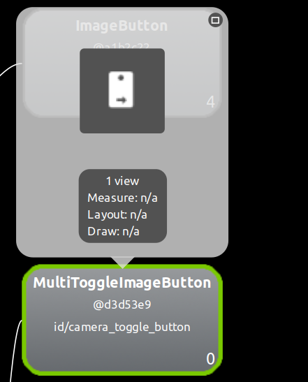
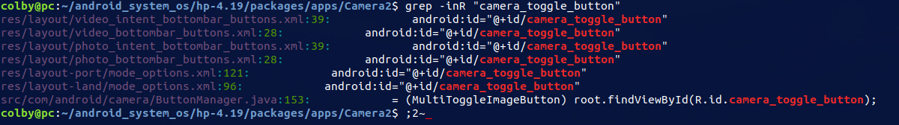
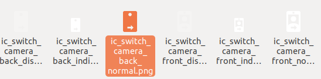
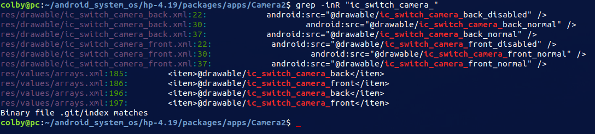

# 1. 问题描述：

在相机拍照时，预览画面中的 前后相机切换时的图标是反的。



# 2. 问题定位

从 hierarchyviewer  中，我们可以拿到 对应 控件的id 为 camera_toggle_button

从中我们可以发现这里的id 其实是和我们的代码中的 是一一对应的




从图片资源文件中，找到搜索的东东：





```xml
res/values/arrays.xml

<array name="camera_id_largeicons" translatable="false">
        <item>@drawable/ic_switch_camera_back</item>                
        <item>@drawable/ic_switch_camera_front</item>
</array>


<array name="camera_id_icons" translatable="false">
        <item>@drawable/ic_switch_camera_back</item>               
        <item>@drawable/ic_switch_camera_front</item>
</array>
```


# 3.问题解决

```diff
diff --git a/packages/apps/Camera2/src/com/android/camera/CaptureModule.java b/packages/apps/Camera2/src/com/android/camera/CaptureModule.java
index 640da4fd5..34eff7c78 100644
--- a/packages/apps/Camera2/src/com/android/camera/CaptureModule.java
+++ b/packages/apps/Camera2/src/com/android/camera/CaptureModule.java
@@ -1542,7 +1542,10 @@ public class CaptureModule extends CameraModule implements
      * settings, rather than a Camera ID. 
      */  
     private static Facing getFacingFromCameraId(int cameraId) {
+        // CHAOZHUO BEGIN
         return cameraId == 1 ? Facing.FRONT : Facing.BACK;
+        //return cameraId == 0 ? Facing.FRONT : Facing.BACK;
+        // CHAOZHUO END
     }
```


