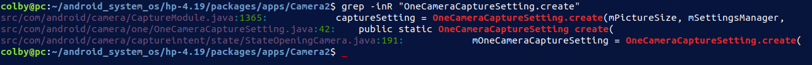

# 1. 问题描述:

台电刷新了新版本的　摄像头固件后，　出现后置摄像头卡顿，以及变为绿色的情况。

# 2. 问题定位:

```shell
lsusb -d 18ec:3399 –v # 18ec:3399 为 厂商ID:产品ID
```

通过上述我们可以得到如下信息：

## 2.1 摄像头配置：

**后置摄像头:**

```shell
        bDescriptorSubtype                  7 (FRAME_MJPEG) 
        bFrameIndex                         1   
        bmCapabilities                   0x00
          Still image unsupported
        wWidth                           1920
        wHeight                          1080
        dwMinBitRate                995328000
        dwMaxBitRate                995328000
        dwMaxVideoFrameBufferSize     4147200
        dwDefaultFrameInterval         333333
        bFrameIntervalType                  1 # 只有一个间距
        dwFrameInterval( 0)            333333 # 30fps
      VideoStreaming Interface Descriptor:
        bLength                            30  
        bDescriptorType                    36
   
   
         bDescriptorSubtype                  7 (FRAME_MJPEG)
        bFrameIndex                         2
        bmCapabilities                   0x00
          Still image unsupported
        wWidth                           2592
        wHeight                          1944
        dwMinBitRate                1209323520
        dwMaxBitRate                1209323520
        dwMaxVideoFrameBufferSize    10077696
        dwDefaultFrameInterval         666666
        bFrameIntervalType                  1 # 只有一个　时间间距选项
        dwFrameInterval( 0)            666666 # 15fps 
      VideoStreaming Interface Descriptor:
        bLength                            14
        bDescriptorType                    36
```

从这个配置中我们可以知道：

后置涉嫌头的配置为：

1920x1080 @30fps

2592x1944 @15fps

**前置摄像头：**

```shell
        bDescriptorSubtype                  7 (FRAME_MJPEG) 
        bFrameIndex                         1   
        bmCapabilities                   0x00
          Still image unsupported
        wWidth                           1600
        wHeight                          1200
        dwMinBitRate                768000000
        dwMaxBitRate                921600000
        dwMaxVideoFrameBufferSize     3840000
        dwDefaultFrameInterval         333333
        bFrameIntervalType                  2   # 两个间距
        dwFrameInterval( 0)            333333　 # 30fps
        dwFrameInterval( 1)            400000   # 25fps
      VideoStreaming Interface Descriptor:
        bLength                            10  
        bDescriptorType                    36
```

1600 x 1200 @30fps @25fps

## 2.2 结论

前后置摄像头，需要根据这两个参数去重新调整。

# 3. fixing

## 3.1 去掉后置过滤

```c
// hp-4.19/hardware/libcamera$ vim V4L2Camera.cpp +750

bool V4L2Camera::EnumFrameIntervals(int pixfmt, int width, int height)
{
    /* CHAOZHUO start */
            if (strstr((const char *)videoIn->cap.card, "Back")) {
                ALOGD("Special mode %s", videoIn->cap.card);
                if (width != 1920 || fival.discrete.denominator != 30) {                   
                    ALOGD("Skip %dx%d@%d", width, height, fival.discrete.denominator);
                    continue;
                }   
                ALOGD("Special mode found %dx%d@%d", width, height, fival.discrete.denominator);
            }   
            /* CHAOZHUO end */
}

// make camera.x86
// ./out/target/product/x86_64/system/lib64/hw/camera.x86.so
```

将原来的　width != 640 => width != 1920 后，后置相机不卡了

## 3.2 设置预览大小

### 3.2.1 后置录像绿色

问题描述，　解决　后置，录像时变为　绿色：

```java
diff --git a/src/com/android/camera/VideoModule.java b/src/com/android/camera/VideoModule.java
index 9a941c73e..10553dd22 100644
--- a/src/com/android/camera/VideoModule.java
+++ b/src/com/android/camera/VideoModule.java
@@ -766,6 +766,16 @@ public class VideoModule extends CameraModule
             quality = CamcorderProfile.QUALITY_HIGH;
         }
         mProfile = CamcorderProfile.get(mCameraId, quality);
+
+        if(mCameraId == 1){
+            // 前置
+            mProfile.videoFrameWidth = 1600;
+            mProfile.videoFrameHeight = 1200;
+        }else if(mCameraId == 0){
+            // 后置
+            mProfile.videoFrameWidth = 1920;　// 这个地方有变动 640
+            mProfile.videoFrameHeight = 1080;　// 原来是　480
+        }
         mPreferenceRead = true;
     }
```


```java
// packages/apps$ vim ./Camera2/src/com/android/camera/VideoModule.java

// make Camera2
```

备注：　这里如果是 640x480 最终录制完的视频　格式也是 640x480, **这里的数值是决定最终录制的视频格式**

## 3.3 后置拍照预览宽高比不对

**问题描述：**

**现象：**

​	在录像界面中的preview 画面是 16:9 (1920x1080) 而 在　拍照界面的preview 的画面是　4:3 (2592x1944)

**原因：**宽高比不对


```shell
# 当前log: 在video preview 切换到　picture 的preview 

I/CAM_OneCamCreator( 5935): Picture Size Configuration: PictureSizeCalculator.Configuration{native size=2592x1944, crop=Rect(0, 0 - 2592, 1944)}

D/CameraHardware( 1420): CameraHardware::initHeapLocked: preview size=2592x1944    
D/CameraHardware( 1420): CameraHardware::initHeapLocked: picture size=2592x1944
D/CameraHardware( 1420): CameraHardware::initHeapLocked: video size=1920x1080
D/CameraHardware( 1420): CameraHardware::initHeapLocked: OK
D/CameraHardware( 1420): CameraHardware::setParameters: OK
D/CameraHardware( 1420): CameraHardware::isPreviewEnabled: 0
D/CameraHardware( 1420): CameraHardware::isPreviewEnabled: 0
D/CameraHardware( 1420): CameraHardware::setPreviewWindow: preview_stream_ops: 0xf46c63d0
D/CameraHardware( 1420): CameraHardware::startPreview
D/CameraHardware( 1420): CameraHardware::startPreviewLocked
D/CameraHardware( 1420): CameraHardware::startPreviewLocked: Open, 1920x1080 # 刚开始　preview size=2592x1944　现在　preview size=1920x1080

I/V4L2Camera( 1420): Actual format: (1920 x 1080), Fps: 30, pixfmt: 'MJPG', bytesperline: 3840

D/CameraHardware( 1420): CameraHardware::initHeapLocked: preview size=1920x1080
D/CameraHardware( 1420): CameraHardware::initHeapLocked: picture size=2592x1944
D/CameraHardware( 1420): CameraHardware::initHeapLocked: video size=1920x1080
D/CameraHardware( 1420): CameraHardware::initHeapLocked: Raw preview heap allocated
D/CameraHardware( 1420): CameraHardware::initHeapLocked: preview heap allocated
D/CameraHardware( 1420): CameraHardware::initHeapLocked: OK
D/CameraHardware( 1420): CameraHardware::startPreviewLocked: StartStreaming
D/CameraHardware( 1420): CameraHardware::setPreviewWindow - Negotiating preview format
D/CameraHardware( 1420): CameraHardware::NegotiatePreviewFormat
D/CameraHardware( 1420): Trying to set preview window geometry to 1920x1080
D/CameraHardware( 1420): CameraHardware::startPreviewLocked: starting PreviewThread
D/CameraHardware( 1420): CameraHardware::startPreviewLocked: O - this:0x0xf46cf000
D/CameraHardware( 1420): CameraHardware::cancelAutoFocus
D/CameraHardware( 1420): CameraHardware::getParameters
D/CameraHardware( 1420): CameraHardware::putParameters
I/CameraDeviceState( 5935): Legacy camera service transitioning to state CAPTURING 
D/CAM_CaptureModule( 5935): onSurfaceTextureUpdated --> updatePreviewTransform
D/CAM_CaptureModule( 5935): updatePreviewTransform: 1920 x 1080
V/CAM_TexViewHelper( 5935): setAspectRatio: 1.35
```


```shell
# 当前log: 从　picture preview　切换到　video preview 中

D/CameraHardware( 1420): CameraHardware::setParameters parms=antibanding=auto;antibanding-values=auto;effect=none;effect-values=none;exposure-compensation=0;exposure-compensation-step=0.5;flash-mode=off;flash-mo
# 这里刚开始　PICTURE: Size 2592x1944
D/CameraHardware( 1420): CameraHardware::setParameters: PREVIEW: Size 1920x1080, 30 fps, format: yuv422sp
D/CameraHardware( 1420): CameraHardware::setParameters: PICTURE: Size 2592x1944, format: jpeg
D/CameraHardware( 1420): CameraHardware::setParameters: VIDEO: Size 1920x1080, format: yuv420p
D/CameraHardware( 1420): CameraHardware::initHeapLocked
D/CameraHardware( 1420): CameraHardware::initHeapLocked: preview size=1920x1080
D/CameraHardware( 1420): CameraHardware::initHeapLocked: picture size=2592x1944
D/CameraHardware( 1420): CameraHardware::initHeapLocked: video size=1920x1080
D/CameraHardware( 1420): CameraHardware::initHeapLocked: OK
D/CameraHardware( 1420): CameraHardware::setParameters: OK
D/CameraHardware( 1420): CameraHardware::sendCommand
D/CameraHardware( 1420): CameraHardware::getParameters
D/CameraHardware( 1420): CameraHardware::putParameters
D/CameraHardware( 1420): CameraHardware::setParameters parms=antibanding=auto;antibanding-values=auto;effect=none;effect-values=none;exposure-compensation=0;exposure-compensation-step=0.5;flash-mode=off;flash-mo
D/CameraHardware( 1420): CameraHardware::setParameters: PREVIEW: Size 1920x1080, 30 fps, format: yuv422sp
# 在这里变为了　 PICTURE: Size 1920x1080
D/CameraHardware( 1420): CameraHardware::setParameters: PICTURE: Size 1920x1080, format: jpeg
D/CameraHardware( 1420): CameraHardware::setParameters: VIDEO: Size 1920x1080, format: yuv420p
D/CameraHardware( 1420): CameraHardware::initHeapLocked
D/CameraHardware( 1420): CameraHardware::initHeapLocked: preview size=1920x1080
D/CameraHardware( 1420): CameraHardware::initHeapLocked: picture size=1920x1080
D/CameraHardware( 1420): CameraHardware::initHeapLocked: video size=1920x1080
D/CameraHardware( 1420): CameraHardware::initHeapLocked: Raw picture heap allocated
D/CameraHardware( 1420): CameraHardware::initHeapLocked: Jpeg picture heap allocated
D/CameraHardware( 1420): CameraHardware::initHeapLocked: OK
D/CameraHardware( 1420): CameraHardware::setParameters: OK
D/CameraHardware( 1420): CameraHardware::getParameters
D/CameraHardware( 1420): CameraHardware::putParameters
D/CameraHardware( 1420): CameraHardware::setParameters parms=antibanding=auto;antibanding-values=auto;effect=none;effect-values=none;exposure-compensation=0;exposure-compensation-step=0.5;flash-mode=off;flash-mo
D/CameraHardware( 1420): Trivially accept it. No changes detected
D/CameraHardware( 1420): CameraHardware::isPreviewEnabled: 0
D/CameraHardware( 1420): CameraHardware::isPreviewEnabled: 0
D/CameraHardware( 1420): CameraHardware::setPreviewWindow: preview_stream_ops: 0xf46c63d0
D/CameraHardware( 1420): CameraHardware::startPreview
D/CameraHardware( 1420): CameraHardware::startPreviewLocked
D/CameraHardware( 1420): CameraHardware::startPreviewLocked: Open, 1920x1080
D/V4L2Camera( 1420): V4L2Camera::EnumFrameFormats

# 从这里我们可以知道，　preview video picture 同时设置为 1920x1080 就没有问题了
```


**初步方案：**

当前

```shell
preview size=1920x1080
picture size=1920x1080
video size=1920x1080
```

这里将　拍照和视频录制都设置为1920x1080，

从如下找到切入点：

### 3.3.1 切入点一：

```shell
I/CAM_OneCamCreator( 5935): Picture Size Configuration: PictureSizeCalculator.Configuration{native size=2592x1944, crop=Rect(0, 0 - 2592, 1944)}
# ./packages/apps/Camera2$ vim src_pd/com/android/camera/one/v2/OneCameraCreator.java
```

对应的代码：

```java

private static Log.Tag TAG = new Log.Tag("OneCamCreator");
 public static OneCamera create( OneCameraCaptureSetting captureSetting,...){
     
     ...
     configuration = pictureSizeCalculator.computeConfiguration(
                        captureSetting.getCaptureSize(),
                        ImageFormat.JPEG);

     imageSaverBuilder = new JpegImageBackendImageSaver(imageRotationCalculator,
                        imageBackend, configuration.getPostCaptureCrop());
     ...
         
     Log.i(TAG, "Picture Size Configuration: " + configuration);
     
 }
```

首先要找明白 configuration 的来源。

captureSetting.getCaptureSize()　从　mCaptureSize　中得到值　，然而　private final Size mCaptureSize;　是在　private OneCameraCaptureSetting() 构造函数中传入的。这里是　private　权限，调用他的地方是在　public static OneCameraCaptureSetting create() 中，　这个是一个　静态方法。

```shell
# package ... OneCameraCaptureSetting.java

static OneCameraCaptureSetting create( pictureSize,) 
	-> new OneCameraCaptureSetting( pictureSize,)
		-> mCaptureSize = captureSize;
```

这里找清楚　是谁调用了　create 函数，　因为是static 方法：



最有可能调用的地方是在：src/com/android/camera/CaptureModule.java:1365　中

```shell
# CaptureModule.java
 openCameraAndStartPreview [CaptureModule]
 	-> OneCameraCaptureSetting.create(mPictureSize,...)
```

mPictureSize 来源于：　

```java
// CaptureModule.java

// private final AppController mAppController;
// public ResolutionSetting getResolutionSetting();

mPictureSize = mAppController.getResolutionSetting().getPictureSize(
                    cameraId, mCameraFacing);

```

mAppController　的来源问题：

```java
// CaptureModule.java

public CaptureModule(AppController appController) {
     this(appController, false);
}

public CaptureModule(AppController appController, boolean stickyHdr) { 
    mAppController = appController;
}
```

```shell
# CameraActivity.java
setModuleFromModeIndex()
	-> agent.createModule(this, getIntent());
	
# ModulesInfo.java 
# 在这里　moduleManager.registerModule(　new ModuleManager.ModuleAgent(){...}
		-> createModule(AppController app,...) [ModulesInfo] 
			-> new CaptureModule(app)
```

从这里我们就确定下来　mAppController　是对应于　CameraActivity.java 中的　

```java
// CameraActivity.java
public class CameraActivity extends QuickActivity
        implements AppController, 
					CameraAgent.CameraOpenCallback,
        			ShareActionProvider.OnShareTargetSelectedListener 
        {
            
        }
// 这样就可以对应起来了
```


在回到最初的　mPictureSize 来源于：　　问题上，

```java
// CameraActivity.java
// getResolutionSetting [CameraActivity]
public ResolutionSetting getResolutionSetting() {
        return mResolutionSetting;                
    }

 public void onCreateTasks(Bundle state) {
     mResolutionSetting = new ResolutionSetting(mSettingsManager, mOneCameraManager,
                                                getContentResolver());
 }
```

在回到最初的　mPictureSize 来源于：　　问题上，

```java
// ResolutionSetting.java 
public Size getPictureSize(CameraId cameraId, Facing cameraFacing){
    
    Size pictureSize = null;
    
    pictureSize = SettingsUtil.sizeFromSettingString(
                    mSettingsManager.getString(SettingsManager.SCOPE_GLOBAL,
                            pictureSizeSettingKey));
    return pictureSize;
}
```

现在目标很明确，　去看　mSettingsManager.getString(SettingsManager.SCOPE_GLOBAL,　pictureSizeSettingKey)

```java
// ResolutionSetting.java

private final SettingsManager mSettingsManager;
public ResolutionSetting(SettingsManager settingsManager,
            OneCameraManager oneCameraManager,
            ContentResolver contentResolver) {
    
        mSettingsManager = settingsManager; 
		...
}
```

这里的　settingsManager　来源于　CameraActivity.java

```shell
# CameraActivity.java

onCreateTasks [CameraActivity]
	-> mSettingsManager = getServices().getSettingsManager();
	-> new ResolutionSetting(mSettingsManager,
		
```

```java
// CameraActivity.java

// getServices [CameraActivity] 
public CameraServices getServices() {
        return CameraServicesImpl.instance();                     
    }
```


```java
// CameraServicesImpl.java
public static CameraServicesImpl instance() { 
        return Singleton.INSTANCE;
    }

private static class Singleton {
        private static final CameraServicesImpl INSTANCE = new CameraServicesImpl(
              AndroidContext.instance().get());
    }

public SettingsManager getSettingsManager() {  
        return mSettingsManager;
    }

private CameraServicesImpl(Context context) {
    mSettingsManager = new SettingsManager(context);
}
```

从这里我们就知道　mSettingsManager = getServices().getSettingsManager();　中的　mSettingsManager ==  new SettingsManager(context)

现在回到　mSettingsManager.getString() 中，我们知道这里的　mSettingsManager ==  new SettingsManager(context)

```shell
# SettingsManager.java
# getString [SettingsManager] 
getString(String scope, String key)
	-> getString(scope, key, getStringDefault(key)); 
```

```java
// SettingsManager.java
public String getString(String scope, String key, String defaultValue) {
     SharedPreferences preferences = getPreferencesFromScope(scope);
     try {
          return preferences.getString(key, defaultValue); // 从这儿返回了　1600x1200
     }
}
```

现在的目标就是　preferences.getString(key, defaultValue);

```shell
# SettingsManager.java
getPreferencesFromScope(String scope)
	-> return mDefaultPreferences;

SettingsManager(Context context) # 构造函数
	-> mContext = context;
	-> mDefaultPreferences = PreferenceManager.getDefaultSharedPreferences(mContext);
```

这里的　mDefaultPreferences　= =   context.getSharedPreferences(getDefaultSharedPreferencesName(context), 
                getDefaultSharedPreferencesMode());

```java
// frameworks ... PreferenceManager.java

public static SharedPreferences getDefaultSharedPreferences(Context context) {
        return context.getSharedPreferences(getDefaultSharedPreferencesName(context),
                getDefaultSharedPreferencesMode());
    }

public static String getDefaultSharedPreferencesName(Context context) {
        return context.getPackageName() + "_preferences";
    }

private static int getDefaultSharedPreferencesMode() {
        return Context.MODE_PRIVATE;
    }
```


```java
// frameworks ... Context.java 
public abstract SharedPreferences getSharedPreferences(String name, int mode);
```

从这里看，　我们必须找清楚　context　的来源：

```shell
# SettingsManager.java
SettingsManager(Context context) # 构造函数
	-> mContext = context;
	-> mDefaultPreferences = PreferenceManager.getDefaultSharedPreferences(mContext);
		-> context.getSharedPreferences()
```

从这里看，要找到　new SettingsManager 的地方

```shell
# CameraServicesImpl.java

CameraServicesImpl.instance()
	-> Singleton.INSTANCE == new CameraServicesImpl(AndroidContext.instance().get())

		-> CameraServicesImpl(Context context)
			-> mSettingsManager = new SettingsManager(context);
    
```

这里可算是找到　context 的来源了　AndroidContext.instance().get()

```java
// AndroidContext.java
public static AndroidContext instance() {
        return sInstance; // sInstance = new AndroidContext(context);
    }

public Context get() {
        return mContext;          
    }

public static void initialize(@NonNull Context context) {
        if (sInstance == null) {
            sInstance = new AndroidContext(context);
        }                      
    } // 从这里知道要想找到　context　必须找到　　AndroidContext.initialize 的调用
```

```shell
# CameraApp.java
onCreate() 
	-> Context context = getApplicationContext();
	-> AndroidContext.initialize(context);
```

豁出来找找：

```shell
# frameworks ... ContextImpl.java
getApplicationContext()
	-> return mPackageInfo.getApplication() : mMainThread.getApplication();

# 这里拿　mMainThread.getApplication()　去找

```

觉得这样找　找不到结果，　这条线，暂时放弃

### 3.3.2 切入点二：

```shell
# 这里也是一个切入点
/RequestThread-0( 5935): configureOutputs - set take picture size to 2592x1944

# frameworks$ vim base/core/java/android/hardware/camera2/legacy/RequestThreadManager.java +492
```

```java
// RequestThreadManager.java
configureOutputs(Collection<Pair<Surface, Size>> outputs){
   
    
    Size smallestSupportedJpegSize = calculatePictureSize(mCallbackOutputs,
                callbackOutputSizes, mParams); // 计算图片大小
    
    
    Log.i(TAG, "configureOutputs - set take picture size to " + smallestSupportedJpegSize);
    mParams.setPictureSize(
                    smallestSupportedJpegSize.getWidth(), smallestSupportedJpegSize.getHeight());
}


private Size calculatePictureSize( List<Surface> callbackOutputs,
                                       List<Size> callbackSizes, Camera.Parameters params) {
    
     Size smallestSupportedJpegSize = Collections.min(candidateSupportedJpegSizes,
                    new SizeAreaComparator());
    
    return smallestSupportedJpegSize;
}


// frameworks/base$ mm
// out/target/product/x86_64/system/framework/framework.jar
```


