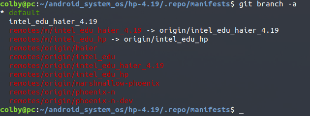

```shell
# 这里临时记录一下 三个设备的名字，等赵鹏项目确立之后，开分支

# 联想有3个设备， AIO520C-24IWL AIO520C-24ICB AIO520X-24ICB
```

## 1.切换工程：

```shell
# hp-4.19$
repo init -u ssh://caobinxin@192.168.1.112:29418/x86manifest -b intel_edu_hp

repo sync -c -j4 # 此时同步报错， 报错说，有的分支，没有提交

repo sync -c -j4 2>sync.err # 提取出报错信息
```

sync.err

```shell
... A new repo command ( 1.25) is available.
... You should upgrade soon:

    cp /home/colby/android_system_os/hp-4.19/.repo/repo/repo /usr/bin/repo

error: frameworks/base/: contains uncommitted changes
error: Cannot checkout frameworks/base
error: packages/apps/Settings/: contains uncommitted changes
error: Cannot checkout packages/apps/Settings

error: Exited sync due to checkout errors
```

解决方式：

```shell
cd frameworks/base/
git checkout .
cd -

cd packages/apps/Settings/
git checkout .
cd -

repo sync -c -j4 # 此时同步成功

. ./build/envsetup.sh 
lunch 
make installclean
```

## 2. 新建工程



当前工程中只有这两个,这里新建一个

```shell
# hp-4.19/.repo/manifests$ 
git checkout -b intel_edu_lenovo_aio520c

git push --set-upstream origin intel_edu_lenovo_aio520c # 推送到远端
```

拉取新的工程：

```shell
# /hp-4.19$
repo init -u ssh://caobinxin@192.168.1.112:29418/x86manifest -b intel_edu_lenovo_aio520c
repo sync -c -j4
```

