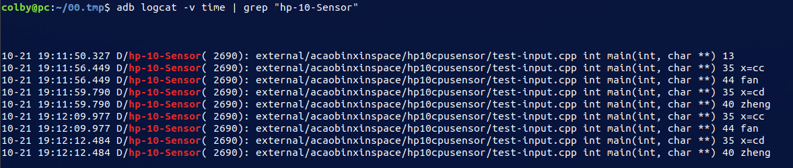

设备：

hp 10-cpu i5

# 1. 问题描述

原本是没有　对应的驱动的，　intel hebo 给的驱动的包如下：

```diff
From a50e8e2ecc1428df28c748c6af6255eb65faf9f3 Mon Sep 17 00:00:00 2001
From: Srinivas Pandruvada <srinivas.pandruvada@linux.intel.com>
Date: Fri, 19 Apr 2019 19:00:31 -0700
Subject: [PATCH] HID: intel-ish-hid: Add Comet Lake PCI device ID

Add Comet Lake PCI device ID to the supported device list.

Signed-off-by: Srinivas Pandruvada <srinivas.pandruvada@linux.intel.com>
Signed-off-by: Jiri Kosina <jkosina@suse.cz>
---
 drivers/hid/intel-ish-hid/ipc/hw-ish.h  | 1 +
 drivers/hid/intel-ish-hid/ipc/pci-ish.c | 1 +
 2 files changed, 2 insertions(+)

diff --git a/drivers/hid/intel-ish-hid/ipc/hw-ish.h b/drivers/hid/intel-ish-hid/ipc/hw-ish.h
index 08a8327dfd22..523c0cbd44a4 100644
--- a/drivers/hid/intel-ish-hid/ipc/hw-ish.h
+++ b/drivers/hid/intel-ish-hid/ipc/hw-ish.h
@@ -31,6 +31,7 @@
 #define CNL_H_DEVICE_ID		0xA37C
 #define ICL_MOBILE_DEVICE_ID	0x34FC
 #define SPT_H_DEVICE_ID		0xA135
+#define CML_LP_DEVICE_ID	0x02FC
 
 #define	REVISION_ID_CHT_A0	0x6
 #define	REVISION_ID_CHT_Ax_SI	0x0
diff --git a/drivers/hid/intel-ish-hid/ipc/pci-ish.c b/drivers/hid/intel-ish-hid/ipc/pci-ish.c
index a6e1ee744f4d..ac0a179daf23 100644
--- a/drivers/hid/intel-ish-hid/ipc/pci-ish.c
+++ b/drivers/hid/intel-ish-hid/ipc/pci-ish.c
@@ -40,6 +40,7 @@ static const struct pci_device_id ish_pci_tbl[] = {
 	{PCI_DEVICE(PCI_VENDOR_ID_INTEL, CNL_H_DEVICE_ID)},
 	{PCI_DEVICE(PCI_VENDOR_ID_INTEL, ICL_MOBILE_DEVICE_ID)},
 	{PCI_DEVICE(PCI_VENDOR_ID_INTEL, SPT_H_DEVICE_ID)},
+	{PCI_DEVICE(PCI_VENDOR_ID_INTEL, CML_LP_DEVICE_ID)},
 	{0, }
 };
 MODULE_DEVICE_TABLE(pci, ish_pci_tbl);
-- 
2.17.1

```

当打上如上 patch 后，　发现 probe 时报错。

```shell
hp_accel: laptop model unknown, using default axes configuration

lis3lv02d: unknown sensor type 0x0

hp_accel: probe of HPQ6007:00 failed with error -22


hid-generic 001F:8086:22D8.0003: invalid report_size 192
hid-generic 001F:8086:22D8.0003: item 0 1 1 7 parsing failed 
hid-generic: probe of 001F:8086:22D8.0003 failed with error -22 
hid-generic 001F:8086:22D8.0004: hidraw2: <UNKNOWN> HID v2.00 Device [hid-ishtp 8086:22D8] on  
hid-generic 001F:8086:22D8.0005: hidraw3: <UNKNOWN> HID v2.00 Device [hid-ishtp 8086:22D8] on  
hid-generic 001F:8086:22D8.0006: hidraw4: <UNKNOWN> HID v2.00 Device [hid-ishtp 8086:22D8] on  
hid-sensor-hub 001F:8086:22D8.0003: invalid report_size 192
hid-sensor-hub 001F:8086:22D8.0003: item 0 1 1 7 parsing failed 
hid-sensor-hub 001F:8086:22D8.0003: parse failed
hid-sensor-hub: probe of 001F:8086:22D8.0003 failed with error -22 
```


# 2. 问题定位

```shell
hp_accel: probe of HPQ6007:00 failed with error -22 # drivers/base/dd.c:569
```


```c
static int really_probe(struct device *dev, struct device_driver *drv)
{
	if (dev->bus->probe) {
        ret = dev->bus->probe(dev);              
        if (ret){
printk(KERN_ERR"%s %d\n", __func__, __LINE__);
            goto probe_failed; // 从这直接跳转到错误执行了
        }    
    } else if (drv->probe) {
        
    }
    
    
    
    ...
        
probe_failed:
    ...
pinctrl_bind_failed:
	...

    switch (ret) {
    case -EPROBE_DEFER:
        ...
        break;
    case -ENODEV:
    case -ENXIO:
        ...
        break;
    default:
        printk(KERN_WARNING
               "%s: probe of %s failed with error %d\n",
               drv->name, dev_name(dev), ret);
printk(KERN_ERR"%s %d\n", __func__, __LINE__);
printk(KERN_ERR"\n\n\n----start-stack---\n");
dump_stack();
printk(KERN_ERR"----end---stack---\n\n\n\n");

    }
    
    ret = 0;
done:
}
```

函数调用栈，打印如下：

```shell
Call Trace:                          
 dump_stack+0x63/0x85
 really_probe+0x358/0x560
 driver_probe_device+0x65/0x150
 __driver_attach+0xf7/0x120
 ? driver_probe_device+0x150/0x150
 ? driver_probe_device+0x150/0x150
 bus_for_each_dev+0x55/0x90
 ? bus_add_driver+0x5d/0x280
 driver_attach+0x1e/0x20
 bus_add_driver+0x1c7/0x280
 driver_register+0x60/0x100
 ? 0xffffffffc01cb000
 acpi_bus_register_driver+0x41/0x50
 lis3lv02d_driver_init+0x15/0x1000 [hp_accel] # 这个是本次的入口点
 do_one_initcall+0x52/0x210
 ? __vunmap+0x92/0xd0
 ? do_init_module+0x28/0x220
 do_init_module+0x61/0x220
 load_module+0x1fc2/0x2550
 ? symbol_put_addr+0x60/0x60
 __se_sys_finit_module+0xb4/0xe0
 __x64_sys_finit_module+0x1a/0x20
 do_syscall_64+0x54/0x120
 entry_SYSCALL_64_after_hwframe+0x44/0xa9

```


另外一个报错的地点

```shell
hid-sensor-hub: probe of 001F:8086:22D8.0003 failed with error -22 
```

通过log 来看，报错的code 路径都是一致的都是由　ret = dev->bus->probe(dev);　报错所导致的

函数调用栈如下：

```SHELL
Call Trace:                       
 dump_stack+0x63/0x85
 really_probe+0x358/0x560
 driver_probe_device+0x65/0x150
 __driver_attach+0xf7/0x120
 ? driver_probe_device+0x150/0x150
 ? driver_probe_device+0x150/0x150
 bus_for_each_dev+0x55/0x90
 ? bus_add_driver+0x5d/0x280
 driver_attach+0x1e/0x20
 bus_add_driver+0x1c7/0x280
 driver_register+0x60/0x100
 ? 0xffffffffc03dd000
 __hid_register_driver+0x56/0x80
 ? 0xffffffffc03dd000
 sensor_hub_driver_init+0x23/0x1000 [hid_sensor_hub] # 这个是入口点
 do_one_initcall+0x52/0x210
 ? __vunmap+0x92/0xd0
 ? do_init_module+0x28/0x220
 do_init_module+0x61/0x220
 load_module+0x1fc2/0x2550
 ? symbol_put_addr+0x60/0x60
 __se_sys_finit_module+0xb4/0xe0
 __x64_sys_finit_module+0x1a/0x20
 do_syscall_64+0x54/0x120
 entry_SYSCALL_64_after_hwframe+0x44/0xa9
```

报错总结：

同时被两个驱动所适配到，hp_accel　和　hid_sensor_hub　，　报错的原因都是　dev->bus->probe(dev);　所导致，也就是　总线所对应的　probe 报错返回了。

这里优先去查　hid_sensor_hub　中的报错。

## 2.1 hid_sensor_hub 

```c
// hid-sensor-hub.c

static struct hid_driver sensor_hub_driver = { 
    .name = "hid-sensor-hub",
    .id_table = sensor_hub_devices,
    .probe = sensor_hub_probe,
    .remove = sensor_hub_remove,
    .raw_event = sensor_hub_raw_event,
    .report_fixup = sensor_hub_report_fixup,
#ifdef CONFIG_PM
    .suspend = sensor_hub_suspend,
    .resume = sensor_hub_resume,
    .reset_resume = sensor_hub_reset_resume,
#endif
};
module_hid_driver(sensor_hub_driver); // 重点关注这个，找到　bus
```

根据一下信息，去对应　module_hid_driver(sensor_hub_driver);

```c
#define module_hid_driver(__hid_driver) \ 
    module_driver(__hid_driver, hid_register_driver, \
              hid_unregister_driver)
        
        
#define module_driver(__driver, __register, __unregister, ...) \                     
static int __init __driver##_init(void) \
{ \
    return __register(&(__driver) , ##__VA_ARGS__); \
} \
module_init(__driver##_init); \
static void __exit __driver##_exit(void) \
{ \
    __unregister(&(__driver) , ##__VA_ARGS__); \
} \
module_exit(__driver##_exit);        
```

对应的结果如下：

```c
static int __init sensor_hub_driver_init(void)
{ 
    return hid_register_driver(&sensor_hub_driver); 
} 
module_init(sensor_hub_driver_init); 
static void __exit sensor_hub_driver_exit(void) 
{ 
    hid_unregister_driver(&sensor_hub_driver); 
} 
module_exit(sensor_hub_driver_exit); 
```

这下就思路清楚多了：（也能和上面的栈对应上了）

```c
#define hid_register_driver(driver) \
    __hid_register_driver(driver, THIS_MODULE, KBUILD_MODNAME)
```

```c
// hid-core.c
int __hid_register_driver(struct hid_driver *hdrv, struct module *owner,const char *mod_name)
{
    int ret; 

    hdrv->driver.name = hdrv->name;
    hdrv->driver.bus = &hid_bus_type; // 这里找到了　hid_bus_type
    hdrv->driver.owner = owner;
    hdrv->driver.mod_name = mod_name;

    INIT_LIST_HEAD(&hdrv->dyn_list);
    spin_lock_init(&hdrv->dyn_lock);

    ret = driver_register(&hdrv->driver);

    if (ret == 0)
        bus_for_each_drv(&hid_bus_type, NULL, NULL,
                 __hid_bus_driver_added);

    return ret; 
}
EXPORT_SYMBOL_GPL(__hid_register_driver);
```

从这个代码中，我们就找到了　驱动所挂载的　bus为　hid_bus_type

```c
// hid-core.c 
struct bus_type hid_bus_type = {   
    .name       = "hid",
    .dev_groups = hid_dev_groups, 
    .drv_groups = hid_drv_groups,
    .match      = hid_bus_match,
    .probe      = hid_device_probe, //　就是执行这里的　probe 后返回了 -22
    .remove     = hid_device_remove,
    .uevent     = hid_uevent,
};
EXPORT_SYMBOL(hid_bus_type);
```

```c
// errno-base.h
#define EINVAL      22  /* Invalid argument */
```

现在首先要确定，　在那个地方被返回了　EINVAL

```c
static int hid_device_probe(struct device *dev)
{
    ...
    if (hdrv->probe) {
            ret = hdrv->probe(hdev, id); // 这儿是很有可能出错的　// sensor_hub_probe
        }
    ...
}
```


现在就转到　我们驱动中的　sensor_hub_probe　函数中了，看它为啥报错　-22 即可

**intel hebo 找　专门做这一块的同事说，这块报错是正确的**

# 3. hal 层问题定位

看一波log 打印：

```shell
getevent -t /dev/input/event6
```

```shell
# 盖子　上
[     869.120979] 0004 0004 000000cd
[     869.120979] 0001 00f0 00000001
[     869.120979] 0000 0000 00000000
[     869.120981] 0001 00f0 00000000
[     869.120981] 0000 0000 00000000

# 盖子　下
[     901.645101] 0004 0004 000000cc
[     901.645101] 0001 00f0 00000001
[     901.645101] 0000 0000 00000000
[     901.645105] 0001 00f0 00000000
[     901.645105] 0000 0000 00000000
```


```shell
getevent -l /dev/input/event6 
```

```shell
# 盖子上
# 事件类型	　事件码　　　　　　　　　　事件值
EV_MSC       MSC_SCAN             000000cd            
EV_KEY       KEY_UNKNOWN          DOWN                
EV_SYN       SYN_REPORT           00000000            
EV_KEY       KEY_UNKNOWN          UP                  
EV_SYN       SYN_REPORT           00000000


# 盖子下
EV_MSC       MSC_SCAN             000000cc            
EV_KEY       KEY_UNKNOWN          DOWN                
EV_SYN       SYN_REPORT           00000000            
EV_KEY       KEY_UNKNOWN          UP                  
EV_SYN       SYN_REPORT           00000000 
```

```shell
Linux中输入设备的事件类型有
EV_SYN 0x00 同步事件
EV_KEY 0x01 按键事件，如KEY_VOLUMEDOWN
EV_REL 0x02 相对坐标,   如shubiao上报的坐标
EV_ABS 0x03 绝对坐标，如触摸屏上报的坐标
EV_MSC 0x04 其它
EV_LED 0x11 LED
EV_SND 0x12 声音
EV_REP 0x14 Repeat
EV_FF 0x15 力反馈 
~~~~~~~~~~~~~~~~~~~~~~~~
EV_PWR       电源
EV_FF_STATUS   状态
```


在我们的　hal层中，有关sensors 支持只有 5中　

hal_sensors=hdaps
hal_sensors=kbd
hal_sensors=iio

hal_sensors=s103t
hal_sensors=w500

通过在init.sh 中修改　set_property ro.hardware.sensors $hal_sensors

发现，没有一种是　支持我们当前设备的传感器的。

## 3.2 解决方案

既然，我们可以使用　getevent 可以读到当前设备的在翻转盖子时的　信息。

1. 在hal 层去手动接收 input 的输入事件
2. 将input输入事件进行封装继续上报给　framework中。

在framework中盖子的翻转的点在：　WindowManagerService.java 中freezeRotation()


# 4. 方案实现

## 4.1 input事件接收

```c
#define LOG_TAG "hp-10-Sensor"
#include <stdio.h>
#include <sys/types.h>
#include <sys/stat.h>
#include <fcntl.h>
#include <string.h>
#include <linux/input.h>
#include <cutils/log.h>
#include <cerrno>

int main(int argc, char* argv[])
{
	ALOGD("%s %s %d", __FILE__, __func__, __LINE__);
	int fd = open("/dev/input/event6", O_RDWR);
	if(fd < 0)
	{
		printf("failed to open %s\n", strerror(errno));
		return -1;
	}

	struct input_event event;
	int x = 0, y = 0;
	while(1)
	{
		memset(&event, 0, sizeof(event));
		read(fd, &event, sizeof(event));
		if(event.type == EV_SYN)
			continue;

		if(event.type == EV_MSC)
		{
			if(event.code == MSC_SCAN)
			{
				x = event.value;
				ALOGD("%s %s %d x=%x", __FILE__, __func__, __LINE__, x);
				printf("%s %s %d x=%x", __FILE__, __func__, __LINE__, x);
			}
			if(0xcd == x)
			{
				ALOGD("%s %s %d zheng", __FILE__, __func__, __LINE__);
				printf("%s %s %d zheng", __FILE__, __func__, __LINE__);
			}else if(0xcc == x)
			{
				ALOGD("%s %s %d fan", __FILE__, __func__, __LINE__);
				printf("%s %s %d fan", __FILE__, __func__, __LINE__);
			}
		}
		else
			continue;
	}

	close(fd);

	return 0;
}
```

亲自测试，在phoenix中不加如下内容，　open(/dev/input/event6, xxx) 也是没有问题的

**但是最好加上**

```shell
hp-4.19/system/core/rootdir$ vim ueventd.rc
```

```shell
/dev/input/event6         0666   root       root
```




## 4.2 sensor hal层框架编写

## 4.3 融合到framework中


# . 备注

## 配置传感器类型：

```shell
hal_sensors=hdaps
hal_sensors=kbd
hal_sensors=iio

hal_sensors=s103t
hal_sensors=w500

# 从这我们知道，　sensor 的种类有　以上　5　种类型
set_property ro.hardware.sensors $hal_sensors
```


读取传感器类型的函数：

```java
// packages/services/Analytics/HardwareCollector/src/org/android_x86/hardwarecollector/HardwareCollectorService.java:195

private void collectSensorsInfo() {
        String sensors = SystemProperties.get("ro.hardware.sensors", "");      
        if (!sensors.isEmpty() && !"kbd".equals(sensors)) {
            checkAndSend(GA_ACTION_HAS_SENSORS, sensors);
        }
    }
```


**搞清楚各个　传感器类似所对应的驱动**

**w500**

```c
// hardware/libsensors$ vim w500_sensor.c
#define DRIVER_DESC             "Acer BMA150 accelerometer"

open_accel_sensor()
	->open()
	->strcmp(name, DRIVER_DESC);  
```

****

**s103t**

```c
// hardware/libsensors$ vim s103t_sensor.c +159
#define DRIVER_DESC             "Lenovo front-screen buttons driver"

open_sensors() 
	-> open()
    -> strcmp(name, DRIVER_DESC)
```

****

**hdaps**

```c
open_input_device()
    ->open()
    ->strcmp(name, accel_list[i].name)
```

accel_list 中是所支持的　设备列表

```c
typedef struct {
    const char *name;
    float conv[3];
    int swap[3];
    int avg_cnt;
} accel_params;


static accel_params accel_list[] = {
    { "hdaps", { CONVERT, -CONVERT, 0 }, NO_SWAP, 1 },
    
    
    { "Pegatron Lucid Tablet Accelerometer", { CONVERT_PEGA, CONVERT_PEGA, CONVERT_PEGA }, NO_SWAP, 4 },
    
    
    { "ST LIS3LV02DL Accelerometer",  { CONVERT_LIS, -CONVERT_LIS, CONVERT_LIS }, SWAP_ZXY, 2 }, /* pc mode */
        
        
};
```

****

**iio**

要想使用iio 类型，需要去看当前sys目录下有没有　in_accel_xxx 相关的接口，如果没有就不能用这种传感器

****

**kbd**

```shell
# init.sh
set_property hal.sensors.kbd.type 1 # 这个就是去指定　KeysType　的第几个元素

```

```c
SensorPollContext()
    -> open()
    -> strcmp(name, ktype->name)
```

```c
struct KbdSensorKeys {
    char name[64];
    int keys[8];
} KeysType[] = { 
    { "", { } },
    { "AT Translated Set 2 keyboard", { EV_KEY, KEY_UP, KEY_RIGHT, KEY_DOWN, KEY_LEFT, KEY_LEFTALT, KEY_LEFTCTRL, 1 } },
    { "AT Translated Set 2 keyboard", { EV_MSC, 91, 115, 123, 109, KEY_LEFTALT, KEY_LEFTCTRL, 3 } },
    { "AT Translated Set 2 keyboard", { EV_KEY, KEY_F5, KEY_F8, KEY_F6, KEY_F7, KEY_LEFTALT, KEY_LEFTCTRL, 1 } },
    { "AT Translated Set 2 keyboard", { EV_KEY, KEY_F9, KEY_F12, KEY_F10, KEY_F11, KEY_LEFTALT, KEY_LEFTCTRL, 1 } },
    { "Asus Laptop extra buttons", { EV_KEY, KEY_F9, KEY_F12, KEY_F10, KEY_F11, KEY_LEFTALT, KEY_LEFTCTRL, 2 } },
    { "HP WMI hotkeys", { -1, KEY_DIRECTION, 0, 0, 0, 0, 0, 3 } },
};
```


