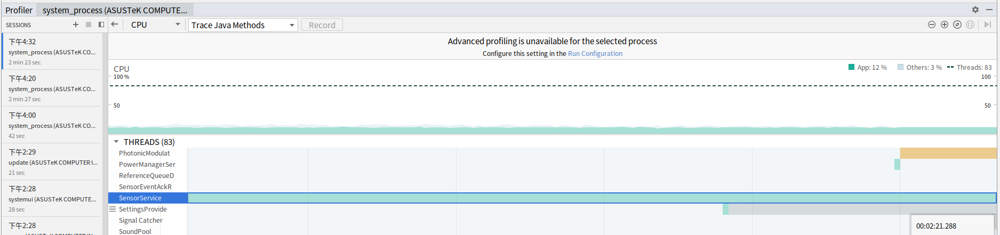

# 1. 问题描述

发现其他设备， 在正常情况下。  什么都不启动的情况下  cpu 占用率，为%0, 而当前设备，cpu 占用率为%12

# 2.分析

这里借助 android studio 的 android profiler 工具进行分析：

## 1. profiler 定位

```shell
intel_hp:/ $
top -m 10

User 12%, System 0%, IOW 0%, IRQ 0%
User 301 + Nice 0 + Sys 0 + Idle 2102 + IOW 0 + IRQ 0 + SIRQ 0 = 2403

  PID USER     PR  NI CPU% S  #THR     VSS     RSS PCY Name
 1964 system   18  -2  12% S    86 1826200K 180512K  fg system_server # 从这里看 他占用 %12
 9515 shell    20   0   0% R     1   9884K   2628K  fg top
    3 root      0 -20   0% I     1      0K      0K  fg rcu_gp
    4 root      0 -20   0% I     1      0K      0K  fg rcu_par_gp
    6 root      0 -20   0% I     1      0K      0K  fg kworker/0:0H-kblockd
    8 root      0 -20   0% I     1      0K      0K  fg mm_percpu_wq
    9 root     20   0   0% S     1      0K      0K  fg ksoftirqd/0
   10 root     20   0   0% I     1      0K      0K  fg rcu_preempt
   11 root     20   0   0% I     1      0K      0K  fg rcu_sched
   12 root     20   0   0% I     1      0K      0K  fg rcu_bh

```


[view] -> [Tool Windows] -> [profiler]



 

通过 profiler 分析 发现， 是我们的 sensorservice 占用过大导致的

## 2. SensorService 问题分析


```cpp
// SensorService.cpp 

// 服务启动后，第一个会走这里
void SensorService::onFirstRef() {
    
    ...
        
    		mAckReceiver = new SensorEventAckReceiver(this);
            mAckReceiver->run("SensorEventAckReceiver", PRIORITY_URGENT_DISPLAY);  // 这里会启动 SensorEventAckReceiver -> threadLoop()
    
            run("SensorService", PRIORITY_URGENT_DISPLAY); // 这个会调用 SensorService ->  threadLoop()
}
```

通过分别注释掉这两个 run ，在通过 profiler 去观察，发现 是 SensorService ->  threadLoop() 中导致的 cpu 占用率 过高的。

# 3. 修复

这里没有进一步在去分析 ，   之前在 hp-10gen-sensor 的问题中 写过一个 sensor 的 hal 层的code

这里直接在 /system/etc/init.sh 中配置 为了 之前的code, 