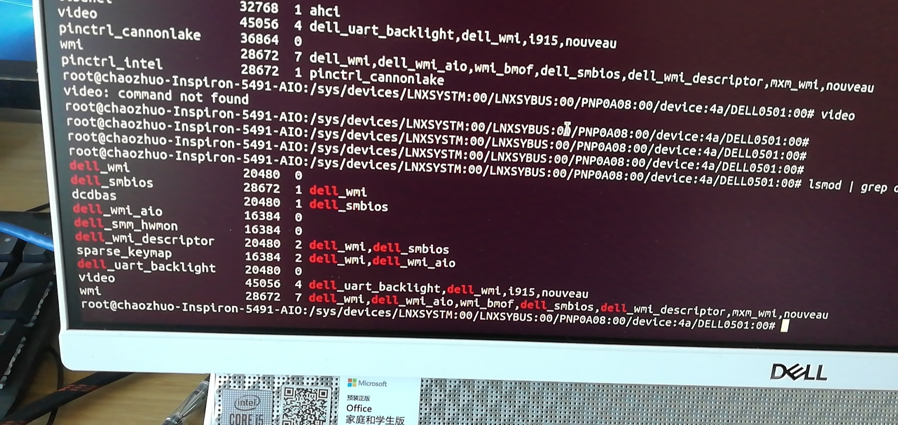
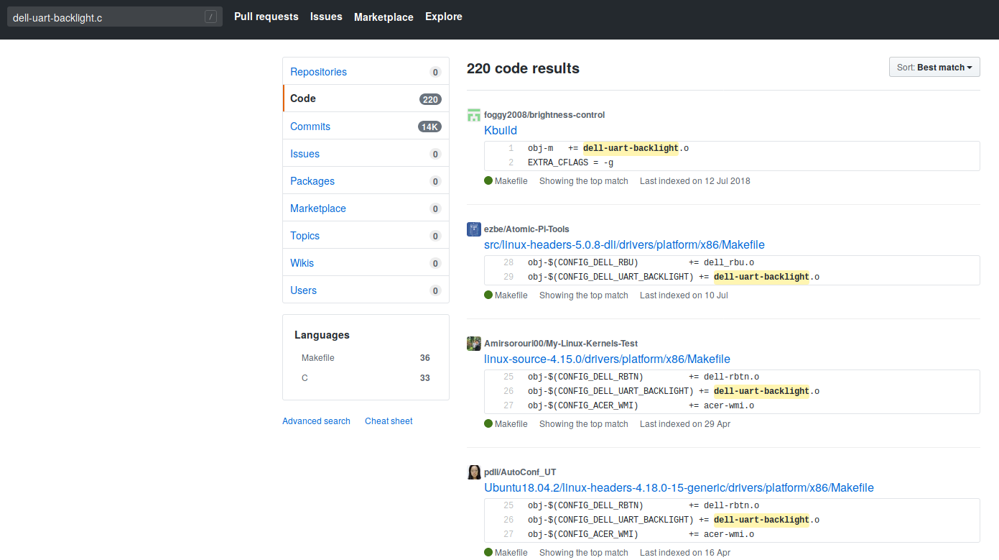

# backlight相关

## 1. 问题描述

滑动桌面背光调节滑动条，　无法调节背光。

## 2. 问题定位

### 2.1 ubuntu 

在kernel 5.0 的ubuntu 下，

在/sys目录下搜索 

```shell
/sys # find -name "*backlight*"
./class/backlight

/sys/class/backlight # ls
dell_uart_backlight


/sys/class/backlight/dell_uart_backlight/device # ls -l
total 0
drwxr-xr-x 3 root root    0 2019-11-11 15:00 backlight
lrwxrwxrwx 1 root root    0 2019-11-11 15:11 driver -> ../../../../../../bus/acpi/drivers/Dell AIO serial backlight


-r--r--r-- 1 root root 4096 2019-11-11 15:11 hid
-r--r--r-- 1 root root 4096 2019-11-11 15:11 modalias
-r--r--r-- 1 root root 4096 2019-11-11 15:11 path
lrwxrwxrwx 1 root root    0 2019-11-11 15:11 physical_node -> ../../../../../pnp0/00:02
drwxr-xr-x 2 root root    0 2019-11-11 15:00 power
-r--r--r-- 1 root root 4096 2019-11-11 15:11 status
lrwxrwxrwx 1 root root    0 2019-11-11 15:11 subsystem -> ../../../../../../bus/acpi
-rw-r--r-- 1 root root 4096 2019-11-11 15:00 uevent
-r--r--r-- 1 root root 4096 2019-11-11 15:11 uid


```



```shell
/sys/class/backlight/dell_uart_backlight # echo 10 > brightness
# 这样确实可以　调节成功亮度
```

从ubuntu 中我们可以知道，对应的驱动是　dell_uart_backlight

通过在我们phoenixos 中的kernel目录下去检索，我们并没有发现　有这个驱动？

此时有一个疑问出现：是不是，我们的code中少对应的驱动。

带着这个疑问，在github中进行搜索：



果然，可以在github中找到这个驱动文件：

最终选择这个　https://github.com/brauner/ubuntu-eoan/blob/45e70975b2c9b8041ea232820fe988845ffd8eff/drivers/platform/x86/Makefile

## 3. fixed

参照上面的链接中的目录结构。在我们的os中加入dell-uart-backlight.c 和 dell-uart-backlight.h两个文件

并修改Kconfig 文件和 Makefile文件 以及　android-x86_64_defconfig

```diff
diff --git a/arch/x86/configs/android-x86_64_defconfig b/arch/x86/configs/android-x86_64_defconfig
index aeaddba798e7..15ba9e86ce62 100644
--- a/arch/x86/configs/android-x86_64_defconfig
+++ b/arch/x86/configs/android-x86_64_defconfig
@@ -6348,6 +6348,7 @@ CONFIG_DELL_WMI_LED=m
 CONFIG_DELL_SMO8800=m
 CONFIG_DELL_RBTN=m
 # CONFIG_DELL_RBU is not set
+CONFIG_DELL_UART_BACKLIGHT=m
 CONFIG_FUJITSU_LAPTOP=m
 CONFIG_FUJITSU_TABLET=m
 CONFIG_AMILO_RFKILL=m
diff --git a/drivers/platform/x86/Kconfig b/drivers/platform/x86/Kconfig
index b52a3dbe60c0..17990b498c24 100644
--- a/drivers/platform/x86/Kconfig
+++ b/drivers/platform/x86/Kconfig
@@ -258,6 +258,19 @@ config DELL_RBU
         image for the image update to take effect.
         See <file:Documentation/dell_rbu.txt> for more details on the driver.
 
+config DELL_UART_BACKLIGHT
+       tristate "Dell AIO UART Backlight driver"
+       depends on SERIAL_8250
+       depends on ACPI
+       ---help---
+         Say Y here if you want to support Dell AIO UART backlight interface.
+         The Dell AIO machines released after 2017 come with a UART interface
+         to communicate with the backlight scalar board. This driver creates
+         a standard backlight interface and talks to the scalar board through
+         UART to adjust the AIO screen brightness.
+
+         To compile this driver as a module, choose M here: the module will
+         be called dell_uart_backlight.
 
 config FUJITSU_LAPTOP
        tristate "Fujitsu Laptop Extras"
diff --git a/drivers/platform/x86/Makefile b/drivers/platform/x86/Makefile
index ffb100f49a0c..b09e8db86f4d 100644
--- a/drivers/platform/x86/Makefile
+++ b/drivers/platform/x86/Makefile
@@ -26,6 +26,7 @@ obj-$(CONFIG_DELL_WMI_LED)    += dell-wmi-led.o
 obj-$(CONFIG_DELL_SMO8800)     += dell-smo8800.o
 obj-$(CONFIG_DELL_RBTN)                += dell-rbtn.o
 obj-$(CONFIG_DELL_RBU)          += dell_rbu.o
+obj-$(CONFIG_DELL_UART_BACKLIGHT) += dell-uart-backlight.o
 obj-$(CONFIG_ACER_WMI)         += acer-wmi.o
 obj-$(CONFIG_ACER_WIRELESS)    += acer-wireless.o
 obj-$(CONFIG_ACERHDF)          += acerhdf.o

```

将*.c 和 *.h 文件放入　drivers/platform/x86/　目录下：

编译后验证，我们phoenixos可以调节亮度了

这里将　dell-uart-backlight.c .h 文件备份在　当前文档所在的目录下

## 4. 代码提交

```shell
git push phoenix HEAD:kernel_4.19.50
```

