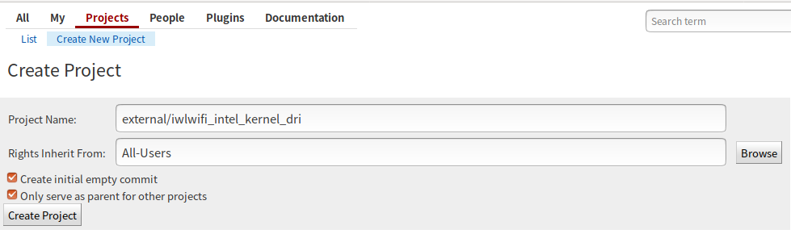
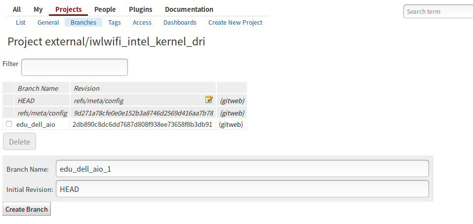

## 1. 说明

intel 直接给了一个 android 下 iwlwifi 的工程， 将这个工程 直接融合到我们的 phoenixos中即可。


## 2. 融合

### 2.1 新建dir

在 phoenixos 的 external 中新建一个目录起名叫 iwlwifi-intel-kernel-dri

```shell
~/phoenixos_edu/external$ mkdir iwlwifi_intel_kernel_dri
```

### 2.2 建立仓库

#### 1. 参照

在远端服务器中，建立一个新的仓库。此时可以参照  CZnetworkSupportLib 进行建立

```shell
packages/apps/CZnetworkSupportLib
```


```xml
<--! ~/phoenixos_edu/.repo/manifests$ vim default.xml -->
    
    
    <project path="packages/apps/CZnetworkSupportLib" name="CZnetworkSupportLib" remote="phoenix" revision="marshmallow-phoenix" /> 
    
    <--! revision = "分支"   remote="github"-->
```

从上面这个 这个我们可以知道  

- 本地所对应的目录：path="packages/apps/CZnetworkSupportLib"
- 远端对应的工程名字：  name="CZnetworkSupportLib"
- git remote -v 所显示的  phoenix
- 对应的仓库的分支为： revision="marshmallow-phoenix"

#### 2. 建立远端仓库

根据 1. 参照, 这里我们可知道，我们最终所期望的是

1. 修改 .repo 中的内容，并提交

```xml
    <project path="external/iwlwifi_intel_kernel_dri" name="external/iwlwifi_intel_kernel_dri" remote="phoenix" revision="edu_dell_aio" /> 
```

**分支为: edu_dell_aio**

2. 在服务器端 创建 external/iwlwifi_intel_kernel_dri 仓库

http://gerrit.chaozhuo.org/#/admin/create-project/



3. 在服务端创建 edu_dell_aio 分支



图中的是  创建 edu_dell_aio_1  ， 此时应该创建的是 edu_dell_aio 分支 ， 这里只是 说明

4. 同步项目：

```shell
repo forall -c git reset --hard

repo init -u ssh://caobinxin@192.168.1.112:29418/x86manifest -b edu_dell_aio

repo sync -c -j8
```

此时已经同步下来了。

### 2.3 code

将intel 给的代码，复制到 这个目录下面

### 2.4 修改 Android.mk

#### 1. 预备知识

```shell
1. Android.mk可以完全 根据 Makefile 的语法去写， 没有必要用Android.mk的语法 (1. include $(CLEAR_VARS) include $(BUILD_PACKAGE)  ) 去写。

2. 然后根据依赖去调试
```

我们的目标是编译 iwlwifi

现在就来调试Makefile

1. 同步代码时所需要的变量

```shell
INTEL_IWL_OUT_DIR=/home/colby/phoenixos_edu/out/target/product/x86_64/iwlwifi

INTEL_IWL_SRC_FILES= 当前目录中所有的文件

INTEL_IWL_SRC_DIR=external/iwlwifi_intel_kernel_dri
```

```makefile
# 当前目录中所有的文件
INTEL_IWL_SRC_FILES := $(shell find $(INTEL_IWL_SRC_DIR) -path $(INTEL_IWL_SRC_DIR)/.git  -prune  -o  -print)
```

翻译过来就是

```shell
find external/iwlwifi_intel_kernel_dri -path external/iwlwifi_intel_kernel_dri/.git -prune -o -print
```

这句的含义就是 在当前目录下搜索 external/iwlwifi_intel_kernel_dri 除了他下面的.git 目录之外的其他文件目录都打印出来


```shell
rsync -rt --del $(INTEL_IWL_SRC_DIR)/ $(INTEL_IWL_OUT_DIR)

# 将 external 中的code 同步到 out 目录下
rsync -rt --del external/iwlwifi_intel_kernel_dri/    /home/colby/phoenixos_edu/out/target/product/x86_64/iwlwifi
```

2. 配置code 所需的变量打印

```makefile
@$(MAKE) -C $(INTEL_IWL_OUT_DIR)/ ARCH=$(TARGET_ARCH) CROSS_COMPILE=$(CROSS_COMPILE_VALUE) KLIB_BUILD=$(KERNEL_OUT_ABS_DIR) defconfig-$(INTEL_IWL_BOARD_CONFIG)

# make 先进入(-c)  /home/colby/phoenixos_edu/out/target/product/x86_64/iwlwifi 目录中  执行 make defconfig-iwlwifi

# ARCH=x86_64

# CROSS_COMPILE="/home/colby/sd_480/edu_tec_x4/prebuilts/gcc/linux-x86/host/x86_64-linux-glibc2.15-4.8/bin/x86_64-linux-"

# KLIB_BUILD="/home/colby/phoenixos_edu/out/target/product/x86_64/obj/kernel"
```


3. 编译code 需要的答应如下：

```makefile
$(MAKE) -C $(INTEL_IWL_OUT_DIR)/ ARCH=$(TARGET_ARCH) CROSS_COMPILE=$(CROSS_COMPILE_VALUE) KLIB_BUILD=$(KERNEL_OUT_ABS_DIR)

# 和 2. 配置中的保持一致即可
```

4. 将*.ko 安装到指定的目录下面：

```shell
$(MAKE) -C $(KERNEL_OUT_ABS_DIR) ARCH=$(TARGET_ARCH) M=$(INTEL_IWL_OUT_DIR)/ INSTALL_MOD_DIR=$(INTEL_IWL_COMPAT_INSTALL_DIR) INSTALL_MOD_PATH=$(INTEL_IWL_COMPAT_INSTALL_PATH) $(INTEL_IWL_INSTALL_MOD_STRIP) modules_install
```


安装上面的格式，进行对应的打印即可


打印如下：

```shell
# 第一步同步code
colby ----1----- start
rsync -rt --del external/iwlwifi_intel_kernel_dri/ /home/colby/phoenixos_edu/out/target/product/x86_64/iwlwifi
colby ----1----- end

# 第二步 配置code
colby ----2----- start
make -C /home/colby/phoenixos_edu/out/target/product/x86_64/iwlwifi/ ARCH=x86_64 CROSS_COMPILE="/home/colby/sd_480/edu_tec_x4/prebuilts/gcc/linux-x86/host/x86_64-linux-glibc2.15-4.8/bin/x86_64-linux-" KLIB_BUILD="/home/colby/phoenixos_edu/out/target/product/x86_64/obj/kernel" defconfig-iwlwifi
colby ----2----- end

# 第三步 make
colby ----3----- start
make -C /home/colby/phoenixos_edu/out/target/product/x86_64/iwlwifi/ ARCH=x86_64 CROSS_COMPILE="/home/colby/sd_480/edu_tec_x4/prebuilts/gcc/linux-x86/host/x86_64-linux-glibc2.15-4.8/bin/x86_64-linux-" KLIB_BUILD="/home/colby/phoenixos_edu/out/target/product/x86_64/obj/kernel"
colby ----3----- end


# 第4步 安转
colby ----4----- start
make -C "/home/colby/phoenixos_edu/out/target/product/x86_64/obj/kernel" ARCH=x86_64 M=/home/colby/phoenixos_edu/out/target/product/x86_64/iwlwifi/ INSTALL_MOD_DIR=kernel INSTALL_MOD_PATH=/home/colby/phoenixos_edu/out/target/product/x86_64/system  modules_install
colby ----4----- end
```


```shell
# 编译后的
out/target/product/x86_64/iwlwifi/drivers/net/wireless/intel/iwlwifi/iwlwifi.ko

# 最终安装的目录
out/target/product/x86_64/system/lib/modules/4.19.50-PhoenixOS-x86_64-ga835aa6065a9/kernel/drivers/net/wireless/intel/iwlwifi/iwlwifi.ko
# 在安装命令中 INSTALL_MOD_DIR=kernel  这个变量就是去指定，是否安转在kernel目录下。当然也可以安装在其他目录下面
```


#### 2. 修改变量的定义

在本项目中 在 Android.mk 中 有的变量是 我直接写死的。现在要做的就是 将那些写死的变量，用 变量去替换

这样，我们就完成我们的融合了。

现在将 写死的变量list出来：

```shell
CROSS_COMPILE_VALUE := "/home/colby/sd_480/edu_tec_x4/prebuilts/gcc/linux-x86/host/x86_64-linux-glibc2.15-4.8/bin/x86_64-linux-"

KERNEL_OUT_ABS_DIR := "/home/colby/phoenixos_edu/out/target/product/x86_64/obj/kernel"
```


这里的修改可以参照 phoenixos 编译 kernel 的命令：

```makefile
#phoenixos_edu/build/core$ vim tasks/kernel.mk +34


TARGET_KERNEL_ARCH ?= $(TARGET_ARCH) # TARGET_ARCH=x86_64

ifeq ($(TARGET_KERNEL_ARCH),x86_64)
CROSS_COMPILE ?= $(abspath prebuilts/gcc/linux-x86/host/x86_64-linux-glibc2.15-4.8/bin)/x86_64-linux-
else
CROSS_COMPILE ?= $(abspath $(TARGET_TOOLS_PREFIX))
endif

KBUILD_OUTPUT := $(abspath $(TARGET_OUT_INTERMEDIATES)/kernel)

mk_kernel := $(hide) $(MAKE) -C $(KERNEL_DIR) O=$(KBUILD_OUTPUT) ARCH=$(TARGET_ARCH) CROSS_COMPILE="$(abspath $(CC_WRAPPER)) $(CROSS_COMPILE)" $(if $(SHOW_COMMANDS),V=1)
```

我们可以将这里的 变量替换成 上面的

将 本项目的 

```shell
KERNEL_OUT_ABS_DIR:= $(abspath $(TARGET_OUT_INTERMEDIATES)/kernel)
# 居然编译通过了
```

将本项目的

```shell
CROSS_COMPILE_VALUE ?= $(abspath prebuilts/gcc/linux-x86/host/x86_64-linux-glibc2.15-4.8/bin)/x86_64-linux-
居然编译通过了
```

#### 3. 完整的Android.mk

```makefile
# including iwlwifi Android mk only if it was declared.
BOARD_USING_INTEL_IWL := true
INTEL_IWL_BOARD_CONFIG := iwlwifi
INTEL_IWL_USE_COMPAT_INSTALL := y
INTEL_IWL_COMPAT_INSTALL_PATH ?= $(ANDROID_BUILD_TOP)/$(TARGET_OUT)
INTEL_IWL_COMPAT_INSTALL_DIR := kernel

ifeq ($(BOARD_USING_INTEL_IWL),true)
# Run only this build if variant define the needed configuration
# e.g. Enabling iwlwifi for XMM6321
# BOARD_USING_INTEL_IWL := true      - this will enable iwlwifi building
# INTEL_IWL_BOARD_CONFIG := xmm6321  - the configuration, defconfig-xmm6321
# INTEL_IWL_USE_COMPAT_INSTALL := y  - this will use kernel modules installation
# INTEL_IWL_COMPAT_INSTALL_DIR := updates - the folder that the modules will be installed in
# INTEL_IWL_COMPAT_INSTALL_PATH ?= $(ANDROID_BUILD_TOP)/$(TARGET_OUT) - the install path for the modules
.PHONY: iwlwifi

INTEL_IWL_SRC_DIR := $(call my-dir)
INTEL_IWL_OUT_DIR := $(abspath $(PRODUCT_OUT)/iwlwifi)
INTEL_IWL_COMPAT_INSTALL_PATH ?= $(abspath $(TARGET_OUT))

TARGET_KERNEL_ARCH:=$(TARGET_ARCH)

ifeq ($(TARGET_KERNEL_ARCH),x86_64)
CROSS_COMPILE_VALUE ?= $(abspath prebuilts/gcc/linux-x86/host/x86_64-linux-glibc2.15-4.8/bin)/x86_64-linux-
else
CROSS_COMPILE_VALUE ?= $(abspath $(TARGET_TOOLS_PREFIX))
endif

ifeq ($(INTEL_IWL_USE_COMPAT_INSTALL),y)
INTEL_IWL_COMPAT_INSTALL := iwlwifi_install
INTEL_IWL_KERNEL_DEPEND := $(INSTALLED_KERNEL_TARGET)
else
# use system install
copy_modules_to_root: iwlwifi
ALL_KERNEL_MODULES += $(INTEL_IWL_OUT_DIR)
INTEL_IWL_KERNEL_DEPEND := build_bzImage
endif

ifeq ($(INTEL_IWL_USE_RM_MAC_CFG),y)
copy_modules_to_root: iwlwifi
INTEL_IWL_COMPAT_INSTALL_PATH := $(abspath $(KERNEL_OUT_MODINSTALL))
INTEL_IWL_KERNEL_DEPEND := modules_install
INTEL_IWL_RM_MAC_CFG_DEPEND := iwlwifi_rm_mac_cfg
INTEL_IWL_INSTALL_MOD_STRIP := INSTALL_MOD_STRIP=1
endif

# IWLWIFI_CONFIGURE is a rule to use a defconfig for iwlwifi
IWLWIFI_CONFIGURE := $(INTEL_IWL_OUT_DIR)/.config

KERNEL_OUT_ABS_DIR := $(abspath $(TARGET_OUT_INTERMEDIATES)/kernel)

iwlwifi: iwlwifi_build $(INTEL_IWL_COMPAT_INSTALL) $(INTEL_IWL_MOD_DEP)

INTEL_IWL_SRC_FILES := $(shell find $(INTEL_IWL_SRC_DIR) -path $(INTEL_IWL_SRC_DIR)/.git -prune -o -print)
$(INTEL_IWL_OUT_DIR): $(INTEL_IWL_SRC_FILES)
	@echo Syncing directory $(INTEL_IWL_SRC_DIR) to $(INTEL_IWL_OUT_DIR)
	@$(info rsync -rt --del $(INTEL_IWL_SRC_DIR)/ $(INTEL_IWL_OUT_DIR))
	@rsync -rt --del $(INTEL_IWL_SRC_DIR)/ $(INTEL_IWL_OUT_DIR)

#$(IWLWIFI_CONFIGURE): $(INTEL_IWL_KERNEL_DEPEND) $(INTEL_IWL_OUT_DIR)
$(IWLWIFI_CONFIGURE): $(INTEL_IWL_OUT_DIR)
	@echo Configuring kernel module iwlwifi with defconfig-$(INTEL_IWL_BOARD_CONFIG)
	@$(info make -C $(INTEL_IWL_OUT_DIR)/ ARCH=$(TARGET_ARCH) CROSS_COMPILE=$(CROSS_COMPILE_VALUE) KLIB_BUILD=$(KERNEL_OUT_ABS_DIR) defconfig-$(INTEL_IWL_BOARD_CONFIG))
	@$(MAKE) -C $(INTEL_IWL_OUT_DIR)/ ARCH=$(TARGET_ARCH) CROSS_COMPILE=$(CROSS_COMPILE_VALUE) KLIB_BUILD=$(KERNEL_OUT_ABS_DIR) defconfig-$(INTEL_IWL_BOARD_CONFIG)

iwlwifi_build: $(IWLWIFI_CONFIGURE)
	@$(info Building kernel module iwlwifi in $(INTEL_IWL_OUT_DIR))
	@$(info make -C $(INTEL_IWL_OUT_DIR)/ ARCH=$(TARGET_ARCH) CROSS_COMPILE=$(CROSS_COMPILE_VALUE) KLIB_BUILD=$(KERNEL_OUT_ABS_DIR))
	@$(MAKE) -C $(INTEL_IWL_OUT_DIR)/ ARCH=$(TARGET_ARCH) CROSS_COMPILE=$(CROSS_COMPILE_VALUE) KLIB_BUILD=$(KERNEL_OUT_ABS_DIR)

iwlwifi_install: iwlwifi_build $(INTEL_IWL_RM_MAC_CFG_DEPEND)
	@$(info Installing kernel modules in $(INTEL_IWL_COMPAT_INSTALL_PATH))
	@$(info make -C $(KERNEL_OUT_ABS_DIR) ARCH=$(TARGET_ARCH) M=$(INTEL_IWL_OUT_DIR)/ INSTALL_MOD_DIR=$(INTEL_IWL_COMPAT_INSTALL_DIR) INSTALL_MOD_PATH=$(INTEL_IWL_COMPAT_INSTALL_PATH) $(INTEL_IWL_INSTALL_MOD_STRIP) modules_install)
	@$(MAKE) -C $(KERNEL_OUT_ABS_DIR) ARCH=$(TARGET_ARCH) M=$(INTEL_IWL_OUT_DIR)/ INSTALL_MOD_DIR=$(INTEL_IWL_COMPAT_INSTALL_DIR) INSTALL_MOD_PATH=$(INTEL_IWL_COMPAT_INSTALL_PATH) $(INTEL_IWL_INSTALL_MOD_STRIP) modules_install

iwlwifi_rm_mac_cfg: iwlwifi_build
	$(info Remove kernel cfg80211.ko and mac80211.ko)
	@find $(KERNEL_OUT_MODINSTALL)/lib/modules/ -name "mac80211.ko" | xargs rm -f
	@find $(KERNEL_OUT_MODINSTALL)/lib/modules/ -name "cfg80211.ko" | xargs rm -f

.PHONY: iwlwifi_clean
iwlwifi_clean:
	rm -rf $(INTEL_IWL_OUT_DIR)

endif
```

### 2.5 何时编译iwlwifi？

#### 1. 思路

到这里，我们的phoenixos系统就可以编译这个新的驱动了。

在实际打包时，我们发现 在执行 make iso_img 命令时，   会将 kernel 中的ko 重新安转的。这样就把我们编译出来的 iwlwifi.ko给覆盖了。 我们能不能在  安装 kernel 的ko 后，在去编译 iwlwifi 这个目标呢？

答案当然是可以的。

既然安装模块， 就会使用  INSTALL_MOD_PATH 变量。它就是我们的切入点。

```shell
~/phoenixos_edu/build/core/tasks$ grep -inR "INSTALL_MOD_PATH"

kernel.mk:57:	$(if $(FIRMWARE_ENABLED),$(mk_kernel) INSTALL_MOD_PATH=$(abspath $(TARGET_OUT)) firmware_install)

kernel.mk:71:	$(mk_kernel) INSTALL_MOD_PATH=$(abspath $(TARGET_OUT)) modules_install

kernel.mk:74:		$(subst $(hide),,$(mk_kernel)) INSTALL_MOD_PATH=$(abspath $(TARGET_OUT)) M=$(abspath $(TARGET_OUT_INTERMEDIATES))/kmodule/$${kmod} modules_install ; \

```


通过调试发现 我们的 make iso_img 最终会调用到这里

```makefile
# kernel.mk
$(BUILT_SYSTEMIMAGE): $(KERNEL_MODULES_DEP)
```

这里的思路是 先执行 target:  KERNEL_MODULES_DEP 然后在 执行 target: iwlwifi 相关的编译

```makefile
iwlwifi:  $(KERNEL_MODULES_DEP)

$(BUILT_SYSTEMIMAGE): iwlwifi
```


```shell
KERNEL_MODULES_DEP=out/target/product/x86_64/system/lib/modules/4.19.50-PhoenixOS-x86_64-ga835aa6065a9/modules.dep
```


```makefile
# core/tasks/kernel.mk
KERNEL_MODULES_DEP := $(firstword $(wildcard $(TARGET_OUT)/lib/modules/*/modules.dep))
```


#### 2. 修改 编译系统


将 sysimg.img 大小变大：

```makefile
#hp-4.19/device$ vim generic/common/BoardConfig.mk +15
ifeq ($(TARGET_PRODUCT),android_x86_64)
# 64bit 2100M                                                                                                                                                                                                      
BOARD_SYSTEMIMAGE_PARTITION_SIZE = $(if $(MKSQUASHFS),0,2202009600)
else
# def=1536Mb  now=1700Mb
BOARD_SYSTEMIMAGE_PARTITION_SIZE = $(if $(MKSQUASHFS),0,1782579200)
endif
```


修改依赖

```diff
diff --git a/core/tasks/kernel.mk b/core/tasks/kernel.mk
index 45a8da70d..5618a680d 100644
--- a/core/tasks/kernel.mk
+++ b/core/tasks/kernel.mk
@@ -76,7 +76,9 @@ $(KERNEL_MODULES_DEP): $(BUILT_KERNEL_TARGET) $(ALL_EXTRA_MODULES)
        $(hide) rm -f $(TARGET_OUT)/lib/modules/*/{build,source}
 endif
 
-$(BUILT_SYSTEMIMAGE): $(KERNEL_MODULES_DEP)
+#$(BUILT_SYSTEMIMAGE): $(KERNEL_MODULES_DEP)
+#iwlwifi:$(KERNEL_MODULES_DEP) - at external/iwlwifi_intel_kernel_dri/Android.mk
+$(BUILT_SYSTEMIMAGE): iwlwifi
 
 ## rules to get source of Broadcom 802.11a/b/g/n hybrid device driver
 ## based on broadcomsetup.sh of Kyle Evans
```

```shell
~/phoenixos_edu/build/core/tasks$ 

git checkout -b edu_dell_aio

git push --set-upstream phoenix edu_dell_aio

# 在repo 中修改

git commit -sm "[phoenix] branch: build->edu_dell_aio"

<project path="build" name="x86/platform/build" groups="pdk" remote="phoenix" revision="edu_dell_aio" >
```

