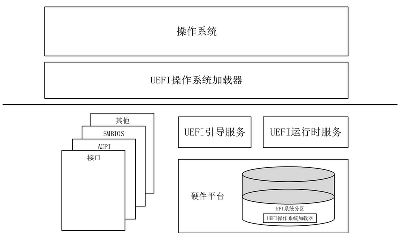
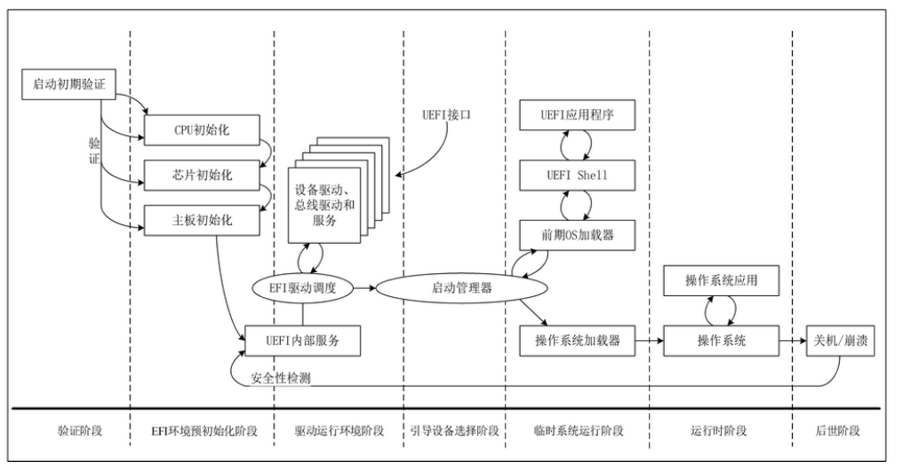

# UEFI与BIOS概述                     

## 1.1　UEFI与BIOS的结构组成

BIOS 是一组固化在计算机ROM里的程序代码，其主要功能就是在计算机上电时对硬件进行初始化配置，并将硬件操作封装为BIOS中断服务。这样，各种硬件间的差异便由BIOS负责维护，程序直接调用BIOS中断服务即可实现对硬件的控制。

BIOS的主要组成部分：

- 加电自检程序，在开机时负责检测硬件设备是否正常工作
- 系统初始化程序，其中包括硬件设备的初始化以及创建BIOS中断向量
- 适配外围即插即用设备
- CMOS设置程序，负责读写保护在CMOS中的系统设备信息

UEFI规范描述了操作系统和平台固件之间的接口，其目的是为操作系统和平台固件定义一种通信方法。

1. UEFI规范仅仅提供操作系统引导过程所需的信息。想达到的目标是： 在不需要对平台或者是操作系统进行深入的定制便可以在处理器规范兼容的平台上运行操作系统。
2. UEFI规范还允许平台引入创新的特性和功能，在无需为OS引导程序重新编程的情况下增强平台功能。
3. UEFI规范适用于从移动系统到服务器的各种硬件平台，并允许原始设备制造商具有最大的扩展性和定制能力，以实现差异化。

**UEFI接口的表现形式是数据表**,其中包括与平台相关的信息，以及操作系统加载器和操作系统可使用的引导服务和运行时服务。它们一起为启动操作系统提供了一个标准环境。UEFI规范设计为纯接口规范。因此，UEFI规范定义了平台固件必须实现的一组接口和结构。以下是UEFI设计的基本要素：

UEFI设计的基本要素:

- 重用现有的接口表。为了让操作系统和固件中的代码可以在现有设计结构中持续使用。凡是兼容UEFI规范的处理器平台都必须遵照UEFI规范进行实现。
- 系统分区。系统分区定义了一个独立的，可共享的分区和文件系统，这个系统分区可允许多个供应商之间安全共享数据，即使这些供应商出于不同目的去访问系统分区。
- 引导服务。引导服务提供了在启动期间可以使用的设备和系统功能的接口。设备的访问是通过句柄Handle和协议Protocol抽象出来的。UEFI通过将基础实现隔离在规范之外，以避免给设备的访问者带来负担，进而促进现有BIOS代码的重用。
- 运行时服务。运行时服务为操作系统提供了正常运行期间可以使用的基础平台硬件资源的接口。

图1描绘了UEFI的整体结构，以及UEFI、平台固件、操作系统三者之间的关系。UEFI自带引导管理器，平台固件通过引导管理器可以从UEFI定义的系统分区中加载任何文件，也可以通过UEFI定义的镜像加载服务来加载文件。UEFI规范提供了各种海量存储设备类型，包括：磁盘、CD-ROM和DVD，以及通过网络进行远程引导。而且，平台固件借助扩展协议接口可以添加其他引导媒体类型。UEFI还定义了NVRAM变量来记录加载的文件，这些变量包含传递给应用程序的数据，以及可以在菜单中显示给用户的字符串。

一旦启动，操作系统加载程序便会继续完成操作系统的引导工作。为此，他可以使用UEFI的引导服务和接口来初始化各种平台组件和系统管理软件。在引导阶段，UEFI的运行时服务也可供操作系统加载程序使用。

## 1.2 BIOS 和 UEFI的启动流程

### 1.2.1 BIOS的启动流程：

在系统上电后， CPU运行在实模式的工作模式下，数据位宽为16位。最大的物理地址寻址范围是0~1MB, 其中的物理地址 0x0c 0000 ~ 0xF FFFF保留给BISO使用。开机后，CPU首先跳转到物理地址0x0F FFF0处 执行程序。一般情况下，这里是一条跳转指令，CPU通过执行此处的跳转指令跳转到真正的BIOS入口地址处执行，一下是BIOS的启动流程：

1. BIOS代码首先做的是 POST (Power on Self Test, 加电自检)操作，主要是检测关键设备是否正常工作，设备设置是否和CMOS中设置的一致。如果发现硬件错误，则通过喇叭报警。
2. 初始化显示设备并显示显卡的信息，接着初始化其他的设备。
3. 检测CPU和内存并显示检测的结果。
4. 检测标准设备，例如硬盘、光驱、串口设备、并口设备等
5. 检测即插即用设备，并为这些设备分配中断号、I/O端口和DMA通道等资源。
6. 如果硬件配置发生变化，那么这些变化的配置将更新到CMOS中。
7. 根据配置的启动顺序引导设备的启动，通过BIOS中断将设备的引导程序读入内存。
8. 将处理器的控制权交给引导程序，最终引导进入操作系统。

### 1.2.2 UEFI的启动流程

在UEFI设计之初，开发人员思考过BIOS存在的诸多问题并最终提出了解决方案，因此UEFI的基础框架比BIOS更加的丰富。UEFI固件不仅可以识别磁盘，它也知道操作系统加载器在磁盘分区中的路径。**并且，当UEFI固件启动完毕后，CPU会运行在保护模式或者IA-32e模式而非实模式.**

UEFI的启动流程见下图：

如图ＵＥＦＩ的启动流程大致可以分为７个阶段，接下来将对图中各个阶段的功能和作用逐一进行介绍。

1. 验证阶段(Security, SEC).系统上电后，CPU开始执行第一条指令，此时系统就进入了ＳＥＣ阶段。这个阶段的内存尚未被初始化，不可使用。所以，ＳＥＣ阶段最主要的工作是建立一些临时内存并将CPU切换到保护模式，这里提到的临时内存可以是处理器的缓存，也可以是系统的物理内存。
2. ＥＦＩ环境预初始化阶段(Pre-EFI Initialization Environment, PEI).PEI阶段最主要的工作就是对内存、CPU以及芯片组等关键设备进行初始化。由于这部分代码没有进行压缩，因此代码必须越精简越好。而且，在PEI阶段还要确定操作系统的引导路径，初始化UEFI驱动和固件需要的内存。
3. 驱动运行环境阶段(Driver Execution Environment, DXE).DXE是EFI最重要的阶段，大部分的驱动、固件加载工作都是在这个阶段完成的。
4. 引导设备选择阶段(Boot Device Select, BDS). BDS阶段的主要工作是初始化控制台设备的环境变量，尝试加载环境变量列表中记录的驱动，并尝试从环境变量列表中记录的启动设备中启动。
5. 临时系统运行阶段（Transient System Load, TSL）.这个阶段将进入UEFI的临时shell系统环境。
6. 运行时阶段(RunTimer, RT).当操作系统调用EFI_BOOT_SERVICES.ExitBootServices服务后，系统进入RT阶段。此时，DXE于引导服务都将销毁，只有EFI运行时服务和EFI系统表可以继续使用。
7. 后市阶段(After Life, AL).当操作系统调用　EFI_RUNTIME_SERVICES.ResetSystem 服务或者调用　ACPI Sleep State, 系统进入ＡＬ阶段。触发异步事件(比如：　SMI、NMI)也可使系统进入AL阶段，这在服务器和工作站中比较常见。

UEFI允许通过加载UEFI驱动程序和UEFI应用程序镜像来扩展平台固件。当UEFI驱动程序和UEFI应用程序加载时，他们可以访问所有UEFI定义的引导服务和运行时服务。UEFI还允许将操作系统加载程序和平台固件中的引导菜单合并为单个平台固件菜单。这些平台固件菜单可以从UEFI引导服务支持的任何引导介质上的任何分区中选择任何UEFI操作系统加载程序执行。

UEFI操作系统加载程序可以支持多个选项，这些选项都可以显示在用户界面中。他还可以包括传统的启动选项。UEFI支持从包含UEFI操作系统加载器或UEFI定义的系统分区的媒介中启动。UEFI要求可引导的块设备必须包含有一个ESP( EFI  System Partition)系统分区。UEFI不需要对ESP 系统分区的第一个扇区进行任何更改，因此可以在引导媒介中同时引导传统体系结构和UEFI平台。

## 1.3 UEFI取代BIOS的原因：

随着时间的推移，曾经作为先进固件程序的BIOS已经无法再满足硬件高速发展的需求了。

### 1.3.1 BIOS的缺点：

随着CPU及其他硬件设备的革新，BIOS逐渐成为计算机系统发展的瓶颈，主要体现在如下几个方面：

1. 开发效率低：大部分BIOS代码使用汇编语言开发，开发效率不言而喻。汇编开发的另外一个缺点是使得代码和设备的耦合度太高，代码受硬件变化的影响大。
2. 性能差：BIOS作为基本的输入输出服务需要通过中断来完成，开销大，并且BIOS没有提供异步的工作模式，大量的时间消耗在等待上。
3. 功能扩展性差，升级缓慢：BIOS代码采用静态链接，增加硬件功能时，必须将16位代码放置在0x0c 0000 ~ 0x0D FFFF 之间，初始化时将其设置为约定的中断处理程序。而且BIOS没有提供动态加载设备驱动的方案。
4. 安全性：BIOS运行过程中对可执行代码没有安全方面的考虑。
5. 不支持从硬盘2TB以上的地址空间引导：受限于BIOS硬盘的寻址方式，BIOS硬盘采用32位地址，因而引导扇区的最大逻辑地址是　2^32 (换算成字节地址即，　2^32 x 512B = 2TB).

### 1.3.2 UEFI的优点:

UEFI 能够迅速取代BIOS成为主流计算机系统固件，正是因为BIOS的缺陷已经严重制约了计算机系统的发展，以下罗列了UEFI的主要优点：

1. UEFI的开发效率：BIOS开发一般采用汇编语言，代码大多数和硬件控制相关。而在UEFI中，绝大部分代码采用c语言编写，UEFI应用程序和驱动甚至可以使用C++编写。UEFI通过固件-操作系统接口(引导服务和运行时服务)为操作系统和操作系统加载器屏蔽了底层硬件细节，使得UEFI上层应用可以方便重用。
2. UEFI系统的可扩展性：UEFI系统的可扩展性体现在两个方面：一个是驱动的模块化设计；二是软硬件升级的兼容性。大部分硬件的初始化通过UEFI驱动实现。每个驱动是一个独立的模块，可以包含在固件中，也可以放在设备上，运行时根据需要动态加载。UEFI中的每个表和协议(包括驱动)都有版本号，这使得系统升级过程更加简单、平滑。
3. UEFI系统的性能：相比BIOS，UEFI有了很大的性能提升，从启动到进入操作系统的时间大大缩短。性能的提高源于一下几个方面：

- UEFI提供了异步操作。基于事件的异步操作，提高了CPU利用率，减少了总的等待时间。
- UEFI舍弃了中断这种比较耗时的操作外部设备的方式，仅仅保留了时钟中断。外部设备的操作采用　“事件 + 异步操作”　完成。
- 可伸缩的设备遍历方式，启动时可以仅仅遍历启动所需的设备，进而加速系统启动。
- UEFI系统的安全性：UEFI的一个重要突破就是其安全方面的考虑。当系统的安全启动功能被打开后，UEFI在执行应用程序和驱动前会去检测程序和驱动证书，仅当证书被信任时才会执行这个应用程序或者驱动。UEFI应用程序和驱动采用PE/COFF格式，其签名放在签名块中。

