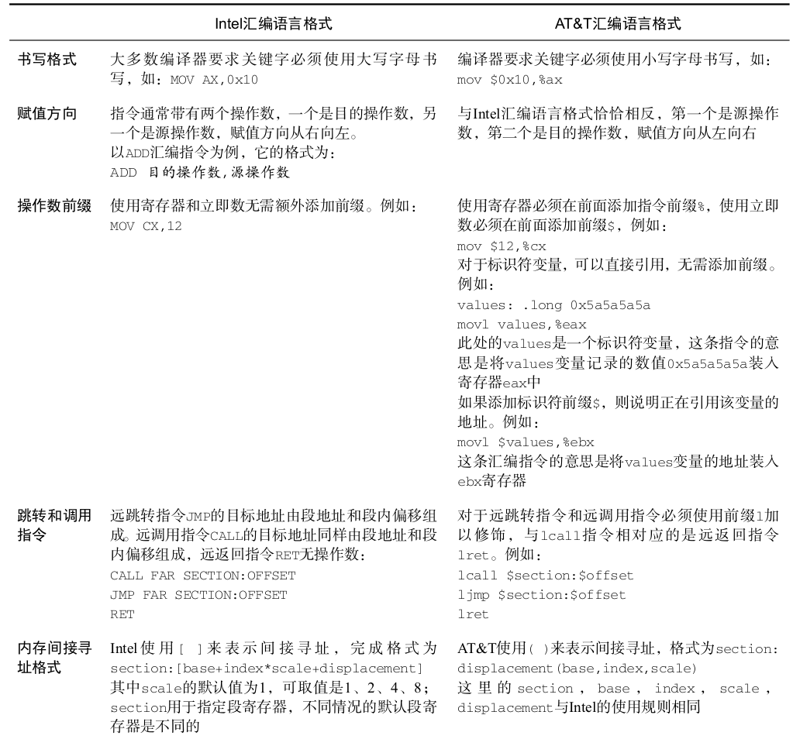
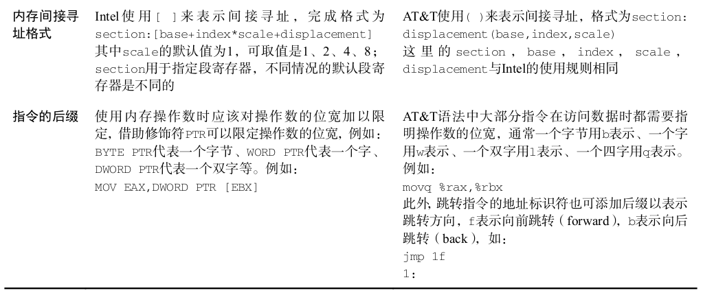

汇编

# 1. 基础

两类：

1. AT&T汇编语言格式: GNU的GAS编译器
2. Intel汇编语言格式: MASM编译器、NASM编译器和YASM编译器

使用的场景：

1.  BootLoader Intel格式的汇编语言编写,使用NASM编译器进行编译;
2.  内核与应用程序将采用AT&T格式的汇编语言编写,使用GNU的GAS编译器进行编译;

 



# 2. NASM 编译器

## 2.1 [ ]

在NASM编译器中,如果直接引用变量名或者标识符,则被编译器认为正在引用该变量的地址。
如果希望访问变量里的数据,则必须使用符号[]。如果这样不太容易记忆,那么可以把它想象成C语言
里的数组,数组名代表数组的起始地址,当为数组名加上符号[ ]后,就表示正在引用数组的元素。

## 2.2 $

符号 $ 在NASM编译器中代表当前行被编译后的地址。这么说好像不太容易理解,那么请看下面
这行代码:

### 2.2.1 jmp $

这条汇编指令的功能是死循环,将它翻译成十六进制机器码是E9 FD FF。其中,机器码E9的意思是跳
转,而机器码FD FF用于确定跳转的目标地址,由于x86处理器是以小端模式保存数据的,所以机器码
转换为地址偏移值是0xfffd,即十进制数-3。从机器码E9可知,这个 JMP 指令完成的动作是相对跳转,
跳转的目标地址是在当前指令地址减3处,这条指令的长度为3个字节,所以处理器又回到这条指令处
重新执行。符号 $ 在上述过程中指的是机器码E9之前的位置。

## 2.3 $

明白了符号 $ ,那么,符号 $$ 又是什么意思呢?其实,它代表一个Section(节)起始处被编译后
的地址,也就是这个节的起始地址。编写小段的汇编程序时,通常使用一个Section即可,只有在编写
复杂程序时,才会用到多个Section。Section既可以是数据段,也可以是代码段。不能把Section比喻成
函数,这是不恰当的。

### 2.3.1 $-$

在编写代码的过程中,时常使用代码 $-$$ ,它表示本行程序距离Section起始处的偏移。如果
只有一个节,它便表示本行程序距离程序起始处的距离。在第3章中,我们会把它与关键字
times 联合使用,来计算将要填充的数据长度,示例代码如下:
times 512 - ($ - $$) db 0

# 3. 汇编调c

## 3.1 反汇编

```c
int test()
{
int i = 0;
i = 1 + 2;
return i;
}
int main()
{
test();
return 0;
}
```

建议主函数的返回值使用
int 类型,而不要使用 void 或者其他类型。虽然主函数执行到 return 0 以后就跟我们没有关系了,
但在回收进程的过程中可能要求主函数要有返回值,或者某些场合会用到主函数的返回值。考虑到上
述原因,请读者尽量使用 int 类型,如果处于某种特殊的、可预测的环境,则无需遵照此条建议。

```shell
gcc demo0.c
objdump -d a.out
```


```shell
00000000000005fa <test>:
 5fa:   55                      push   %rbp
 5fb:   48 89 e5                mov    %rsp,%rbp
 5fe:   c7 45 fc 00 00 00 00    movl   $0x0,-0x4(%rbp)
 605:   83 45 fc 02             addl   $0x2,-0x4(%rbp)
 609:   8b 45 fc                mov    -0x4(%rbp),%eax
 60c:   5d                      pop    %rbp
 60d:   c3                      retq   

000000000000060e <main>:
 60e:   55                      push   %rbp
 60f:   48 89 e5                mov    %rsp,%rbp
 612:   b8 00 00 00 00          mov    $0x0,%eax
 617:   e8 de ff ff ff          callq  5fa <test>　#这里是指跳转到　5fa地址处
 61c:   b8 00 00 00 00          mov    $0x0,%eax
 621:   5d                      pop    %rbp
 622:   c3                      retq   
 623:   66 2e 0f 1f 84 00 00    nopw   %cs:0x0(%rax,%rax,1)
 62a:   00 00 00 
 62d:   0f 1f 00                nopl   (%rax)                
```

000000000000060e <main>:是程序的主函数 main ,函数名前面的十六进制数
000000000000060e 是函数的起始地址,每个数字占4位宽度共16个数字,这也间接说明该程序运行
在16×4 = 64位地址宽度下。

1. 乍一看,有好多个 % 符号。还记得2.2.1节里讲的AT&T汇编语法格式吗?这就是引用寄存器时必须
   在前面添加的符号前缀。还有一些汇编指令加入了后缀字母 l 和 q ,字母 l 表示操作数的位宽是32位(一
   个双字),字母 q 表示操作数的位宽是64位(一个四字)。

2. 在x86中一个字是16位(两个字节)，而在arm中一个字是32位(四个字节)。

3. 这段汇编中，使用的是AT&T汇编语法格式，所以　cmd 源, 目标

4. 如果在看到汇编中有　代码 leaveq 等效于 movq %rbp, %rsp; popq %rbp; 　相当是一个退栈的过程。

### 3.1.1 CALL指令

CALL指令可以被　JMP, RET指令取代

1. 被JMP取代的例子

CALL 指令会把其后的那条指令的地址压入栈中,作为
调用的返回地址,也就是代码中的 61c 地址处,随后再跳转至 test 函数里执行,而
JMP 指令却不会把返回地址 61c 压入栈中。一旦 test 函数执行完毕,便会执行代码
retq 把栈中的返回地址弹出到RIP寄存器中,进而返回到主函数 main 中继续执行。由于 JMP 指令没有
返回地址入栈的操作,通过以下伪代码即可替代 CALL 指令:

```shell
pushq $0x000000000000061c
jmpq 00000000000005fa <test>
```

2. 被RET指令取代的例子：

CALL 指令还可以被 RET 指令所取代,在执行 RET 指令时,该指令会弹出栈中保存的返回地址,并
从返回地址处继续执行。根据 RET 指令的执行动作,可先将返回地址 61c 压入栈中,
再把 test 函数的入口地址 5fa 压入栈中,此时跳转地址和返回地址均已存入栈中,
紧接着执行 RET 指令,以调用返回的形式从主函数 main “返回”到 test 函数。以下是 RET 指令取代 CALL
指令的伪代码:

```shell
pushq $0x00000000000061c
pushq $0x0000000000005fa
retq
```

# 4. 函数的调用约定

函数的调用约定描述了执行函数时返回地址和参数的出入栈规律。不同公司开发的C语言编译器
都有各自的函数调用约定,而且这些调用约定的差异性很大。随着IBM兼容机对市场进行洗牌后,微
软操作系统和编程工具占据了统治地位。除微软之外,仍有零星的几家公司和开源项目GNU C在维护
自己的调用约定。下面将介绍几款比较流行的函数调用约定。

## 4.1 stdcall调用约定

**1.** 在调用函数时,参数将按照从右向左的顺序依次压入栈中,例如下面的 function 函数,其
参数入栈顺序依次是 second 、 first :
int function(int first,int second)
**2.** 函数的栈平衡操作(参数出栈操作)是由**被调用函数完成的**。通过代码 retn x 可在函数返
回时从栈中弹出 x 字节的数据。当CPU执行 RET 指令时,处理器会自动将栈指针寄存器ESP
向上移动 x 个字节,来模拟栈的弹出操作。例如上面的 function 函数,当 function 函数返
回时,它会执行该指令把参数 second 和 first 从栈中弹出来,再到返回地址处继续执行。
**3.** 在函数的编译过程中,编译器会在函数名前用下划线修饰,其后用符号 @ 修饰,并加上入栈
的字节数,因此函数 function 最终会被编译为 _function@8 。

## 4.2 cdecl 调用约定

1. cdecl调用约定的参数压栈顺序与stdcall相同,皆是按照从右向左的顺序将参数压入栈中
2. 函数的栈平衡操作是由调用函数完成的,这点与stdcall恰恰相反。stdcall调用约定使用代码 retn x 平衡栈,而cdecl调用约定则通常会借助代码 leave 、 pop 或向上移动栈指针等方法来
   平衡栈。
3. 每个函数调用者都含有平衡栈的代码,因此编译生成的可执行文件会较stdcall调用约定生成
   的文件大。
   cdecl是GNU C编译器的默认调用约定。但GNU C在64位系统环境下,却使用寄存器作为函
   数参数的传递方式。函数调用者按照从左向右的顺序依次将前6个整型参数放在通用寄存器
   RDI、RSI、RDX、RCX、R8和R9中;同时,寄存器XMM0~XMM7用来保存浮点变量,而
   RAX寄存器则用于保存函数的返回值,函数调用者负责平衡栈。

## 4.3 fastcall调用约定

1. fastcall调用约定要求函数参数尽可能使用通用寄存器ECX和EDX来传递参数,通常是前两个
   int 类型的参数或较小的参数,剩余参数再按照从右向左的顺序逐个压入栈中
2. 函数的栈平衡操作由被调用函数负责完成


# 5. 函数的参数传递

## 5.1 寄存器传递方式：

此种传递方式的优点是
执行速度快,只有少数调用约定默认使用寄存器来传递参数的,而绝大部分编译器需要特殊指
定传递参数的寄存器 。
在基于x86体系结构的Linux内核中,**系统调用API一般会使用寄存器传递方式。因为,应用层空
间与内核层空间是相隔离的,若想从应用层把参数传递至内核层,最便捷的方法是通过寄存器
来携带参数**,否则就只能大费周折地在两个层之间搬运数据。更详细的解释会在第4章中给出。

## 5.2 内存传递方式：

在大多数情况下,函数参数都是以压栈方式传递到目标函数中的。
同在x86体系结构的Linux内核中,中断处理过程和异常处理过程都会使用内存传参方式。(从
Linux 2.6开始逐渐改为寄存器传递方式。)因为从中断/异常产生到调用相应的处理,这期间
的过渡代码全部由汇编语言编写。在汇编语言跳转至C语言函数的过程中,C语言函数使用栈
来传递参数,为了保证两种开发语言的无缝衔接,在汇编代码中必须把参数压入栈中,然后再
跳转到C语言实现的中断处理函数中执行。

**以上内容均是基于x86体系结构的参数传递方式。而在x64体系结构下,大多数编译器选择寄存器
传参方式。**

# 6. 细节

1. 在运行汇编器时，在命令行上使用-Cp 选项可以使所有关键字和标识符大小写敏感
2. 汇编器大量使用@符号作为预定义符号的前缀，因此应该尽量避免在自己定义的标识符中使用@符号作为首字符。
3. MASM中伪指令大小写不敏感，如.data .DATA 和 .Data是等价的
4. 汇编伪指令的一个重要功能就是定义程序的节(section)或者段(segment)。如.data伪指令标识了程序中包含变量的区域。　.code伪指令标识了程序中包含指令的区域。　.stack伪指令，标识了程序中包含运行时栈的区域，并设定了运行栈的大小。　.stack 100h