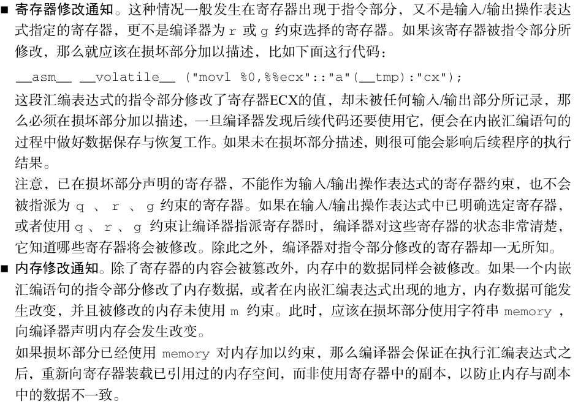
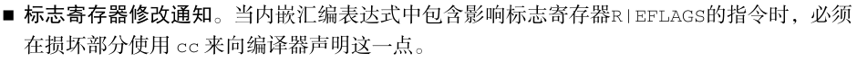
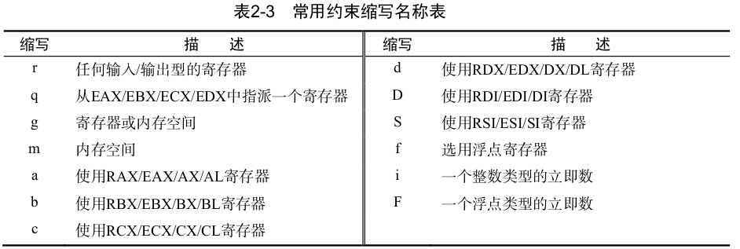

c 语言

# 1. GNU C 内嵌汇编语言

## 1.1 引子

GNU C语言提供了关键字 asm 来声明代码是内嵌的汇编语句,如下面这行代码:

```c
#define nop() __asm__ __volatile__ ("nop \n\t") // 空操作
```

从 nop 函数中可知,C语言使用关键字__asm__和__volatile__对汇编语句加以修饰,这两个关
键字在C语言内嵌汇编语句时经常使用。


### 1.1.1 __ __asm__ __ 宏：

__ asm __ ：用于申明这行代码是一个　内嵌汇编表达式，　他是关键字　asm的宏定义

```c
#define __asm__ asm
```

1. 任何内嵌的汇编表达式都以此关键字作为开头
2. 如果希望编写符合ANSI C标准的代码(即与ANSI C标准相兼容),那么建议使用关键字 __ asm __ 


### 1.1.2 __ volatile __ 关键字：

1. 其作用是告诉编译器此行代码不能被编译器优化,编译时保持代码原状。
2. 如果期望编写处符合ANSI C标准的程序(即与ANSI C标准兼容),那么建议使用关键字 __ volatile __ 。

## 1.2 内嵌汇编书写格式

### 1.2.1  内嵌汇编表达式

1. 为了在C语言内融入一段汇编代码片段,那就必须在每次嵌入汇编代码前做一番准备工作.
2. 嵌入前的准备工作主要负责确定寄存器的分配情况、与C程序的融合情况等细节,这些内容大部分需要在内嵌的汇编表达式中显式标明出来。


1. # **指令部分:输出部分:输入部分:损坏部分**


如果将内嵌汇编表达式当作函数,指令部分是函数中的代码,输入部分用于向函数传入参数,而输出部分则可以理解为函数的返回值。以下是这4部分功能的详细解释。

#### 1.2.1.1 指令部分：

指令部分是汇编代码本身,其书写格式与AT&T汇编语言程序的书写格式基本相同,但也存在些许不同之处。指令部分是内嵌汇编表达式的必填项,而其他部分视具体情况而定,如果不需要的话则可以直接忽略。在最简单的情况下,指令部分与常规汇编语句基本相同,如 nop 函数。

指令部分的编写规则要求是:当指令表达式中存在多条汇编代码时,可全部书写在一对双引号中;亦可将汇编代码放在多对双引号中。如果将所有指令编写在同一双引号中,那么相邻两条指令间必须使用分号( ; )或换行符( \n )分隔。如果使用换行符,通常在其后还会紧跟一个制表符( \t )。当汇编代码引用寄存器时,必须在寄存器名前**再添加一个 % 符,**以表示对寄存器的引用,例如代码 "movl $0x10,%%eax" 。

#### 1.2.1.2 输出部分：

1. 输出部分紧接在指令部分之后,这部分记录着指令部分的输出信息,其格式为:
   **“输出操作约束”(输出表达式),“输出操作约束”(输出表达式),......。**

2. 格式中的输出操作约束和输出表达式成对出现

3. 整个输出部分可包含多条输出信息,每条信息之间必须使用逗号 “,” 分隔开。

4. 括号内的输出表达式部分主要负责保存指令部分的执行结果。通常情况下,输出表达式是一
   个变量。
5. 双引号内的部分,被称为“输出操作约束”,也可简称为“输出约束”。
6. 输出约束部分必须使用等号“ = ”或加号“ + ”进行修饰。这两个符号的区别是,等号“ = ”意味着输出表达式是
   一个纯粹的输出操作,加号“ + ”意味着输出表达式既用于输出操作,又用于输入操作。不论是等号“ = ”还是加号“ + ”
   ,它们只能用在输出部分,不能出现在输入部分,而且是可读写的。
7. 关于输出约束的更多内容,将在“操作约束和修饰符”中进行补充。

#### 1.2.1.3 输入部分：

1. 输入部分记录着指令部分的输入信息,其格式为:
   “输入操作约束”(输入表达式),“输入操作约束”(输入表达式),......。
2. 格式中的输入操作约束与输入表达式同样要求成对出现,整个输入部分亦可包含多条输入信息,并用逗号 “,” 分隔开。在输入操作约束中**不允许使用等号 “ = ”和加号“ + ” ,因此输入部分是只读的。**

#### 1.2.1.4 损坏部分：

损坏部分描述了在指令部分执行的过程中,将被修改的寄存器、内存空间或标志寄存器,并且
这些修改部分并未在输出部分和输入部分出现过,格式为:
“损坏描述”,“损坏描述”,......。
如果需要声明多个寄存器,则必须使用逗号“,”将它们分隔开,这点与输入/输出部分一致。






#### 1.2.1.5 操作约束和修饰符

每个输入/输出表达式都必须指定自身的操作约束。操作约束的类型可以细分为寄存器约束、内存约束和立即数约束。在输出表达式中，还有限定寄存器操作的修饰符。

- 寄存器约束限定了表达式的载体是一个寄存器，这个寄存器可以明确指派，也可以模糊指派再由编译器自行分配。寄存器约束可使用寄存器的全名，也可以使用寄存器的缩写名称，如下所示：

```c
__asm__ __volatile__("movl %0, %%cr0": : "eax"(cr0));　// 这里的eax是一个具体寄存器 
__asm__ __volatilt__("movl %0, %%cr0": : "a"(cr0)); // 这里的 a　是指：使用RAX/EAX/AX/AL寄存器
```

如果使用寄存器的缩写名称，那么编译器会根据指令部分的汇编代码来确定寄存器的实际位宽。



- 内存约束限定了表达式的载体是一个内存空间，使用约束名m表示。例如一下内嵌汇编表达式：

```c
__asm__ __volatile__ ("sgdt %0" : "=m"(__gdt_addr)::);
__asm__ __volatile__ ("lgdt %0" : : "m"(__gdt_addr) : );
```

- 立即数约束　只能用于输入部分，它限定了表达式的载体是一个数值，如果不想借助任何寄存器或内存，那么可以使用立即数约束，比如下面的代码：

```c
__asm__ __volatile__ ("movl %0, %%ebx" : : "i" (50));
```

使用约束名i 限定输入表达式是一个　整数类型的立即数，如果希望限定输入表达式是一个浮点数类型的立即数，则使用约束名F. 立即数约束只能使用在输入部分。

- 修饰符　只可用在输出部分。　

修饰符都有：

1. =:
2. +:
3. &: 只能写在输出约束部分的第二个字符的位置上，即只能位于　= 　和　+ 之后，它告诉编译器不得为任何输入操作表达式分配该寄存器。因为编译器会在输入部分赋值前，先对&符号修饰的寄存器进行赋值，一旦后面的输入操作表达式向该寄存器赋值，将会造成输入和输出数据的混乱。

这里对& 进行补充说明：

​	只有在输入约束中使用过模糊约束(使用q、r或者g等约束缩写)时，　在输出约束中使用符号&修饰才有意义！如果所有输入操作表达式都明确指派了寄存器，那么输出约束再使用符号&就没有任何意义了。如果没有使用修饰符&,那就意味着编译器将先对输入部分进行赋值，当指令部分执行结束后，再对输出部分进行操作。

- 序号占位符：

  序号占位符是输入/输出操作约束的数值映射，每个内嵌汇编表达式最多只有10条输入/输出约束，这些约束按照书写顺序依次被映射为序号0~9。如果指令部分想引用序号占位符，必须使用百分号%前缀加以修饰，例如序号占位符%0对应第一个操作约束，序号占位符%1对应第2个操作约束，依次类推。指令部分为了区分序号占位符和寄存器，特使用两个百分号(%%)对寄存器加以修饰。在编译时，编译器会将每个占位符代表的表达式替换到相应的寄存器或者是内存中。

  指令部分在引用序号占位符时，可以根据需要指定操作位宽是字节或者是字，也可以指定操作的字节位置，即在%和序号占位符之间插入字母b表示操作最低字节，或插入字母h表示操作次低字节。

# 2. gun c语言对标准c的扩展

## 2.1 柔性数组

柔性数组、零长数组、变长数组　都是同一个概念。

```c
#include <stdlib.h>
#include <stdio.h>

typedef struct s
{   
    int n;
    int array[0];
} s_t;


void test_space(){
    s_t a; // 这里没有独自对　array开辟空间
    if( sizeof(a) == 4){
        printf("struct s 中的柔性数组array 如果不动态分配是不占空间的\n");
    }else
    {
        printf("struct s 中的柔性数组array 如果不动态分配是 占空间的！！！\n");
    }
}

void test_malloc(){
    int len = 16;
    s_t *a = malloc(sizeof(s_t) + sizeof(int [len]));
    a->n = len;

    a->array[15] = 15;
    printf("malloc size = %ld\n", sizeof(*a));// 这里居然打印的是4, 也就是说　sizeof居然检测不出来
    printf("array[15]　=　%d\n", a->array[15]);
}

int main(int argc, char const *argv[])
{
    
    test_malloc();
    return 0;
}
```

## 2.2 case:

扩展了case可以写成范围,例子如下：

```c
#include <stdio.h>


void test_1(){
    unsigned char buf[6]={0x00,0x07,0x11,0x60,0x61,0x66};
    
    for(int i=0;i<6;i++)
    switch(buf[i])
    {
        case 0x00 ... 0x10: printf("buf[%d] is 0x0 ~0x10\n",i);  break;
        case 0x11 ... 0x20: printf("buf[%d] is 0x11~0x20\n",i);  break;
        case 0x30 ... 0x60: printf("buf[%d] is 0x30~0x60\n",i);  break;
        case 0x61 ... 0xff: printf("buf[%d] is 0x61~0xff\n",i);  break;
    } 
}

void test_2(){
    char buf[6][6]={"0xff","0X02","0X1f","0xf1","0xa1","0Xb0"};

    for(int i=0;i<6;i++)
    if(buf[i][0]=='0'&&(buf[i][1]=='x' || buf[i][1]=='X'))    //匹配前缀
    {
        unsigned char val=0;
        int err=0; 
        for(int j=2;j<4;j++)
        switch(buf[i][j]) 
        {
            case '0' ... '9' :   val= val*16 + (buf[i][j]-'0'); break;
            case 'a' ... 'f' :   val= val*16 + (buf[i][j]-'a'+10); break;
            case 'A' ... 'F' :   val= val*16 + (buf[i][j]-'A'+10); break;
            default :  err =1;  break;
        }   

        if(!err)    
            printf("buf[%d]  = 0X%02X\n",i,val);
        else
            printf("buf[%d]  ERR \n",i); 
    }
    else
        printf("buf[%d]  ERR \n",i); 
}

int main(int argc, char const *argv[])
{
    test_2();

    return 0;
}

```


## 2.3 typeof

typeof关键字：

```c
typeof(x) // 可以取得变量x的数据类型，在编写宏定义的时候，关键字typeof经常会被派上用场。
```

```c
#include <stdio.h>


// (typeof(x)* == int*

#define READ_ONE(x) (*((typeof(x)*)(&x)))  
// READ_ONE这个宏是借鉴内核的　，这样在访问a这个变量的时候，可以保证每次都是从　内存中去哪的，而不是从寄存器中，这样就能确保正确性


int main(int argc, char const *argv[])
{
    int a = 100;
    a = READ_ONE(a);

    printf("a = %d\n", a);
    return 0;
}


/***
 * 
 * 这里附上　kernel 4.19.50　中的定义
*/

typedef __signed__ char __s8;
typedef unsigned char __u8;                                                                                                                                                                                        

typedef __signed__ short __s16;
typedef unsigned short __u16;

typedef __signed__ int __s32;
typedef unsigned int __u32;

typedef __signed__ long __s64;
typedef unsigned long __u64;


#define __READ_ONCE_SIZE \
({\
    switch (size) {\
    case 1: *(__u8 *)res = *(volatile __u8 *)p; break;\
    case 2: *(__u16 *)res = *(volatile __u16 *)p; break;\
    case 4: *(__u32 *)res = *(volatile __u32 *)p; break;\
    case 8: *(__u64 *)res = *(volatile __u64 *)p; break;\
    }\
}) 

static __always_inline 
void __read_once_size_nocheck(const volatile void *p, void *res, int size)
{
    __READ_ONCE_SIZE;
}

static __always_inline
void __read_once_size(const volatile void *p, void *res, int size)
{
    __READ_ONCE_SIZE;
}

#define __READ_ONCE(x, check)                       \
({                                  \
    union { typeof(x) __val; char __c[1]; } __u;            \
    __read_once_size(&(x), __u.__c, sizeof(x));     \
    __u.__val;                          \
})
#define READ_ONCE(x) __READ_ONCE(x, 1)


static __always_inline void __write_once_size(volatile void *p, void *res, int size)                                                                                                                           
{
    switch (size) {
    case 1: *(volatile __u8 *)p = *(__u8 *)res; break;
    case 2: *(volatile __u16 *)p = *(__u16 *)res; break;
    case 4: *(volatile __u32 *)p = *(__u32 *)res; break;
    case 8: *(volatile __u64 *)p = *(__u64 *)res; break;
    }
}


#define WRITE_ONCE(x, val) \
({                          \
    union { typeof(x) __val; char __c[1]; } __u =   \
        { .__val = (__force typeof(x)) (val) }; \
    __write_once_size(&(x), __u.__c, sizeof(x));    \
    __u.__val;                  \
})


/**
 *  kernel 4.14.15 中的
 * 
 * If possible use READ_ONCE()/WRITE_ONCE() instead.
 */
#define __ACCESS_ONCE(x) ({ \
     __maybe_unused typeof(x) __var = (__force typeof(x)) 0; \
    (volatile typeof(x) *)&(x); })
#define ACCESS_ONCE(x) (*__ACCESS_ONCE(x))


/**
 *  这里看到在kernel4.19中将这个变得好复杂，其实要实现的功能都是一样的
 * 
*/
```


## 2.4 可变参数宏

```c
#include <stdio.h>

// 当可变参数arg被忽略或者为空，printf函数中的 ##　操作将迫使预处理去掉它前面的那个逗号。
// 如果在调用宏函数时，确实提供了若干个可变参数，那么GNU C 会把这些可变参数放到逗号后面，使其能够正常工作。

#define pr_debug(fmt, arg...) \
    printf(fmt, ##arg);

int main(int argc, char const *argv[])
{
    pr_debug("caobinxin\n");
    pr_debug("ca%cb%cnxi%c\n", 'o', 'i', 'n');
    return 0;
}
```

## 2.5 元素编号

标准C语言规定数组和结构体必须按照固定顺序对成员(或元素)进行初始化赋值。GNU C语言
为使数组和结构体初始化更加自由,特意放宽了此限制,使得数组可以在初始化期间借助下标对某些
元素(元素可以是连续的或者不连续的)进行赋值,并在结构体初始化过程中允许使用成员名直接对
成员进行赋值。与此同时,GNU C语言还允许数组和结构体按照任意顺序对成员(或元素)进行初始
化赋值。以下是两者的初始化实例:

```c
#include <stdio.h>

#define MAX 56
unsigned char data[MAX] =
{
    [0]=10,
    [10 ... 50]=100,
    [55]=55,
};


struct demo
{
    int *a;
    int *aa;
    int *aaa;
    int *aaaa;
};

int main(int argc, char const *argv[])
{
    int b = 66;
    struct demo demo = {
        aa:&b,
        aaaa:&b,
        .aaa = &b,
        .a = &b
    };

    printf("%d %d %d %d\n", *demo.aa, *demo.a, *demo.aaa, *demo.aaaa);


    for(int i = 0; i < MAX; i++){
        printf("%d ", data[i]);
    }
    return 0;
}
```

## 2.6 当前的函数名

```c
#include <stdio.h>

int main(int argc, char const *argv[])
{
    printf("%s\n", __FUNCTION__);
    printf("%s\n", __func__);
    printf("%s\n", __PRETTY_FUNCTION__);
    return 0;
}

```

在C99标准中,只规定标识符 __　func__ 能够代表函数的名字,而 __　FUNCTION__ 虽被各类编译器
广泛支持,但只是 __　func__ 标识符的宏别名。

## 2.7 特殊属性声明

GNU C语言还允许使用特殊属性对函数、变量和类型加以修饰,以便对它们进行手工代码优化和
定 制 。 在 声 明 处 加 入 关 键 字 __　attribute__((ATTRIBUTE)) 即 可 指 定 特 殊 属 性 , 关 键 字 中 的
ATTRIBUTE 是属性说明,如果存在多个属性,必须使用逗号隔开。目前GNU C语言支持的属性说明有

noreturn 、 noinline 、 always_inline 、 pure 、 const 、 nothrow 、 format 、 format_arg 、
no_instrument_function 、 section 、 constructor 、 destructor 、 used 、 unused 、 deprecated 、
weak 、 malloc 、 aliaswarn_unused_result nonnull 等

### 2.7.1 noreturn

noreturn 属性用来修饰函数,表示该函数从不返回。这会使编译器在优化代码时剔除不必要的
警告信息。例如

```c
static void __attribute__((noreturn))
fail_file(void)
{
    cleanup();
    longjmp(jmpenv, SJ_FAIL);
}
```

### 2.7.2 packed

packed 属性的作用是取消结构在编译时的对齐优化,使其按照实际占用字节数对齐。这个属性经
常出现在协议包的定义中,如果在定义协议包结构体时加入了 packed 属性,那么编译器会取消各个
成员变量间的对齐填充,按照实际占用字节数进行对齐。例如下面这个结构体,它的实际内存占用量
为1 B+4 B+8 B=13 B:

```c
struct example_struct
{
char a;
int b;
long c;
} __attribute__((packed));
```

### 2.7.3 regparm

regparm(n) 属性用于以指定寄存器传递参数的个数,该属性只能用在函数定义和声明里,寄存
器参数的上限值为3(使用顺序为EAX、EDX、ECX)。如果函数的参数个数超过3,那么剩余参数将
使用内存传递方式。
值得注意的一点是, regparm 属性只在x86处理器体系结构下有效,而在x64体系结构下,GUN C
语言使用寄存器传参方式作为函数的默认调用约定。无论是否采用 regparm 属性加以修饰,函数都会
使用寄存器来传递参数,即使参数个数超过3,依然使用寄存器来传递参数,具体细节遵照cdecl调用
约定。请看下面这个例子

```c
int q = 0x5a;
int t1 = 1;
int t2 = 2;
int t3 = 3;
int t4 = 4;
#define REGPARM3 __attribute((regparm(3)))
#define REGPARM0 __attribute((regparm(0)))
void REGPARM0 p1(int a)
{
q = a + 1;
}
void REGPARM3 p2(int a, int b, int c, int d)
{
q = a + b + c + d + 1;
}
int main()
{
p1(t1);
p2(t1,t2,t3,t4);
return 0;
}
```

objdump -D 可执行程序
此条命令中的选择 -D 用于反汇编程序中的所有段,包括代码段、数据段、只读数据段以及其他辅
助段等。而此前使用过的选项 -d 只能反汇编出程序的代码段。以下是反汇编出的部分程序片段:


参照2.2.3节中描述的cdecl调用约定可知,在x64体系结构下,函数采用寄存器传参方式。
而此段代码也确实通过寄存器向函数 p1 和 p2 传递参数,按照从左至右的顺序依次使用RDI、RSI、
RDX、RCX这4个寄存器,这却与 regparm 属性的规定完全不一致。由此看来,在基于x64体系结构的
GNU C语言环境中,属性 regparm 已经不再起作用了。