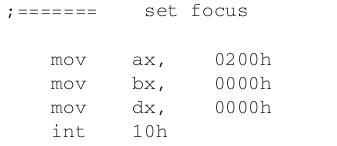

# bootloader

bootloader 引导启动程序原本由boot引导程序和loader引导程序两个部分构成。boot引导程序主要负责开机启动和加载loader程序；

loader引导程序则用于完成配置硬件工作环境、引导加载内核等任务。

# 1.BIOS引导原理：

1. 加电后，BIOS首先会做自检设备的操作。
2. 自检设备结束后，会根据启动选项设备(我们在配置文件中，指定为软驱启动)去选择启动设备
3. 即检测软盘的第0磁头、第０磁道、第1扇区，是否以数值 0x55 和　0xaa 两个字节作为结尾，如果是，那么BIOS就认为这个扇区是一个Boot Sector(引导扇区)，进而把此扇区的数据复制到物理地址0x7c00处，
4. 随后将处理器的执行权交给这段程序(跳转到0x7c00地址处进行执行)

软盘的结构如下：


**一个扇区的大小只有　512 个字节（512B）**

BIOS也仅仅是负责加载这一个扇区的数据到物理内存中。

# 2. 细化启动流程

## 2.1 加电

此时加电，此时系统会执行BIOS的代码：完成如下功能：

1. 设备自检
2. 对cpu进行初始化(包括对　cs 和 ip 连个寄存器的初始化)
3. BIOS去从软盘中找到　boot 程序,并将boot代码搬移到　内存地址(物理地址)为　0x7c00处。
4. BIOS将执行权交给 boot程序，也就是跳转到 0x7c000处执行

**跳转之前　此时处理器　处于实模式下，　cs ip 的值分别是　0x0000 和　0x7c00**

cs: 代码段寄存器

ip: 指令指针寄存器

此时的物理地址转换公式如下：

**物理地址 = cs << 4 + ip**


# 3.BIOS 中断

## 3.1 int 10h

INT 10h中断服务程序要求在调用时,必须向AH寄存器传入服务程序的主功能编号,再向其他寄存器传入参数。

下面按照主功能号进行分类：

BIOS中断服务程序INT 10h的主功能编号有06h、02h和13h,

### 3.1.1  设置屏幕光标位置(02h)

INT 10h,AH=02h功能:设定光标位置。

1. DH=游标的列数;
2.  DL=游标的行数;
3.  BH=页码。 

代码实例：



这条语句的目的是,将屏幕的光标位置设置在屏幕的左上角(0,0)处。不论是行号还是列号,它们
皆从0开始计数,屏幕的列坐标0点和行坐标0点位于屏幕的左上角,纵、横坐标分别向下和向右两个
方向延伸,或者说坐标原点位于屏幕左上角。

### 3.1.2 上卷指定范围的窗口(包括清屏功能)(06h)

INT 10h的主功能号AH=06h可以实现按指定范围滚动窗口的功能,同时也具备清屏功能,具体寄存器参数说明如下:

INT 10h,AH=06h功能:按指定范围滚动窗口。

1. AL=滚动的列数,若为0则实现清空屏幕功能;
2. BH=滚动后空出位置放入的属性;
3. CH=滚动范围的左上角坐标列号;
4. CL=滚动范围的左上角坐标行号;
5. DH=滚动范围的右下角坐标列号;
6. DL=滚动范围的右下角坐标行号;
7. BH=颜色属性。
   - bit 0~2:字体颜色(0:黑,1:蓝,2:绿,3:青,4:红,5:紫,6:综,7:白)
   - bit 3:字体亮度(0:字体正常,1:字体高亮度)
   - bit 4~6:背景颜色(0:黑,1:蓝,2:绿,3:青,4:红,5:紫,6:综,7:白)
   - bit 7:字体闪烁(0:不闪烁,1:字体闪烁)


**后缀H 、L分别代表： 高、低字节，　**

**x 表示２个字节，高低字节的组合**


​       这条命令主要用于按指定范围滚动窗口,但是如果AL=0的话,则执行清屏功能。在使用清屏功能时(AL寄存器为0),其他BX、CX、DX寄存器参数将不起作用,读者无需纠结它们的数值。

逐条解释如下：

```assembly
mov ax, 0600h ; ah=06 al=00 清空屏幕功能 
int 10h; 中断１０　
; 只需要如上两句，就可以实现清屏的操作，　实际证明，这两句完成不了清楚屏幕的功能，还需啊中间的
```

```assembly
mov ax, 0600h ; ah=06 al=00 清空屏幕功能

mov bx, 0700h ; 07h == 0000 0111 字体为白色，背景为黑色

mov cx, 0 ; 左上角的坐标为(0, 0)

mov dx, 18 4fh; 4fh=79 18h=24 (24,79) ; 也就是　左上角(0,0) - (24,79)这块区域会被清理

int 10h; 中断10
```


### 3.1.3 显示字符串(13h)

IOS中断服务程序INT 10h的主功能号AH=13h可以实现字符串的显示功能,具体寄存器参数说明如下。
INT 10h,AH=13h 功能:显示一行字符串。

1. AL=写入模式。
   - AL=00h:字符串的属性由BL寄存器提供,而CX寄存器提供字符串长度(以B为单位),显示后光标位置不变,即显示前的光标位置。
   - AL=01h:同AL=00h,但光标会移动至字符串尾端位置。
   - AL=02h:字符串属性由每个字符后面紧跟的字节提供,故CX寄存器提供的字符串长度改成以Word为单位,显示后光标位置不变。
   - AL=03h:同AL=02h,但光标会移动至字符串尾端位置。
   - 
2. CX=字符串的长度。
3. DH=游标的坐标行号。
4. DL=游标的坐标列号。
5. ES:BP=>要显示字符串的内存地址。
6. BH=页码。
7. BL=字符属性/颜色属性。
   - bit 0~2:字体颜色(0:黑,1:蓝,2:绿,3:青,4:红,5:紫,6:综,7:白)
   - bit 3 :字体亮度(0:字体正常,1:字体高亮度)
   - bit 4~6:背景颜色(0:黑,1:蓝,2:绿,3:青,4:红,5:紫,6:综,7:白)
   - bit 7:字体闪烁(0:不闪烁,1:字体闪烁)

实例：


```assembly
mov ax, 1301h; 字符串的属性由BL寄存器提供,而CX寄存器提供字符串长度(以B为单位),光标会移动至字符串尾端位置

mov bx, 000fh; 00: 页码0   0f: 转换为二进制 0000 1111 字体高亮，字体为白色

mov dx, 0000h; 游标的行为0　列为0 即屏幕左上角(0,0)

mov cx, 10; 字符串的长度为　10 ; 数字后加h 的表示十六进制，　没有h的表示10进制

push ax; 将1301h 先保存在栈中
mov ax, ds;  ax = ds 赋值
mov es, ax; es = ax 赋值，　也就是将　es = ds 赋值
pop ax; 将1301h 放置到ax中
mov bp, StartBootMessage; 将StartBootMessage所代表的地址　放置到bp中，　　注意es:bp 指向　要显示字符串的内存地址。

int 10h; 触发BIOS的10h中断
```


## 3.2 int 13h

### 3.2.1 复位磁盘驱动器(00h)

整个复位过程是通过BIOS中断服务程序INT 13h的主功能号AH=00h实现的,具体寄存器参数说明如下。

INT 13h,AH=00h 功能:重置磁盘驱动器,为下一次读写软盘做准备。

1. DL=驱动器号,    00H~7FH:软盘;       80H~0FFH:硬盘;
   - DL=00h代表第一个软盘驱动器(“drive A:”);
   - DL=01h代表第二个软盘驱动器(“drive B:”);
   - DL=80h代表第一个硬盘驱动器;
   - DL=81h代表第二个硬盘驱动器。

实例如下：

```assembly
; xor异或操作：　相同为０，不同为1, 这里ah,和 dl 直接被设置为0

xor ah, ah ; ah = 00h

xor dl, dl ; dl = 00h 代表第一个软盘设备(drive A:) 

int 13h 
```

