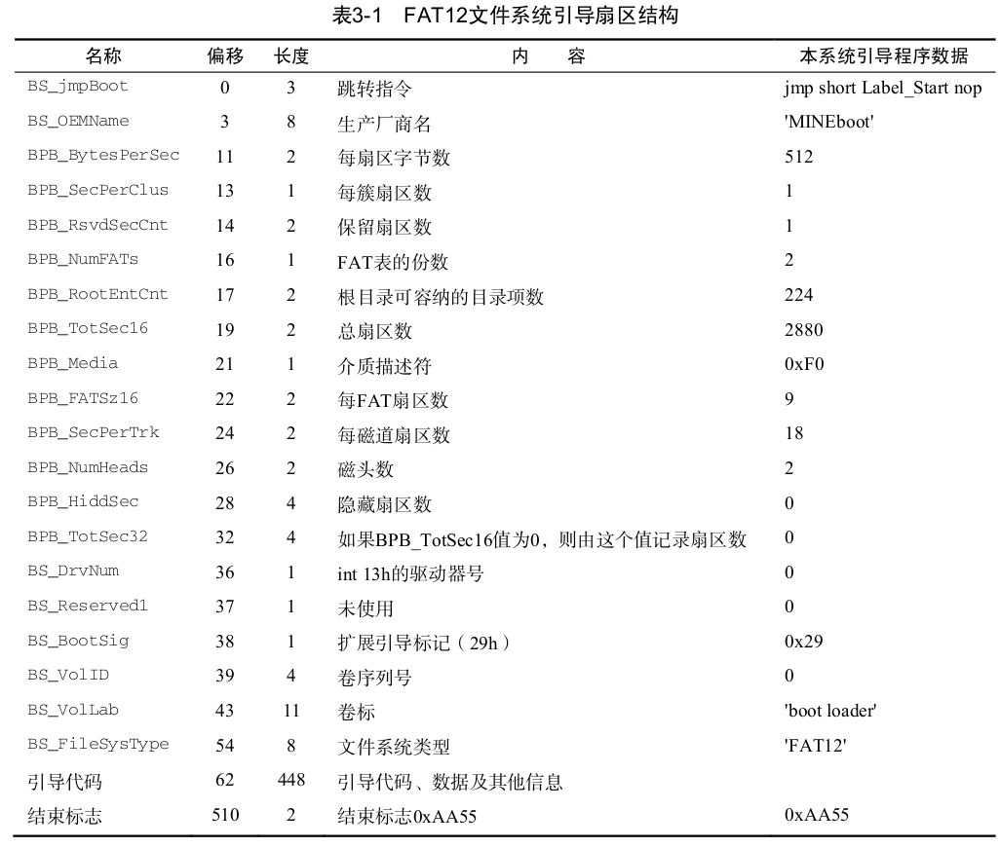
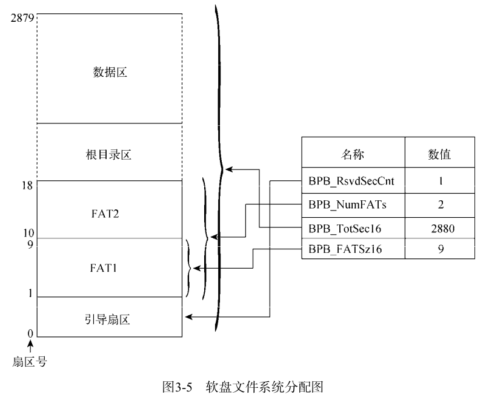
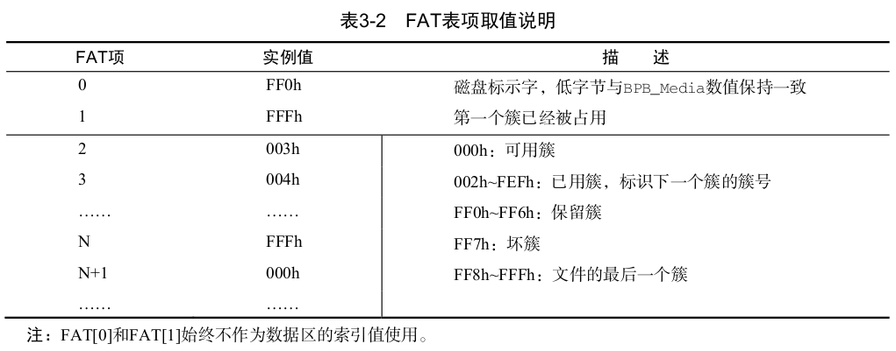
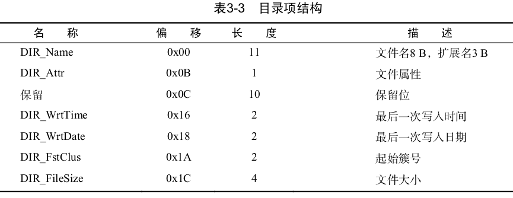
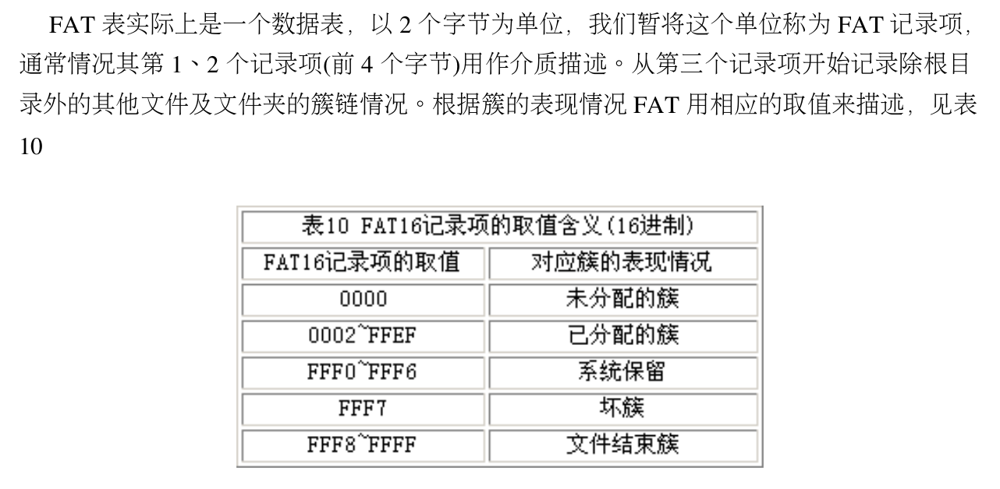

FAT12文件系统

将软盘格式化成FAT12文件系统的过程中,FAT类文件系统会对软盘里的扇区进行结构化处理,进而把软盘扇区划分成引导扇区、FAT表、根目录区和数据区4部分。

# 1. 基础

## 1.1 引导扇区：

**引导扇区　包含在　保留扇区之中**

FAT12文件系统的引导扇区不仅包含有引导程序,还有FAT12文件系统的整个组成结构信息

BPB(BIOS Parameter Block)，

表中这些字段的具体含义，可以去看书：Ｐ５４

这里只记录，几个我认为重要的字段：

1. BS_jmpBoot:  是一句跳转代码,这是由于 BS_jmpBoot 字段后面的数据不是可执行程序,而是FAT12文件系统的组成结构信息,故此必须跳过这部分内容。
2. BPB_RsvdSecCnt: 此域值不能为0。保留扇区起始于FAT12文件系统的第一个扇区,对于FAT12而言此位必须为1,也就意味着引导扇区包含在保留扇区内,所以FAT表从软盘的第二个扇区开始。（假设这里的扇区编号从1开始）
3. BPB_RootEntCnt:  指定根目录可容纳的目录项数。对于FAT12文件系统而言,这个数值乘以32必须是BPB_BytesPerSec 的偶数倍。
4. BPB_Media:  对于不可移动的存储介质而言,标准值是 0xF8 。对于可移动的存储介质,常用值为 0xF0 , 另外提醒一点,无论该字段写入了什么数值,同时也必须向FAT[0]的低字节写入相同值。
5. BPB_NumFATs: 指定FAT12文件系统中FAT表的份数,任何FAT类文件系统都建议此域设置为2。设置为2主要是为了给FAT表准备一个备份表,因此FAT表1与FAT表2内的数据是一样的,FAT表2是FAT表1的数据备份表。
6. BPB_FATSz16:  记录着FAT表占用的扇区数。FAT表1和FAT表2拥有相同的容量,它们的容量均由此值记录。
7. BPB_TotSec16: 记录着总扇区数。这里的总扇区数包括保留扇区(内含引导扇区)、FAT表、根目录区以及数据区占用的全部扇区数,如果此域值为0,那么 BPB_TotSec32 字段必须是非0值。

对于这个图的解释如下：

1. 首先这里的扇区编号是从0开始的。
2. 0号扇区中　装的就是　这些表中的字段。表中的字段的含义，就是箭头所指的。
3. 　BPB_RsvdSecCnt　= 1 ：表示我有一个保留扇区，保留扇区中有包含了引导扇区(或者是同一个)；
4. 　BPB_NumFATs　= 2 : 我有两个　FAT表，其中一个是用来做备份用的
5. 　BPB_TotSec16　= 2880 : 扇区编号从0开始数，总共有2880个扇区
6. 　BPB_FATSz16　= ９: 表示一个FAT表，占用9 个扇区。

## 1.2 FAT表

从引导扇区中填的值，我们可以知道，　每个FAT表占用9个扇区，有两张FAT表，其中一个是用来备份的。

FAT12文件系统以簇为单位来分配数据区的存储空间(扇区)
,每个簇的长度　＝　BPB_ BytesPerSec *　BPB_SecPerClus 字节,

每个簇的长度　= 每个扇区的大小　* 一个簇多少扇区数

1. 数据区的簇号和FAT表的表项是一一对应的.**故，文件在FAT类文件系统的存储单元是簇，而非字节或者是扇区，即使文件的长度只有一个字节，FAT12文件系统也会为它分配一个簇的磁盘存储空间。**此种设计方法可以将磁盘存储空间按固定存储页有效的管理起来，进而可以按照文件偏移，分片段访问文件内的数据，就不必一次将文件里的数据全部读取出来。
2. FAT表中的表项位宽与FAT类型有关,例如,FAT12文件系统的表项位宽为12 bit、FAT16文件系统的表项位宽为16 bit、FAT32文件系统的表项位宽为32 bit。
3. 当一个文件的体积增大时,其所需的磁盘存储空间也会增加,随着时间的推移,文件系统将无法确保文件中的数据存储在连续的磁盘扇区内,文件往往被分成若干个片段。借助FAT表项,可将这些不连续的文件片段按簇号链接起来,这个链接原理与C语言的单向链表极为相似。表3-2以FAT12文件系统为例,来对FAT表项的取值加以说明。

这里要知道**数据区的簇号　和　FAT表的表项是一一对应的关系。**

1. FAT[0](FAT表项0)的低8位在数值上与 BPB_Media 字段保持一致,剩余位全部设置为1。由于表3-1的 BPB_Media 字段数值是F0h,故此FAT[0]的值是FF0h。在文件系统初始化期间,已经明确地将FAT[1]赋值为FFFh,想必这是为了防止文件系统误分配该表项。(由于我们这里将BPB_SecPerClus　＝　１,也就是，一个扇区和一个簇相对应。，这里将FAT[1] = FFFh,也就是代表，第一个扇区不能使用)
2. 现在,大部分操作系统的FAT类文件系统驱动程序都直接跳过这两个FAT表项的检索,使它们不
   再参与计算。因此,FAT[0]和FAT[1]的数值已经不再那么重要了,有时候这两个值为0也是没问题的。
   我们在编写程序时不必检测它们的数值,直接跳过即可。

## 1.3 根目录区和数据区

1. 根目录区和数据区都保存着和文件相关的数据，只不过根目录区只能保存目录项信息，而数据区不但可以保存目录项信息，还可以保存文件内的数据。
2. 这里提到的目录项是一个32Ｂ（字节）组成的结构体，这个结构体既可以表示一个目录，也可以表示成一个文件。这个结构体中记录着名字、长度以及数据起始簇号等信息。

**对于树状的目录结构而言,树的层级结构自然是通过代表着目录的目录项结构建立起来,从根目录开始经过目录项的逐
层嵌套渐渐地形成了树状结构**

### 1.3.1  SectorBalance equ 17 

汇编代码 SectorBalance equ 17 用于平衡文件(或者目录)的起始簇号与数据区起始簇号的差值。更通俗点说,因为数据区对应的有效簇号是 2 (FAT[2]),为了正确计算出FAT表项对应的数据区起始扇区号,则必须将FAT表项值减 2 ,或者将数据区的起始簇号 / 扇区号减 2 (仅在每簇由一个扇区组成时可用)。本程序暂时采用一种更取巧的方法是,将根目录起始扇区号减 2 ( 19–2=17 ),进而间接把数据区的起始扇区号(数据区起始扇区号 = 根目录起始扇区号 + 根目录所占扇区数)减 2 。

这里暂时将这段解释放在这里，待会分析代码的时候，在借助代码去理解。

总结：

在FAT文件系统中找文件：　首先在　根目录区中找到，我们要找的文件的目录结构(32B),　然后在32B中是可以找到这个文件的起始簇的编号的，　　　拿到这个起始簇号，在到FAT1 标中找，现在就是一个链了，不断去找。就找到这个文件的全部了。(这个问题有待后续代码验证哈。)