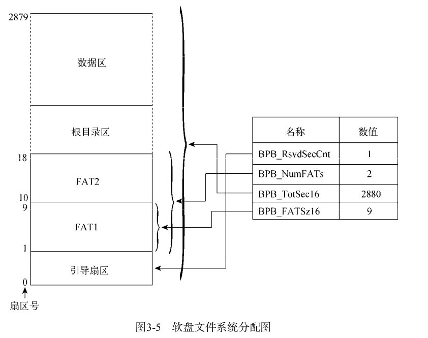
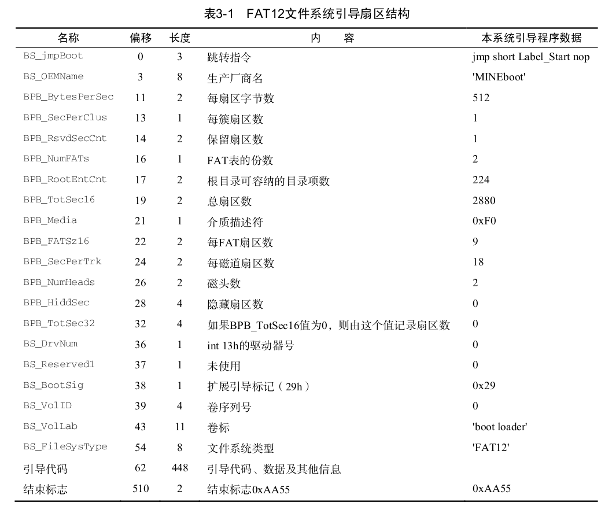
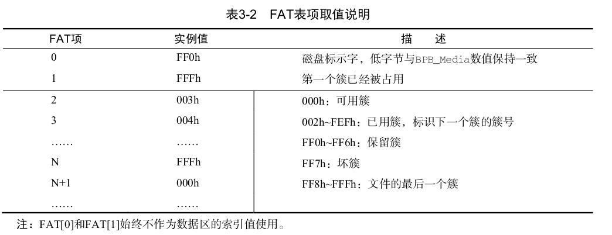
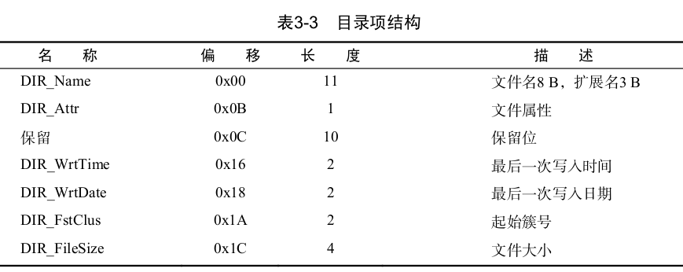
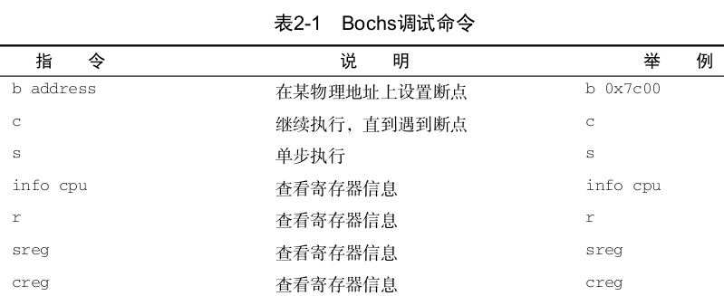
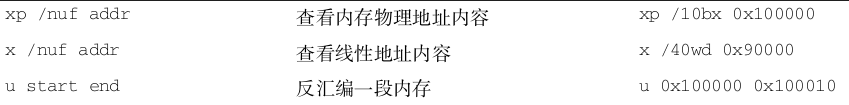
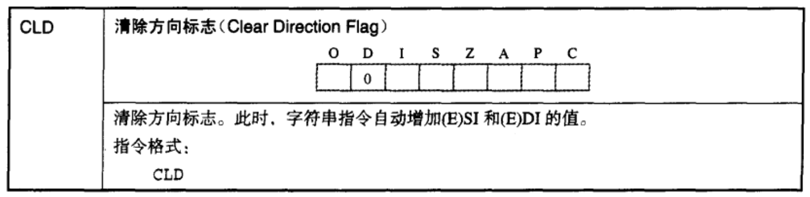
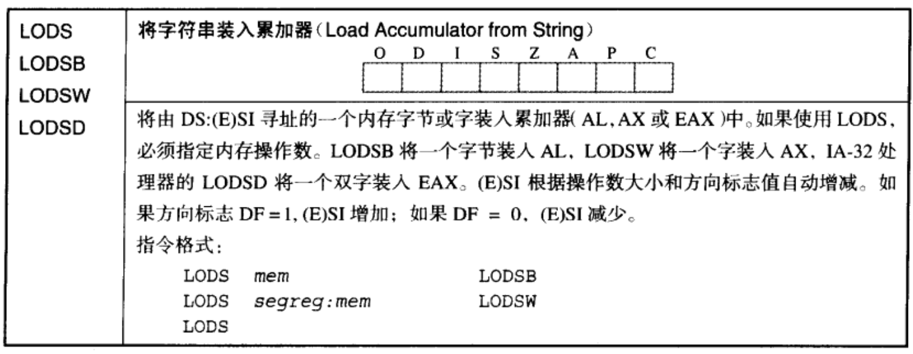
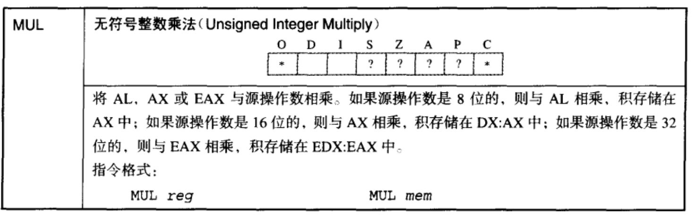
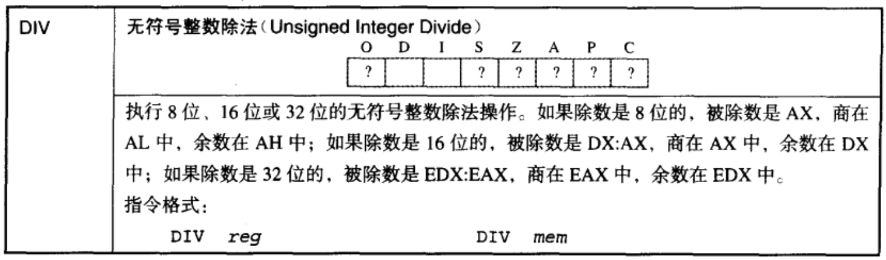

详解3-2code

# 1.code

## 1. 参照图

### 1.1 软盘文件系统分配图



### 1.2 FAT12引导扇区结构图



### 1.3 FAT表项取值说明图



每个FAT表项，占用1.5个字节，　表项中的值代表的含义：要么是下一个表项的编号，要么就是FFFh表示该文件是最后一个簇。　这里我们的簇和表项的标号是一一对应的。(簇号＝表项编号)

### 1.4 根目录中的目录项图



### 1.5 Bochs调试指令图

虚拟机调试命令：






https://www.jianshu.com/p/3b0588acbe16

```assembly
xchg bx,bx; 魔幻调试

xchg %bx, %bx; at&t 汇编
```


```assembly

org	0x7c00	; 如果不加，编译的时候，起始地址为0000h; 如果加,起始地址从0x7c00h开始


;==================================
BaseOfStack	equ	0x7c00
BaseOfLoader	equ	0x1000
OffsetOfLoader	equ	0x00
RootDirSectors	equ	14
SectorNumOfRootDirStart	equ	19
SectorNumOfFAT1Start	equ	1
SectorBalance	equ	17	
; 这个区间中的内容相当是　宏定义
;===================================

;-----------------------------------------------
	jmp	short Label_Start; 
	nop
	BS_OEMName	db	'MINEboot'
	BPB_BytesPerSec	dw	512
	BPB_SecPerClus	db	1
	BPB_RsvdSecCnt	dw	1
	BPB_NumFATs	db	2
	BPB_RootEntCnt	dw	224
	BPB_TotSec16	dw	2880
	BPB_Media	db	0xf0
	BPB_FATSz16	dw	9
	BPB_SecPerTrk	dw	18
	BPB_NumHeads	dw	2
	BPB_HiddSec	dd	0
	BPB_TotSec32	dd	0
	BS_DrvNum	db	0
	BS_Reserved1	db	0
	BS_BootSig	db	0x29
	BS_VolID	dd	0
	BS_VolLab	db	'boot loader'
	BS_FileSysType	db	'FAT12   '
	
; FAT12文件系统　引导扇区的结构
;--------------------------------------------

; 初始化各个段寄存器的值
Label_Start:

	mov	ax,	cs
	mov	ds,	ax
	mov	es,	ax
	mov	ss,	ax
	mov	sp,	BaseOfStack; 初始化栈指针

;=======	clear screen

	mov	ax,	0600h
	mov	bx,	0700h
	mov	cx,	0
	mov	dx,	0184fh
	int	10h

;=======	set focus

	mov	ax,	0200h
	mov	bx,	0000h
	mov	dx,	0000h
	int	10h

;=======	display on screen : Start Booting......

	mov	ax,	1301h
	mov	bx,	000fh
	mov	dx,	0000h
	mov	cx,	10
	push	ax
	mov	ax,	ds
	mov	es,	ax
	pop	ax
	mov	bp,	StartBootMessage
	int	10h

;=======	reset floppy

	xor	ah,	ah
	xor	dl,	dl
	int	13h

;=======	search loader.bin
	mov	word	[SectorNo],	SectorNumOfRootDirStart

Lable_Search_In_Root_Dir_Begin:

	cmp	word	[RootDirSizeForLoop],	0
	jz	Label_No_LoaderBin
	dec	word	[RootDirSizeForLoop]	
	mov	ax,	00h
	mov	es,	ax
	mov	bx,	8000h
	mov	ax,	[SectorNo]
	mov	cl,	1
	call	Func_ReadOneSector
	mov	si,	LoaderFileName
	mov	di,	8000h
	cld
	mov	dx,	10h
	
Label_Search_For_LoaderBin:

	cmp	dx,	0
	jz	Label_Goto_Next_Sector_In_Root_Dir
	dec	dx
	mov	cx,	11

Label_Cmp_FileName:

	cmp	cx,	0
	jz	Label_FileName_Found
	dec	cx
	lodsb	
	cmp	al,	byte	[es:di]
	jz	Label_Go_On
	jmp	Label_Different

Label_Go_On:
	
	inc	di
	jmp	Label_Cmp_FileName

Label_Different:

	and	di,	0ffe0h
	add	di,	20h
	mov	si,	LoaderFileName
	jmp	Label_Search_For_LoaderBin

Label_Goto_Next_Sector_In_Root_Dir:
	
	add	word	[SectorNo],	1
	jmp	Lable_Search_In_Root_Dir_Begin
	
;=======	display on screen : ERROR:No LOADER Found

Label_No_LoaderBin:

	mov	ax,	1301h
	mov	bx,	008ch
	mov	dx,	0100h
	mov	cx,	21
	push	ax
	mov	ax,	ds
	mov	es,	ax
	pop	ax
	mov	bp,	NoLoaderMessage
	int	10h
	jmp	$

;=======	found loader.bin name in root director struct

Label_FileName_Found:

	mov	ax,	RootDirSectors
	and	di,	0ffe0h
	add	di,	01ah
	mov	cx,	word	[es:di]
	push	cx
	add	cx,	ax
	add	cx,	SectorBalance
	mov	ax,	BaseOfLoader
	mov	es,	ax
	mov	bx,	OffsetOfLoader
	mov	ax,	cx

Label_Go_On_Loading_File:
	push	ax
	push	bx
	mov	ah,	0eh
	mov	al,	'.'
	mov	bl,	0fh
	int	10h
	pop	bx
	pop	ax

	mov	cl,	1
	call	Func_ReadOneSector
	pop	ax
	call	Func_GetFATEntry
	cmp	ax,	0fffh
	jz	Label_File_Loaded
	push	ax
	mov	dx,	RootDirSectors
	add	ax,	dx
	add	ax,	SectorBalance
	add	bx,	[BPB_BytesPerSec]
	jmp	Label_Go_On_Loading_File

Label_File_Loaded:
	
	jmp	$

;=======	read one sector from floppy

Func_ReadOneSector:
	
	push	bp
	mov	bp,	sp
	sub	esp,	2
	mov	byte	[bp - 2],	cl
	push	bx
	mov	bl,	[BPB_SecPerTrk]
	div	bl
	inc	ah
	mov	cl,	ah
	mov	dh,	al
	shr	al,	1
	mov	ch,	al
	and	dh,	1
	pop	bx
	mov	dl,	[BS_DrvNum]
Label_Go_On_Reading:
	mov	ah,	2
	mov	al,	byte	[bp - 2]
	int	13h
	jc	Label_Go_On_Reading
	add	esp,	2
	pop	bp
	ret

;=======	get FAT Entry

Func_GetFATEntry:

	push	es
	push	bx
	push	ax
	mov	ax,	00
	mov	es,	ax
	pop	ax
	mov	byte	[Odd],	0
	mov	bx,	3
	mul	bx
	mov	bx,	2
	div	bx
	cmp	dx,	0
	jz	Label_Even
	mov	byte	[Odd],	1

Label_Even:

	xor	dx,	dx
	mov	bx,	[BPB_BytesPerSec]
	div	bx
	push	dx
	mov	bx,	8000h
	add	ax,	SectorNumOfFAT1Start
	mov	cl,	2
	call	Func_ReadOneSector
	
	pop	dx
	add	bx,	dx
	mov	ax,	[es:bx]
	cmp	byte	[Odd],	1
	jnz	Label_Even_2
	shr	ax,	4

Label_Even_2:
	and	ax,	0fffh
	pop	bx
	pop	es
	ret

;=======	tmp variable

RootDirSizeForLoop	dw	RootDirSectors
SectorNo		dw	0
Odd			db	0

;=======	display messages

StartBootMessage:	db	"Start Boot"
NoLoaderMessage:	db	"ERROR:No LOADER Found"
LoaderFileName:		db	"LOADER  BIN",0

;=======	fill zero until whole sector

	times	510 - ($ - $$)	db	0
	dw	0xaa55

```

采取分片段的方式，进行详解：

## 2. search loader.bin

```assembly
SectorNumOfRootDirStart equ 19; 宏定义
SectorNo        dw  0; 大小为１个字的变量(两个字节)

RootDirSectors  equ 14
RootDirSizeForLoop  dw  RootDirSectors; 根目录共占用14个扇区　14 = (224*32)/512; 224个目录项、每项占32字节、每个扇区占512字节


LoaderFileName:     db  "LOADER  BIN",0

;=======	search loader.bin
	mov	word	[SectorNo],	SectorNumOfRootDirStart; SectorNo = 19; 参照1.1图理解

Lable_Search_In_Root_Dir_Begin:

	cmp	word	[RootDirSizeForLoop],	0;　每次读一个扇区的内容，共读14次，
	
	jz	Label_No_LoaderBin; 如果　RootDirSizeForLoop　== 0 成立，说明，我们已经搜索完所有的根目录扇区中的目录项，都没找到loader.bin文件
	
	dec	word	[RootDirSizeForLoop]; 读一次 RootDirSizeForLoop--
	mov	ax,	00h
	mov	es,	ax; es = 00h
	mov	bx,	8000h; bx = 8000h; 这里初始化es:bx，　软盘一个扇区的内容将放置到这个内存地址处　
	mov	ax,	[SectorNo]; ax = 19 根目录所在的第一个扇区标号，参照1.1图理解， ax中保存我们要读的扇区号
	mov	cl,	1; 读取的扇区数
	
	call	Func_ReadOneSector ; 读一个扇区到 8000h这个内存地址中
	
	mov	si,	LoaderFileName; si 保存将要从文件系统中检索的文件名字
	mov	di,	8000h; di = 8000h 扇区内容读到这了
	
	cld ;清除df方向标示，df位=0，　si,di 寄存器中的值，会跟着lods 读入字节数，自动加
	
	mov	dx,	10h; dx=16的意义是： 一个扇区512字节，一个目录项32字节 512/32 = 16;一个扇区可以装16个目录，如果在这个扇区中，没有找到文件，那就要去加载下一个扇区了。
	
Label_Search_For_LoaderBin:

	cmp	dx,	0
	jz	Label_Goto_Next_Sector_In_Root_Dir; 这个就是加载下一个扇区的函数
	dec	dx ; dx--; dx = 0fh = 15
	mov	cx,	11 ; cx = 11; 这里是“LOADER  BIN”的长度11, 这里也要循环11次，每个字符去匹配

Label_Cmp_FileName:

	cmp	cx,	0
	jz	Label_FileName_Found
	dec	cx ; cx-- ; cx=10
	lodsb	; si由原来的 000e7dde + 1 变为 000e7ddf， 这里是si会自动加1,和inc di相互照应
	cmp	al,	byte	[es:di]; 这里应该是一个一个比较， 只所以从目录项的0偏移开始比较，看1.4图理解
	jz	Label_Go_On; 如果第一个字母匹配对，就会跳转，
	jmp	Label_Different

Label_Go_On:
	
	inc	di; 这里对di++; 也就是说保存目录项的内存地址，也会相应+1, 然后去匹配后面的字符
	jmp	Label_Cmp_FileName

Label_Different:

	and	di,	0ffe0h; 原来di= 8000h ; di & 0ffe0h = 8000h
	add	di,	20h; 8000h + 20h; 这里相当是内存地址向后挪动了一个目录项(32字节)
	mov	si,	LoaderFileName; si 保存将要从文件系统中检索的文件名字
	jmp	Label_Search_For_LoaderBin; 这里会重新跳转到，上面，开始搜索下一个目录项

Label_Goto_Next_Sector_In_Root_Dir:
	
	add	word	[SectorNo],	1; 最初是19标识第一个根目录的起始扇区,现在要加载根目录区的第二个扇区 当然此时要 SectorNo++ ： 20
	jmp	Lable_Search_In_Root_Dir_Begin
```

### 2.1 cld 指令



在比对每个目录项文件名的过程中,使用了汇编指令 LODSB ,该命令的加载方
向与DF标志位有关,因此在使用此命令时需用CLD指令清DF标志位。
以下是Intel官方白皮书对 LODSB/LODSW/LODSD/LODSQ 指令的概括描述。
 该命令可从DS:(R|E)SI寄存器指定的内存地址中读取数据到AL/AX/EAX/RAX寄存器。
 当数据载入到AL/AX/EAX/RAX寄存器后,(R|E)SI寄存器将会依据 R|EFLAGS 标志寄存器的DF
标志位自动增加或减少载入的数据长度(1/2/4/8字节)
。当 DF=0 时,(R|E)SI寄存器将会自动增
加;反之,(R|E)SI寄存器将会自动减少。

### 2.2 lodsb



这里的这个是错的，我调试代码的时候，调试出来的， DF=0的时候， 执行 lodsb SI增加

### 2.3 程序的状态位

https://www.cnblogs.com/x54256/p/8099440.html

```shell
<bochs:8> r
CPU0:
rax: 00000000_0000004c
rbx: 00000000_00008000
rcx: 00000000_0009000a
rdx: 00000000_0000000f
rsp: 00000000_00007c00
rbp: 00000000_00007dbd
rsi: 00000000_000e7ddd
rdi: 00000000_00008020
r8 : 00000000_00000000
r9 : 00000000_00000000
r10: 00000000_00000000
r11: 00000000_00000000
r12: 00000000_00000000
r13: 00000000_00000000
r14: 00000000_00000000
r15: 00000000_00000000
rip: 00000000_00007cce
eflags 0x00000082: id vip vif ac vm rf nt IOPL=0 of df if tf SF zf af pf cf # 状态寄存器
```


## 3. 找到文件所在的目录项...

调用时机：

在224个目录项中，找到我们想要找的文件所在的目录向之后，就会调用这部分代码：


```assembly
RootDirSectors  equ 14
RootDirSizeForLoop  dw  RootDirSectors

SectorBalance   equ 17 
BaseOfLoader    equ 0x1000
OffsetOfLoader  equ 0x00


;=======	found loader.bin name in root director struct

Label_FileName_Found:

	mov	ax,	RootDirSectors; ax = 14 ; 根目录总共占用14个扇区，容纳224个目录项,每个目录项占用32B

;1. 如果首字母或者其他字母没有匹配成功， di+=32;	
;2. 在执行我们逐个字符去比较文件名的时候，曾对di++ "Label_Go_On: -> inc di",
;3. 基于以上两种情况，这里 做了一个 与操作，类似字节对齐， 这里做了一个5位对齐， di &  1110 0000 
	
	and	di,	0ffe0h;目的是回到，该目录项的0偏移处
	add	di,	01ah; di += 0x1a; di目前的地址是，该目录项的起始簇号， 参看1.4中的图
	mov	cx,	word	[es:di]; 将起始簇号 读入cx中， 假如我们起始簇号为2(数据区一个扇区)，参考1.3图
	push	cx; 起始簇号入栈 2
	add	cx,	ax; cx += 14; cx=16
	add	cx,	SectorBalance; cx += 17; cx=33
	
;在int 13h 02h 中读软盘的中断中，就规定了 [es:bx]将作为我们存放数据的起始地址

	mov	ax,	BaseOfLoader; ax = 0x1000
	mov	es,	ax; es = 0x1000;
	mov	bx,	OffsetOfLoader; bx = 0x0h ;这里将我们的文件读到[es:bx]内存地址中去
	
	
	mov	ax,	cx; ax=33

Label_Go_On_Loading_File:
	push	ax; 将33压栈
	push	bx; 将0压栈
	mov	ah,	0eh; ah = 0x0e; 字符显示功能
	mov	al,	'.'
	mov	bl,	0fh
	int	10h
	pop	bx; bx = 0;
	pop	ax; ax = 33; 33 = 引导扇区数(1)+FAT1表(9)+FAT2表(9)+根目录(14)=1+9+9+14

	mov	cl,	1; cl = 1;读入的扇区数
	call	Func_ReadOneSector; 这里读入的就是，我们想要的文件所在的扇区
	pop	ax; ax = 2; 这里是起始簇号2被出栈了
	call	Func_GetFATEntry;访问FAT表中的项 2; 这个函数执行结束后，ax中放的是，FAT表项中的值，
	cmp	ax,	0fffh; 0fffh 表示，文件结束，参考1.3中的图
	jz	Label_File_Loaded; 如果是文件尾， 就执行
	push	ax
	mov	dx,	RootDirSectors
	add	ax,	dx
	add	ax,	SectorBalance
	add	bx,	[BPB_BytesPerSec]
	jmp	Label_Go_On_Loading_File

Label_File_Loaded:
	
	jmp	$
```


**亲自调试：**

```assembly
;=======	found loader.bin name in root director struct

Label_FileName_Found:

	mov	ax,	RootDirSectors
	and	di,	0ffe0h
	add	di,	01ah
	mov	cx,	word	[es:di]; 这里读出的起始簇号是 3
	push	cx ; 将 3 入栈
	add	cx,	ax ; cx = cx + ax = 3 + 14 = 17
	add	cx,	SectorBalance ; cx += 17; cx = 34
	mov	ax,	BaseOfLoader ; ax = 0x1000
	
	;-----------------------------------------------------------------------------	
	; 此时的es 
	;es:0x0000, dh=0x00009300, dl=0x0000ffff, valid=3
	;Data segment, base=0x00000000, limit=0x0000ffff, Read/Write, Accessed

	
	mov	es,	ax; ex = 0x1000
	
	; 此时 es
	;es:0x1000, dh=0x00009301, dl=0x0000ffff, valid=1
	;Data segment, base=0x00010000, limit=0x0000ffff, Read/Write, Accessed
	;==============================================================================
	
	mov	bx,	OffsetOfLoader ; bx = 0x0 这里将我们的文件读到[es:bx]内存地址中去 这个是int 10 规定的
	
	mov	ax,	cx; ax = 34

Label_Go_On_Loading_File:
	push	ax; 将0x22 = 34 入栈
	push	bx; 将 OffsetOfLoader = 0x0 入栈
	mov	ah,	0eh; ah = 0eh 这个是int 13中断的 主功能号
	mov	al,	'.'
	mov	bl,	0fh
	int	10h
	pop	bx; bx = 0x0 
	pop	ax; ax = 0x22; = 34 

	mov	cl,	1
	call	Func_ReadOneSector ;这里先去读出 34这个扇区的内容
	pop	ax; 这里将起始簇号出栈，去FAT表中去找，有关这个文件的下一个扇区。(如果这个文件是个大于512字节的文件)  此时: ax=3
	
	call	Func_GetFATEntry
	cmp	ax,	0fffh; 此时ax = 0fffh
	jz	Label_File_Loaded; 这里就会跳到loader去执行
	push	ax ; 如果不是结束标志，那就是下一个表项的编号以及对应数据区的扇区的标号。
	mov	dx,	RootDirSectors
	add	ax,	dx
	add	ax,	SectorBalance
	add	bx,	[BPB_BytesPerSec]
	jmp	Label_Go_On_Loading_File

Label_File_Loaded:
	
	jmp	$

;=======	read one sector from floppy

Func_ReadOneSector:
	
	push	bp
	mov	bp,	sp
	sub	esp,	2
	mov	byte	[bp - 2],	cl
	push	bx
	mov	bl,	[BPB_SecPerTrk]
	div	bl
	inc	ah
	mov	cl,	ah
	mov	dh,	al
	shr	al,	1
	mov	ch,	al
	and	dh,	1
	pop	bx
	mov	dl,	[BS_DrvNum]
Label_Go_On_Reading:
	mov	ah,	2
	mov	al,	byte	[bp - 2]
	int	13h
	jc	Label_Go_On_Reading
	add	esp,	2
	pop	bp
	ret

;=======	get FAT Entry

Func_GetFATEntry:
;-------------------------------------------------------------------------
; 此时 es的值
; es:0x1000, dh=0x00009301, dl=0x0000ffff, valid=1
; Data segment, base=0x00010000, limit=0x0000ffff, Read/Write, Accessed

	push	es ; 将 es中的 0x1000 压入栈中
	push	bx ; 将 bx中的 0x000 压人栈中
	push	ax ; 将 ax中的 3 压入栈
	mov	ax,	00 ;
    
 ;----------------------------------------------------------------------------
 ; 此时的es
 ; es:0x1000, dh=0x00009301, dl=0x0000ffff, valid=1
 ;	Data segment, base=0x00010000, limit=0x0000ffff, Read/Write, Accessed
	
	mov	es,	ax
	
 ; es:0x0000, dh=0x00009300, dl=0x0000ffff, valid=1
 ; Data segment, base=0x00000000, limit=0x0000ffff, Read/Write, Accessed
 ; ============================================================================
 
 
	pop	ax ; ax = 3
	mov	byte	[Odd],	0
	mov	bx,	3
	mul	bx; ax = ax * bx = 3*3 = 9
	mov	bx,	2; bx = 2;
	div	bx ; ax/bx = 4.5 商(ax) 余数(dx); ax = 4, dx = 1
	cmp	dx,	0 
	jz	Label_Even
	mov	byte	[Odd],	1

Label_Even:

	xor	dx,	dx; dx 清零
	mov	bx,	[BPB_BytesPerSec]; bx = 0x200; 512
	div	bx ; ax/bx = 4/512 ; ax = 0; dx = 4
	push	dx; 4 压栈
	mov	bx,	8000h; bx=0x8000
	add	ax,	SectorNumOfFAT1Start; ax = 0 + 1 = 1
	mov	cl,	2; cl = 2; 
	call	Func_ReadOneSector ; ax = 1, cl = 2, 这里读取1号扇区，读取两个扇区
	
	pop	dx; dx = 4
	add	bx,	dx ; bx = bx + dx = 0x8004h
	mov	ax,	[es:bx]; 从地址处:  0x8004h的内存地址处，去读，我们这里是 第3个表项
	cmp	byte	[Odd],	1
	jnz	Label_Even_2; 这里是不等于0才跳转, 1-1 =0 ，这里的值为0, 不跳转
	shr	ax,	4; 向右 平移4位:  ax = 0fff

Label_Even_2:
	and	ax,	0fffh; ax = 0fff
	pop	bx; bx = 0x0;
	pop	es; es = 1000h ,开始切换段了
	ret

;=======	tmp variable

RootDirSizeForLoop	dw	RootDirSectors
SectorNo		dw	0
Odd			db	0

;=======	display messages

StartBootMessage:	db	"Start Boot"
NoLoaderMessage:	db	"ERROR:No LOADER Found"
LoaderFileName:		db	"LOADER  BIN",0

;=======	fill zero until whole sector

	times	510 - ($ - $$)	db	0
	dw	0xaa55

```

**总结:**

通过调试， 把FAT12文件系统的访问过程记录如下：

1. 先从根目录区中，搜索每个目录项，找到和名字相同的文件目录项
2. 从目录项中拿出，起始簇号3：换算出最终的扇区号 34.
3. 将34号扇区中的内容读取到 0x10000h地址处。
4. 然后从 FAT表中找到3这个表项，这个表项中记录这下一个FAT表的编号(可以转换为下一个扇区的标号),如果是0xfff，就表示这是最后一个扇区。


## 4. 访问FAT项

```assembly
BPB_BytesPerSec dw  512 ; 一个扇区512字节
SectorNumOfFAT1Start    equ 1

;=======	get FAT Entry

Func_GetFATEntry:

	push	es; 0x1000 入栈
	push	bx; 0 入栈
	push	ax; 2 入栈
	mov	ax,	00; ax = 00
	mov	es,	ax; es = 00
	pop	ax; 出栈 ax = 2
	mov	byte	[Odd],	0; Odd = 0
	mov	bx,	3; bx = 3
	mul	bx; [dx:ax] = ax * bx ; 这里 ax = 6
	mov	bx,	2; bx = 2
	div	bx; ax/bx  商(ax) 余数(dx), 此时 ax = 6/2 = 3
	cmp	dx,	0; FAT表项占1.5个字节，这里余数如果是0,就说明当前簇号为偶数 2、4、6 、8...
	jz	Label_Even; 偶数簇号执行
	mov	byte	[Odd],	1

Label_Even:
	xor	dx,	dx; dx = 0
	mov	bx,	[BPB_BytesPerSec]; bx = 512
	div	bx ; ax/bx = 3/512 -> ax = 0, dx = 3 ; 需要在这之前下断点
	push	dx; 将 3入栈
	mov	bx,	8000h; bx = 8000h
	add	ax,	SectorNumOfFAT1Start; ax += 1; ax = 1 
	mov	cl,	2; 这里读入两个扇区，此时 es:bx = 0:8000h
	call	Func_ReadOneSector; 这里是从FAT表区读入两个扇区，该区起始扇区标号为1，参考1.1图
	
	pop	dx; dx = 3
	add	bx,	dx; bx +=dx ; bx = 8000h + 4 = 0x8003h
	mov	ax,	[es:bx]; 这里需要调试看， 这里相当于， ax保存的是 FAT区中的第二个扇区地址中的值，这里有问题，调试看看
	cmp	byte	[Odd],	1
	jnz	Label_Even_2
	shr	ax,	4; 如果簇号对奇数，这里要右移4位，

Label_Even_2:
	and	ax,	0fffh; 取出FAT表项中的值， 通过 & 只拿3个字节
	pop	bx
	pop	es
	ret
```

这段程序首先会保存FAT表项号,并将奇偶标志变量(变量 [odd] )置0。因为每个FAT表项占
1.5 B,所以将FAT表项乘以3除以2 (扩大1.5倍)
,来判读余数的奇偶性并保存在 [odd] 中(奇数为1,
偶数为0),再将计算结果除以每扇区字节数,商值为FAT表项的偏移扇区号,余数值为FAT表项在
扇区中的偏移位置。接着,通过 Func_ReadOneSector 模块连续读入两个扇区的数据,此举的目的
是为了解决FAT表项横跨两个扇区的问题。最后,根据奇偶标志变量进一步处理奇偶项错位问题,
即奇数项向右移动4位。有能力的读者可自行将FAT12文件系统替换为FAT16文件系统,这样可以简
化FAT表项的索引过程。

**bochs调试过程：**

调试目的：

验证这句话：,再将计算结果除以每扇区字节数,商值为FAT表项的偏移扇区号,余数值为FAT表项在
扇区中的偏移位置？？？


### 4.1 mul 指令



### 4.2 div 指令



