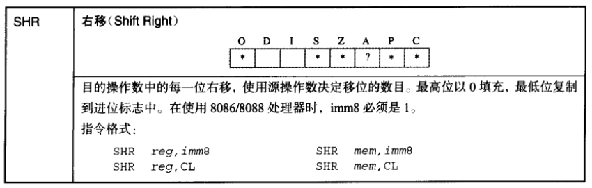

详解3-4code

本系统的内核程序起始地址位于物理地址 0x100000 (1 MB)处,因为1 MB以下的物理地址并不全是可用内存地址空间,这段物理地址被划分成若干个子空间段,它们可以是内存空间、非内存空间以及地址空洞。随着内核体积的不断增长,未来的内核程序很可能会超过1 MB,因此让内核程序跳过这些纷繁复杂的内存空间,从平坦的1 MB地址开始,这是一个非常不错的选择。

内存地址 0x7E00 是内核程序的临时转存空间,由于内核程序的读取操作是通过BIOS中断服务程序INT 13h实现的,BIOS在实模式下只支持上限为1 MB的物理地址空间寻址,所以必须先将内核程序读入到临时转存空间,然后再通过特殊方式搬运到1 MB以上的内存空间中。当内核程序被转存到最终内存空间后,这个临时转存空间就可另作他用,此处将其改为内存结构数据的存储空间,供内核程序在初始化时使用。本节将主要围绕上述内容逐步展开代码实现。

# 1. 源码调试

## fat12.inc

```assembly
RootDirSectors	equ	14
SectorNumOfRootDirStart	equ	19
SectorNumOfFAT1Start	equ	1
SectorBalance	equ	17	

	BS_OEMName	db	'MINEboot'
	BPB_BytesPerSec	dw	512
	BPB_SecPerClus	db	1
	BPB_RsvdSecCnt	dw	1
	BPB_NumFATs	db	2
	BPB_RootEntCnt	dw	224
	BPB_TotSec16	dw	2880
	BPB_Media	db	0xf0
	BPB_FATSz16	dw	9
	BPB_SecPerTrk	dw	18
	BPB_NumHeads	dw	2
	BPB_hiddSec	dd	0
	BPB_TotSec32	dd	0
	BS_DrvNum	db	0
	BS_Reserved1	db	0
	BS_BootSig	db	29h
	BS_VolID	dd	0
	BS_VolLab	db	'boot loader'
	BS_FileSysType	db	'FAT12   '
```


## loader.asm

```assembly
org	10000h
	jmp	Label_Start

%include	"fat12.inc"

BaseOfKernelFile	equ	0x00
OffsetOfKernelFile	equ	0x100000

BaseTmpOfKernelAddr	equ	0x00
OffsetTmpOfKernelFile	equ	0x7E00

MemoryStructBufferAddr	equ	0x7E00

[SECTION gdt]

LABEL_GDT:		dd	0,0
LABEL_DESC_CODE32:	dd	0x0000FFFF,0x00CF9A00
LABEL_DESC_DATA32:	dd	0x0000FFFF,0x00CF9200

GdtLen	equ	$ - LABEL_GDT
GdtPtr	dw	GdtLen - 1
	dd	LABEL_GDT

SelectorCode32	equ	LABEL_DESC_CODE32 - LABEL_GDT
SelectorData32	equ	LABEL_DESC_DATA32 - LABEL_GDT

[SECTION gdt64]

LABEL_GDT64:		dq	0x0000000000000000
LABEL_DESC_CODE64:	dq	0x0020980000000000
LABEL_DESC_DATA64:	dq	0x0000920000000000

GdtLen64	equ	$ - LABEL_GDT64
GdtPtr64	dw	GdtLen64 - 1
		dd	LABEL_GDT64

SelectorCode64	equ	LABEL_DESC_CODE64 - LABEL_GDT64
SelectorData64	equ	LABEL_DESC_DATA64 - LABEL_GDT64

[SECTION .s16]
[BITS 16]

Label_Start:

	mov	ax,	cs
	mov	ds,	ax
	mov	es,	ax
	mov	ax,	0x00
	mov	ss,	ax
	mov	sp,	0x7c00

;=======	display on screen : Start Loader......

	mov	ax,	1301h
	mov	bx,	000fh
	mov	dx,	0200h		;row 2
	mov	cx,	12
	push	ax
	mov	ax,	ds
	mov	es,	ax
	pop	ax
	mov	bp,	StartLoaderMessage
	int	10h

;=======	open address A20
	push	ax
	in	al,	92h
	or	al,	00000010b
	out	92h,	al
	pop	ax

	cli

	db	0x66
	lgdt	[GdtPtr]	

	mov	eax,	cr0
	or	eax,	1
	mov	cr0,	eax

	mov	ax,	SelectorData32
	mov	fs,	ax
	mov	eax,	cr0
	and	al,	11111110b
	mov	cr0,	eax

	sti

;=======	reset floppy

	xor	ah,	ah
	xor	dl,	dl
	int	13h

;=======	search kernel.bin
	mov	word	[SectorNo],	SectorNumOfRootDirStart

Lable_Search_In_Root_Dir_Begin:

	cmp	word	[RootDirSizeForLoop],	0
	jz	Label_No_LoaderBin
	dec	word	[RootDirSizeForLoop]	
	mov	ax,	00h
	mov	es,	ax
	mov	bx,	8000h
	mov	ax,	[SectorNo]
	mov	cl,	1
	call	Func_ReadOneSector
	mov	si,	KernelFileName
	mov	di,	8000h
	cld
	mov	dx,	10h
	
Label_Search_For_LoaderBin:

	cmp	dx,	0
	jz	Label_Goto_Next_Sector_In_Root_Dir
	dec	dx
	mov	cx,	11

Label_Cmp_FileName:

	cmp	cx,	0
	jz	Label_FileName_Found
	dec	cx
	lodsb	
	cmp	al,	byte	[es:di]
	jz	Label_Go_On
	jmp	Label_Different

Label_Go_On:
	
	inc	di
	jmp	Label_Cmp_FileName

Label_Different:

	and	di,	0FFE0h
	add	di,	20h
	mov	si,	KernelFileName
	jmp	Label_Search_For_LoaderBin

Label_Goto_Next_Sector_In_Root_Dir:
	
	add	word	[SectorNo],	1
	jmp	Lable_Search_In_Root_Dir_Begin
	
;=======	display on screen : ERROR:No KERNEL Found

Label_No_LoaderBin:

	mov	ax,	1301h
	mov	bx,	008Ch
	mov	dx,	0300h		;row 3
	mov	cx,	21
	push	ax
	mov	ax,	ds
	mov	es,	ax
	pop	ax
	mov	bp,	NoLoaderMessage
	int	10h
	jmp	$

;=======	found loader.bin name in root director struct

Label_FileName_Found:
	mov	ax,	RootDirSectors
	and	di,	0FFE0h
	add	di,	01Ah
	mov	cx,	word	[es:di]
	push	cx
	add	cx,	ax
	add	cx,	SectorBalance
	mov	eax,	BaseTmpOfKernelAddr	;BaseOfKernelFile
	mov	es,	eax
	mov	bx,	OffsetTmpOfKernelFile	;OffsetOfKernelFile
	mov	ax,	cx

Label_Go_On_Loading_File:
	push	ax
	push	bx
	mov	ah,	0Eh
	mov	al,	'.'
	mov	bl,	0Fh
	int	10h
	pop	bx
	pop	ax

	mov	cl,	1
	call	Func_ReadOneSector
	pop	ax

;;;;;;;;;;;;;;;;;;;;;;;	
	push	cx
	push	eax
	push	fs
	push	edi
	push	ds
	push	esi

	mov	cx,	200h
	mov	ax,	BaseOfKernelFile
	mov	fs,	ax
	mov	edi,	dword	[OffsetOfKernelFileCount]

	mov	ax,	BaseTmpOfKernelAddr
	mov	ds,	ax
	mov	esi,	OffsetTmpOfKernelFile

Label_Mov_Kernel:	;------------------
	
	mov	al,	byte	[ds:esi]
	mov	byte	[fs:edi],	al

	inc	esi
	inc	edi

	loop	Label_Mov_Kernel

	mov	eax,	0x1000
	mov	ds,	eax

	mov	dword	[OffsetOfKernelFileCount],	edi

	pop	esi
	pop	ds
	pop	edi
	pop	fs
	pop	eax
	pop	cx
;;;;;;;;;;;;;;;;;;;;;;;	

	call	Func_GetFATEntry
	cmp	ax,	0FFFh
	jz	Label_File_Loaded
	push	ax
	mov	dx,	RootDirSectors
	add	ax,	dx
	add	ax,	SectorBalance

	jmp	Label_Go_On_Loading_File

Label_File_Loaded:
		
	mov	ax, 0B800h
	mov	gs, ax
	mov	ah, 0Fh				; 0000: 黑底    1111: 白字
	mov	al, 'G'
	mov	[gs:((80 * 0 + 39) * 2)], ax	; 屏幕第 0 行, 第 39 列。

KillMotor:
	
	push	dx
	mov	dx,	03F2h
	mov	al,	0	
	out	dx,	al
	pop	dx

;=======	get memory address size type

	mov	ax,	1301h
	mov	bx,	000Fh
	mov	dx,	0400h		;row 4
	mov	cx,	24
	push	ax
	mov	ax,	ds
	mov	es,	ax
	pop	ax
	mov	bp,	StartGetMemStructMessage
	int	10h

	mov	ebx,	0
	mov	ax,	0x00
	mov	es,	ax
	mov	di,	MemoryStructBufferAddr	

Label_Get_Mem_Struct:

	mov	eax,	0x0E820
	mov	ecx,	20
	mov	edx,	0x534D4150
	int	15h
	jc	Label_Get_Mem_Fail
	add	di,	20

	cmp	ebx,	0
	jne	Label_Get_Mem_Struct
	jmp	Label_Get_Mem_OK

Label_Get_Mem_Fail:

	mov	ax,	1301h
	mov	bx,	008Ch
	mov	dx,	0500h		;row 5
	mov	cx,	23
	push	ax
	mov	ax,	ds
	mov	es,	ax
	pop	ax
	mov	bp,	GetMemStructErrMessage
	int	10h
	jmp	$

Label_Get_Mem_OK:
	
	mov	ax,	1301h
	mov	bx,	000Fh
	mov	dx,	0600h		;row 6
	mov	cx,	29
	push	ax
	mov	ax,	ds
	mov	es,	ax
	pop	ax
	mov	bp,	GetMemStructOKMessage
	int	10h	

;=======	get SVGA information

	mov	ax,	1301h
	mov	bx,	000Fh
	mov	dx,	0800h		;row 8
	mov	cx,	23
	push	ax
	mov	ax,	ds
	mov	es,	ax
	pop	ax
	mov	bp,	StartGetSVGAVBEInfoMessage
	int	10h

	mov	ax,	0x00
	mov	es,	ax
	mov	di,	0x8000
	mov	ax,	4F00h

	int	10h

	cmp	ax,	004Fh

	jz	.KO
	
;=======	Fail

	mov	ax,	1301h
	mov	bx,	008Ch
	mov	dx,	0900h		;row 9
	mov	cx,	23
	push	ax
	mov	ax,	ds
	mov	es,	ax
	pop	ax
	mov	bp,	GetSVGAVBEInfoErrMessage
	int	10h

	jmp	$

.KO:

	mov	ax,	1301h
	mov	bx,	000Fh
	mov	dx,	0A00h		;row 10
	mov	cx,	29
	push	ax
	mov	ax,	ds
	mov	es,	ax
	pop	ax
	mov	bp,	GetSVGAVBEInfoOKMessage
	int	10h

;=======	Get SVGA Mode Info

	mov	ax,	1301h
	mov	bx,	000Fh
	mov	dx,	0C00h		;row 12
	mov	cx,	24
	push	ax
	mov	ax,	ds
	mov	es,	ax
	pop	ax
	mov	bp,	StartGetSVGAModeInfoMessage
	int	10h


	mov	ax,	0x00
	mov	es,	ax
	mov	si,	0x800e

	mov	esi,	dword	[es:si]
	mov	edi,	0x8200

Label_SVGA_Mode_Info_Get:

	mov	cx,	word	[es:esi]

;=======	display SVGA mode information

	push	ax
	
	mov	ax,	00h
	mov	al,	ch
	call	Label_DispAL

	mov	ax,	00h
	mov	al,	cl	
	call	Label_DispAL
	
	pop	ax

;=======
	
	cmp	cx,	0FFFFh
	jz	Label_SVGA_Mode_Info_Finish

	mov	ax,	4F01h
	int	10h

	cmp	ax,	004Fh

	jnz	Label_SVGA_Mode_Info_FAIL	

	add	esi,	2
	add	edi,	0x100

	jmp	Label_SVGA_Mode_Info_Get
		
Label_SVGA_Mode_Info_FAIL:

	mov	ax,	1301h
	mov	bx,	008Ch
	mov	dx,	0D00h		;row 13
	mov	cx,	24
	push	ax
	mov	ax,	ds
	mov	es,	ax
	pop	ax
	mov	bp,	GetSVGAModeInfoErrMessage
	int	10h

Label_SET_SVGA_Mode_VESA_VBE_FAIL:

	jmp	$

Label_SVGA_Mode_Info_Finish:

	mov	ax,	1301h
	mov	bx,	000Fh
	mov	dx,	0E00h		;row 14
	mov	cx,	30
	push	ax
	mov	ax,	ds
	mov	es,	ax
	pop	ax
	mov	bp,	GetSVGAModeInfoOKMessage
	int	10h

;=======	set the SVGA mode(VESA VBE)

	mov	ax,	4F02h
	mov	bx,	4180h	;========================mode : 0x180 or 0x143
	int 	10h

	cmp	ax,	004Fh
	jnz	Label_SET_SVGA_Mode_VESA_VBE_FAIL

;=======	init IDT GDT goto protect mode 

	cli			;======close interrupt

	db	0x66
	lgdt	[GdtPtr]

;	db	0x66
;	lidt	[IDT_POINTER]

	mov	eax,	cr0
	or	eax,	1
	mov	cr0,	eax	

	jmp	dword SelectorCode32:GO_TO_TMP_Protect

[SECTION .s32]
[BITS 32]

GO_TO_TMP_Protect:

;=======	go to tmp long mode

	mov	ax,	0x10
	mov	ds,	ax
	mov	es,	ax
	mov	fs,	ax
	mov	ss,	ax
	mov	esp,	7E00h

	call	support_long_mode
	test	eax,	eax

	jz	no_support

;=======	init temporary page table 0x90000

	mov	dword	[0x90000],	0x91007
	mov	dword	[0x90800],	0x91007		

	mov	dword	[0x91000],	0x92007

	mov	dword	[0x92000],	0x000083

	mov	dword	[0x92008],	0x200083

	mov	dword	[0x92010],	0x400083

	mov	dword	[0x92018],	0x600083

	mov	dword	[0x92020],	0x800083

	mov	dword	[0x92028],	0xa00083

;=======	load GDTR

	db	0x66
	lgdt	[GdtPtr64]
	mov	ax,	0x10
	mov	ds,	ax
	mov	es,	ax
	mov	fs,	ax
	mov	gs,	ax
	mov	ss,	ax

	mov	esp,	7E00h

;=======	open PAE

	mov	eax,	cr4
	bts	eax,	5
	mov	cr4,	eax

;=======	load	cr3

	mov	eax,	0x90000
	mov	cr3,	eax

;=======	enable long-mode

	mov	ecx,	0C0000080h		;IA32_EFER
	rdmsr

	bts	eax,	8
	wrmsr

;=======	open PE and paging

	mov	eax,	cr0
	bts	eax,	0
	bts	eax,	31
	mov	cr0,	eax

	jmp	SelectorCode64:OffsetOfKernelFile

;=======	test support long mode or not

support_long_mode:

	mov	eax,	0x80000000
	cpuid
	cmp	eax,	0x80000001
	setnb	al	
	jb	support_long_mode_done
	mov	eax,	0x80000001
	cpuid
	bt	edx,	29
	setc	al
support_long_mode_done:
	
	movzx	eax,	al
	ret

;=======	no support

no_support:
	jmp	$

;=======	read one sector from floppy

[SECTION .s16lib]
[BITS 16]

Func_ReadOneSector:
	
	push	bp
	mov	bp,	sp
	sub	esp,	2
	mov	byte	[bp - 2],	cl
	push	bx
	mov	bl,	[BPB_SecPerTrk]
	div	bl
	inc	ah
	mov	cl,	ah
	mov	dh,	al
	shr	al,	1
	mov	ch,	al
	and	dh,	1
	pop	bx
	mov	dl,	[BS_DrvNum]
Label_Go_On_Reading:
	mov	ah,	2
	mov	al,	byte	[bp - 2]
	int	13h
	jc	Label_Go_On_Reading
	add	esp,	2
	pop	bp
	ret

;=======	get FAT Entry

Func_GetFATEntry:

	push	es
	push	bx
	push	ax
	mov	ax,	00
	mov	es,	ax
	pop	ax
	mov	byte	[Odd],	0
	mov	bx,	3
	mul	bx
	mov	bx,	2
	div	bx
	cmp	dx,	0
	jz	Label_Even
	mov	byte	[Odd],	1

Label_Even:

	xor	dx,	dx
	mov	bx,	[BPB_BytesPerSec]
	div	bx
	push	dx
	mov	bx,	8000h
	add	ax,	SectorNumOfFAT1Start
	mov	cl,	2
	call	Func_ReadOneSector
	
	pop	dx
	add	bx,	dx
	mov	ax,	[es:bx]
	cmp	byte	[Odd],	1
	jnz	Label_Even_2
	shr	ax,	4

Label_Even_2:
	and	ax,	0FFFh
	pop	bx
	pop	es
	ret

;=======	display num in al

Label_DispAL:

	push	ecx
	push	edx
	push	edi
	
	mov	edi,	[DisplayPosition]
	mov	ah,	0Fh
	mov	dl,	al
	shr	al,	4
	mov	ecx,	2
.begin:

	and	al,	0Fh
	cmp	al,	9
	ja	.1
	add	al,	'0'
	jmp	.2
.1:

	sub	al,	0Ah
	add	al,	'A'
.2:

	mov	[gs:edi],	ax
	add	edi,	2
	
	mov	al,	dl
	loop	.begin

	mov	[DisplayPosition],	edi

	pop	edi
	pop	edx
	pop	ecx
	
	ret


;=======	tmp IDT

IDT:
	times	0x50	dq	0
IDT_END:

IDT_POINTER:
		dw	IDT_END - IDT - 1
		dd	IDT

;=======	tmp variable

RootDirSizeForLoop	dw	RootDirSectors
SectorNo		dw	0
Odd			db	0
OffsetOfKernelFileCount	dd	OffsetOfKernelFile

DisplayPosition		dd	0

;=======	display messages

StartLoaderMessage:	db	"Start Loader"
NoLoaderMessage:	db	"ERROR:No KERNEL Found"
KernelFileName:		db	"KERNEL  BIN",0
StartGetMemStructMessage:	db	"Start Get Memory Struct."
GetMemStructErrMessage:	db	"Get Memory Struct ERROR"
GetMemStructOKMessage:	db	"Get Memory Struct SUCCESSFUL!"

StartGetSVGAVBEInfoMessage:	db	"Start Get SVGA VBE Info"
GetSVGAVBEInfoErrMessage:	db	"Get SVGA VBE Info ERROR"
GetSVGAVBEInfoOKMessage:	db	"Get SVGA VBE Info SUCCESSFUL!"

StartGetSVGAModeInfoMessage:	db	"Start Get SVGA Mode Info"
GetSVGAModeInfoErrMessage:	db	"Get SVGA Mode Info ERROR"
GetSVGAModeInfoOKMessage:	db	"Get SVGA Mode Info SUCCESSFUL!"
```


## 魔幻调试

```assembly
xchg bx,bx; 魔幻调试
```


## 1.1 BITS伪指令

此处追加定义了一个名为 .s16 的段, BITS伪指令可以通知NASM编译器生成的代码,将运行在16位宽的处理器上或者运行在32位宽的处理器上,语法是 'BITS 16' 或 'BITS 32' 。

当NASM编译器处于16位宽( 'BITS 16' )状态下,使用32位宽数据指令时需要在指令前加入前缀0x66,使用32位宽地址指令时需要在指令前加入前缀0x67。

而在32位宽( 'BITS 32' )状态下,使用16位宽指令也需要加入指令前缀。伪指令 'BITS 位宽 ' 拥有一种等效的书写格式,即 [BITS 位宽 ]

```assembly
[SECTION .s16] ; 定义一个 .s16 段

[BITS 16] ; 此时nasm编译器处于 16位宽
```


## 1.2 开启  address A20

实模式只能寻址1 MB以内的地址空间。为了突破这一瓶颈,接下来的代码将开启
1 MB以上物理地址寻址功能,同时还开启了实模式下的4 GB寻址功能。


最初的处理器只有20根地址线,这使得处理器只能寻址1MB以内的物理地址空间,如果超过1 MB范围的寻址操作,也只有低20 位是有效地址。


```assembly
LABEL_GDT:      dd  0,0

LABEL_DESC_CODE32:  dd  0x0000FFFF,0x00CF9A00
LABEL_DESC_DATA32:  dd  0x0000FFFF,0x00CF9200

GdtLen  equ $ - LABEL_GDT
GdtPtr  dw  GdtLen - 1


;=======	open address A20
	push	ax ; 将 0x1301 入栈
	in	al,	92h; al = 0x1302
	or	al,	00000010b ; 将第1位设置为1 , al = 0x1302
	out	92h,	al ; 将0x1302 写入端口92h中
	pop	ax; ax = 0x1301

	cli ; 关闭中断

	db	0x66 ; 使用32位宽数据指令时需要在指令前加入前缀0x66,
	lgdt	[GdtPtr] ; 通过指令 LGDT 加载保护模式结构数据信息

	mov	eax,	cr0; eax = 0x60000010
	or	eax,	1; 第0位设置为1; eax = 0x60000011; 并置位CR0寄存器的第0位来开启保护模式
	mov	cr0,	eax; cro = 0x60000011; 到这里已经开启了32位的保护模式,

	mov	ax,	SelectorData32; ax = 0x10 = 16
;==============================================================================	
; 观察fs 的变话
;fs:0x0000, dh=0x00009300, dl=0x0000ffff, valid=1
;	Data segment, base=0x00000000, limit=0x0000ffff, Read/Write, Accessed
	mov	fs,	ax; 
;fs:0x0010, dh=0x00cf9300, dl=0x0000ffff, valid=1
;	Data segment, base=0x00000000, limit=0xffffffff, Read/Write, Accessed	
;
; 1. limit 变化了
; 2. fs中的值，也发生变化了
; 
;-------------------------------------------------------------------------------
	mov	eax,	cr0 
	and	al,	11111110b; 从32位的保护模式，切换到16位的保护模式
	mov	cr0,	eax

	sti; 开启中断
```

从Bochs虚拟机的调试信息中可知,FS段寄存器的状态信息与其他段寄存器略有不同,特别是段基地址 base=0x00000000 和段限长 limit=0xffffffff 两值,它们的寻址能力已经从20位(1 MB)扩展到32位(4 GB)。

这里需要注意一点的是,在物理平台下,当段寄存器拥有这种特殊能力后,如果重新对其赋值的话,那么它就会失去特殊能力,转而变回原始的实模式段寄存器。但是Bochs虚拟机貌似放宽了对寄存器的检测条件,即使重新向FS段寄存器赋值,FS段寄存器依然拥有特殊能力。


**从这里我们可以看出来，要想在16位实模式下使用超过1M的物理地址，只需要将 fs段配置为正确的值，即可。**

## 1.3 搜索Kernel.bin

```assembly
KernelFileName:     db  "KERNEL  BIN",0
BaseTmpOfKernelAddr equ 0x00
OffsetTmpOfKernelFile   equ 0x7E00
RootDirSectors  equ 14 
BaseOfKernelFile    equ 0x00

;=======	search kernel.bin
	mov	word	[SectorNo],	SectorNumOfRootDirStart; SectorNo = 19

Lable_Search_In_Root_Dir_Begin:

	cmp	word	[RootDirSizeForLoop],	0; 第一次 RootDirSizeForLoop = 14
	jz	Label_No_LoaderBin; 根目录中没有找到kernel.bin文件的目录项
	dec	word	[RootDirSizeForLoop] ;RootDirSizeForLoop-- ; RootDirSizeForLoop=13
	mov	ax,	00h; ax = 0000h
;=================================================================================
; es:0x1000, dh=0x00009301, dl=0x0000ffff, valid=1
; 	Data segment, base=0x00010000, limit=0x0000ffff, Read/Write, Accessed
	
	mov	es,	ax ; es = 000h

; es:0x0000, dh=0x00009300, dl=0x0000ffff, valid=1
;	Data segment, base=0x00000000, limit=0x0000ffff, Read/Write, Accessed
;---------------------------------------------------------------------------------
	mov	bx,	8000h
	mov	ax,	[SectorNo]; ax = 0x13 = 19
	mov	cl,	1; 读入一个扇区
	call	Func_ReadOneSector; 开始读入一个扇区,读入的内容放在[es:bx]==[0000:8000h]这个内存地址中
	
	mov	si,	KernelFileName;转入要搜索的名字 KERNEL  BIN
	mov	di,	8000h;
	cld ; 清理df标志位 0, 此时lodsb 时，di会自动加一个字节
	mov	dx,	10h ; dx = 16, 一个扇区有16个目录项，一个目录项32字节
	
Label_Search_For_LoaderBin:

	cmp	dx,	0
	jz	Label_Goto_Next_Sector_In_Root_Dir; 这个扇区中没有这个目录项，会加载下一个扇区
	dec	dx; dx--
	mov	cx,	11; cx = 11; "kernel  bin"字符串长度为11

Label_Cmp_FileName:

	cmp	cx,	0
	jz	Label_FileName_Found; 11个字符完全匹配成功，会跳转
	dec	cx ; cx--
	lodsb ; di 会向后挪动一个字节 si++,去匹配第二个字符
	cmp	al,	byte	[es:di]
	jz	Label_Go_On
	jmp	Label_Different

Label_Go_On:
	
	inc	di ; 这里和si相互照应
	jmp	Label_Cmp_FileName

Label_Different:

	and	di,	0FFE0h
	add	di,	20h
	mov	si,	KernelFileName
	jmp	Label_Search_For_LoaderBin

Label_Goto_Next_Sector_In_Root_Dir:
	
	add	word	[SectorNo],	1
	jmp	Lable_Search_In_Root_Dir_Begin
	
;=======	display on screen : ERROR:No KERNEL Found

Label_No_LoaderBin:

	mov	ax,	1301h
	mov	bx,	008Ch
	mov	dx,	0300h		;row 3
	mov	cx,	21
	push	ax
	mov	ax,	ds
	mov	es,	ax
	pop	ax
	mov	bp,	NoLoaderMessage
	int	10h
	jmp	$

;=======	found kernel.bin name in root director struct

Label_FileName_Found:
	mov	ax,	RootDirSectors ; ax = 14
	and	di,	0FFE0h
	add	di,	01Ah; 
	mov	cx,	word	[es:di]; 将起始簇号 读入cx中， 假如我们起始簇号为8(数据区一个扇区)，
	push	cx; 起始簇号 8入栈
	add	cx,	ax; cx +=ax ; cx = 14+8 = 0x16 = 22
	add	cx,	SectorBalance; cx = 22+17 = 0x27 = 39
	mov	eax,	BaseTmpOfKernelAddr	;BaseOfKernelFile ; eax = 0x0 
	mov	es,	eax; es 段为0
	mov	bx,	OffsetTmpOfKernelFile	;OffsetOfKernelFile ; bx = 0x7E00 
	mov	ax,	cx ;ax = 0x27 = 39,最终读取的扇区号

Label_Go_On_Loading_File:
	push	ax
	push	bx
	mov	ah,	0Eh
	mov	al,	'.'
	mov	bl,	0Fh
	int	10h
	pop	bx; [es:bx] = [0:0x7E00] 中,读取的一个扇区，最终放在这个内存地址处；  这个是int 10 规定的
	pop	ax; ax = 39,最终要读的扇区编号

	mov	cl,	1; 读一个扇区
	call	Func_ReadOneSector
	pop	ax ;将起始簇号8 放入到 ax 中

;;;;;;;;;;;;;;;;;;;;;;;	
	push	cx; 将0x104压栈
	push	eax; 将0x08压栈
	push	fs ;将 [0x0010] 压栈
	push	edi; 将 0x807a 压栈
	push	ds ; 将 0x1000 压栈
	push	esi; 将 0x07cb 压栈

	mov	cx,	200h; cx 转载的是循环的次数， 512字节，
	mov	ax,	BaseOfKernelFile ; ax = 0
	mov	fs,	ax ; ax = 0
	mov	edi,	dword	[OffsetOfKernelFileCount] ; edi = 0x100000

	mov	ax,	BaseTmpOfKernelAddr; ax = 0;
	mov	ds,	ax ; ds = 0
	mov	esi,	OffsetTmpOfKernelFile ;esi = 0x7E00
```

## 1.4 搬移kernel

```assembly
Label_Mov_Kernel:	;------------------
	
	mov	al,	byte	[ds:esi]; 从[0:0x7E00] 中读入一个字节放入 al 中
	mov	byte	[fs:edi],	al; 将al中的一个字节写入 [0,0x100000] 中

	inc	esi; esi++
	inc	edi; edi++

	loop	Label_Mov_Kernel; 这里 cx--, 然后判断cx ?= 0,如果是0，则不在循环，如果不为0,则跳转到 Label_Mov_Kernel

	mov	eax,	0x1000
	mov	ds,	eax; ds = 0x1000

	mov	dword	[OffsetOfKernelFileCount],	edi ;OffsetOfKernelFileCount = 0x00100200

;=========================================================================
; rsi: 00000000_00008000
	pop	esi; esi = 0x07cb
; rsi: 00000000_000e07cb	
;-------------------------------------------------------------------------
	pop	ds ; ds = 0x1000 重新初始化代码段
	pop	edi; edi = 0x0000807a
	pop	fs; fs = 0x0x0010, 重新初始化fs
	pop	eax ;eax = 0x00000008
	pop	cx ; cx = 0x0104
;;;;;;;;;;;;;;;;;;;;;;;	

	call	Func_GetFATEntry
	cmp	ax,	0FFFh
	jz	Label_File_Loaded ; 当该簇为结束族，就表示加载完毕
	push	ax
	mov	dx,	RootDirSectors
	add	ax,	dx
	add	ax,	SectorBalance

	jmp	Label_Go_On_Loading_File

Label_File_Loaded:
		
	mov	ax, 0B800h
;===============================================================
; gs:0x0000, dh=0x00009300, dl=0x0000ffff, valid=1
;	Data segment, base=0x00000000, limit=0x0000ffff, Read/Write, Accessed
	mov	gs, ax
; gs:0xb800, dh=0x0000930b, dl=0x8000ffff, valid=1
;	Data segment, base=0x000b8000, limit=0x0000ffff, Read/Write, Accessed
;---------------------------------------------------------------
	mov	ah, 0Fh				; 0000: 黑底    1111: 白字
	mov	al, 'G'
	mov	[gs:((80 * 0 + 39) * 2)], ax	; 屏幕第 0 行, 第 39 列。
```

## 1.5 操作显存

这段代码首先将GS段寄存器的基地址设置在 0B800h 地址处,并将AH寄存器赋值为 0Fh ,将AL寄存器赋值为字母 'G' ,然后将AX寄存器的值填充到地址 0B800h 向后偏移(80×0 + 39) × 2处。该方法与BIOS的INT 10h中断服务程序相比,更符合操作显卡内存的习惯。从内存地址 0B800h 开始,是一段专门用于显示字符的内存空间,每个字符占用两个字节的内存空间,其中低字节保存显示的字符,高字节保存字符的颜色属性。此处的属性值 0Fh 表示字符使用白色字体、黑色背景。

```assembly
Label_File_Loaded:
		
	mov	ax, 0B800h
	mov	gs, ax
	mov	ah, 0Fh				; 0000: 黑底    1111: 白字
	mov	al, 'G'
	mov	[gs:((80 * 0 + 39) * 2)], ax	; 屏幕第 0 行, 第 39 列。
```

在最开始的1 MB物理地址空间内,不仅有显示字符的内存空间,还有显示像素的内存空间以及其
他用途的内存空间。这段代码只为让读者了解操作显示内存的方法,毕竟不能长期依赖BIOS中断服务
程序。在不久的将来,我们会操作更高级的像素内存,甚至可以通过像素内存在屏幕上作画或者播放
视频,更多内容将会在第 7 章中讲述。

## 1.6 关闭软盘驱动

关闭软驱马达是通过向I/O端口3F2h写入控制命令实现的,此端口控制着软盘驱动器的不少硬件功能。表3-4罗列出了I/O端口3F2h可控制的软盘驱动器功能。


```assembly
KillMotor:                                                                                             
    push    dx  
    mov dx, 03F2h
    mov al, 0   
    out dx, al; 向0x03f2 端口直接写入0000 0000b 注意是二进制哈， 没一位都有对应的功能
    pop dx

```

## 1.7 获得内存地址大小和类型

```assembly
StartGetMemStructMessage:   db  "Start Get Memory Struct."
MemoryStructBufferAddr  equ 0x7E00

;=======    get memory address size type
xchg bx, bx
    mov ax, 1301h
    mov bx, 000Fh
    mov dx, 0400h       ;row 4
    mov cx, 24
    push    ax  
    mov ax, ds
    mov es, ax
    pop ax
    mov bp, StartGetMemStructMessage ; Start Get Memory Struct.
    int 10h 
xchg bx, bx                                                                               ;-----------------------------------屏幕打印文字                                                                                                                     
    mov ebx,    0   ; ebx = 0
    mov ax, 0x00 ; ax = 0
    
;===================================================
;es:0x1000, dh=0x00009301, dl=0x0000ffff, valid=1
;	Data segment, base=0x00010000, limit=0x0000ffff, Read/Write, Accessed
    mov es, ax ; 
;es:0x0000, dh=0x00009300, dl=0x0000ffff, valid=1
;	Data segment, base=0x00000000, limit=0x0000ffff, Read/Write, Accessed    
;---------------------------------------------------

    mov di, MemoryStructBufferAddr ; di = 0x7E00 这个地址中之前有使用过(软盘扇区中的kernel, 首先被拷贝在这个地址处， 然后被搬移到了 10000地址处，) 此时这个地址不用了，可以放其他东东了

Label_Get_Mem_Struct:

    mov eax,    0x0E820
    mov ecx,    20  ; 保存地址范围描述符的内存大小,应该 >= 20 字节;
    mov edx,    0x534D4150 ; 这个就是一个字符串 SMAP， 这是一种默认的约定
    int 15h 
    jc  Label_Get_Mem_Fail ; cflags 的 CF 位:若 INT 15 中断执行成功,则不置位,否则置位;
    
    
    ; 此时di = 0x7e00
    add di, 20; 如果没有报错，继续探测下一个内存块，di +=20; 为下一个内存块的信息的存放地址
	; 此时di = 0x7e14 下一个内存块的保存地址
	
	; 此时 bx = 0x1
    cmp ebx,    0   ; ebx 为0,表示已经探测完毕; 不为0继续探测 ;
    jne Label_Get_Mem_Struct ; 这里总共获取了6次 最后一次di = 0x7e78 ; 78h = 120
    jmp Label_Get_Mem_OK
```

内存信息记录：

执行这段代码之前：

```shell
<bochs:2> x /30wx 0x7e00
[bochs]:
0x0000000000007e00 <bogus+       0>:	0x00000000	0x00000000	0x00000000	0x00000000
0x0000000000007e10 <bogus+      16>:	0x00000000	0x00000000	0x00000000	0x00000000
0x0000000000007e20 <bogus+      32>:	0x00000000	0x00000000	0x00000000	0x00000000
0x0000000000007e30 <bogus+      48>:	0x00000000	0x00000000	0x00000000	0x00000000
0x0000000000007e40 <bogus+      64>:	0x00000000	0x00000000	0x00000000	0x00000000
0x0000000000007e50 <bogus+      80>:	0x00000000	0x00000000	0x00000000	0x00000000
0x0000000000007e60 <bogus+      96>:	0x00000000	0x00000000	0x00000000	0x00000000
0x0000000000007e70 <bogus+     112>:	0x00000000	0x00000000
<bochs:3>
```

执行之后：

```shell
<bochs:20> x /30wx 0x7e00
[bochs]:
0x0000000000007e00 <bogus+       0>:	0x00000000	0x00000000	0x0009f000	0x00000000
0x0000000000007e10 <bogus+      16>:	0x00000001	0x0009f000	0x00000000	0x00001000
0x0000000000007e20 <bogus+      32>:	0x00000000	0x00000002	0x000e8000	0x00000000
0x0000000000007e30 <bogus+      48>:	0x00018000	0x00000000	0x00000002	0x00100000
0x0000000000007e40 <bogus+      64>:	0x00000000	0x7fef0000	0x00000000	0x00000001
0x0000000000007e50 <bogus+      80>:	0x7fff0000	0x00000000	0x00010000	0x00000000
0x0000000000007e60 <bogus+      96>:	0x00000003	0xfffc0000	0x00000000	0x00040000
0x0000000000007e70 <bogus+     112>:	0x00000000	0x00000002
<bochs:21> 
```

这个就是当前的内存信息：每个内存块块占20个字节

其中每个块遵循如下结构体：

```c
 struct {
 long long addr;// 8字节
 long long size;// 8字节
 long type;// 4字节
 } map[6];
```


这一阶段后续代码： 这都是一些文字打印

```assembly
Label_Get_Mem_Fail:

    mov ax, 1301h
    mov bx, 008Ch
    mov dx, 0500h       ;row 5
    mov cx, 23
    push    ax  
    mov ax, ds
    mov es, ax
    pop ax
    mov bp, GetMemStructErrMessage
    int 10h 
    jmp $

Label_Get_Mem_OK:
    
    mov ax, 1301h
    mov bx, 000Fh
    mov dx, 0600h       ;row 6
    mov cx, 29
    push    ax  
    mov ax, ds
    mov es, ax
    pop ax
    mov bp, GetMemStructOKMessage
    int 10h 

```

## 1.8 获得SVGA info

```assembly
;=======    get SVGA information

    mov ax, 1301h
    mov bx, 000Fh
    mov dx, 0800h       ;row 8
    mov cx, 23
    push    ax
    mov ax, ds
    mov es, ax
    pop ax
    mov bp, StartGetSVGAVBEInfoMessage
    int 10h
    ;------------------------上述是打印信息---------------------------
    
    
    mov ax, 0x00           
    mov es, ax
    mov di, 0x8000
    mov ax, 4F00h

    int 10h

    cmp ax, 004Fh

    jz  .KO
    
;=======    Fail

    mov ax, 1301h
    mov bx, 008Ch
    mov dx, 0900h       ;row 9
    mov cx, 23
    push    ax
    mov ax, ds
    mov es, ax
    pop ax
    mov bp, GetSVGAVBEInfoErrMessage
    int 10h

    jmp $
    
.KO:

    mov ax, 1301h
    mov bx, 000Fh
    mov dx, 0A00h       ;row 10
    mov cx, 29
    push    ax
    mov ax, ds
    mov es, ax
    pop ax
    mov bp, GetSVGAVBEInfoOKMessage
    int 10h


;=======    Get SVGA Mode Info

    mov ax, 1301h
    mov bx, 000Fh
    mov dx, 0C00h       ;row 12
    mov cx, 24
    push    ax
    mov ax, ds
    mov es, ax
    pop ax
    mov bp, StartGetSVGAModeInfoMessage
    int 10h


    mov ax, 0x00
    mov es, ax
    mov si, 0x800e

    mov esi,    dword   [es:si]
    mov edi,    0x8200

Label_SVGA_Mode_Info_Get:

    mov cx, word    [es:esi]
    
    
;=======    display SVGA mode information

    push    ax
    
    mov ax, 00h
    mov al, ch ; al 要显示的十六进制数字
    call    Label_DispAL

    mov ax, 00h
    mov al, cl  
xchg bx, bx
    call    Label_DispAL
    
    pop ax

xchg bx, bx
;=======
    
    cmp cx, 0FFFFh
    jz  Label_SVGA_Mode_Info_Finish

    mov ax, 4F01h
    int 10h

    cmp ax, 004Fh

    jnz Label_SVGA_Mode_Info_FAIL   

    add esi,    2
    add edi,    0x100

    jmp Label_SVGA_Mode_Info_Get
        
Label_SVGA_Mode_Info_FAIL:

    mov ax, 1301h
    mov bx, 008Ch
    mov dx, 0D00h       ;row 13
    mov cx, 24
    push    ax
    mov ax, ds
    mov es, ax
    pop ax
    mov bp, GetSVGAModeInfoErrMessage
    int 10h
    
Label_SET_SVGA_Mode_VESA_VBE_FAIL:

    jmp $

Label_SVGA_Mode_Info_Finish:

    mov ax, 1301h
    mov bx, 000Fh
    mov dx, 0E00h       ;row 14
    mov cx, 30
    push    ax
    mov ax, ds
    mov es, ax
    pop ax
    mov bp, GetSVGAModeInfoOKMessage
    int 10h

```

## 1.9 Label_DispAL 讲解

```assembly
DisplayPosition     dd  0

Label_DispAL:

    push    ecx 
    push    edx 
    push    edi 
                                                                                                                                                                                                               
    mov edi,    [DisplayPosition]
    mov ah, 0Fh ; ah 中存入字体的颜色属性
    mov dl, al; 暂且保存al中的值， 这个里面是有低4位的值的，不用担心
    shr al, 4; 将al 右移动4位， 丢弃低4位
    mov ecx,    2   
.begin:

    and al, 0Fh ;高8位清0 第8位保持不变
    cmp al, 9;
    ja  .1  ; 大于9 跳
    add al, '0' ;否则 al += '0'
    jmp .2
.1:

    sub al, 0Ah ; al -= 0xa
    add al, 'A' ; al += 'A'
.2:


;gs:0xb800, dh=0x0000930b, dl=0x8000ffff, valid=7
;	Data segment, base=0x000b8000, limit=0x0000ffff, Read/Write, Accessed

    mov [gs:edi],   ax  ; 将ax 中的值保存在 [gs:edi] 内存中，显卡的内存
    add edi,    2   ; 内存地址偏移+2
        
    mov al, dl ; 这个是进行 低4位的显示做准备
    loop    .begin

    mov [DisplayPosition],  edi 

    pop edi 
    pop edx 
    pop ecx 
        
    ret 

```


这个函数，将我们的查询结果显示在屏幕上；


## 1.10 设置SVGA mode

```assembly
;=======    set the SVGA mode(VESA VBE)

xchg bx, bx
    mov ax, 4F02h                                                                                                                                                                                              
    mov bx, 4143h   ;========================mode : 0x180 or 0x143
    int     10h 
xchg bx, bx

    cmp ax, 004Fh
    jnz Label_SET_SVGA_Mode_VESA_VBE_FAIL ; 这个是错误处理

```


此部分内容是关于VBE(VESABIOSEXTENSION)的显示模式,通过设置不同的显示模式号,
可配置出不同的屏幕分辨率、每个像素点的数据位宽、颜色格式等。这些信息皆是从Bochs虚拟平台
的SVGA芯片中获得,读者目前只要了解表3-5描述的内容就可以了,更多知识将在第7章中讲解。

## 1.11 切换到保护模式

在实模式下，程序可以操作任何地址空间，而且无法限制程序的执行权限。尽管这种模式给设置硬件功能带来了许多方便，但是却给程序执行的安全性和稳定性带来了灾难性的后果，一旦程序执行错误，很可能导致整个系统的奔溃。况且实模式的寻址能力有限，故而才进化出保护模式。

在保护模式中分0 1 2 3 四个等级(由高到低)。在linux内核中，只用 0和3 。而等级1和等级2介于内核程序和应用程序之间，他们通常作为系统服务程序来使用。  一些特殊汇编指令必须在0特权级下才能执行。

为了进入保护模式,处理器必须在模式切换前,在内存中创建一段可在保护模式下执行的代码以及必要的系统数据结构,只有这样才能保证模式切换的顺利完成。相关系统数据结构包括IDT/GDT/LDT描述符表各一个(LDT表可选)、任务状态段TSS结构、至少一个页目录和页表(如果开启分页机制)和至少一个异常/中断处理模块。

在处理器切换到保护模式前,还必须初始化GDTR寄存器、IDTR寄存器(亦可推迟到进入保护模式后,使能中断前)、控制寄存器CR1~4、MTTRs内存范围类型寄存器。

- 系统数据结构 系统在进入保护模式前，必须创建一个拥有代码段描述符和数据段描述符的GDT(Globad Descriptor Table, 全局描述符表)(第一项必须是NULL描述符),并且一定要使用LGDT 汇编指令将其加载到GDTR寄存器中。保护模式的栈寄存器ss,使用可读写的数据段即可，无需创建专用描述符。对于多段式操作系统，可采用LDT（Local Descriptor Table, 局部描述符表）(必须保存在GDT表的描述符中)来管理应用程序，多个应用程序可单独或共享一个局部描述符表。如果希望开启分页机制，则必须准备至少一个页目录项和页表项。(如果使用4MB 页表，那么准备一个页目录即可)。
- 中断和异常 在保护模式下，中断/异常处理程序都是由 IDT(Interrupt Descriptor Table, 中断描述符表)来管理的。IDT由若干个门描述符组成，如果采用中断门或者是陷阱门描述符，他们可以直接指向异常处理程序；如果采用任务门描述符，则必须为处理程序准备TSS段描述符、额外的代码和数据以及任务段描述符等结构。如果处理器允许接收外部中断请求，那么IDT还必须为每个中断处理程序建立门描述符。在使用IDT表之前，必须使用LIDT汇编指令将其加载到IDTR寄存器中，典型的加载时机是在处理器切换到保护模式之前。
- 分页机制 CR0 控制寄存器的PG标志位用于控制分页机制的开启或者是关闭。在开启分页机制(置位PG标志位)前，必须在内存中创建一个页目录和页表(此时的页目录和页表不可使用同一个物理页)，并将页目录的物理地址加载到CR3控制寄存器中（或称PDBR寄存器）。当上述工作准备就绪后，可同时置位控制寄存器CR0的PE标志位和PG标志位，来开启分页机制。（分页机制往往和模式切换同时进行，不能在进入保护模式前开启分页机制。）
- 多任务机制 如果希望使用多任务机制或者允许改变特权级，则必须在首次执行任务切换之前，创建至少一个任务状态段TSS结构和附加的TSS段描述符。（当特权级切换至0、1、2时，栈段寄存器和栈指针寄存器都从TSS段结构中取得）在使用TSS段结构前，必须使用LTR汇编指令将其加载到TR寄存器中，这个过程只能在进入保护模式后执行。此表也必须保存在全局描述符表GDT中，而且任务切换不会影响其他段描述符表、LDT表、TSS段结构以及TSS段描述符的自由创建。只有处理器才能在任务切换时置位TSS段描述符的忙状态位，否则忙状态位始终保持复位状态。如果即不想开启多任务机制，也不允许改变特权级，则无需加载TR任务寄存器，也无需创建TSS段结构。

# 2.汇编指令

## 2.1 cli


## 2.2 sti


## 2.3 lgdt

通过指令 LGDT 加载保护模式结构数据信息

## 2.4 loop


## 2.5 shr 



# 3. bios中断

## 3.1 int 15h

https://blog.csdn.net/yes_life/article/details/6839453


https://www.jianshu.com/p/703402070090

**INT15h BIOS 中断的详细调用参数:**

 eax:e820h:INT 15 的中断调用参数;
 edx:534D4150h (即 4 个 ASCII 字符―SMAP‖) ,这只是一个签名而已;
 ebx:如果是第一次调用或内存区域扫描完毕,则为 0。 如果不是,则存放上次调用之后的计数值;
 ecx:保存地址范围描述符的内存大小,应该大于等于 20 字节;
 es:di:指向保存地址范围描述符结构的缓冲区,BIOS 把信息写入这个结构的起始地址。

**此中断的返回值为:**

cflags 的 CF 位:若 INT 15 中断执行成功,则不置位,否则置位;
 eax:534D4150h ('SMAP') ;
 es:di:指向保存地址范围描述符的缓冲区,此时缓冲区内的数据已由 BIOS 填写完毕
 ebx:下一个地址范围描述符的计数地址
 ecx :返回 BIOS 往 ES:DI 处写的地址范围描述符的字节大小
 ah:失败时保存出错代码

------

通过调用 INT 15h BIOS 中断,递增 di 的值(20 的倍数),让 BIOS 帮我们查找出一个一个的内存布局 entry,并放入到一个 保存 地址范围描述符 结构的缓冲区中,供后续.
 struct e820map {
 int nr_map;
 struct {
 long long addr;
 long long size;
 long type;
 } map[E820MAX];
 };

```assembly
probe_memory:
//对 0x8000 处的 32 位单元清零,即给位于 0x8000 处的
//struct e820map 的结构域 nr_map 清零
movl $0, 0x8000
xorl %ebx, %ebx
//表示设置调用 INT 15h BIOS 中断后,BIOS 返回的映射地址描述符的起始地址
movw $0x8004, %di
start_probe:
movl $0xE820, %eax // INT 15 的中断调用参数
//设置地址范围描述符的大小为 20 字节,其大小等于 struct e820map 的结构域 map 的大
小
movl $20, %ecx
//设置 edx 为 534D4150h (即 4 个 ASCII 字符“SMAP”),这是一个约定
movl $SMAP, %edx
//调用 int 0x15 中断,要求 BIOS 返回一个用地址范围描述符表示的内存段信息
int $0x15
//如果 eflags 的 CF 位为 0,则表示还有内存段需要探测
jnc cont
//探测有问题,结束探测
movw $12345, 0x8000
jmp finish_probe
cont:
//设置下一个 BIOS 返回的映射地址描述符的起始地址
addw $20, %di
//递增 struct e820map 的结构域 nr_map
incl 0x8000
//如果 INT0x15 返回的 ebx 为零,表示探测结束,否则继续探测
cmpl $0, %ebx
jnz start_probe
finish_probe :
```

上述代码正常执行完毕后,在 0x8000 地址处保存了从 BIOS 中获得的内存分布信息,此信息按照 struct e820map 的设置来进行填充。这部分信息将在 bootloader 启动 ucore 后,由ucore 的 page_init 函数来根据 struct 820map 的 memmap(定义了起始地址为 0x8000)来完成对整个机器中的物理内存的总体管理。