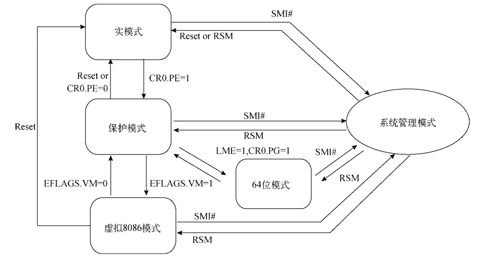

07.第六章基础

# 1. 基础功能和特性

## 1.1 运行模式

intel处理器体系结构大体上可分为IA-32体系结构和IA-32e体系结构两种。

32位处理器采用IA-32体系结构

64位处理器采用IA-32e体系结构

这两种体系结构中包含着多种运行模式，较为常见的运行模式有IA-32体系结构的保护模式和IA-32e体系结构的64位模式，其他运行模式主要用于模式切换或为了程序的兼容性。

- 实模式 (Real-Address Mode) 它为处理器提供Intel 8086处理器的运行环境，并追加了保护模式和系统管理模式的切换扩展。
- 保护模式 (Protected Mode) 它是32位处理器的主要运行模式，为软件的运行提供了丰富的功能、严格的安全性检测以及向后兼容性。
- 系统管理模式 (System Management Mode, SMM). 它是32位处理器的标准功能，提供了一种对操作系统透明的机制来执行电源管理和OEM的特殊功能。一旦切换到SMM模式，处理器将进入一个隔离的地址空间运行。
- 虚拟8086模式 (Virtual-8086 Mode) 它是处理器为保护模式提供的一种准运行模式，允许处理器在保护模式下执行8086软件和多任务环境。
- IA-32e模式 (IA-32e Mode) 它是64位处理器的主要运行模式，共包含两种子模式：兼容模式和64位模式(64-bit Mode).64位模式为处理器提供64位的线性地址空间并支持超过64GB的物理地址寻址，而兼容模式可使大部分保护模式的应用程序无修改运行在64位处理器中。

由此可见，IA-32e 体系结构是对 IA-32体系结构的扩展。

如图所示描述了IA-32e体系结构各运行模式的切换过程。

从处理器在上电或者重启后首先运行实模式。

CR0控制寄存器的PE标志位控制着处理器运行在实模式或保护模式。

EFLAGS标志寄存器的VM标志位可使处理器在保护模式和虚拟8086模式之间进行切换，切换过程往往通过任务切换或中断/异常返回程序实现。

在开启分页机制的保护模式下，置位IA32_EFER寄存器的LME标志位(位于)