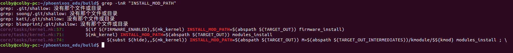

## 原理

由于我们编译生成的kernel 模块在 系统的各个子目录下面。


此时我们要收集各个子模块下的ko文件时，我们可以使用如下

```shell
make ARCH=arm CROSS_COMPILE=armv5tel-linux- INSTALL_MOD_PATH=~/xxxdir modules_install
```

主要是通过  INSTALL_MOD_PATH 去指定 我们要 安装在那， 


## phoenixos 例子

在我们的phoenixos 中也是有定义的：




