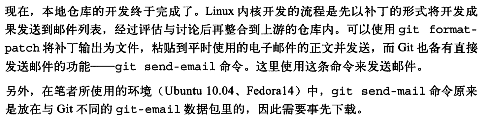
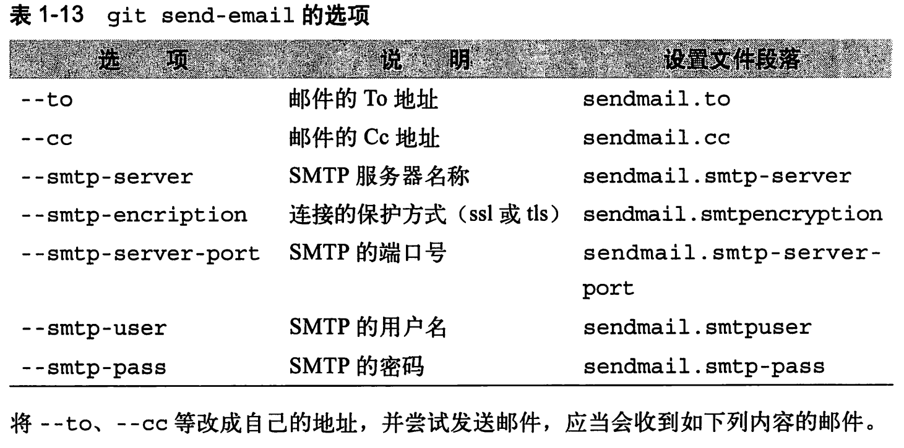

## 1. 内容

git add 文件：    此时将 文件 放入 缓冲区中

git commit -sm "..." : 此时将 缓冲区的内容提交到 本地仓库中 

git diff  : 此时比较的是  缓冲区和工作区的差别

git diff HEAD : 此时 比较的是 最新提交和工作区中的差别

git diff --cached : 最新的提交和 缓冲区之间的差别


### 1.1 加标签

可以为每次提交 加上 标签。 为发布版本等关键的提交加上标签，以后就可以使用标签名称来参照本次提交，十分方便。

```shell
git tag ver1 HEAD~1
```


```shell
~/myntai_work_note$

git add .

git commit -sm "内核75必杀技"

git tag book HEAD 

 git push 
 
 gitk ./
```


```shell
# 显示该仓库下的 所有 tag 的列表
git tag -l
```

### 1.2 rebase 命令

开发版本 必须一直在最新发行版的基础上进行开发。

例如，当发行版安装新功能时，必须将其也安装到 开发版本中。 

这里我们将 master 分支作为 发行分支。将v0.1 分支作为 开发分支。

在master 分支中 添加 main.c 之后 打上 v0 的tag,   然后基于 v0 创建出 v0.1 开发分支。

在master 分支中添加 printf.c 文件。 此时提交。【这里相当于时在发行分支中，添加了新的模块】

**而开发分支 必须一直在最新发新版的基础上进行开发**，此时我们在v0.1 分支，需要重新去复位 基底


例子中 用 rebase 到 master 的最新提交，但可以使用 --onto 选项来指定 要 rebase 到的任意提交。默认为所指定分支(master) 的最新提交

```shell
 1015  mkdir gittest
 1016  cd gittest/
 1017  ls
 1018  touch main.c
 1019  git init
 1020  git commit -a
 1022  git add .
 1023  git commit -a # 此时会让你输入 提交的信息

 1026  git tag v0 HEAD  # 此时 发行第一个版本 v0 ,此时是打了一个标签
 1027  git tag -l # 查看仓库中所有的 标签  


 1032  git branch v0.1 v0 # 此时基于v0标签[commit] 创建新的分支， 此时还在 master分支中
 
 1035  touch  printf.c # 在 master 分支中 添加新的功能
 1036  git add .
 1037  git commit -a


 1040  git checkout  v0.1  # 切换到 v0.1 分支中

 1042  vim main.c # 在里面实现 main()
 1043  git add .
 1044  git commit -a 


 # 由于此时 master 分支中 加入了 printf 功能， 而 开发分支始终要在最新发行版的基础之上进行开发
 # 此时 就要将 当前分支(v0.1)分支 复位基底   --到--> 分支 master 的最新提交上(prinf提交上)
 1049  git rebase master
 

```


### 1.3 merge

```shell
 1066  git checkout master 
 1067  git log --graph -a # 显示所有分支的情况  用图的方式

 1069  vim main.c  # 修改 main.c  
 1070  git add .
 1071  git commit -a

 1073  vim printf.c # 修改 printf
 1075  git add .
 1076  git commit -sm "[master] 添加printf注释"
 
 1079  git merge v0.1  # 此时在 master 分支， 将 v0.1 分支的内容 merge 到 master 分支中
 1080  git status  # 查看，冲突的文件
 1081  vim main.c  # 手动 解决冲突
 1082  git status 
 1083  git add .
 1084  git commit -sm "merge: v0.1" # 提交解决完后的 记录

 1086  git tag v1 HEAD  # 发行 v1 版本的code

 1089  git checkout v0.1  # 切换到 v0.1 的分支上
 1090  git rebase master # 将 master 最新的提交作为基底 

 1093  git log --graph -a

```


### 1.4 提取补丁

此时我们想要提取 v0 到 v1 的每次提交的差别 提取补丁文件，可以执行如下操作：


```shell
 1097  git checkout v0.1
 1098  git format-patch v0..v1 # 注意这里有 “..” 除此之外，还可以指定提交的散列值和分知名
 1099  ls
 1100  git status 
 1101  history 
```

### 1.5 提取源码树

执行如下命令，可以将 版本1 的源代码 作为 tar 文件 提取出来

```shell
git archive --format=tar --prefix="hello-v1/" v1 > ../hello-v1.tar

# 会在 上级目录中生成 hello-v1.tar 文件
# 解压后 发现有一层目录的名字是 hello-v1  
# 没有git 仓库，只有 对应于 v1 版本的 code
```

这里着重解释一下  --prefix 

当 --prefix="hello-"时：

```shell
git archive --format=tar --prefix="hello-" v1 > ../hello-v1.tar
```

```shell
colby@colby-pc:~/hello-v1$ tree
.
├── hello-main.c
└── hello-printf.c

0 directories, 2 files
colby@colby-pc:~/hello-v1$ 
```


当 --prefix="hello-/"时：

```shell
git archive --format=tar --prefix="hello-/" v1 > ../hello-v1.tar
```

```shell
colby@colby-pc:~/hello-v1$ tree
.
└── hello-
    ├── main.c
    └── printf.c

1 directory, 2 files
colby@colby-pc:~/hello-v1$ 
```

上述两个的区别是，第一个  --prefix="hello-"  没有加 "/" 而第二个加了 

加 "/" 的 会创建一层目录

**--prefix 总结：**

当各文件 包含到 tar 文件中时，文件名前面会加上 使用 --prefix 选项指定的文字。这只是单纯地添加了文字，因此，当指定 tar 文件内的根目录名时，要记得 加上例子中的 "hello-/" 这样在文字的最后加上 "/"

## 2. 远程仓库进行共同作业

linux 内核上游开发时的流程说明：

- 将上游的仓库复制到本地
- 不断追踪上游仓库的最新状态，同时在本地仓库进行开发
- 以补丁的形式将开发成果提交 维护人员以及开发邮件列表

### 2.1 复制仓库

#### 1. 方式一：同步uml

可以通过 

```shell
git clone git://git.kernel.org/pub/scm/linux/kernel/git/torvalds/linux-2.6 
```

复制 linux 树时 要下载 1GB 以上的数据，因此需要花费很长的时间，仅仅在必要的时候，在进行这个操作。

#### 2. 方式二： 本地

这里将之前 我本地用做测试的仓库 gittest 当做远程的仓库，将其复制到其他位置中：

```shell
# colby@colby-pc:~/gittest$ 
cd ..

# colby@colby-pc:~$ 
git clone gittest gittest_bat
```

注意看这里的目录变化， 我们是在 gittest 所在的上级目录中执行的 git clone

此时 生成的 gittest-bat 目录是  gittest 的全部拷贝，  所有的提交记录都在但是有如下区别：

1. 此时 gittest_bat 是将我们的 gittest 仓库作为远程仓库了

```shell
# colby@colby-pc:~/gittest_bat$ git branch -a
* v0.1
  remotes/origin/HEAD -> origin/v0.1
  remotes/origin/master
  remotes/origin/v0.1
#colby@colby-pc:~/gittest_bat$ git remote -v
origin	/home/colby/gittest (fetch) # 从可以我们可以知道  该gittest_bat 和 /home/colby/gittest  仓库进行了挂钩
origin	/home/colby/gittest (push)
```

### 2.2 建立本地分支

当前在 gittest_bat 仓库中：


这里会让人认为  v0.1 是 gittest 仓库中v0.1 的副本，而其实并不是这个样子。 gettest_bat 仓库中的 v0.1,在本地仓库是以 origin/v0.1 的标题出现的。这个分支才完全时 gettest仓库中的 v0.1 的副本。 这种形式叫做 **追踪分支**

在使用 git pull 对仓库进行代码拉取的时候， 首先同步的就是这个追踪分支 origin/v0.1 。 然后，把追踪分支的提交合并到追踪分支所关联的本地分支中。

用 git remote 命令来 显示 远程仓库的信息


这些信息，都是通过  .git/config 文件设置的。相关各部分的内容(section)如下所示。

```shell
[core]                                                                                                                                                                                                             
    repositoryformatversion = 0 
    filemode = true
    bare = false
    logallrefupdates = true
[remote "origin"]
    url = /home/colby/gittest
    fetch = +refs/heads/*:refs/remotes/origin/*
[branch "v0.1"]
    remote = origin
    merge = refs/heads/v0.1
```

[remote "origin"]

- 规定了远程仓库的URL、远程仓库上的分支、追踪分支之间的关系

[branch "v0.1"]

- 规定了合并到本地分支 v0.1 的远程分支为 origin仓库(gittest)  的 v0.1 分支上。


以追踪分支为起点建立本地分支后，本地分支就被追踪分支关联。例如，可以通过下列命令，建立 v1.0 分支的追踪分支相关联的本地分支 v0.1_work


本地分支 v0.1 以及 v0.1_work 分支虽然被关联，但是二者完全是本地分支。因此也可以直接在上面进行本地开发。但是，由于需要通过 git pull 进行合并，因此如果发生了冲突，就必须在这个时候进行解决

### 2.3  将分支rebase 到最新状态


图中写的很清楚了，不做任何解释了。


如果 此时 git rebase master 时出现 冲突，解决的步骤如下：

```shell
1. 手动解决冲突
2. git add .
3. git rebase --continue
```

这样就成功地复位基底到最新的版本了。这时也可以使用 git log 确认记录

## 3. 邮件发送 补丁







```shell
sudo apt-get install git-email


git send-email --to=caobinxin666@163.com --cc=caobinxin666@163.com --smtp-server=smtp.googlemail.com --smtp-encryption=ssl --smtp-server-port=465 --smtp-user=caobinxin --smtp-pass=915321004caobin. HEAD~1..HEAD
```


