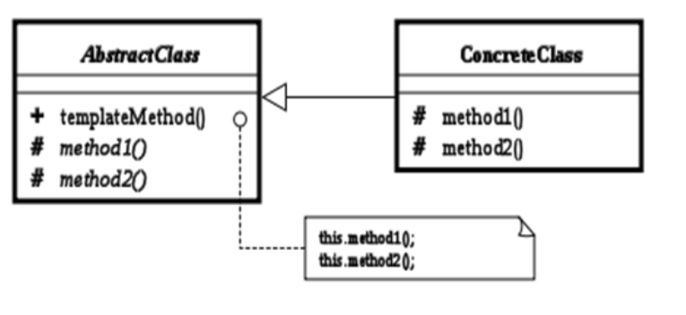

# 04.模板模式

## 1. 概述

模板方法模式：模板方法模式准备一个抽象类，将部分逻辑以具体方法以及具体构造子的形式实现，然后声明一些抽象方法来迫使子类实现剩余的逻辑。

不同的子类可以以不同的方式实现这些抽象方法，从而对剩余的逻辑有不同的实现。先制定一个顶级逻辑框架，而将逻辑的细节留给具体的子类去实现。 

ps: 

女生从认识到得手的不变的步骤分为巧遇、打破僵局、展开追求、接吻、得手

但每个步骤针对不同的情况，都有不一样的做法，这就要看你随机应变啦(具体实现)

## 2. 应用场景

- 具有统一的操作步骤或操作过程
- 具有不同的操作细节
- 存在多个具有同样操作步骤的应用场景，但某些具体的操作细节却各不相同

总结：在抽象类中统一操作步骤，并规定好接口；让子类实现接口。这样可以把各个具体的子类和操作步骤接耦合

## 3. 类图角色和职责

- AbstractClass：抽象类的父类
- ConcreteClass：具体的实现子类
- templateMethod()：模板方法
- method1()与method2()：具体步骤方法  

1. templateMethod中去调用 method1 method2  
2. method1 method2 是由子类去实现，也就是说 我们templateMethod 根据多态，去调用我们子类中的方法。

