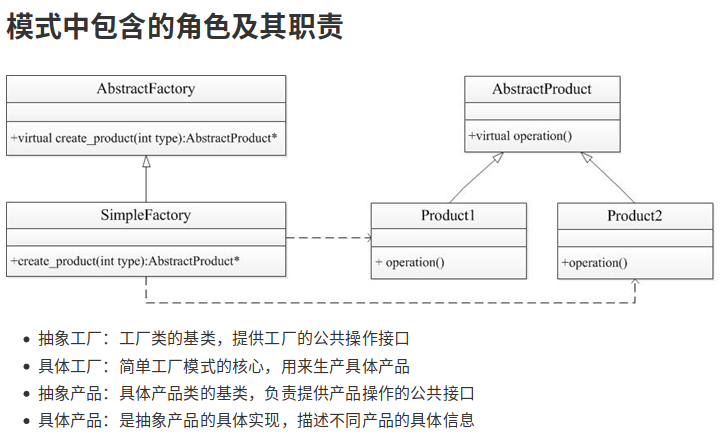

# 05.简单工厂模式

## 1. c++

简单工厂模式属于类的创建型模式,又叫做静态工厂方法模式。通过专门定义一个类来负责创建其他类的实例，被创建的实例通常都具有共同的父类。

**核心思想是用一个工厂来根据输入的条件产生不同的类，然后根据不同类的virtual函数得到不同的结果。**

工厂模式：客户类和工厂类分开。  

优缺点：

1. 优点：消费者无须修改就可以接纳新产品
2. 缺点：当产品修改时，工厂类也要做相应的修改。

### 1.1 简单工厂模式的优缺点

**优点：**

在这个模式中，工厂类是整个模式的关键所在。它包含必要的判断逻辑，能够根据外界给定的信息，决定究竟应该创建那个具体类的对象。用户在使用时可以根据工厂类去创建所需要的实例，而无需了解这些对象是如何创建以及如何组织的。**有利于这个软件体系结构的优化。**

**缺点：**

不难发现，简单的工厂模式的缺点也正体现在其工厂类上，由于工厂类集中了所有实例的创建逻辑，所以高内聚方面做的并不是很好。另外，当系统中的具体产品类不断增多时，可能会出现要求工厂类去要做相应的修改，扩展性并不是很好。

**总结：**

good：

​	适用于不同情况创建不同的类

bug:

​	客户端必须要知道基类和工厂类，耦合性差

核心思想：

​	用一个工厂来根据输入的条件产生不同的类，然后根据不同类的virtual函数得到不同的结果。

